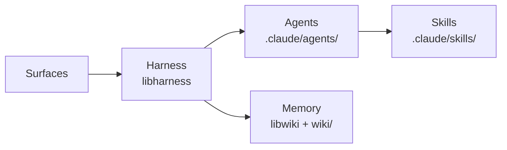
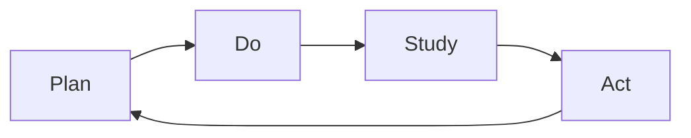
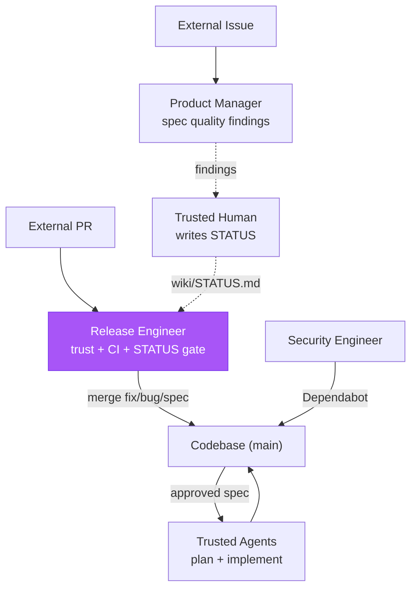

# Kata Agent Team

> "What does the pattern of the Improvement Kata give us? A means for
> systematically and scientifically working toward a new desired condition, in a
> way that is appropriate for the unpredictability and uncertainty involved."
>
> — Mike Rother, _Toyota Kata_

The Kata Agent Team is an autonomous, continuously improving agent team that
operates across six surfaces — IDE, scheduled shifts, GitHub Issues, GitHub PRs,
GitHub Discussions, and Microsoft Teams — using the same harness (`libharness`),
the same shared memory (`libwiki`), the same agent profiles, and the same
skills. All execution runs securely inside GitHub Actions. The team is organized
as a daily **Plan-Do-Study-Act** (PDSA) cycle where agents plan by writing
specs, ship features, study their own traces, and act on findings.

Kata is an implementation of two upstream standards: the repository structure
in [MONOREPO.md](MONOREPO.md) and the instruction architecture in
[COALIGNED.md](COALIGNED.md). Everything below assumes both.

Kata runs on [Gemba](https://www.forwardimpact.team/gemba/), the
agent-runtime platform: the `gemba-*` command family and the
bootstrap/harness/wiki/benchmark CI actions are the substrate every shift
executes on. Kata is the platform's reference tenant — the daily proof that
the substrate is generic and another team could run on it.

## Architecture

**Surfaces** are the entry points — IDE sessions, cron schedules, GitHub
events, and bridge-relayed messages. The **Harness** (`libharness`) provides the
orchestration loop, async coordination primitives (`Ask`/`Answer`/`Announce`),
role-based tool surfaces, and NDJSON trace capture. **Agents** define persona,
scope, and skill composition. **Skills** define procedures, checklists, and
domain knowledge. **Memory** (`libwiki` + `wiki/`) persists state across
surfaces and sessions.

Local composite actions under `.github/actions/` encapsulate shared CI steps:
`audit/` and `coaligned-check/`.
<!-- enum:sibling-composite-actions:count -->
Six composite actions are co-located in the monorepo (under
`products/gemba/actions/` and `products/kata/actions/`) and published to
`forwardimpact/` siblings:
<!-- /enum -->

<!-- enum:sibling-composite-actions:list -->
- `benchmark` — coding-agent benchmarks
- `bootstrap` — the FIT CI environment
- `harness` — agent task execution
- `wiki` — agent-memory commands with fresh App token
- `kata-agent` — full Kata workflow (auth, checkout, bootstrap, eval, wiki push)
- `kata-interview` — JTBD switching interview run
<!-- /enum -->

Publish, pinning, and release mechanics live in
[`.github/CLAUDE.md`](.github/CLAUDE.md); run `kata-setup` to generate
workflows interactively.

## Simplicity

A differentiating factor of the Kata Agent Team is its simplicity.

- **Curated skills**, each under 3k tokens
  (~200 lines of text). Small enough to read in full, audit in minutes.
- **No additional infrastructure.** All core surfaces work with only skills and
  GitHub Actions — no databases, no queues, no custom servers.
- **Minimal harness.** The orchestration layer is built around the Claude SDK —
  simple yet incredibly capable.
- **Minimal runtime dependencies.** Plain JavaScript throughout — the harness
  (`libharness`) depends on the Claude Agent SDK plus a few small utilities;
  memory (`libwiki`) pulls in no third-party packages.

## Surfaces

The same agents operate across six surfaces. Each surface routes to the agent
team through one of three mechanisms: direct invocation, scheduled workflow, or
bridge-dispatched workflow.

| Surface               | Mechanism         | Entry workflow     |
| --------------------- | ----------------- | ------------------ |
| **IDE**               | Direct invocation | —                  |
| **Scheduled shifts**  | Cron              | `kata-shift`       |
| **GitHub Issues**     | Event trigger     | `kata-dispatch`    |
| **GitHub PRs**        | Event trigger     | `kata-dispatch`    |
| **GitHub Discussions**| Bridge dispatch   | `kata-dispatch`    |
| **MS Teams channels** | Bridge dispatch   | `kata-dispatch`    |

**Direct invocation** — IDE sessions run agents locally against the same
profiles and skills.

**Scheduled workflows** — `kata-shift` runs the full roster three times daily;
`kata-storyboard` runs the daily meeting; `kata-coaching` runs on demand.

**Event-triggered workflows** — `kata-dispatch` fires on issue and PR activity
(opened, labeled, commented, reviewed, merged).

**Bridge-dispatched workflows** — `ghbridge` fronts GitHub Discussion webhooks;
`msbridge` fronts Microsoft Teams conversations. Both build on `libbridge` for
the shared callback registry, durable per-thread state, and resume-trigger
contract. The bridge acknowledges on the channel, fires `kata-dispatch` via
`workflow_dispatch`, and posts the agent's reply back to the thread. Suspended
conversations (`Recess` in `libharness` discuss mode) resume when the trigger
condition is met.

## The PDSA Loop

Every workflow belongs to a PDSA phase. Findings from Study always re-enter
the loop — nothing is observed without downstream action.

- **Plan** — Turn approved `spec.md` (WHAT/WHY) into `design-a.md` (WHICH/WHERE)
  then `plan-a.md` (HOW/WHEN) with steps, files, sequencing, risks.
- **Do** — Execute plans via implementation PRs; run scheduled workflows that
  harden, release, and maintain. Every run captures a trace.
- **Study** — Analyze Do outputs across four streams: security audits, external
  feedback triage, one-topic-deep doc review, one-trace-deep grounded theory.
- **Act** — Mechanical findings become **pushed fix PRs**; structural findings
  become `spec.md` documents on **pushed spec branches** — classify each per
  [work-definition.md § Classification tests](.claude/agents/x-work-definition.md#classification-tests).
  A local commit is not a PR — the URL is the only valid completion signal.
  `fix/` and `spec/` branches never mix.

## Agents

Eight personas with explicit scope constraints — when a finding exceeds scope,
the agent writes a spec rather than attempting the fix.

| Agent                 | Phase          | Purpose                                                                 |
| --------------------- | -------------- | ----------------------------------------------------------------------- |
| **staff-engineer**    | Plan, Do       | Own the full spec -> design -> plan -> implement arc for approved specs |
| **release-engineer**  | Do             | Keep PR branches merge-ready, repair trivial CI, cut releases           |
| **security-engineer** | Do, Study, Act | Patch dependencies, harden supply chain, enforce security policies      |
| **devex-engineer**    | Do, Study, Act | Audit codebase health, review maintainability, clean debt without behavior change |
| **product-manager**   | Study, Act     | Triage issues, review spec quality, run evaluations                     |
| **technical-writer**  | Study, Act     | Review docs for accuracy, curate wiki, fix staleness, spec gaps         |
| **archivist**         | Study, Act     | Retire stale logs, storyboards, and terminal specs once their signal is preserved |
| **improvement-coach** | Study          | Facilitate storyboard meetings and 1-on-1 coaching sessions             |

Each agent selects work via
[on-boot routing](.claude/agents/x-memory-protocol.md#on-boot-routing):
owned priorities → active claims → storyboard deliverables → domain checks →
cross-cutting fallback.

## Workflows

The four PDSA workflows:

<!-- enum:kata-workflows:list -->

| Workflow            | Trigger                              | Agent(s)                                                                                                        |
| ------------------- | ------------------------------------ | --------------------------------------------------------------------------------------------------------------- |
| **kata-shift**      | Daily 03:00 · 12:00 · 20:00 (Paris) | product-manager → staff-engineer → security-engineer → devex-engineer → technical-writer → archivist → release-engineer → improvement-coach  |
| **kata-storyboard** | Daily 08:00 (Paris)                  | improvement-coach (facilitates 7 agents)                                                                        |
| **kata-coaching**   | `workflow_dispatch`                  | improvement-coach (facilitates 1 agent)                                                                         |
| **kata-dispatch**   | Events + bridge dispatch             | release-engineer (facilitates up to 4 agents)                                                                   |

<!-- /enum -->

A separate `workflow_dispatch`-only utility, **kata-interview**
(product-manager, supervises 1 interview agent), runs JTBD product-testing
interviews outside the PDSA cycle.

**kata-shift** runs the roster sequentially (`max-parallel: 1`, `fail-fast:
false`). **kata-dispatch** is the event-driven counterpart — the release
engineer facilitates and routes to the best-suited agent. For bridge-dispatched
messages, `libharness` discuss mode enables multi-turn threaded conversations
spanning days via `Recess`/`Adjourn`. kata-dispatch groups concurrency per
artifact (issue/PR) with `cancel-in-progress: false` so cascaded events stack;
storyboard, coaching, and interview each use a single global group. All
workflows support `workflow_dispatch`.

**Killswitch** — every `kata-*` workflow checks the `KATA_KILLSWITCH`
repository (or org) Actions variable as its first step and fails fast when it
holds a truthy value (anything other than empty, `0`, `false`, `no`, or `off`).
Set it from the repository's Settings → Secrets and variables → Actions →
Variables to halt all kata automation at once — scheduled shifts, the
event-driven dispatcher, and manual dispatches — without disabling each workflow
individually. Clear or unset it to resume.

## Skills

All Kata skills use the `kata-` prefix and own exactly one PDSA phase (or none
for utilities).

<!-- enum:published-skills:list -->

| Skill                     | Phase   | Purpose                                       |
| ------------------------- | ------- | --------------------------------------------- |
| `kata-design`             | Plan    | Specs to architectural design documents       |
| `kata-plan`               | Plan    | Designs to executable plans                   |
| `kata-implement`          | Do      | Execute plans step by step                    |
| `kata-security-update`    | Do      | Dependabot triage, vulnerability fixes        |
| `kata-release-merge`      | Do      | Trust, type, CI, rebase, approval gate, merge |
| `kata-release-cut`        | Do      | Version bumps, tagging, publish verification  |
| `kata-security-audit`     | Study   | Seven-area security review                    |
| `kata-product-issue`      | Study   | Issue triage against product vision           |
| `kata-interview`          | Study   | JTBD switching interviews                     |
| `kata-documentation`      | Study   | One topic deep per run                        |
| `kata-wiki-curate`        | Study   | Agent memory hygiene                          |
| `kata-backlog-synthesis`  | Study   | Consolidate overlapping issues/PRs into one spec |
| `kata-archive`            | Study   | Retire stale time-bounded artifacts safely    |
| `kata-devex-audit`        | Study   | Deep-dive codebase-health review, one area/run |
| `kata-spec`               | Act     | Write specs capturing WHAT/WHY                |
| `kata-review`             | Utility | Grade a single artifact (leaf, no sub-agents) |
| `kata-session`            | Utility | Toyota Kata coaching protocol for sessions    |
| `kata-setup`              | Utility | Interactive Kata Agent Team setup             |

<!-- /enum -->

## Shared Memory

Agents share persistent state via the **GitHub wiki** at `wiki/`, managed by
`libwiki` and the `gemba-wiki` CLI. The wiki is a separate checkout (not a
submodule) — `wiki/` is gitignored, cloned on demand, synced by `just
wiki-pull` on session start and `just wiki-push` on stop.

Memory is the same regardless of which surface triggered the run. A
scheduled shift, a bridge-dispatched Discussion reply, and an IDE session all
read and write the same wiki files.

**Per-agent state:**

- **Summary** (`{agent}.md`) — current priorities, blockers, teammate
  observations.
- **Weekly log** (`{agent}-{YYYY}-W{VV}.md`) — append-only record, one file per
  agent per ISO week.

**Cross-agent state:**

- **MEMORY.md** — cross-cutting priorities and active claims (who is working on
  what target, branch, and PR).
- **STATUS.md** — canonical approval record for every spec (see § Approval
  Signal).
- **Storyboard** (`storyboard-{YYYY}-M{NN}.md`) — monthly storyboard with
  per-agent deliverables and experiment tracking.
- **Metrics** (`metrics/{skill}/{YYYY}.csv`) — per-skill run metrics.

The canonical read-summary, append-log, update-summary cadence is defined in
[memory-protocol.md](.claude/agents/x-memory-protocol.md). Read
contract: `Read wiki/MEMORY.md` + `Bash: gemba-wiki boot --agent <self>`.

## Coordination

Four channels, governed by
[coordination-protocol.md](.claude/agents/x-coordination-protocol.md):

| Channel               | Use for                                          | Lifetime                              | Mechanism                    |
| --------------------- | ------------------------------------------------ | ------------------------------------- | ---------------------------- |
| **Storyboard**        | Daily current condition and next experiment      | One day; captured into wiki           | `kata-storyboard` workflow   |
| **Discussion**        | Open questions before they become decisions      | Open until resolved into spec or wiki | `ghbridge` → `kata-dispatch` |
| **PR / issue thread** | Real-time response on a specific artifact        | Lives with the artifact               | `kata-dispatch` workflow     |
| **Sub-agent**         | Specialized inline work within one run           | Ephemeral (one task)                  | `Agent` tool, skill spawning |

Discussions must terminate into a spec, wiki note, or close. PR/issue threads
are scoped to one artifact; cross-cutting questions belong in a Discussion.
Sub-agents don't carry state across runs — that's the wiki's job.

## Trust Boundary

The release engineer is the sole external merge point. The product manager
gates spec quality via PR-comment findings; trusted humans translate those
into `wiki/STATUS.md` writes that the release engineer reads at merge time.

| External PR type | What merges                     | Who implements                        |
| ---------------- | ------------------------------- | ------------------------------------- |
| `fix` / `bug`    | Contributor's code (small)      | The external contributor              |
| `spec`           | Specification document only     | Trusted agents, never the contributor |
| Everything else  | Nothing — requires human review | N/A                                   |

Top-7 contributors pass the trust gate; `kata-agent-team` PRs are trusted by
identity.

**Retention PRs** preserve this boundary: the archivist opens a
`retention(specs)` PR to remove terminal spec directories but never pushes to
`main`; the product manager approves once every target is terminal and its
durable signal is preserved; the release engineer merges. The release engineer
stays the sole `main`-push agent.

## Approval Signal

Approval state is recorded in `wiki/STATUS.md` — a tab-separated file, one
row per spec: `{id}\t{phase}\t{status}`. STATUS is the canonical record;
`kata-release-merge` reads it to decide which phase PRs may merge.

| Signal | Source | Captured by |
|---|---|---|
| `<phase>:approved` label | Human or `/ship-it` | `kata-dispatch` |
| APPROVED review | Trusted-account approver | `kata-dispatch` |
| Approval comment ("LGTM", "ship it") | Trusted contributor | `kata-dispatch` |
| In-session user message | Trusted user | Active agent |
| `kata-plan` panel-clean | `staff-engineer` (plans only) | `kata-plan` skill |
| retention-PR approval | `product-manager` (retention PRs only) | `kata-release-merge` at the gate |

Agents never autonomously originate `spec approved` or `design approved` —
they only propagate signals from trusted humans. Plans may be approved by
`staff-engineer` after `kata-plan` review; the product manager may originate a
retention-PR approval, read by `kata-release-merge` at the gate rather than from
a STATUS row. See
[approval-signals.md](.claude/agents/x-approval-signals.md).

## Metrics

End-to-end skills record per-run counts as CSV rows in
`wiki/metrics/{skill}/{YYYY}.csv`. The storyboard reads these via `gemba-xmr`
for control limits.

Every metrics CSV row carries a `host_run` field — `$GITHUB_RUN_ID` when the
row is written in CI, the literal `local` otherwise — so a row resolves to the
workflow run that produced it by keyed lookup, not a forensic time-window
sweep. `gemba-xmr record` fills it automatically. Narrative log entries are
exempt; they are prose memory, recoverable through the keyed rows they
accompany.

## Design Principles

- **Simplicity over machinery.** Fewer moving parts, fewer failure modes, easier
  to audit.
- **PDSA over pipeline.** Findings from Study always re-enter the loop.
- **Fix-or-spec discipline.** Mechanical fixes and structural improvements never
  share a PR.
- **Explicit scope constraints.** Each agent knows what it must _not_ do.
- **Trace-driven accountability.** Every run captures a trace; the improvement
  coach quotes specific evidence. Use `gemba-trace` to query.
- **Least privilege.** The workflow-level `permissions:` block restricts only
  `GITHUB_TOKEN`. The App token carries coordination-channel permissions via
  installation settings.
- **Surface-agnostic agents.** The same profiles and skills operate identically
  whether triggered by cron, a GitHub event, or a bridge-relayed message.
- **App-based auth.** GitHub App `kata-agent-team` with 1-hour installation
  tokens (no PAT). See
  [`github-app.md`](.claude/skills/kata-setup/references/github-app.md).
- **Main branch CI repair.** See CONTRIBUTING.md for the release engineer's
  direct-to-`main` exception.
- **Authoring.** Instruction architecture, length limits, skill structure, and
  the seven-layer model live in [COALIGNED.md](COALIGNED.md).
