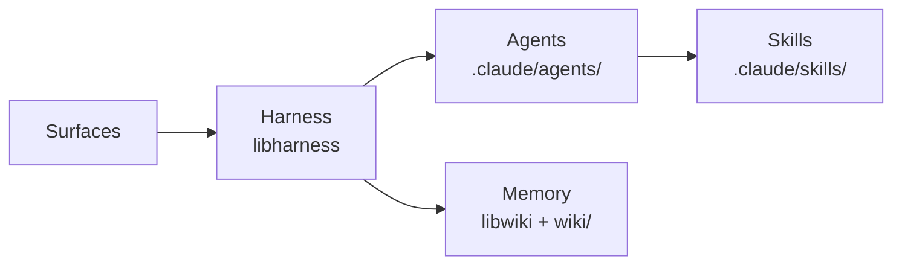
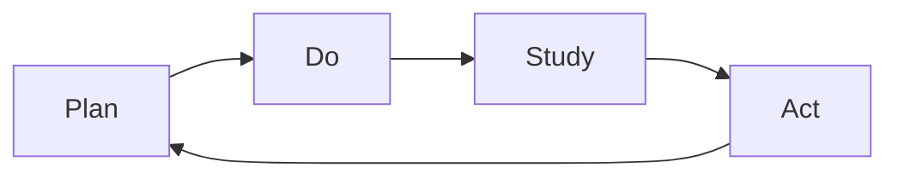
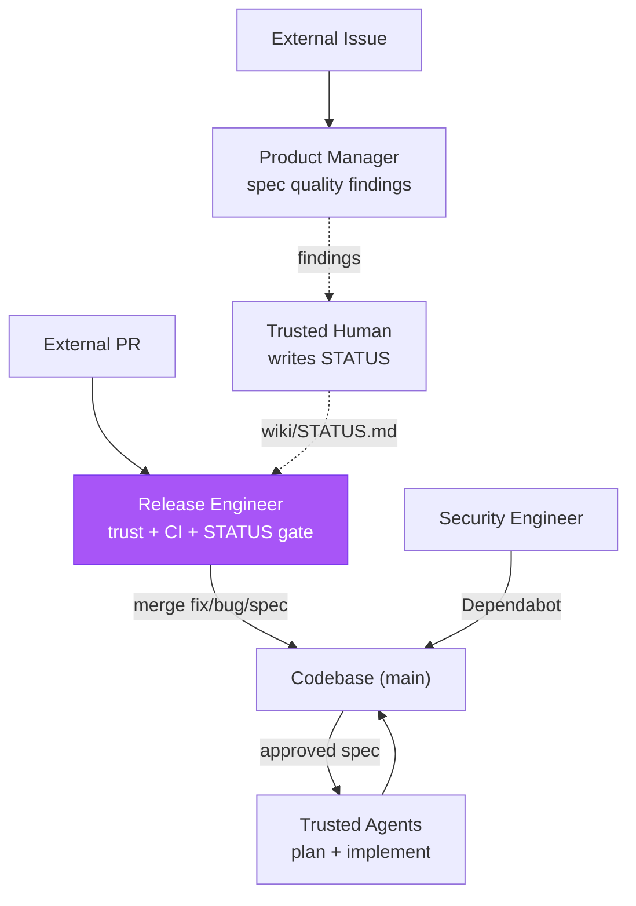

# Kata Agent Team

> "What does the pattern of the Improvement Kata give us? A means for
> systematically and scientifically working toward a new desired condition, in a
> way that is appropriate for the unpredictability and uncertainty involved."
>
> — Mike Rother, _Toyota Kata_

The Kata Agent Team is an autonomous agent team that continuously improves. It
operates across six surfaces: IDE, scheduled shifts, GitHub Issues, GitHub PRs,
GitHub Discussions, and Microsoft Teams. Every surface uses the same harness
(`libharness`), the same shared memory (`libwiki`), the same agent profiles, and
the same skills. All execution runs securely inside GitHub Actions. The team
runs a daily **Plan-Do-Study-Act** (PDSA) cycle. Agents write specs to plan.
They ship features. They study their own traces. They act on findings.

Kata implements two upstream standards: the repository structure in
[MONOREPO.md](MONOREPO.md) and the instruction architecture in
[JIDOKA.md](JIDOKA.md). Everything below assumes both.

Kata runs on [Gemba](https://www.forwardimpact.team/gemba/), the
agent-runtime platform. The `gemba-*` command family and the
bootstrap/harness/wiki/benchmark CI actions are the substrate every shift
executes on. Kata is the platform's reference tenant. Kata is the daily proof
that the substrate is generic and that another team could run on it.

## Architecture

```mermaid
graph LR
    SU["Surfaces"] --> H["Harness<br/>libharness"] --> A["Agents<br/>.claude/agents/"] --> S["Skills<br/>.claude/skills/"]
    H --> M["Memory<br/>libwiki + wiki/"]
```

**Surfaces** are the entry points: IDE sessions, cron schedules, GitHub
events, and bridge-relayed messages. The **Harness** (`libharness`) provides the
orchestration loop, async coordination primitives (`Ask`/`Answer`/`Announce`),
role-based tool surfaces, and NDJSON trace capture. **Agents** define persona,
scope, and skill composition. **Skills** define procedures, checklists, and
domain knowledge. **Memory** (`libwiki` + `wiki/`) persists state across
surfaces and sessions.

Local composite actions under `.github/actions/` encapsulate shared CI steps:
`audit/`.
<!-- enum:sibling-composite-actions:count -->
Seven composite actions are co-located in the monorepo (under
`products/{gemba,jidoka,kata}/actions/`) and published to
`forwardimpact/` siblings:
<!-- /enum -->

<!-- enum:sibling-composite-actions:list -->
- `benchmark` — coding-agent benchmarks
- `bootstrap` — the FIT CI environment
- `harness` — agent task execution
- `wiki` — agent-memory commands with fresh App token
- `kata-agent` — full Kata workflow (auth, checkout, bootstrap, eval, wiki push)
- `jidoka` — Jidoka checks: stop the line on instruction drift
- `kata-interview` — JTBD switching interview run
<!-- /enum -->

Publish, pin, and release mechanics live in
[`.github/CLAUDE.md`](.github/CLAUDE.md). Run `kata-setup` to generate
workflows interactively.

## Simplicity

Simplicity sets the Kata Agent Team apart.

- **Curated skills**, each under 3k tokens
  (~200 lines of text). You can read one in full and audit it in minutes.
- **No additional infrastructure.** All core surfaces work with only skills and
  GitHub Actions. They need no databases, no queues, and no custom servers.
- **Minimal harness.** The orchestration layer builds on the Claude SDK. The
  SDK is simple and incredibly capable.
- **Minimal runtime dependencies.** The code is plain JavaScript throughout.
  The harness (`libharness`) depends on the Claude Agent SDK plus a few small
  utilities. Memory (`libwiki`) pulls in no third-party packages.

## Surfaces

The same agents operate across six surfaces. Each surface routes to the agent
team through one of three mechanisms: direct invocation, scheduled workflow, or
bridge-dispatched workflow.

| Surface               | Mechanism         | Entry workflow     |
| --------------------- | ----------------- | ------------------ |
| **IDE**               | Direct invocation | —                  |
| **Scheduled shifts**  | Cron              | `kata-shift`       |
| **GitHub Issues**     | Event trigger     | `kata-dispatch`    |
| **GitHub PRs**        | Event trigger     | `kata-dispatch`    |
| **GitHub Discussions**| Bridge dispatch   | `kata-dispatch`    |
| **MS Teams channels** | Bridge dispatch   | `kata-dispatch`    |

**Direct invocation** — IDE sessions run agents locally against the same
profiles and skills.

**Scheduled workflows** — `kata-shift` runs the full roster three times daily.
`kata-storyboard` runs the daily meeting. `kata-coaching` runs on demand.

**Event-triggered workflows** — `kata-dispatch` fires on issue and PR activity
(opened, labeled, commented, reviewed, merged).

**Bridge-dispatched workflows** — `ghbridge` fronts GitHub Discussion webhooks.
`msbridge` fronts Microsoft Teams conversations. Both build on `libbridge` for
the shared callback registry, durable per-thread state, and resume-trigger
contract. The bridge acknowledges on the channel. It fires `kata-dispatch`
through `workflow_dispatch`. It posts the agent's reply back to the thread.
Suspended conversations (`Recess` in `libharness` discuss mode) resume when the
trigger condition holds.

## The PDSA Loop

Every workflow belongs to a PDSA phase. Findings from Study always re-enter
the loop. Every observation leads to downstream action.

```mermaid
graph LR
    P["Plan"] --> D["Do"] --> S["Study"] --> A["Act"] --> P
```

- **Plan** — Turn an approved `spec.md` (WHAT/WHY) into `design-a.md`
  (WHICH/WHERE). Then turn that into `plan-a.md` (HOW/WHEN) with steps, files,
  order, and risks.
- **Do** — Execute plans through implementation PRs. Run scheduled workflows
  that harden, release, and maintain. Every run captures a trace.
- **Study** — Analyze Do outputs across four streams: security audits, external
  feedback triage, one-topic-deep doc review, one-trace-deep grounded theory.
- **Act** — Mechanical findings become **pushed fix PRs**. Structural findings
  become `spec.md` documents on **pushed spec branches**. Classify each finding
  per
  [work-definition.md § Classification tests](.claude/agents/x-work-definition.md#classification-tests).
  A local commit is not a PR. The URL is the only valid completion signal.
  `fix/` and `spec/` branches never mix.

## Agents

Eight personas carry explicit scope constraints. When a finding exceeds scope,
the agent writes a spec. The agent does not attempt the fix.

| Agent                 | Phase          | Purpose                                                                 |
| --------------------- | -------------- | ----------------------------------------------------------------------- |
| **staff-engineer**    | Plan, Do       | Own the full spec -> design -> plan -> implement arc for approved specs |
| **release-engineer**  | Do             | Keep PR branches merge-ready, repair trivial CI, cut releases           |
| **security-engineer** | Do, Study, Act | Patch dependencies, harden supply chain, enforce security policies      |
| **devex-engineer**    | Do, Study, Act | Audit codebase health, review maintainability, clean debt without behavior change |
| **product-manager**   | Study, Act     | Triage issues, review spec quality, run evaluations                     |
| **technical-writer**  | Study, Act     | Review docs for accuracy, curate wiki, fix staleness, spec gaps         |
| **archivist**         | Study, Act     | Retire stale logs, storyboards, and terminal specs once their signal is preserved |
| **improvement-coach** | Study          | Facilitate storyboard meetings and 1-on-1 coaching sessions             |

Each agent selects work through
[on-boot routing](.claude/agents/x-memory-protocol.md#on-boot-routing):
owned priorities → active claims → storyboard deliverables → domain checks →
cross-cutting fallback.

## Workflows

The four PDSA workflows:

<!-- enum:kata-workflows:list -->

| Workflow            | Trigger                              | Agent(s)                                                                                                        |
| ------------------- | ------------------------------------ | --------------------------------------------------------------------------------------------------------------- |
| **kata-shift**      | Daily 03:00 · 12:00 · 20:00 (Paris) | product-manager → staff-engineer → security-engineer → devex-engineer → technical-writer → archivist → release-engineer → improvement-coach  |
| **kata-storyboard** | Daily 08:00 (Paris)                  | improvement-coach (facilitates 7 agents)                                                                        |
| **kata-coaching**   | `workflow_dispatch`                  | improvement-coach (facilitates 1 agent)                                                                         |
| **kata-dispatch**   | Events + bridge dispatch             | release-engineer (facilitates up to 4 agents)                                                                   |

<!-- /enum -->

**kata-interview** is a separate `workflow_dispatch`-only utility. The
product-manager runs it and supervises 1 interview agent. It runs JTBD
interviews that test the products, outside the PDSA cycle.

**kata-shift** runs the roster sequentially
(`max-parallel: 1`, `fail-fast: false`). **kata-dispatch** is the event-driven
counterpart. The release engineer facilitates it and routes to the best-suited
agent. For bridge-dispatched messages, `libharness` discuss mode lets
multi-turn threaded conversations span days through `Recess`/`Adjourn`.
kata-dispatch groups concurrency per artifact (issue/PR) with
`cancel-in-progress: false`, so cascaded events stack. Storyboard, coaching,
and interview each use a single global group. All workflows support
`workflow_dispatch`.

**Killswitch** — every `kata-*` workflow checks the `KATA_KILLSWITCH`
repository (or org) Actions variable as its first step. The workflow fails fast
when the variable holds a truthy value (anything other than empty, `0`,
`false`, `no`, or `off`). Set it from the repository's Settings → Secrets and
variables → Actions → Variables. That halts all kata automation at once:
scheduled shifts, the event-driven dispatcher, and manual dispatches. You do not
need to disable each workflow individually. Clear or unset it to resume.

## Skills

All Kata skills use the `kata-` prefix and own exactly one PDSA phase (or none
for utilities).

<!-- enum:published-skills:list -->

| Skill                     | Phase   | Purpose                                       |
| ------------------------- | ------- | --------------------------------------------- |
| `kata-design`             | Plan    | Specs to architectural design documents       |
| `kata-plan`               | Plan    | Designs to executable plans                   |
| `kata-implement`          | Do      | Execute plans step by step                    |
| `kata-security-update`    | Do      | Dependabot triage, vulnerability fixes        |
| `kata-release-merge`      | Do      | Trust, type, CI, rebase, approval gate, merge |
| `kata-release-cut`        | Do      | Version bumps, tagging, publish verification  |
| `kata-security-audit`     | Study   | Seven-area security review                    |
| `kata-product-issue`      | Study   | Issue triage against product vision           |
| `kata-interview`          | Study   | JTBD switching interviews                     |
| `kata-documentation`      | Study   | One topic deep per run                        |
| `kata-wiki-curate`        | Study   | Agent memory hygiene                          |
| `kata-synthesize-backlog` | Study   | Consolidate overlapping issues/PRs into one spec |
| `kata-archive`            | Study   | Retire stale time-bounded artifacts safely    |
| `kata-devex-audit`        | Study   | Deep-dive codebase-health review, one area/run |
| `kata-synthesize-autonomy`| Study   | Autonomy-vs-approval grounded theory analysis |
| `kata-spec`               | Act     | Write specs capturing WHAT/WHY                |
| `kata-review`             | Utility | Grade a single artifact (leaf, no sub-agents) |
| `kata-session`            | Utility | Toyota Kata coaching protocol for sessions    |
| `kata-setup`              | Utility | Interactive Kata Agent Team setup             |

<!-- /enum -->

## Shared Memory

Agents share persistent state through the **GitHub wiki** at `wiki/`. `libwiki`
and the `gemba-wiki` CLI manage it. The wiki is a separate checkout (not a
submodule). `wiki/` is gitignored and cloned on demand. `just wiki-pull` syncs
it on session start. `just wiki-push` syncs it on stop.

Memory is the same regardless of which surface triggered the run. A
scheduled shift, a bridge-dispatched Discussion reply, and an IDE session all
read and write the same wiki files.

**Per-agent state:**

- **Summary** (`{agent}.md`) — current priorities, blockers, teammate
  observations.
- **Weekly log** (`{agent}-{YYYY}-W{VV}.md`) — append-only record, one file per
  agent per ISO week.

**Cross-agent state:**

- **MEMORY.md** — cross-cutting priorities and active claims (who works on
  what target, branch, and PR).
- **STATUS.md** — canonical approval record for every spec (see § Approval
  Signal).
- **Storyboard** (`storyboard-{YYYY}-M{NN}.md`) — monthly storyboard with
  per-agent deliverables. It also tracks experiments.
- **Metrics** (`metrics/{skill}/{YYYY}.csv`) — per-skill run metrics.

[memory-protocol.md](.claude/agents/x-memory-protocol.md) defines the canonical
read-summary, append-log, update-summary cadence. Read
contract: `Read wiki/MEMORY.md` + `Bash: gemba-wiki boot --agent <self>`.

## Coordination

[coordination-protocol.md](.claude/agents/x-coordination-protocol.md) governs
four channels:

| Channel               | Use for                                          | Lifetime                              | Mechanism                    |
| --------------------- | ------------------------------------------------ | ------------------------------------- | ---------------------------- |
| **Storyboard**        | Daily current condition and next experiment      | One day; captured into wiki           | `kata-storyboard` workflow   |
| **Discussion**        | Open questions before they become decisions      | Open until resolved into spec or wiki | `ghbridge` → `kata-dispatch` |
| **PR / issue thread** | Real-time response on a specific artifact        | Lives with the artifact               | `kata-dispatch` workflow     |
| **Sub-agent**         | Specialized inline work within one run           | Ephemeral (one task)                  | `Agent` tool, skill spawning |

Discussions must end in a spec, a wiki note, or a close. PR/issue threads
cover one artifact. Cross-cutting questions belong in a Discussion.
Sub-agents don't carry state across runs. That's the wiki's job.

## Trust Boundary

The release engineer is the sole external merge point. The product manager
gates spec quality through PR-comment findings. Trusted humans translate those
findings into `wiki/STATUS.md` writes. The release engineer reads those writes
at merge time.

```mermaid
graph TD
    EXT["External PR"] --> RE["Release Engineer<br/>trust + CI + STATUS gate"]
    ISS["External Issue"] --> PM["Product Manager<br/>spec quality findings"]
    PM -.->|"findings"| HU["Trusted Human<br/>writes STATUS"]
    HU -.->|"wiki/STATUS.md"| RE
    RE -- "merge fix/bug/spec" --> CB["Codebase (main)"]
    style RE fill:#a855f7,stroke:#7c3aed,color:#fff
    CB -- "approved spec" --> TA["Trusted Agents<br/>plan + implement"]
    TA --> CB
    SE["Security Engineer"] -- "Dependabot" --> CB
```

| External PR type | What merges                     | Who implements                        |
| ---------------- | ------------------------------- | ------------------------------------- |
| `fix` / `bug`    | Contributor's code (small)      | The external contributor              |
| `spec`           | Specification document only     | Trusted agents, never the contributor |
| Everything else  | Nothing — requires human review | N/A                                   |

Top-7 contributors pass the trust gate. The gate trusts `kata-agent-team` PRs
by identity.

**Retention PRs** preserve this boundary. The archivist opens a
`retention(specs)` PR to remove terminal spec directories. The archivist never
pushes to `main`. The product manager approves once every target is terminal
and its durable signal is preserved. The release engineer merges. The release
engineer stays the sole `main`-push agent.

## Approval Signal

`wiki/STATUS.md` records approval state. It is a tab-separated file with one
row per spec: `{id}\t{phase}\t{status}`. STATUS is the canonical record.
`kata-release-merge` reads it to decide which phase PRs may merge.

| Signal | Source | Captured by |
|---|---|---|
| `<phase>:approved` label | Human or `/ship-it` | `kata-dispatch` |
| APPROVED review | Trusted-account approver | `kata-dispatch` |
| Approval comment ("LGTM", "ship it") | Trusted contributor | `kata-dispatch` |
| Human merge of a PR | Trusted human — the merge _is_ the approval | `kata-dispatch` (close event) |
| In-session user message | Trusted user | Active agent |
| `kata-plan` panel-clean | `staff-engineer` (plans only) | `kata-plan` skill |
| retention-PR approval | `product-manager` (retention PRs only) | `kata-release-merge` at the gate |

Agents never autonomously originate `spec approved` or `design approved`. They
only propagate signals from trusted humans. When a human merges a PR, that
merge is one of those signals. When STATUS does not record it, reconcile the
row to what the human merged. A `kata-release-merge` merge is not a signal. The
gate merges only what STATUS already authorized. `staff-engineer` may approve
plans after a `kata-plan` review. The product manager may originate a
retention-PR approval. `kata-release-merge` reads that approval at the gate
rather than from a STATUS row. See
[approval-signals.md](.claude/agents/x-approval-signals.md).

## Metrics

End-to-end skills record per-run counts as CSV rows in
`wiki/metrics/{skill}/{YYYY}.csv`. The storyboard reads these with `gemba-xmr`
for control limits.

Every metrics CSV row carries a `host_run` field. The field holds
`$GITHUB_RUN_ID` when CI writes the row. Otherwise it holds the literal
`local`. So a row resolves by keyed lookup to the workflow run that produced
it. A forensic time-window sweep is not needed. `gemba-xmr record` fills the
field automatically. Narrative log entries are exempt. They are prose memory.
The keyed rows they accompany make them recoverable.

## Design Principles

- **Simplicity over machinery.** The system has fewer parts and fewer failure
  modes. You can audit it more easily.
- **PDSA over pipeline.** Findings from Study always re-enter the loop.
- **Fix-or-spec discipline.** Mechanical fixes and structural improvements never
  share a PR.
- **Explicit scope constraints.** Each agent knows what it must _not_ do.
- **Trace-driven accountability.** Every run captures a trace. The improvement
  coach quotes specific evidence. Use `gemba-trace` to query.
- **Least privilege.** The workflow-level `permissions:` block restricts only
  `GITHUB_TOKEN`. The App token carries coordination-channel permissions
  through installation settings.
- **Surface-agnostic agents.** The same profiles and skills operate
  identically. Cron, a GitHub event, or a bridge-relayed message can trigger
  them.
- **App-based auth.** GitHub App `kata-agent-team` with 1-hour installation
  tokens (no PAT). See
  [`github-app.md`](.claude/skills/kata-setup/references/github-app.md).
- **Main branch CI repair.** See CONTRIBUTING.md for the release engineer's
  direct-to-`main` exception.
- **Authoring.** Instruction architecture, length limits, skill structure, and
  the seven-layer model live in [JIDOKA.md](JIDOKA.md).
