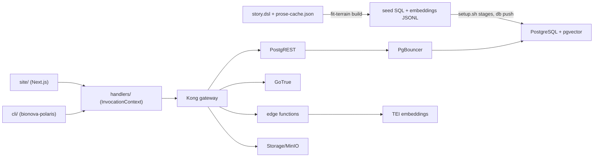

# BioNova Polaris Design

All paths below are within the `bionova-apps` repository. That repository
is separate from this monorepo. It follows MONOREPO.md and consumes
Forward Impact libraries from npm.

## Architecture

## Components

| Component | Location | Purpose |
| --- | --- | --- |
| Handlers | `products/polaris/handlers/` | Surface-agnostic business logic |
| Web frontend | `products/polaris/site/` | Next.js App Router with hand-rolled Tailwind components |
| CLI | `products/polaris/cli/` | `bionova-polaris` on libcli, with a librepl session |
| Edge functions | `services/polaris-functions/` | Deno functions for eligibility, seeding, and sync |
| Infrastructure | `infrastructure/` | PG On Rails self-hosted Supabase stack |
| Synthetic source | `data/synthetic/` | Verbatim-vendored `story.dsl` + `prose-cache.json`, the domain source of truth |
| Seed build | `data/synthetic/.build/` (gitignored) | Disposable target for `fit-terrain build --output-root` |

## Shared libraries

| Library | Consumer | Role |
| --- | --- | --- |
| `libcli` | CLI | Dispatch, `--help`, subcommand routes |
| `librepl` | CLI | The `repl` subcommand |
| `libformat` | CLI | Renders templated markdown to ANSI. The web surface renders React directly and does not use it |
| `libtemplate` | Handlers | Shared markdown templates through the exported templates-dir |
| `libui` | Site | `freezeInvocationContext` and web-surface helpers |
| `libutil` | CLI | Pinned from npm in the Polaris CLI manifest |
| `fit-terrain` | Build scripts only | Renders the vendored DSL to seed SQL + embeddings JSONL. No surface imports it |

## Shared surface and handlers

Both surfaces produce a frozen `InvocationContext { data, args, options }`
and dispatch to the same handler. Handlers return plain data. The CLI
renders it through `libtemplate` + `libformat`. The web surface renders
React.

| Handler | CLI command | Web route | Prose field |
| --- | --- | --- | --- |
| `searchTrials` | `search` | `/search` | — |
| `showTrial` | `trial <id>` | `/trials/:id` | `faq`, `consentSummary` |
| `showCondition` | `condition <id>` | `/conditions/:id` | `explainer` |
| `checkEligibility` | `eligibility <id>` | `/trials/:id/eligibility` | — |
| `listSites` | `sites` | `/sites` | `description` per site |
| `listStories` | `stories` | `/stories` | `story` rows |
| `showAbout` | `about` | `/about` | `therapies` list |
| `manageTrial` | `admin trial <id>` | `/admin/trials/:id` | — (staff auth; interest aggregates) |

## Schema summary

Terrain renders every seed table. Hand-written migrations add the rest.
Primary keys and FK columns are `text`.

| Table | Key columns | Source |
| --- | --- | --- |
| `conditions` | `id pk`, `name`, `synonyms[]` | `ClinicalConditionEntity` |
| `sites` | `id pk`, `city`, `state`, `specialties[]` | `ClinicalSiteEntity` |
| `researchers` | `id pk`, `name`, `role` | `ClinicalResearcherEntity` |
| `trials` | `id pk`, `phase`, `status`, enrollment counts | `ClinicalTrialEntity` |
| `criteria` | `trial_id pk/fk`, one row per trial: `inclusion jsonb`, `exclusion jsonb`, each carrying `custom[]` | `ClinicalCriterionEntity` |
| `trial_conditions`, `trial_sites` | composite-pk junctions | trial arrays |
| `condition_embeddings` | `id pk`, `condition_id fk`, `embedding vector(384)` | render + `embed-seed` |
| six prose tables | `condition_explainers`, `trial_faqs`, `consent_summaries`, `site_descriptions`, `patient_stories`, `therapy_descriptions`, keyed by owner id | prose cache |
| `interest_signals` | `id uuid pk`, `trial_id text fk`, `screener_answers jsonb`, `match_score` | hand-written |

The `criteria` JSONB shapes: `inclusion` carries `age_min`, `age_max`,
`conditions_required`, `ecog_max`, `prior_treatments_allowed`, and
`custom[]`. `exclusion` carries `conditions_excluded` and its own
`custom[]`. The `custom[]` strings are the screener-question source.

## Row-Level Security

| Class | Policy |
| --- | --- |
| Public read | `FOR SELECT USING (true)` on every terrain-emitted table. Terrain owns these policies |
| Staff writes | INSERT/UPDATE on `trials` and `criteria` gated on `auth.jwt() ->> 'role' = 'staff'` |
| Anonymous interest | anon INSERT on `interest_signals` with staff-only SELECT. Anon read-back fails |

## Edge functions

| Function | Trigger | Behavior |
| --- | --- | --- |
| `embed-seed` | `setup.sh` | Reads the mounted JSONL, embeds through TEI, idempotent upsert through the unique index |
| `eligibility-check` | screener POST | Pure scorer over the trial's single `criteria` row. No LLM |
| `notify-updates` | pg_net trigger on `trials.status` change | Logs a would-notify stub |
| `sync-listings` | pg_cron schedule | Re-reads staged seed SQL and upserts |

## Connection topology

Only PostgREST connects through the transaction pooler. GoTrue and
Storage send a `search_path` startup parameter that the pooler rejects,
and Realtime needs session-scoped prepared statements, so those three
connect directly to Postgres. Pooled PostgREST disables prepared
statements and the schema-reload channel; setup reloads its schema cache
after each migration push.

## Visual token contract

The web surface implements these tokens. Plan part 04 applies them. The
component library stays an implementation choice.

| Token group | Contract |
| --- | --- |
| Surface colors | `background`, `foreground`, `muted`, `primary`, `accent` as CSS variables with light and dark values |
| Status mapping | `recruiting` → positive; `not_yet_recruiting` → neutral (upcoming); `active_not_recruiting` → warning (closed to enrollment); `completed` → muted. Each status renders a human label |
| Type scale | At least three steps (heading, body, metadata) applied on every page |
| Geometry | One spacing scale and one radius scale; no ad-hoc pixel values |
| Contrast | WCAG AA in both themes |
| Responsive floor | 390 px viewport: no horizontal scroll, usable navigation |

## Key decisions

| Decision | Chosen | Why |
| --- | --- | --- |
| Seed source vendored | `story.dsl` + `prose-cache.json` verbatim; `bionova-apps` runs `fit-terrain build` itself | The DSL is the legible source of truth, and the local build proves `fit-terrain` works for external teams |
| Build credentials | `fit-terrain build` (cache-only) | `build` renders from the committed prose cache with zero LLM calls. `generate` resolves a credential even at full cache |
| API layer | PostgREST generated from the schema | Schema-driven REST removes boilerplate. Staff writes carry a GoTrue JWT so RLS applies |
| Screener questions | Derived from `criteria` `custom[]` at display time | The strings already carry plain-language criteria. Display is a presentation concern |
| Embedding model | HuggingFace TEI (`BAAI/bge-small-en-v1.5`, 384-dim) on the Docker network | No external API key, deterministic, local |
| Versions | Load-bearing minimums only | See spec § Version policy |

## Interviewing Polaris

The committed `.github/workflows/kata-interview.yml` in `bionova-apps`
and the
[Substrate Contract guide](https://www.forwardimpact.team/docs/libraries/substrate-contract/index.md)
are normative. Two mappings are Polaris-specific:

- The substrate setup command boots Polaris' own compose stack and runs
  `setup.sh`, then the `fit-terrain substrate` contract gate and identity
  provisioning. It does not use the Supabase CLI stack.
- Patient interviews omit `persona-select-command`. Polaris is
  patient-facing with anonymous access, so the supervisor builds the
  persona from the vendored `story.dsl` and issues no JWT. Staff-facing
  interviews pass a persona command over the substrate verbs.
