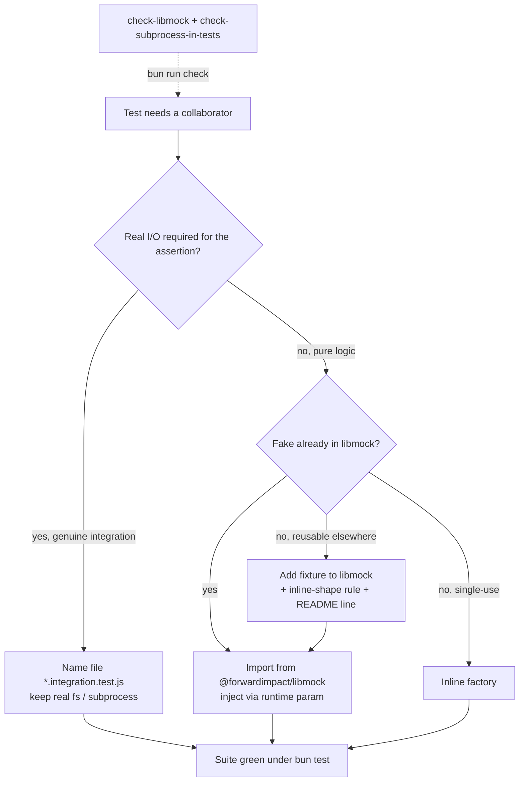

# Design 0640-a — Test-Side Hygiene

## Restatement

The suite is 440 test files; only 156 (35%) import `@forwardimpact/libmock`,
three named shared fixtures are still rebuilt inline at multiple sites, a tail
of **unit** tests does real filesystem/subprocess I/O even though the source
seams to avoid it now exist, 30 files exceed ~400 LOC, and three combinatorial
matrices cross-multiply axes that exercise one code path. The job is to lift
fake reuse and cut maintenance surface — close the three fixture holes, migrate
the residual real-I/O unit tests onto the existing `runtime` seam, tame the
oversized files, and collapse the matrices. **Wall time is not a target** — it
is recorded as a trend only (Decision 7).

## Scope Boundary

Two sibling slices already landed on `main`; this design owns only **test-side
hygiene** and consumes — never re-opens — what they delivered.

| Slice                                                | Spec     | State on `main` | This design                                                            |
| ---------------------------------------------------- | -------- | --------------- | --------------------------------------------------------------------- |
| Source-side DI (`fs`/`proc`/`clock`/`subprocess`)    | **1370** | Delivered       | Consumes the injected `runtime` seam; changes zero `src/` files.      |
| Runner switch (`node:test` → `bun test`, `spy()`)    | **0650** | Delivered       | Assumes `bun test`; no runner or shim work.                           |
| Test-side hygiene (libmock holes, I/O, shape, params) | **0640** | This design     | Adds the 3 fixtures + lint rules; migrates unit tests; tames files.   |

Already settled by prior passes (the `check-libmock` guard, the CONTRIBUTING
READ-DO/DO-CONFIRM libmock entries, most A.3 fakes, coverage-cut candidates that
were re-examined and kept): the planner verifies these exist; it does not redo
them.

## Components

**libmock fixture surface** — three additive exports from
`@forwardimpact/libmock`, each documented in README § Collaborators. They follow
the injected-collaborator pattern (Decision 1), so libmock gains no dependency,
and they extend libmock without rewriting its internals:

- `createGraphIndexFixture({ GraphIndex, Store, storageOverrides?, indexKey? }) → { n3Store, graphIndex, mockStorage }`
- `createMockGrpcHealthDefinition() → a mock gRPC health service definition` —
  the stripped `{ Check: { path, … } }` shape guide's tests fake; **not**
  librpc's real `healthDefinition`, which librpc's own tests exercise directly
  and this design leaves untouched.
- `createReplEnvironment() → { readline, process, os, formatter, storage }`

| Component                       | Role & interface                                                                                                                                                                                                                                                                                                                          |
| ------------------------------- | ----------------------------------------------------------------------------------------------------------------------------------------------------------------------------------------------------------------------------------------------------------------------------------------------------------------------------------------- |
| **Inline-shape lint rules**     | `scripts/check-libmock-rules.mjs` gains one pure detector per fixture, flagging the inline triple/definition/bundle it replaces — the same mechanism as the existing `{ run, spawn, calls }` and `MockStorage` shape detectors, surfaced through `bun run invariants:check-libmock`.                                                        |
| **Unit / integration boundary** | The `*.integration.test.js` suffix (1370's convention) is the seam: integration files keep real collaborators; unit files inject `createMockFs` / `createMockSubprocess` through the loader's existing `runtime` parameter. The **subprocess** side is already guarded by `check-subprocess-in-tests.mjs`; the **fs/tmpdir** side has no detector — it is verified by judgement plus the spec's SC3 `rg -l mkdtemp` allow-list. No new guard (per spec Non-goals). |
| **Test-file shape policy**      | One CONTRIBUTING line: target ≤400 LOC per `*.test.js`, split **by behaviour family**, with an explicit allow-list for the few that stay larger. Judgement-shaped — no lint.                                                                                                                                                               |
| **Parametrization audit rule**  | A combinatorial matrix is collapsed to boundary cases + one property check per targeted function, **only after** confirming the matrix exercises a single implementation path. Per-file judgement, no lint.                                                                                                                                |

## Data Flow — choosing a fake and an I/O posture

Three artifacts land together for a new shared fixture: the export in libmock,
its inline-shape rule in `check-libmock-rules.mjs`, and its README line. The
lint enforces the contract; the README makes it discoverable; libmock holds the
code.

## Key Decisions

| #   | Decision                                                                                                                              | Why                                                                                                                                                  | Rejected alternative                                                                                                            |
| --- | ----------------------------------------------------------------------------------------------------------------------------------- | ---------------------------------------------------------------------------------------------------------------------------------------------------- | ------------------------------------------------------------------------------------------------------------------------------- |
| 1   | The three fixtures take domain constructors as **injected parameters** (`GraphIndex`, `Store`); libmock gains no new dependency.     | libmock ships with zero dependencies and already uses this pattern for `createTurtleHelpers` (injected n3 `Parser`) precisely to stay dependency-free. | libmock imports libgraph + n3 directly — couples the shared-fakes package to a domain library and risks a cycle (libgraph tests import libmock). |
| 2   | A fixture, its inline-shape lint rule, and its README line ship in the **same change**.                                             | Forces the discovery contract; a freshly-named inline shape is invisible to lint until its rule exists.                                               | Migrate-later backlog — proven not to work: adoption stalled at 35% and three holes persisted under exactly that contract.       |
| 3   | Lint rules are **shape detectors** (regex over the inline triple/bundle), not `createMock*` name matches alone.                     | The inline consumers write `new GraphIndex(mockStorage, n3Store, …)` with no wrapper function, so a name-only rule would miss them.                   | AST-based lint — parse cost and dependency surface for a finite, known pattern set; name-only match — blind to wrapperless inlining. |
| 4   | `*.integration.test.js` suffix is the unit/real-I/O boundary; unit tests inject through the existing `runtime` param.              | Reuses 1370's convention; the subprocess guard already enforces its half and the source seam is in place, so the migration is mechanical. The fs half stays judgement + SC3, since the spec forbids new guards. | Per-test tmpdir allow-list — grows unbounded and carries no structural signal about why a test touches the disk.                 |
| 5   | ≤400 LOC test-file ceiling, split **by behaviour family**, allow-listed exceptions, **no lint**.                                   | Behaviour-family splits keep each file end-to-end readable; a hard gate would false-positive on legitimately cohesive files.                          | Hard lint gate — punishes cohesive files; split by data type — scatters one feature across files.                               |
| 6   | Matrices collapse to boundary + one property check, after auditing single-path.                                                    | Cross-multiplied matrices retest one loop N× ; boundary + property sampling covers the same branches at a fraction of the surface.                    | Blanket case cap — over-cuts where an axis is a real branch; status quo — keeps redundant maintenance surface.                  |
| 7   | **No wall-clock target** — speed is a recorded trend, not a gate.                                                                  | `bun test` does not fork per file, so file count no longer drives wall time; 1370 retired its own wall-time gate for the same reason.                 | Keep a speed gate — measures noise under bun and would resurrect the false "reduce files → cut time" thesis the re-scope killed. |
| 8   | All three fixtures ship even where only one inline consumer exists today (grpc, repl).                                            | Extraction is justified by discoverability and inline-surface reduction, not only cross-site dedup; these three are the spec's named § A decisions, while the data-flow "reusable?" branch governs *new* fakes a contributor adds later. | Inline the single-consumer bundles — leaves the largest inline scaffolds undiscoverable and re-opens the spec's approved § A. |

## Out of Scope

- Source-side DI seams (1370) and the runner switch (0650) — both delivered.
- Rewriting libmock internals — the three additions are extensions only.
- New process guards — the test-side guards (`check-libmock`,
  `check-subprocess-in-tests`) already exist; this design only adds per-fixture
  rules to `check-libmock`. `check-ambient-deps` is 1370's source-side guard and
  does not inspect test files.
- Coverage cuts — the original § C candidates were re-examined and kept.

## Open Questions for the Plan

1. **Sweep breadth for § B.** Beyond the libprompt/libtemplate loaders, which of
   the remaining non-`integration` `mkdtemp` / subprocess files assert pure
   logic (migrate) versus legitimately need real I/O (rename)? Plan enumerates;
   default migrate only assertions that inspect pure logic.
2. **Property-check tooling.** Admit `fast-check` to the library set, or use a
   hand-rolled property loop? Default hand-rolled unless a matrix is genuinely
   property-shaped.
3. **Graph-fixture ergonomics.** Do the five libgraph tests pass `GraphIndex` /
   `Store` to `createGraphIndexFixture` directly, or once through a thin
   libgraph-local wrapper? Plan decides; default direct injection.
