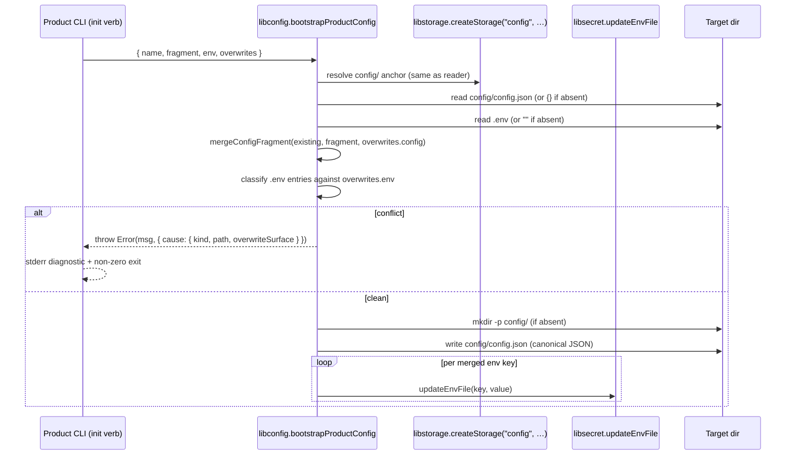

# Design 1000-c — Bootstrap writer in libconfig (no new library)

Alternative to [design-a](design-a.md) and [design-b](design-b.md). Design-a
introduces a new `@forwardimpact/libinit` library; design-b extends three
existing libraries with a generic plan/apply coordinator. **This design
extends exactly one existing library — libconfig — with a single
`bootstrapProductConfig` entry that mirrors the existing `createProductConfig`
factory.** It delegates `.env` writes to `libsecret.updateEnvFile` per key
(unchanged) and reuses libstorage's `createStorage("config", …)` for anchor
resolution so the writer shares one path-discovery implementation with every
reader in the family.

## Components

| Component | Home | Role |
|---|---|---|
| `bootstrapProductConfig` | `libraries/libconfig/src/bootstrap.js` | Single entry. Accepts `{ name, fragment, env, overwrites }`; converges on-disk state or throws. Mirrors `createProductConfig(name, …)` naming so read-side and write-side are visibly paired. |
| `mergeConfigFragment` | `libraries/libconfig/src/merge.js` | Pure function over `{ existing, fragment, overwrites }`; returns merged object or throws. Top-level-namespace ownership with leaf-path diagnostic. |
| Anchor resolution | reuses `createStorage("config", …)` | Writer calls the same libstorage factory the readers do; the target directory is whichever ancestor `Finder.findUpward` would resolve, falling through to `process.cwd()` and materialising `config/` there when no ancestor exists. Reader and writer cannot drift. |
| `.env` writes | `libsecret.updateEnvFile` per key | Unchanged libsecret surface. `0o600`, comment-rewrite, and trailing-newline guarantees hold transitively. |
| Refusal | plain `Error` with `cause: { kind, path, overwriteSurface }` | Matches the in-tree `throw new Error("[substrate stage: <phase>] …")` idiom (`products/map/src/commands/substrate-stage.js:85`). No new error class. |
| `fit-guide init` adapter | `products/guide/src/commands/init.js` | Materialises secrets via `getOrGenerateSecret` before the bootstrap call; passes one fragment + one env object. Existing `package.json` / `.claude/skills/` writes stay local — those are not config or env. |
| `fit-map init` adapter | `products/map/src/commands/init.js` | Calls `bootstrapProductConfig` with `fragment: {}`; existing `data/pathway/` copy becomes idempotent; the writer materialises `config/config.json` as `{}` if absent. |
| `fit-map substrate stage` | `products/map/src/commands/substrate-stage.js` | Gains `runPhase("init", () => runInit(target))` as the first phase, alongside the existing `stack`/`url-discovery`/`migrate`/`seed`/`provision`/`smoke` array. |
| Workflow cleanup | `.github/workflows/kata-interview.yml` | Substrate stage step drops the `mkdir -p "$AGENT_CWD/config"` line; Landmark gate (`if: inputs.product == 'landmark'`) preserved. |
| README home | `libraries/libconfig/README.md` § *Bootstrap* | Extends the existing "Environment-aware application settings" framing with the onboarding contract: entry point, namespace-declaration step, overwrite-intent parameter. |

## Interface

```js
import { bootstrapProductConfig } from "@forwardimpact/libconfig";

await bootstrapProductConfig({
  name: "guide",                       // product slug; anchors via createStorage("config", …)
  fragment: {                          // top-level keys are product-owned namespaces; {} or omitted is allowed
    "product.guide": { systemPrompt: "…" },
    "service.mcp":   { systemPrompt: "…", tools: { … } },
  },
  env: {                               // .env entries; {} or omitted is allowed
    SERVICE_SECRET: "…",
    MCP_TOKEN:      "…",
  },
  overwrites: {
    config: ["product.guide"],         // top-level namespace names
    env:    ["MCP_TOKEN"],             // bare keys
  },
});
```

Returns `void` on success; throws `Error` with structured `cause` on refused
write. The writer **always materialises `config/config.json`** at the resolved
anchor (`{}` when fragment is empty and the file is absent) — this satisfies
the spec's anchoring criterion for `fit-map init` without a `product.map`
starter fragment. `.env` is created only when at least one entry is supplied.

## Data flow



Merges complete and classify before any FS mutation — a `.env` conflict never
leaves a half-written `config.json` on disk.

## Namespace ownership semantics

Ownership is enforced at the **top-level key** of `config.json` (the spec's
literal framing). Each top-level key classifies against the existing on-disk
subtree:

| Pre-state | Fragment subtree | Result |
|---|---|---|
| absent | any | write subtree |
| present, deep-equal (canonical JSON) | same | no-op |
| present, different | different | refuse, unless top-level key ∈ `overwrites.config` |

"Deep-equal canonical JSON" = sorted-key, no-whitespace serialisation compared
as strings — the normalisation rule that makes A→B→A→B converge regardless of
input key order or whitespace.

**Ownership granularity is top-level; diagnostic granularity is leaf.** When a
top-level subtree differs, the writer enumerates the leaf paths that disagree
into `cause.path` (dotted), so a write of `product.x.foo = "b"` against
existing `product.x.foo = "a"` produces a diagnostic naming `product.x.foo`
(satisfying spec § *Failure surfacing*) while the overwrite-intent surface
remains the top-level namespace `product.x`. See Decision #3.

For `.env`, the same three rows apply at bare-key granularity against
`overwrites.env`. Value comparison is byte-for-byte after `KEY=`.

## fit-map init ↔ fit-map substrate stage

The spec leaves the *which-invokes-which* arrangement as a design choice.
This design picks **substrate stage delegates to init**: a new first phase
calls `runInit` inside the existing `runPhase` array
(`substrate-stage.js:47-75`). The kata-interview workflow keeps
`bunx fit-map substrate stage` as its only substrate entry point; the
`mkdir -p` line goes away. Bootstrap-shape parity is structural — both
`fit-map init` and `fit-map substrate stage` run the same `runInit` body, so
the spec's "two fresh tmpdirs" criterion holds by construction.

## Re-run semantics

**fit-guide init**: The adapter uses `libsecret.getOrGenerateSecret` to
materialise `SERVICE_SECRET` / `MCP_TOKEN` **before** the bootstrap call. The
fragment carries whatever value is already in `.env`; the merge classifies it
same-key-same-value and writes nothing. The pre-spec `"config/ already
exists, skipping starter copy"` line is dropped.

**fit-map init**: Pre-spec exits non-zero with `./data/pathway/ already
exists`. The adapter changes the existence check to a no-op; re-running
becomes byte-stable and makes `substrate stage` idempotent against an
already-bootstrapped workspace.

## Key decisions

| # | Decision | Rejected alternative | Reason |
|---|---|---|---|
| 1 | Bootstrap writer lives in **libconfig**, not a new library, and not split across libconfig + libsecret. | (a) New library `@forwardimpact/libinit` (design-a). (b) Per-surface writers split across libconfig + libsecret (design-b). | `libraries/CLAUDE.md` mandates checking the catalog before writing a generic capability. libconfig's concern is `config.json` semantics — the read/write split is incidental, not architectural. Splitting the namespace-ownership knowledge across two libraries forces it to depend on whichever library hosts the writer. One library, one README, one entry. |
| 2 | Single `bootstrapProductConfig` entry; product CLI calls it once. | Per-surface writers (design-b). | The spec's "one callable interface" language is singular. Per-surface writers force callers to discipline call ordering; a single entry makes refuse-before-mutate structural. |
| 3 | Top-level-namespace ownership; **leaf-path diagnostic**. | (a) Leaf-path ownership (design-a #5). (b) Top-level diagnostic. | (a) Top-level ownership matches the spec's normative text and how products think about their slice; leaf-path is stronger than asked. (b) Top-level diagnostic alone would name only `product.x` and fail the spec's success-criterion that the diagnostic carries `product.x.foo`. Splitting ownership granularity from diagnostic granularity satisfies both clauses with one contract pair. |
| 4 | Anchor resolution reuses `createStorage("config", …)`. | New target-dir argument resolved by `bootstrapProductConfig` itself. | Reader and writer share one path-discovery implementation. The spec's *fit-map init anchors locally* criterion becomes a structural property of libstorage, not a behavioural assertion on the writer. Eliminates an entire class of drift between read and write. |
| 5 | Refusal is a plain `Error` with `cause: { kind, path, overwriteSurface }`. | A dedicated `ConflictError` class (design-a) or `WriterConflict` aggregate (design-b). | The in-tree pattern in `substrate-stage.js:85` is `throw new Error("[…] …")`. Node's `Error.cause` carries the structured fields without a new public class to import, test, and document. The spec's "greppable for both" requirement is satisfied by the message text. |
| 6 | `.env` writer reuses `libsecret.updateEnvFile` per merged key. | (a) New `updateEnvEntries` batch wrapper in libsecret (design-b). (b) New env writer inside libconfig. | `updateEnvFile` already preserves `0o600` + comment-rewrite + trailing-newline; per-key invocation matches the existing `fit-guide init` pattern verbatim. A batch wrapper would be a thin pass-through; an env writer inside libconfig would re-implement guarantees libsecret already owns. |
| 7 | `substrate stage` delegates to `runInit` via the existing `runPhase` helper. | Workflow sequences `init` + `stage` as two subprocesses (design-b). | Bootstrap-shape parity is structural (one code path) rather than asserted (one CI test). `substrate-stage.js` already uses `runPhase("stack", …)`, `runPhase("url-discovery", …)`, etc. — `runPhase("init", …)` is the minimal extension of an established pattern. |
| 8 | `runInit` becomes idempotent on `data/pathway/`. | Keep the non-zero exit. | Spec § *Re-invoking* idempotency requires it; substrate stage re-running against a bootstrapped workspace requires it. |
| 9 | Always materialise `config/config.json`; never auto-create empty `.env`. | Symmetric auto-creation of `.env`. | Spec's anchoring criterion needs `config/config.json` to exist; `.env` has no equivalent anchoring role. Auto-creating an empty `0o600` `.env` would surprise developers. |
| 10 | Empty-string `.env` values written verbatim. | Skip empty values. | Spec 990 makes empty-string-on-shell-env equivalent to absent on the **read** path; the writer's job is bytes, not read semantics. |
| 11 | Onboarding docs in `libraries/libconfig/README.md` § *Bootstrap*. | A new `libinit/README.md` (design-a) or cross-linked sections across three READMEs (design-b). | Spec § *New-product onboarding* mandates "the shared library's README" — singular. One library, one README, no cross-links. |
| 12 | libconfig adds a `@forwardimpact/libsecret` dep. | Keep libconfig dep-free of libsecret; require callers to invoke libsecret themselves. | libstorage already depends on libsecret (`generateUUID`); the cross-library line is already crossed in this neighborhood. Keeping callers single-call requires the delegation. |

## Coherence with spec 990

- **`mkdir -p` workaround** — removed. The substrate stage step in
  `kata-interview.yml` keeps the `if: inputs.product == 'landmark'` gate;
  only the `mkdir` line goes.
- **Credential-override read order** — unchanged. libconfig's writer
  produces bytes only; libconfig's reader still resolves shell env > `.env`
  > defaults. Empty-string writes to `.env` produce `KEY=` on disk; the
  credential-override loop independently treats shell-empty-string as
  absent.

## Verification surfaces

| Success criterion | Surface |
|---|---|
| Two-namespace merge, idempotent re-invoke, A→B→A→B convergence, refuse + leaf-path diagnostic | libconfig unit tests (extends existing suite) |
| `.env` ownership + `0o600` mode + diagnostic | libconfig unit tests (mode assertion via `fs.stat`) |
| `fit-map init` anchors locally after init | fit-map product test |
| Workflow runs end-to-end without in-workflow `mkdir`; Landmark interview prep preserved (substrate roster non-empty, substrate issue writes `.env` + `.substrate.json`, `resolveIdentity()` succeeds, Landmark self-smoke green) | kata-interview CI on the implementation branch + workflow source grep |
| Bootstrap-shape parity (`fit-map init` vs substrate stage) | fit-map product test (structural — both call `runInit`) |
| `fit-guide init` first-run + re-run preservation | fit-guide product test + existing suite |
| README documents onboarding contract | libconfig README test (grep for entry point, namespace step, overwrite-intent param) |
| Existing in-tree tests stay green | `bun run test` on the implementation branch |

## Out of scope (deferred to plan or follow-ups)

- File-level changes inside the three adapters — plan scope.
- Cross-file atomicity between `config.json` and `.env` — deferred per spec.
- Schema validation of the merged `config.json` — deferred per spec.
- Secret rotation as a separate verb — deferred per spec.
- Cleaning up libutil's lower-fidelity `updateEnvFile`
  (`libraries/libutil/src/index.js:19`) — follow-up; no in-scope consumer
  touches it.

— Staff Engineer 🛠️
