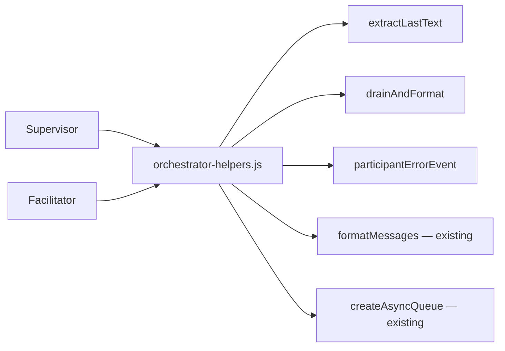
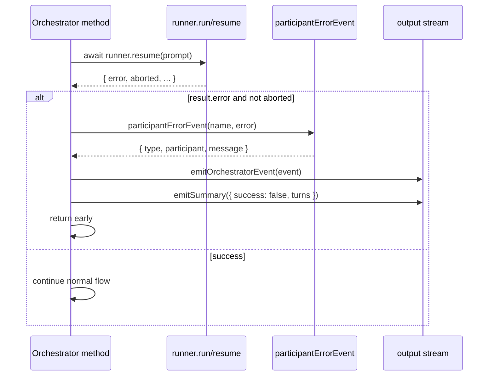

# Design A — Orchestrator Uniform Robustness

## Architectural intent

Three thin primitives in `orchestrator-helpers.js` plus disciplined consumption
at every runner-result callsite. The orchestrators stay structurally the
same — they keep their internal state machines, their tool servers, their
turn-counting — but they delegate the parts that recur (drain-then-format,
last-text extraction, error attribution) to shared helpers. Failures
attribute through a single typed event and short-circuit the calling method
cleanly; nothing wraps a runner call in `try`/`catch`.



## Components

| Component | Module | Role |
|---|---|---|
| `extractLastText(runner, fallback)` | `src/orchestrator-helpers.js` | Pure function — scans `runner.buffer` for the last assistant text block; returns `fallback` when none found. Single home for both orchestrators. |
| `drainAndFormat(messageBus, name)` | `src/orchestrator-helpers.js` | Drains messages addressed to `name` (destructive — same semantics as today's open-coded `messageBus.drain`); returns `formatMessages(drained)` when non-empty, `null` when empty. Caller branches on `null` to keep null-vs-non-null behaviour explicit at each site. Sites that need the raw `Message[]` (e.g. `#awaitAgentMessages`) keep using `messageBus.drain` directly — the helper covers only the drain-then-format kernel. |
| `participantErrorEvent(participant, error)` | `src/orchestrator-helpers.js` | Event builder — returns `{type: "participant_error", participant, message: error.message}`. Pure data; orchestrators decide when to emit and how to exit. |
| `Supervisor` | `src/supervisor.js` | Unchanged state machine. New: after every `runner.run`/`runner.resume`, branches on `result.error` and emits the new event before the existing terminal-failure exit shape (matching the `if (result.error)` predicate already present at `supervisor.js:111` and `:225`). |
| `Facilitator` | `src/facilitator.js` | Unchanged state machine. New: after every `runner.run`/`runner.resume`, branches on `result.error`. On error, emits the new event, then triggers sibling abort by calling `currentAbortController.abort()` on every running participant — the same call already used at `facilitator.js:124-128` (concludePromise) and `:135-141` (catch). The trigger is new; the abort call is not. |

## Interfaces

```text
extractLastText(runner: AgentRunner, fallback: string): string         // pure, non-mutating
drainAndFormat(messageBus: MessageBus, name: string): string | null    // MUTATES bus — drains queue
participantErrorEvent(participant: string, error: Error): { type: "participant_error", participant: string, message: string }
```

`AgentRunner` and `MessageBus` types unchanged. The error-event shape matches
the orchestrators' existing event vocabulary (`type` + payload fields;
`session_start`, `agent_start`, `mid_turn_review`, `intervention_relayed`,
`redirect` — see `supervisor.js:276`, `facilitator.js:91`).

## Data flow on error



Every runner-result callsite enumerated by spec § Defect 1 — Facilitator's
six and Supervisor's five — adopts this branch shape. Supervisor's three
sites that already check `.error` today emit the new event before their
existing exit path, so all error attribution flows through one event type
regardless of orchestrator or site.

## Key decisions

| Decision | Choice | Rejected alternative | Why |
|---|---|---|---|
| **Where shared primitives live** | Add to `orchestrator-helpers.js` alongside `formatMessages`/`createAsyncQueue`. | New `src/orchestrator-base.js` with a `BaseOrchestrator` class the two extend. | The two orchestrators already share only data utilities — they have different state machines, different tool servers, different concurrency models (Facilitator runs N agent loops in parallel; Supervisor runs one). A base class would either be near-empty or force unnatural unification of the state machines. Helpers keep the seam at the data boundary, where it actually is. |
| **Error-event vocabulary** | One event type `participant_error` with a `participant` field. | Two types `agent_error` and `facilitator_error`. | Trace consumers filter by `type` already. A single type lets a `--errors` view aggregate uniformly; the `participant` field carries the discrimination the consumer needs. Mirrors the existing `agent_start` event shape (one type, named participant). |
| **Helper return shape for drain** | `string \| null` from `drainAndFormat`. | `string` (empty when drained nothing) or `{relay: string, messages: Message[]}` tuple. | The 11 callsites today already branch on `length > 0` before deciding what to do (some return null, some return undefined, some skip the call). A nullable return preserves that branch point; the tuple shape would force callers to discard data. |
| **Failure semantics in Facilitator** | On any runner `.error`, emit `participant_error`, abort sibling participants by calling `currentAbortController.abort()` on each running runner, emit summary `{success: false}`, return. | Let surviving agents continue; only fail the failed participant's loop. | A failed runner means the conversation's trace is corrupted from this point — surviving agents have nothing reliable to react to. The abort *calls* already exist at `facilitator.js:135-141` (catch-block cascade) and `:124-128` (concludePromise cascade); the new code reuses those calls under a new trigger. |
| **No `try`/`catch` around runner calls** | Inspect `result.error` after `await`; never wrap the call. | Try/catch wrapper that converts thrown errors into `{error: e}` results. | `AgentRunner` already normalizes thrown errors into `.error` on the return value (catch block at `agent-runner.js:196-202`; result shape at `:208`). Wrapping again is the recovery-shim pattern this session removed in commits `d741da99` and `58da3961`. Carries the clean-break direction forward. |
| **Where `participant_error` events go relative to summary** | Event first, then `emitSummary({success:false})`, then return. | Single `summary` event with an `error` field. | Existing `summary` shape has no `error` field; trace consumers parse it positionally. Adding a sibling event preserves the contract and gives `fit-trace errors` a single line to surface. |

## What stays untouched

- `AgentRunner` (consolidated by `f9deed07`).
- Tool servers and Ask/Answer/Conclude/RollCall semantics
  (`orchestration-toolkit.js`).
- `messageBus` and `pending-ask` state.
- `Supervisor.extractTranscript` — used only by `#endOfTurnReview` at
  `supervisor.js:307`; has no Facilitator counterpart per spec § Scope.
- Existing trace event types — only `participant_error` is added.

## Risks

| Risk | Mitigation |
|---|---|
| Facilitator's parallel agent loops produce *concurrent* error events for the same root cause (one agent errors, sibling-abort triggers an `aborted: true` result on the others). | The `result.error && !result.aborted` predicate already exists in supervisor pattern (`supervisor.js:225`). Reusing it filters cascade noise — only the first failure emits `participant_error`. |
| `drainAndFormat` collapses the subtle prefix-decoration variations across the 11 sites (e.g. supervisor's `"Agent messages:\n${formatMessages(...)}"` at `supervisor.js:315`). | Helper returns the inner string; prefix decoration stays inline at each consumer. Helper only owns the drain-then-format kernel, not the surrounding template. |
| The new event changes the trace size for trace-analysis consumers. | Additive only; no existing event field changes. `fit-trace` filtering uses `type` (verified by `.claude/skills/fit-trace/SKILL.md`). |

## Verifies

- Spec § Success criteria row 1 (three-part conjunction: typed failure
  event identifying the participant + `summary.success === false` +
  same-turn iterator return) → `participant_error` event with `participant`
  field; followed by `emitSummary({success: false, …})`; followed by
  `return` from the same orchestrator method on the same turn (see Data
  flow on error diagram).
- Spec § Success criteria row 2 (supervisor `:281`, `:340` parity) →
  identical branch shape and event emission applied at all five
  supervisor runner-result sites.
- Spec § Success criteria row 3 (`extractLastText` single location) →
  the helper is exported from `orchestrator-helpers.js` and consumed by
  Supervisor's existing callsite; the Facilitator copy is dead code and
  is removed.
- Spec § Success criteria row 4 (`drain` callsites ≤6) → drain-then-format
  sites consume `drainAndFormat`; raw-`Message[]` consumers
  (e.g. `#awaitAgentMessages` at `facilitator.js:226`/`:233` and the
  prefix-decorated site at `supervisor.js:306-315`) keep direct
  `messageBus.drain` calls with an inline comment naming the reason.
- Spec § Success criteria row 5 (no `try`/`catch` added) → branch-on-result
  pattern; helpers are pure functions; `participantErrorEvent` returns
  data, never side-effects.
- Spec § Success criteria row 6 (`bun test` and `bun run check` exit 0) →
  plan-scope verification command; the design imposes no constraint
  that prevents it.
