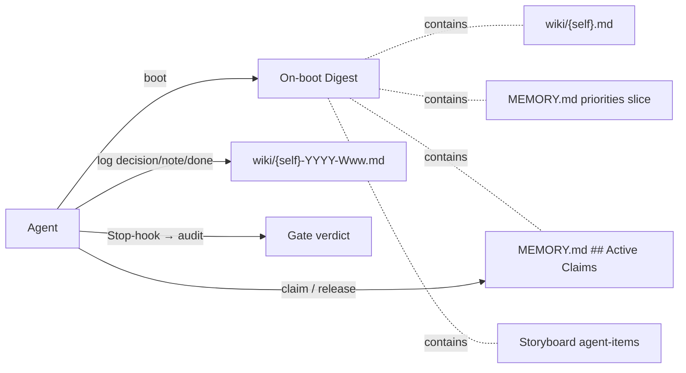
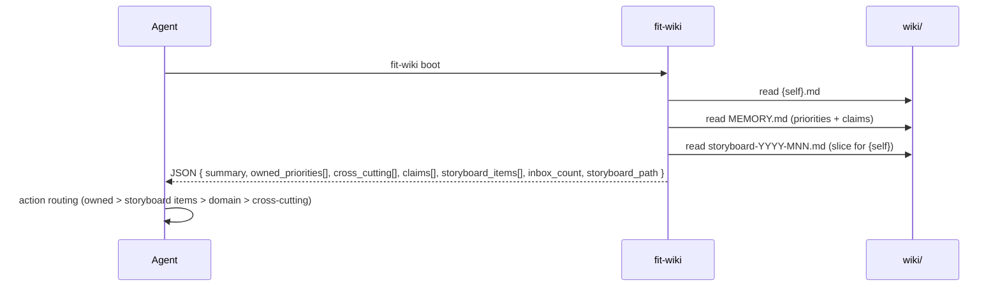
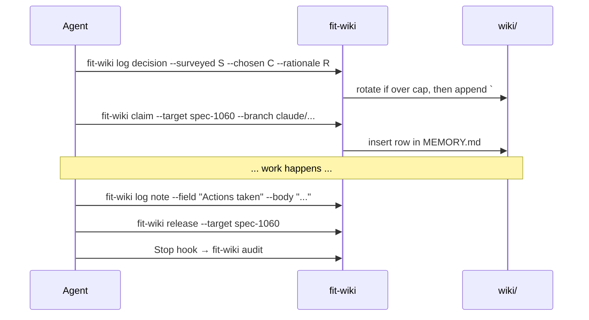

# Design 1060 — Memory Protocol Redesign

## Architectural Posture

The current protocol asks agents to *find files, read files, parse files, write
files.* Every gap the spec catalogues (F3, F4, F5, F6, F8, F10, F11, F13, F17,
F18) is a tax that lands on the agent because the protocol contracts the work
but not the surface that performs it. The redesign inverts that: **`fit-wiki`
becomes the agent's interface to memory.** Reads collapse to one call that
returns a structured digest. Writes collapse to one call that resolves paths,
dates, headings, and budgets. Direct file edits remain possible but become the
escape hatch, not the path.

This is what makes the read-on-boot habit cheap enough to beat
`gh`/`git`/source re-derivation (the JTBD Habit named in the spec § Forces).
The CLI is calibrated, on every primitive, to cost fewer tool calls than the
alternative it competes with.



## Components

| Component | Contract (interface, not implementation) |
|---|---|
| **`fit-wiki boot`** | Inputs: Tier 1 surfaces (`{self}.md`, `MEMORY.md`, current storyboard). Output: structured JSON digest (schema below). Reads memory; does not write. Missing-section tolerance: returns empty arrays for absent `## Active Claims` / inbox / storyboard slice. |
| **`fit-wiki log`** | Inputs: field flags (`--surveyed`, `--chosen`, `--rationale`, `--field`, `--body`). Output: append to current weekly log. Subcommands: `decision` (run opener, required leading `### Decision`), `note` (field append), `done` (entry closer). Cap enforcement: rotates *before* appending when the next append would exceed the cap. |
| **`fit-wiki claim` / `release`** | Inputs: `--target`, `--branch`, `--pr` (optional), `--expires-at` (optional). Output: insert / remove row in `MEMORY.md ## Active Claims`. `release` is the only writer that deletes a row in the normal lifecycle; `release --expired` is the operator cleanup primitive that removes rows past `expires_at`. |
| **`fit-wiki inbox`** | Subcommands: `list`, `ack`, `promote` (writes a row directly into MEMORY.md's priorities table), `drop`. |
| **`fit-wiki rotate`** | Seals the current weekly log as a read-only prior part and creates a fresh active part in the same agent-week namespace. Append-only invariant: no part is ever rewritten. Naming convention is plan-scope. |
| **`fit-wiki audit`** | Absorbs `scripts/wiki-audit.sh`. Sole audit invocation points: the Claude Code Stop-hook (per-run self-correction) and pre-merge CI (collective gate). `log`, `claim`, `release`, `rotate` never invoke audit. |
| **`fit-wiki memo`** | Unchanged. Send a cross-agent memo. |
| **`fit-wiki push` / `pull` / `refresh`** | Unchanged. |
| **`fit-wiki init`** | Idempotent. Scaffolds the `## Active Claims` heading and Stop-hook entry; never rewrites existing content. Single code path covers fresh and existing installs. |
| **`memory-protocol.md`** | Rewritten to specify CLI contracts plus the named jobs the CLI serves, not file-shape contracts. |
| **`MEMORY.md`** | Retains canonical-priority role; gains the `## Active Claims` schema. |

**Digest schema (boot output, JSON).** Array element shapes are part of the
stable contract:

```
{
  summary: string,
  owned_priorities: [{ item, status, added, link }],
  cross_cutting: [{ item, status, added, link }],
  claims: [{ agent, target, branch, pr?, claimed_at, expires_at }],
  storyboard_items: [{ dim, threshold, status, link }],
  inbox_count: number,
  storyboard_path: string,
}
```

`boot`'s output is the **load-bearing contract**; a `--format markdown` flag
renders the same content for human reading.

## Data Flow

### On boot



**Spec verifier compatibility — dual-path reads.** The spec § Success Criteria
wording requires a "file open of the named surface within the run's first ten
tool calls," and for claims, "by file open alone (no separate tool
round-trip)." The design preserves direct `Read` of MEMORY.md / `{self}.md` /
storyboard as a fully sanctioned path — the CLI is the *cheap* path, not the
only path. The redesigned protocol's Step 0 mandates `boot` (because
calibrated cost wins the Habit), but the verifier's success-criterion check
accepts either surface: a `Read` event on a named Tier 1 file, *or* a `Bash:
fit-wiki boot` event. Both are observable in the trace; both exercise the
priority surface. No spec re-draft required — the design's CLI posture
supplements the file-open path rather than replacing it. The "separate tool
round-trip" clause in the claims criterion targets *external* tools (`gh`,
`git`); `fit-wiki` is part of the memory infrastructure the criterion
protects, not an alternative to it.

### During run



## Decision-area Positions

Each row carries position, rejected alternative, and why.

| # | Area | Position | Rejected · Why |
|---|---|---|---|
| 1 | **Tier 1 read set** (closes F5, F11) | 3 files: `wiki/{self}.md`, `wiki/MEMORY.md`, current `wiki/storyboard-YYYY-MNN.md`. Agents do not name the file list in Step 0; they call `fit-wiki boot`, which returns a JSON digest containing each surface (storyboard pre-filtered to `{self}`'s items). | Rejected: keep the 3-file Tier 1 *instruction* (status quo). · The instruction is the source of F11 (0/8 reads of MEMORY.md) — agents skip what they must memorise. A CLI primitive calibrated cheaper than three file opens removes the "skip Step 0" Habit while preserving the routing contract (storyboard items remain a routing input). |
| 2 | **Weekly-log size budget** (closes F3, F17) | 500 lines per file. Anchor: a Tier 2 read consumes ≤10% of the agent's context window. The 200k-token window is the published context size for the model family the agents currently run on; the 10% fraction is the redesign's policy choice for per-read tax. Conversion to lines uses the spec's 25k-token / 600-line Read-cap empirical proxy (≈42 tokens/line), giving 20k-token / ~500-line. Overflow rotates: `log` seals the prior part read-only *before* appending, so the day's entry always lands in a fresh part and no part is ever rewritten (append-only audit preserved). Cutover: ISO **2026-W23** (Mon 2026-06-01). Pre-cutover logs exempt. | Rejected: daily file rotation; or no cap. · Daily explodes file count 7×; no-cap reproduces F3/F17. 500-line cap with seal-before-append preserves one-file-per-week as the common case while bounding worst-case context cost. |
| 3 | **Canonical priority surface** (closes F11, F8) | `wiki/MEMORY.md` retained as canonical priority surface. Read-on-every-boot realised by `fit-wiki boot` emitting the priority slice for `{self}` in the JSON digest. | Rejected: distribute priorities across agent summaries; or retire MEMORY.md. · Distributing reintroduces drift; retiring sheds the cross-cutting role. Retain and make cheap to read. |
| 4 | **In-flight work surface** (closes F8, F18) | New `## Active Claims` section in `MEMORY.md`. Schema: `\| agent \| target \| branch \| pr \| claimed_at \| expires_at \|`. **Row presence = active; row absence = settled.** Expiry policy: per-claim, set at `claim` time via `--expires-at` with a default of **claim+7 days** (one storyboard week; chosen so a claim outlives the longest legitimate single-spec run without indefinite stickiness). `pr` is optional (claim-before-PR is the F8/F18 case). Rows past `expires_at` are excluded from `boot`'s active set; `audit` reports them as findings; `release` (normal lifecycle) and `release --expired` (operator cleanup) are the writers that remove rows; no row is removed implicitly. | Rejected: separate `wiki/CLAIMS.md`. · One read fetches priorities and claims together; claims *are* priorities-in-flight; co-locating saves a Tier 1 file. |
| 5 | **Mechanical enforcement of summary contract** (closes F10) | Per rule, all three are **kept and gated** by `fit-wiki audit`: (a) 80-line summary cap (`wc -l`), (b) `<!-- memo:inbox -->` marker present directly below `## Message Inbox`, (c) `## Message Inbox` is the first H2. Stop-hook (per-run) + pre-merge CI (collective). | Rejected per rule: (a) raise the cap and skip gating, (b) drop the marker convention, (c) drop the first-H2 requirement. · Rules are already documented and load-bearing for on-boot inbox visibility; F10 is that they are unchecked, not that they are wrong. |
| 6 | **Decision-block adoption** (closes F6, F13) | Required at the **opening** of each weekly-log entry. `fit-wiki log decision` is the only sanctioned start-of-run write; `audit` flags entries that lack a leading `### Decision`. Past entries not retrofitted. | Rejected: keep the opening-position requirement as a contractually-stated but unenforced guideline (status quo, the source of F6/F13). · The wording is already correct; the failure mode is that it is unchecked. Gating fixes the gap without rewriting the contract. |
| 7 | **Tool-vs-memory habit** (closes F4, F5, F11) | **Memory-first**, anchored on CLI cost. The redesigned protocol states: when deciding between asking memory and re-deriving via `gh`/`git`/source, prefer memory because the CLI is calibrated to be cheaper. One call for the on-boot read set (F11). One call to record a decision (F4). One call for inbox state (F5 partial). | Rejected: tool-first; or silence (status quo). · The Habit (gh/git/source) competes only when memory access is more expensive. A position taken on exhortation alone will not shift behaviour; one taken via primitive cost will. |
| 8 | **`fit-wiki` CLI surface composition** (cross-cuts F3, F5, F8, F10, F17, F18) | See § CLI Surface. Every protocol contract maps to a subcommand; every subcommand maps to a protocol contract. A doc-test diffs the protocol's CLI-gated rule list against the CLI's subcommand list; mismatch fails CI. | Rejected: make CLI use optional and let agents hand-edit memory files. · Optional CLI reproduces F4 (probe-heavy writes) and F11 (skipped reads) — the primitives must be the *path*, not an alternative. The spec § Out of scope escape route allows deferring individual subcommands when a follow-up spec inherits the contract; the rejection is of full optionality, not staged delivery. |

## CLI Surface

| Subcommand | Status | Realizes contract | Closes |
|---|---|---|---|
| `boot` | new | Tier 1 on-boot read; priority-surface read; in-flight visibility; storyboard-items routing input | F5, F11 |
| `log decision` | new | Decision block at run opening | F4, F6, F13 |
| `log note` | new | Field appends within the open run entry | F4 |
| `log done` | new | Mark the open run entry closed. `rotate` is triggered by `log decision` / `log note` when the next append would exceed the cap, not by `done`. | F3, F17 |
| `claim` / `release` | new | In-flight work surface; append-only audit trail | F8, F18 |
| `inbox list` / `ack` / `promote` / `drop` | new | Inbox lifecycle | F5 (partial) |
| `rotate` | new | Weekly-log overflow handling; seal-before-append | F3, F17 |
| `audit` | absorbed (`scripts/wiki-audit.sh`) | All gated rules; Stop-hook + CI | F3, F8, F10, F13, F17, F18 |
| `memo` | retained (unchanged) | Cross-agent memo into recipient inbox | — |
| `push` / `pull` | retained (unchanged) | Wiki git sync | — |
| `init` | modified (additive, idempotent) | Scaffold MEMORY.md `## Active Claims`; install Stop-hook entry in `.claude/settings.json` | F8, F10, F13, F18 |
| `refresh` | retained (unchanged) | Storyboard XmR chart refresh | — |

## Cross-cutting Architectural Choices

| Choice | Position | Rejected · Why |
|---|---|---|
| Named jobs in protocol text (spec § In scope) | The protocol explicitly names the three jobs and binds each to a CLI primitive: "find next thing to pick up without colliding" → `claim`/`release`; "trust another agent's reported state without re-deriving" → `boot` digest + MEMORY.md; "receive memos without breaking my contract" → `inbox list/ack/promote/drop`. | Rejected: leave them unnamed; or disclaim. · Read-write asymmetry produced F11. Naming each job in the read contract and pointing each to its write contract closes the loop. |
| Append-only audit preservation under rotation | `log` seals the prior part read-only *before* appending; the new entry lands in a fresh part. No part is ever rewritten. | Rejected: rewrite-in-place compaction; or truncate-and-summarise. · Rewrite-in-place violates audit; summarisation lossy. Seal-before-append preserves the invariant with zero rewrite. |
| Coordination boundary | `coordination-protocol.md` and `approval-signals.md` not modified. `memo` (memory write) stays here; `agent-react` dispatch stays in `coordination-protocol.md`. | Rejected: fold sibling references in. · Spec § Out of scope; collapsing them blurs distinct contracts. |

## Non-Goals (Restated from Spec)

- No retrofit of pre-cutover weekly logs.
- No `agent-react` dispatch changes.
- No `coordination-protocol.md` / `approval-signals.md` redesign.
- No `libwiki/` internal refactor beyond what the new commands require.
- No external-system survey.

## Trade-offs Accepted

- **CLI dependency.** Step 0 requires `fit-wiki` on `PATH`. Mitigated:
  `fit-wiki` already ships in every Kata installation (`just quickstart`). A
  broken CLI fails loud; a missed `Read wiki/MEMORY.md` fails silent.
- **One more abstraction layer.** Agents interact with memory via a command
  surface rather than the filesystem. The win on every weekly-log write (6
  probes → 1 call, F4) and every cold boot (3 reads → 1 call) exceeds the
  conceptual cost.
- **Digest-format coupling.** Downstream skills consume `boot`'s JSON output.
  Treated as a stable contract under semantic versioning; format changes
  require a follow-up spec.
- **Trace-observability shift.** Pre-redesign, the priority surface read was a
  `Read` tool event. Post-redesign it is a `Bash: fit-wiki boot` event. The
  spec's success-criteria verifier reads the trace the same way; the surface
  it observes shifts from filename to subcommand name.

## References

- Spec [1060](spec.md)
- [memory-protocol.md](../../.claude/agents/references/memory-protocol.md) — current
- [libwiki](../../libraries/libwiki/) — CLI implementation (existing modules: `src/commands/init.js`, `src/commands/memo.js`, `src/commands/refresh.js`, `src/commands/sync.js`)
- [wiki-audit.sh](../../scripts/wiki-audit.sh) — to be absorbed
- Research corpus: [research](../../wiki/memory-protocol-research-2026-05-16.md), [study](../../wiki/memory-protocol-study-2026-05-16.md), [content analysis](../../wiki/memory-protocol-content-analysis-2026-05-16.md), [JTBD](../../wiki/memory-protocol-jtbd-2026-05-16.md), [failures](../../wiki/memory-protocol-failures-2026-05-16.md)
