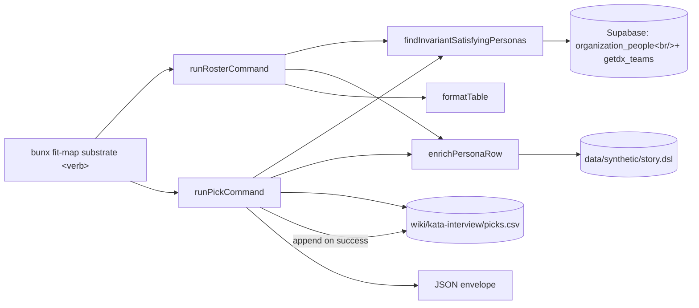
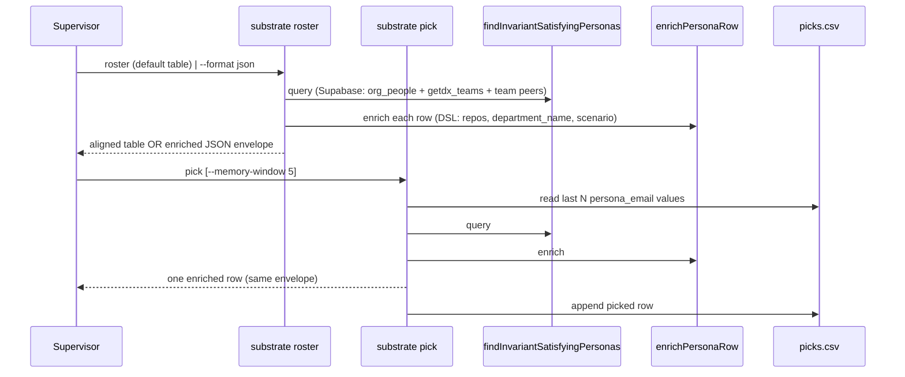

# Design 1090: Substrate roster reframed for the supervisor's persona-pick job

Companion to [`spec.md`](spec.md). Defines the components, verbs, row
shape, enrichment path, and memory record that satisfy the five spec
criteria without widening scope to `.substrate.json` on-disk semantics
or the persona-corpus invariants `substrate smoke` audits.

## Architectural overview

The reframe (i) widens the Supabase query inside the existing helper to
return rows the supervisor reads, (ii) adds a DSL enricher for the two
fields the substrate does not carry, and (iii) splits the operator
surface into two verbs — `roster` for "show me the menu" and `pick` for
"give me one persona diversified against memory". `substrate smoke`
continues to call `findInvariantSatisfyingPersonas` directly; the
persona-corpus invariants it audits are untouched.

## Components

| Component | Location | Role |
| --- | --- | --- |
| `runRosterCommand` | `products/map/src/commands/substrate-roster.js` | Default: aligned table. `--format json`: existing `{ personas, selection_metadata }` envelope with the enriched per-row shape. |
| `runPickCommand` (new) | `products/map/src/commands/substrate-pick.js` | Returns `{ personas: [<one row>], selection_metadata }`. Exits non-zero when no candidate diversifies. Appends to memory on success. |
| `findInvariantSatisfyingPersonas` | `products/map/src/commands/substrate-persona-query.js` | Same persona-corpus invariants (a–d), one new filter (`manager_email IS NOT NULL` — so every row in the result has a recorded org-tree parent; resolves the rename-with-nulls concern in Decision 4), and a widened row shape: persona scalars now include `github_username` and `getdx_team_id`; row carries the joined `getdx_teams` row (column: `name` — surfaced as `team_name`), the persona's parent row (`{email, name, github_username, level}` from `organization_people` by `manager_email`), and team peers (same four columns, persona excluded, ordered by `email` ASC, capped at 3 with `teammates_truncated: bool`). Renames the per-row scalar `manager_email` → `parent_email` (Decision 4). |
| `enrichPersonaRow` (new) | `products/map/src/lib/persona-enricher.js` | Pure function: given a persona row carrying `getdx_team_id` and a parsed story AST, returns the row augmented with three DSL-only fields. Strips the `gdx_team_` prefix from `getdx_team_id` to recover the DSL team `id` (substrate id-coupling, per `libraries/libsyntheticgen/src/engine/entities.js`), then delegates AST navigation to `findTeamById`, `findDepartmentForTeam`, and `findMostRecentScenarioForTeam` exported from `@forwardimpact/libsyntheticgen` (Decision 3). Enriched-field → helper: `repos` ← `findTeamById(ast, teamId).repos`; `department_name` ← `findDepartmentForTeam(ast, team).name`; `scenario` ← `findMostRecentScenarioForTeam(ast, teamId)` (most-recent entry in `ast.scenarios[]` whose `affects[].team_id` matches the team id, ordered by `timerange_start` then `id` ASC). The enricher carries no AST traversal of its own. |
| `loadStory` (new) | `products/map/src/lib/persona-enricher.js` | Wraps `createDslParser` from `@forwardimpact/libsyntheticgen`. Resolves `data/synthetic/story.dsl` via libutil `Finder` (`libraries/libutil/src/finder.js`, already exported on `main`) anchored at the monorepo root (root `package.json` name: `forwardimpact-monorepo`). Returns `null` when Finder reports the file absent — the supervisor's kata-interview runs from the monorepo root and always finds it; externally-published `npx fit-map` consumers without staged terrain see DSL-derived fields as `null` (Risk A). One call per command invocation. **Manifest changes**: the plan promotes `@forwardimpact/libsyntheticgen` from `devDependencies` to `dependencies` in `products/map/package.json` and adds `@forwardimpact/libutil` to `dependencies`, so both runtime imports pass the spec-1070 workspace-imports guard. |
| `readPickMemory`, `appendPickMemory` (new) | `products/map/src/lib/pick-memory.js` | CSV reader/writer over `wiki/kata-interview/picks.csv`. |
| `runSelfSmoke` (consumer-only edit) | `products/map/src/commands/substrate-smoke.js` | `assertDiscoveryResolves` reads `persona.parent_email`. Truthiness check unchanged — the assertion still gates "persona has a non-null parent". The persona-corpus invariants the audit gates on are unchanged. |

## Key Decisions

| # | Decision | Rejected alternative | Why |
| - | --- | --- | --- |
| 1 | **Two verbs (`roster` + `pick`)**, not one. | Single `roster` with a `--pick` flag. | `roster` returns the menu; `pick` returns exactly one row with a different exit contract (non-zero when memory diversification finds no candidate). Two verbs map directly onto the two supervisor moves in [`SKILL.md` Step 3a](../../.claude/skills/kata-interview/SKILL.md); a `--pick` flag couples the verbs without serving any caller. |
| 2 | **Render the table via libcli's existing `formatTable`** (`libraries/libcli/src/format.js:58`). | Hand-roll alignment; or pipe through `column -t`. | `formatTable` is already exported and used across `fit-map`. Reusing it removes the supervisor's ad-hoc Python tabulation (spec § Why-now bullet 3) without forking the renderer; `column -t` reintroduces piping. |
| 3 | **Source split: Supabase for `team_name`, `parent` (name/handle/level), and `teammates`; DSL JIT for `repos`, `department_name`, and `scenario`. AST navigation owned by libsyntheticgen, not the substrate.** Persona-template's `## You` fields map to substrate sources as: `email`/`name`/`github_username`/`discipline`/`level`/`track` from the persona row; `team_name` from `getdx_teams` joined via `getdx_team_id`; parent row from `organization_people` by `manager_email`; teammate rows from `organization_people` by shared `getdx_team_id`. The DSL contributes only `repos` (team block's `repos`), `department_name` (the team's enclosing department block's `name`), and `scenario` (the most-recent scenario block whose `affects` clause names the team's `id`). The substrate's `getdx_team_id` is derived from the DSL team `id` (substrate emits `gdx_team_<id>`, per `libraries/libsyntheticgen/src/engine/entities.js:36`), so the enricher's join is deterministic by construction. **AST traversal lives next to the AST**: the plan extends `@forwardimpact/libsyntheticgen`'s public exports with three pure helpers — `findTeamById(ast, teamId)`, `findDepartmentForTeam(ast, team)`, `findMostRecentScenarioForTeam(ast, teamId)` — JSDoc'd as part of the library's API surface and covered by a new `libraries/libsyntheticgen/test/dsl-helpers.test.js`. The substrate's `enrichPersonaRow` consumes the helpers; the lookup semantics (department-id → department-block resolution, scenario `affects` matching, `timerange_start`+`id` ordering) live in the library that owns the grammar. See `data/synthetic/story.dsl:20` for an example team block and `libraries/libsyntheticgen/src/dsl/parser-blocks.js:49,224,252` for the parser-emitted team/affect/scenario shapes the helpers walk. | (a) Materialize all DSL fields into a `personas_enriched` Postgres view via a new migration. (b) Hand-roll a DSL parser inside `fit-map`. (c) Separate `substrate persona-context <email>` verb. (d) Open-code AST traversal inside `products/map/src/lib/persona-enricher.js`. | (a) is the most invasive change, requires re-seeding terrain, is harder to roll back than query-time enrichment, and widens the spec-1100 substrate-stage surface this spec walls off (the spec OOS list does not explicitly forbid migrations, but spec § Risks prefers query-time enrichment for the same reason). (b) re-implements parsing the workspace already exports. (c) re-introduces the manual second-call pattern the spec retires. (d) couples the substrate to AST shape that may drift independently of the persona-pick contract; the helpers give the library a single seam to absorb that drift. The Supabase-first split is also correct on data locality: every scalar field of the `## You` block exists in `organization_people`/`getdx_teams`; only narrative-shaped fields are DSL-only. |
| 4 | **Rename `manager_email` → `parent_email` AND tighten the helper's invariant set to `manager_email IS NOT NULL`.** Renaming alone leaks top-of-tree rows (managers with no parent) into roster output as `parent_email: null`, which spec criterion 4 forbids ("value matches the semantic role"). Adding the non-null filter pushes the smoke truthiness check up into the query so every roster row, not just `personas[0]`, carries a real parent. `.substrate.json`'s on-disk `manager_email` key is unchanged (spec § OOS row 5). Spec § OOS row 4 ("smoke invariants … untouched") refers to the persona-corpus invariants `substrate smoke` audits, not to JS-level field names: the audit's assertions still pass by construction, and the additional filter only narrows the set, never widens it. | (a) Rename only; document null as "top-of-tree". (b) Drop the field. (c) Split into `parent_email` + `reports_to_count`. | (a) puts a value the spec criterion 4 rule forbids into the operator surface (a `parent_email` field with `null` is still a name-vs-value mismatch under the spec's strict reading). (b) breaks `substrate-smoke.js:184`'s assertion contract. (c) is busywork; `manages_count` already covers reports. The chosen approach is mechanical, fit-map-internal, and keeps `.substrate.json`'s on-disk `manager_email = persona_email` (per `substrate-issue.js:87`) unchanged — the operator-facing rename and the on-disk key serve different consumers. |
| 5 | **Memory record: `wiki/kata-interview/picks.csv`** (new top-level skill-scoped directory). Schema `picked_at,persona_email,run_id`. `run_id` is `$GITHUB_RUN_ID` when set, else empty. Default `--memory-window 5` rows (configurable). Spec criterion 3's verification is single-session: each `pick` invocation reads the file, picks against the last N rows, then appends; two successive `pick` calls in one shell session return different personas. Cross-CI durability is a downstream concern (the existing wiki-sync pipeline commits `wiki/` back to `main`); not a design contract. | (a) Grep `wiki/product-manager-*.md` weekly logs. (b) Regex-extract persona email from the prose `note` column of `wiki/metrics/kata-interview/2026.csv`. (c) Place picks.csv as a sibling under `wiki/metrics/kata-interview/`. (d) Inline pick history in `wiki/STATUS.md`. (e) Schema column `verb` to record the invoking command. | (a) is the prose-fragile pattern being retired. (b) couples picks to a free-form prose column whose phrasing has historically shifted. (c) collides with the established `wiki/metrics/<skill>/<YYYY>.csv` schema (`date,metric,value,unit,run,note`) — picks.csv is an event log, not a measurement series; co-locating them complicates the metric-ingestion contract (`references/metrics.md`). (d) overloads STATUS. (e) carries one value (`pick`) with no foreseen second (YAGNI). The new top-level `wiki/kata-interview/` namespace mirrors `wiki/{agent}.md` and is the smallest convention extension that keeps measurement and event-log surfaces distinct. |
| 6 | **Table columns** (in this order): `email`, `name`, `discipline`, `level`, `track`, `team_name`, `manages_count`, `parent_email`. Spec criterion 1's named set (email, name, discipline, level, track) appears in the same aligned block; the design widens by `team_name` (load-bearing for memory diversification by team coverage), `manages_count` (the spec-named invariant signal — same name as the helper's existing field, no rename), and `parent_email` (Decision 4). | (a) Exact spec criterion 1 column set only. (b) Every field as a column. | (a) hides team and reports-count signals load-bearing for the pick. (b) busts the table at typical terminal width: list-valued fields do not align in fixed-width cells. |
| 7 | **JSON row carries the eight table columns plus** `github_username` (@-handle source), `parent: {email, name, github_username, level}`, `evidence_count`, `practice_directs_count`, `snapshot_id`, `item_id` (scalar diagnostic/discovery fields kept out of the table to bound it to the pick-time field set), `teammates: [{email, name, github_username, level}, …]`, `teammates_truncated` (bool), `repos`, `department_name`, `scenario`. | Render collections as comma-joined cells inside the table; or move scalar diagnostic fields (`evidence_count`, `snapshot_id`, etc.) into the table for completeness. | Comma-joined cells truncate or break alignment as list lengths vary. Diagnostic fields are present in the JSON for trace/debugging; surfacing them as columns dilutes the persona-pick scan with values the supervisor never reads for selection. The table is the pick surface; JSON is the persona-craft surface. |

## Data flow

## Spec-criteria mapping

| Spec criterion | Component(s) | Verification surface |
| --- | --- | --- |
| 1 Tabular default | Decision 2 + Decision 6 | `roster` stdout starts with the aligned header line (no leading bullet); spec criterion 1's five columns appear in the same block. |
| 2 Persona-ready JSON | Decision 3 + Decision 7 | One `roster --format json` row carries every `## You` template value: `email`, `name`, `github_username` (the @-handle source), `team_name`, `department_name`, `parent: {email, name, github_username, level}`, `discipline`, `level`, `track`, `repos`, `teammates: [{email, name, github_username, level}, …]`, `scenario`. |
| 3 Memory-diversified pick | Decision 1 + Decision 5 | Two successive `pick` invocations against a fixed substrate return different `persona_email` values; the second invocation's persona is absent from the row appended by the first plus the N−1 prior. |
| 4 No misleading field | Decision 4 | `roster` output (table + JSON) carries `parent_email`; the value is the persona's actual org-tree parent (`organization_people.manager_email`); never `null` (the helper filter excludes top-of-tree rows by construction) and never the persona's own email. |
| 5 SKILL.md alignment | Plan owns the SKILL.md text; design names the contract Step 3a must invoke. | Plan-time check: Step 3a invokes `substrate pick` and references the enriched `roster` row; no `rg`/`grep` against `wiki/product-manager-*.md` or `data/synthetic/`. |

## Risks

- **A — DSL absent.** `loadStory` returns `null` when `data/synthetic/story.dsl`
  is missing; enricher returns the persona row with
  `repos: null, department_name: null, scenario: null`. Spec criterion 2 holds
  only when terrain is staged — guaranteed by the kata-interview workflow's
  `fit-terrain build` step.
- **B — DSL schema drift.** Enricher is coupled to `story.dsl`'s grammar via
  `createDslParser`. A grammar change throws a parse error; `loadStory` catches
  and rethrows with the file path and parser message, and the verbs exit
  non-zero (rather than silently degrading), so the supervisor sees the drift
  inside Step 3a. The plan's manifest-promotion step (move
  `@forwardimpact/libsyntheticgen` from `devDependencies` to `dependencies` in
  `products/map/package.json`) is gated by the spec-1070 workspace-imports
  guard, so a missing promotion fails CI before merge.
- **C — `formatTable` null cells render as empty strings**
  (`libraries/libcli/src/format.js:79`: `String(cell || "")`). The supervisor
  sees an empty column for a missing `team_name` or `parent_email`, not a
  sentinel — clear enough to drive a different pick.
- **D — Memory persistence across CI runs.** `picks.csv` is durable only if
  committed back to the wiki. The existing wiki-sync workflow handles this; if
  it fails, cross-run diversification degrades to single-run diversification.
  Detection surfaces in the next supervisor session via memory-window staleness.
- **E — Memory file growth.** Append-only with one row per pick; observed
  cadence ≤2 picks/day → ≤500 rows/year. Rotation deferred; flag for re-spec if
  growth exceeds bound.

## Out of scope (for this design)

- `.substrate.json` on-disk field names (spec § Out-of-scope row 5).
- Persona-corpus invariants `substrate smoke` audits (unchanged; only the field
  name one consumer assertion reads moves).
- SKILL.md Step 3a text — owned by the plan, against the contract named in
  criterion 5 above.
- Migration-time materialization of DSL fields — rejected (Decision 3a) for
  cost-vs-benefit and substrate-stage-surface containment, not spec OOS.
