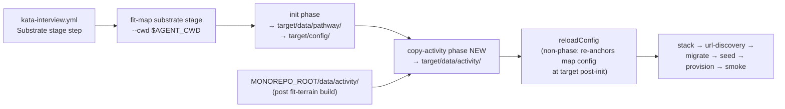

# Design 1100: `substrate stage` copies `data/activity/` to the agent workspace

## Problem (restated)

Today the Landmark kata-interview flow leaves `data/activity/` file staging in
the supervisor's head: `bunx fit-map substrate stage` seeds the Supabase
substrate but does **not** copy `data/activity/` to `$AGENT_CWD`, so the
supervisor must remember a manual
`cp -r data/activity "$AGENT_CWD/data/activity"` on top of the automated
`substrate stage`. Run 25999252444 skipped it; run 25999790849 caught it at
supervisor turn 38. We move the copy into substrate automation so the workspace
exhibits the right state regardless of supervisor recall.

## Scope

In: `products/map/src/commands/substrate-stage.js`, a new helper
`products/map/src/lib/copy-activity.js`, its test, the existing
`substrate-stage.test.js` (phase-ordering assertions extended), and the
Landmark row of `.claude/skills/kata-interview/SKILL.md` Step 3. Map/Pathway/
Summit rows are byte-identical to `origin/main` post-change.

Out: the Supabase activity seed (already automated); non-Landmark workspace
staging; substrate roster/suggest reframe (1090); wiki log rotation (1110).

## Architecture

After `substrate stage` completes, `$AGENT_CWD/` must carry everything the
agent needs that is not handled by the supervisor's per-product `cp -r
data/pathway`. Today that contract is incomplete for `data/activity/`. We
add a single new phase (`copy-activity`) to the existing `substrate stage`
pipeline rather than introducing a parallel verb.

The kata-interview workflow already guarantees the source exists:
`.github/workflows/kata-interview.yml`'s `Prepare interview workspace` step
runs `bunx fit-terrain build` before the `Substrate stage` step fires. The
new phase is a no-op as a precondition contract — it asserts that the
workflow ran terrain build, and fails loudly if not.



## Components

| Component | Role | File |
| --- | --- | --- |
| `copyActivity({ source, target })` | Pure async helper. Calls `fs.cp(source, path.join(target, "data", "activity"), { recursive: true, force: false, errorOnExist: false })` (`node:fs/promises`); `recursive: true` creates the `data/` parent if absent, matching `init.js`'s recursive-copy semantics. Throws raw `Error` (no envelope prefix) so the caller's `runPhase` owns the framing. | `products/map/src/lib/copy-activity.js` (new) |
| `runStageCommand` | Adds a `copy-activity` phase between `init` and the existing `reloadConfig` step, resolved through `runPhase("copy-activity", …)`. Inside the wrapper, resolves `source = path.dirname(await findDataDir(undefined)) + "/activity"` and calls `copyActivity({ source, target })`. New injectable dep `loadCopyActivity` mirrors `loadInit`. | `products/map/src/commands/substrate-stage.js` (edit) |
| Source-directory discovery | The `copy-activity` phase resolves `source` via its own `findDataDir(undefined)` call **inside its `runPhase` wrapper** — so a missing-monorepo throw becomes `[substrate stage: copy-activity] No data directory found …` rather than an unwrapped escape from `runStageCommand`. The existing seed-phase call at `substrate-stage.js:89` stays in place; both calls walk upward from `process.cwd()` (in CI: monorepo root — `--cwd $AGENT_CWD` only sets the substrate's *target*, not the process cwd) and return the same `pathway/` subdirectory (`data-dir.js:42`), so both phases observe the same `<monorepo>/data` root. Two calls, one resolver, same result. | `products/map/src/commands/substrate-stage.js` |
| `runPhase` envelope | Unchanged. Wraps any throw as `[substrate stage: copy-activity] <reason>` — the existing throw at `substrate-stage.js:112` satisfies spec § Success criterion 3 verbatim. | `products/map/src/commands/substrate-stage.js` |
| Landmark SKILL row | Step 3 table Landmark row drops the supervisor `data/activity/` instruction (only the activity portion; `data/pathway/` stays). Map/Pathway/Summit rows untouched. | `.claude/skills/kata-interview/SKILL.md` |

## Interfaces

```js
// products/map/src/lib/copy-activity.js
export async function copyActivity({ source, target }) { … }
```

- `source` (string, absolute): the directory whose contents should be copied
  (e.g. `<monorepo>/data/activity`).
- `target` (string, absolute): the workspace target (`--cwd` value). The
  helper writes into `path.join(target, "data", "activity")`.

Phase sequence post-change (as observable in tests via `runPhase`
invocations):

```text
init → copy-activity → stack → url-discovery → migrate → seed → provision → smoke
```

## Data flow

1. CI step `Prepare interview workspace` runs `bunx fit-terrain build`, so
   `<monorepo>/data/activity/` exists.
2. CI step `Substrate stage` runs
   `bunx fit-map substrate stage --cwd <agent_dir>`. `runStageCommand` runs the
   `init` phase against `target`.
3. The new `copy-activity` phase wrapper resolves `dataRoot` via
   `path.dirname(await findDataDir(undefined))`, then calls `copyActivity({
   source: dataRoot + "/activity", target })`, which invokes `fs.cp(...)`
   with the idempotent options above. Re-running against an already-staged
   target is additive (Decision 7).
4. `reloadConfig` re-anchors map config at `target` (existing behaviour).
5. Subsequent DB phases proceed unchanged; none read or write
   `target/data/activity/`.

## Key Decisions

| # | Decision | Rejected alternative | Why |
| --- | --- | --- | --- |
| 1 | **New `copy-activity` phase inside `substrate stage`.** | (a) `substrate issue` (supervisor-time verb); (b) extend `runInit` to copy `data/activity/` when present. | `substrate issue` runs per-persona (potentially repeated picks); activity files are persona-independent — wrong layer. `init` is a developer-facing verb (`bunx fit-map init`) that bootstraps `data/pathway/` from a shipped starter dir; `data/activity/` is post-build state from a different source — conflating violates `init`'s single responsibility and couples a developer command to terrain output. `substrate stage` is the once-per-run workspace-prep verb — the right layer. |
| 2 | **Reuse `runPhase` envelope; do not introduce a new error format.** | A new envelope owned by `substrate issue` (the spec § Scope explicitly listed this as a design choice). | The existing envelope at `substrate-stage.js:112` already emits `[substrate stage: <phase>] <reason>` — satisfies spec § Success criterion 3 verbatim with zero new surface. Choosing this envelope is the consequence of Decision 1's host choice. |
| 3 | **Sequence `copy-activity` immediately after `init`, before `reloadConfig`.** | Run after `seed`; or after `reloadConfig` but before `stack`. | `copy-activity` is filesystem-only and target-only. Putting it adjacent to `init` (the other filesystem phase) groups related work and surfaces a corrupt-source failure before the slow Supabase boot — fast feedback on a 30-min CI job. `init` writes `target/data/pathway/` + `target/config/`; copy-activity writes `target/data/activity/` — disjoint sub-trees, zero clobber risk. Pre-`reloadConfig` because `copy-activity` reads no config. |
| 4 | **Two independent `findDataDir(undefined)` calls — one inside the `copy-activity` `runPhase` wrapper, one at the existing seed-phase site.** | (a) A single shared call hoisted to the top of `runStageCommand`; (b) hard-code `path.resolve(process.cwd(), "data/activity")`; (c) new `FIT_MAP_ACTIVITY_DIR` env var. | A hoisted single call lives outside any `runPhase` wrapper — a "No data directory found" throw from `data-dir.js:44` would escape unwrapped and miss spec § Success criterion 3 ("names the file-copy step"). Two calls inside their phase wrappers attribute discovery failures correctly; `findDataDir(undefined)` is deterministic in a given process (walks from unchanged `process.cwd()`), so both calls return the same path. Hard-coding breaks developer flows; a new env var multiplies operator surface for no gain. |
| 5 | **Phase name is the literal string `copy-activity`.** | `stage-activity`, `activity`, `activity-copy`. | The envelope `[substrate stage: <phase>] <reason>` embeds the phase name verbatim (spec § Success criterion 3 requires "human-readable" and "name the file-copy step"). `copy-activity` reads as a file operation; `stage-activity` collides with the verb name; bare `activity` collides with the existing `seed` phase's payload. |
| 6 | **Fail loud if source dir is absent; never silent-skip.** | Skip the copy when `<dataRoot>/activity` is missing (e.g. someone ran `substrate stage` in a dev tree without `fit-terrain build`). | Silent-skip would re-create the "remember the manual cp" landmine the spec is closing. The envelope `[substrate stage: copy-activity] ENOENT: …` is the exact diagnostic spec § Success criterion 3 demands. CI always runs `fit-terrain build` first, so this only fires in dev — where the message is immediately actionable ("you skipped `fit-terrain build`"). |
| 7 | **Idempotent `fs.cp` options: `force: false, errorOnExist: false`.** | `force: true` (overwrite) or default (`errorOnExist: true`). | Matches `init.js`'s recursive-copy semantics. CI's `mktemp -d` target is always fresh, so the option only matters for dev re-runs — where existing edits should not be clobbered and a re-run should not throw. A dev who already ran `fit-terrain build` sees a clean idempotent re-stage. |
| 8 | **No env gate on the new phase.** | Gate behind `CI=true` or a Landmark-only flag because the verb docstring marks it "not a developer verb". | The docstring already names this verb as the CI/workflow surface; activity copy is consistent with that contract. Gating multiplies test paths and creates a "works in CI, fails in dev" surface future supervisors rediscover the hard way. Decision 6's loud-failure handles the dev-no-terrain case cleanly. |

## Tests

| Surface | Property |
| --- | --- |
| `copy-activity.test.js` (new) | Helper copies a source tree to `target/data/activity/` such that relative-path sets agree; idempotent re-run is **additive** (source-deleted files persist on target — acceptable because CI's `mktemp -d` target is always fresh; dev re-runs documented in Decision 7); missing source throws a raw `Error` whose message names the absent path. |
| `substrate-stage.test.js` (edit) | Phase-ordering test extended to require `copy-activity` between `init` and `stack`. Existing parametric `failPhase` test already covers the `[substrate stage: <phase>]` envelope generically (`substrate-stage.js:108-114`); a new integration assertion confirms a real missing-source ENOENT (helper run against an absent source) surfaces wrapped as `[substrate stage: copy-activity] …`. |

Spec § Success criteria 1 and 4 are one-shot CI / PR-time verifications,
not recurring tests — surfaced in the plan's verification checklist:
(1) end-to-end relative-path-set diff against `<monorepo>/data/activity`
after a real workflow run; (4) `git diff` on the Map/Pathway/Summit Step 3
rows.

## Risks

| Risk (spec §) | Mitigation |
| --- | --- |
| Race with workspace init (clobbering `init` output) | Decision 3 + disjoint sub-trees: `init` writes `target/data/pathway/` + `target/config/`; copy writes `target/data/activity/`. Sequencing makes the no-clobber property obvious in the trace; disjointness makes it true regardless. |
| Source-directory discovery (resolver appropriate for file copy?) | Decision 4: each phase calls `findDataDir(undefined)` inside its own `runPhase` wrapper. `findDataDir` is deterministic against `process.cwd()` in a given process, so both calls return the same `<monorepo>/data/pathway` and `path.dirname` recovers the same root. Phase attribution survives because each call's throw is wrapped by its own envelope. |
| CI-vs-developer-flow divergence (verb is "CI-only") | Decision 8: no env gate. Decision 6's loud-failure message gives a dev who runs `substrate stage` cold an immediately actionable error. A dev who first ran `fit-terrain build` sees a clean idempotent re-stage (Decision 7). |
