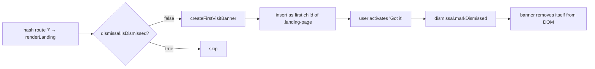

# design(1120): pathway first-visit dismissible banner

## Architecture

A single client-side component renders on the landing page (`/`) only,
controlled by a small dismissal-state module that wraps `localStorage`. No
server, no global store changes, no router-level guard.



## Components

| Component                                 | Responsibility                                                                                                                                                |
| ----------------------------------------- | ------------------------------------------------------------------------------------------------------------------------------------------------------------- |
| `first-visit-banner` (UI component)       | Builds the banner element with the verbatim copy from § Banner copy, a `Got it` button, and an `onDismiss` callback. Pure factory — no storage access inside. |
| `first-visit-dismissal` (storage adapter) | `isDismissed()` and `markDismissed()` over a single `localStorage` key. Guarded against unavailable / throwing storage (e.g. private mode).                   |
| Landing-page integration                  | Reads `isDismissed()`; if false, builds the banner and inserts it as the first child of `.landing-page`. Wires `onDismiss` to `markDismissed()` + removal.    |
| Banner stylesheet                         | Banner layout, dismiss-button styling, responsive rules, reduced-motion handling. A component CSS partial imported by the existing `app.css` bundle.          |

The banner is **only** rendered from `renderLanding`. Non-root routes never
import the component, so behaviour 8 ("never on non-root routes") falls out of
the module-import graph rather than a runtime check.

## Interfaces

```js
// first-visit-banner.js
export function createFirstVisitBanner({ onDismiss }) { /* returns HTMLElement */ }

// first-visit-dismissal.js
export function isDismissed() { /* boolean — false if storage unavailable */ }
export function markDismissed() { /* void — no-op on storage error */ }
```

The storage key is `pathway:first-visit-banner:dismissed`, value `"1"`. The
prefix `pathway:` reserves an origin-local namespace; the suffix `:dismissed`
keeps room for a future versioned re-show key (see § Out of scope at design
level) without colliding with this one.

## Data flow

The banner has exactly one source of truth (the `localStorage` key) and one
write path (`markDismissed`, called from the `Got it` activation handler).
There is no reactive store entry and no subscription. After dismissal, the
banner element is removed directly from the DOM; the next landing render
skips it because `isDismissed()` now returns `true`.

## Accessibility model

| Concern                | Mechanism                                                                                                                                          |
| ---------------------- | -------------------------------------------------------------------------------------------------------------------------------------------------- |
| Screen-reader region   | Banner is a `<section role="region" aria-labelledby="first-visit-heading">` containing a `<h2 id="first-visit-heading">Before you begin</h2>`.     |
| Announce on appear     | The region also carries `aria-live="polite"` so assistive tech announces the heading and body copy when the banner is inserted (spec behaviour 7). |
| Keyboard reach         | `Got it` is a native `<button>`. No `tabindex`, no focus trap — banner is non-blocking by spec.                                                    |
| Focus on appear        | No programmatic focus move. Stealing focus on every first visit fights behaviour 2 (non-blocking).                                                 |
| Focus after dismissal  | No programmatic move — the page underneath is interactive throughout, so neither mouse nor keyboard users are stranded.                            |
| Reduced motion         | Any enter/leave transition gated behind `prefers-reduced-motion: no-preference`.                                                                   |

## Key Decisions

| Decision                                                                   | Choice                                          | Rejected alternative                                                                                                                                                                                |
| -------------------------------------------------------------------------- | ----------------------------------------------- | --------------------------------------------------------------------------------------------------------------------------------------------------------------------------------------------------- |
| Where to persist dismissal                                                 | `localStorage` key, same-origin                 | `sessionStorage` (lost on tab close → banner re-shows in same browser session, violates behaviour 5); cookie (implies server round-trip the spec rules out); in-memory only (re-shows on reload).   |
| Where to render the banner                                                 | Inside `renderLanding` only                     | Top-level slot in `index.html` with a visibility toggle (banner DOM would exist on every route and need runtime hide logic — risks behaviour 8 regressing whenever a new route is added).           |
| Copy source                                                                | Hard-coded module export in the component       | Loading from `standard.yaml` or a new YAML file (re-opens the per-installation-customization surface the spec explicitly closed); a translation layer (no i18n elsewhere in Pathway yet).           |
| Dismissal state surface                                                    | Stand-alone module, not the libui store         | Adding a `ui.banner.dismissed` field to the global store (couples first-visit UX to the central store, invites other one-off flags to follow); subscribing to store changes (no reactive consumer). |
| Behaviour when `localStorage` is unavailable (private mode, storage error) | Treat as "not dismissed" each visit             | Failing closed (banner never shows — engineers who need orientation most lose it); throwing (breaks landing page render).                                                                           |
| Storage key shape                                                          | `pathway:first-visit-banner:dismissed` = `"1"`  | A single boolean `firstVisitDismissed` (collides with anything else in the origin); JSON payload (no second field is in scope).                                                                     |
| Banner placement within the landing DOM                                    | First child of `.landing-page`                  | Sticky overlay (visually blocking, re-introduces the modal feel); footer placement (out of orientation order — the banner has to land before the engineer reads the page).                          |
| Announce on appear                                                         | `aria-live="polite"` on the region              | Programmatic focus move to the banner (steals focus from the page); silent region (spec behaviour 7 requires announcement on appear).                                                               |

## Risks

- **Banner appears every visit in private browsing.** Acceptable — spec § 9
  explicitly allows re-show after site data is cleared, and private mode is the
  same shape.
- **A future route handler that delegates to `renderLanding`** (e.g. a "home
  with state" variant) would inherit the banner. Coupling is intentional: the
  banner follows the landing render, not the literal `/` route.
- **Copy regressions are silent.** Because the copy is hard-coded, a typo in
  the component is a visual bug only — no test surface protects it from drift.

## Out of scope at design level

- Banner re-show triggers (version bumps, content revisions). Not modelled —
  storage key is intentionally version-free; a future spec can introduce
  `pathway:first-visit-banner:v2:dismissed` without migration.
- Telemetry hooks for dismissal events. Not modelled.
- Per-installation copy overrides. Not modelled — the `standard.yaml` surface
  is deliberately not extended.

— Release Engineer 🚀
