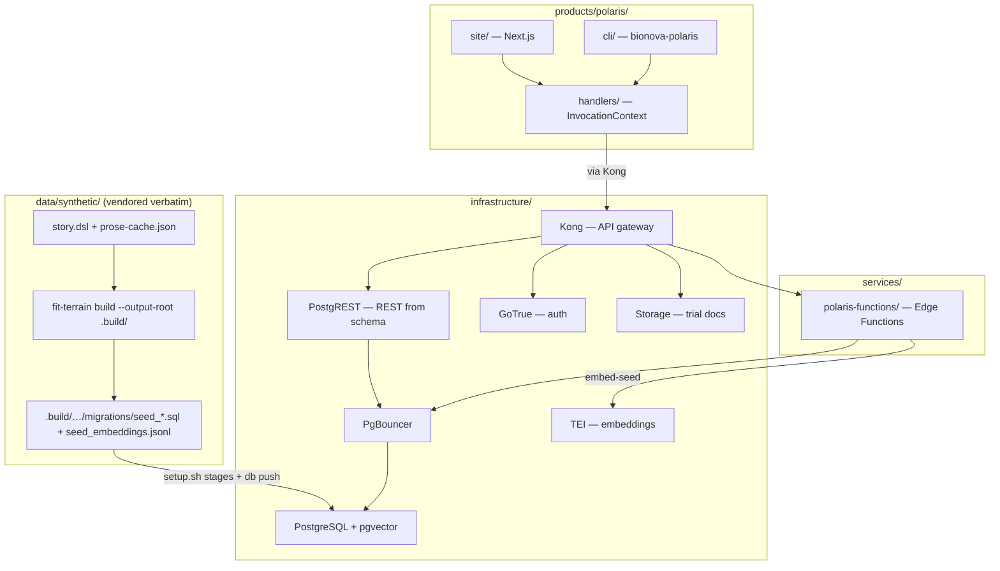

# Design 1160 — BioNova Polaris Application

All paths below are within the `bionova-apps` repository — a separate,
MONOREPO.md-compliant repo that consumes Forward Impact libraries from npm.

## Components

| Component | Location | Purpose |
| --- | --- | --- |
| Handlers | `products/polaris/handlers/` | Surface-agnostic business logic |
| Web frontend | `products/polaris/site/` | Next.js App Router + Tailwind + shadcn/ui |
| CLI | `products/polaris/cli/` | `bionova-polaris` via libcli |
| Edge Functions | `services/polaris-functions/` | Deno functions for eligibility, seeding, sync |
| Infrastructure | `infrastructure/` | PG On Rails self-hosted Supabase stack |
| Synthetic source | `data/synthetic/story.dsl` + `prose-cache.json` | Verbatim vendored DSL — the domain source of truth, rendered locally by `fit-terrain` |
| Seed build | `data/synthetic/.build/` (gitignored) | Disposable target for `fit-terrain build --output-root`; staged into migrations by `setup.sh` |

## Architecture



## Shared Library Consumption

| Library | Consumer | Role |
| --- | --- | --- |
| `libcli` | `products/polaris/cli/` | CLI dispatch, `--help`, subcommand routing |
| `libui` | `products/polaris/site/` | Routing, reactive state, and `freezeInvocationContext` for the web surface |
| `libformat` | `products/polaris/handlers/` | Render handler output to ANSI (CLI) or HTML (web) |
| `libtemplate` | `products/polaris/handlers/` | Mustache templates for trial cards, eligibility reports |
| `librepl` | `products/polaris/cli/` | `bionova-polaris repl` — staff interactive trial data exploration |
| `libterrain` (`fit-terrain`) | `setup.sh` / `package.json` build script | Build-time only. Renders the vendored `story.dsl` to seed SQL + embeddings JSONL. Not imported by any surface. |
| `@forwardimpact/map` | dependency of `libterrain` | Build-time only. Resolves the map schema dir for `--schema-dir` (pathway rendering is skipped for Polaris). |

## Shared Surface Architecture

Both surfaces produce an `InvocationContext { data, args, options }` (`libcli`
on the terminal, `libui` on the web) and dispatch to the same handler function.
Handlers return surface-agnostic data; `libformat` renders to ANSI or HTML.

| Handler | CLI command | Web route | Args |
| --- | --- | --- | --- |
| `searchTrials` | `search` | `/search` | `--condition`, `--phase`, `--status`, `--location` |
| `showTrial` | `trial <id>` | `/trials/:id` | `id` positional; includes the trial FAQ (`trial_faqs`) and consent summary (`consent_summaries`) |
| `showCondition` | `condition <id>` | `/conditions/:id` | `id` positional; includes the condition explainer (`condition_explainers`) |
| `checkEligibility` | `eligibility <id>` | `/trials/:id/eligibility` | `id` positional |
| `listSites` | `sites` | `/sites` | `--specialty`; each site includes its description (`site_descriptions`) |
| `listStories` | `stories` | `/stories` | `--condition`; patient stories (`patient_stories`) |
| `showAbout` | `about` | `/about` | none; includes therapy descriptions (`therapy_descriptions`) |
| `manageTrial` | `admin trial <id>` | `/admin/trials/:id` | `id` positional (staff auth); includes interest signal aggregates |

Every prose surface reads a generated seed table. No handler hand-authors
patient-facing copy — the text originates in `story.dsl`'s `clinical.content`
block and is rendered through the prose cache.

The CLI entry point (`bin/bionova-polaris.js`) uses `createCli` from
`@forwardimpact/libcli`. The `admin` subcommand group requires GoTrue JWT
via `--token` or `SUPABASE_SERVICE_ROLE_KEY`.

## PostgreSQL Schema

Tables seeded by the terrain pipeline (`supabase_migration` output via
`renderSql()` in libsyntheticrender):

| Table | Columns | Source entity |
| --- | --- | --- |
| `conditions` | `id pk`, `name`, `icd10 text[]`, `synonyms text[]`, `synthea_module`, `severity`, `prose_topic`, `prose_tone` | `ClinicalConditionEntity` |
| `sites` | `id pk`, `name`, `address`, `city`, `state`, `country`, `org_ref`, `capacity int`, `specialties text[]` | `ClinicalSiteEntity` |
| `researchers` | `id pk`, `person_ref`, `name`, `email`, `role`, `trial_ids text[]`, `specialty` | `ClinicalResearcherEntity` |
| `trials` | `id pk`, `name`, `protocol_id`, `phase`, `therapeutic_area`, `sponsor`, `status`, `target_enrollment int`, `current_enrollment int`, `start_date date`, `estimated_end_date date`, `arms text[]`, `prose_topic`, `prose_tone`, `principal_investigator_id fk`, `project_ref`, `project_id` | `ClinicalTrialEntity` |
| `criteria` | `trial_id pk/fk`, `inclusion jsonb`, `exclusion jsonb` | `ClinicalCriterionEntity` |
| `trial_conditions` | `trial_id fk`, `condition_id fk` (composite pk) | Junction from `trial.conditions[]` |
| `trial_sites` | `trial_id fk`, `site_id fk` (composite pk) | Junction from `trial.sites[]` |
| `condition_embeddings` | `id pk`, `condition_id fk`, `embedding vector(384)` | `renderSql(include_embeddings: true)` + `embed-seed` edge function |
| `condition_explainers` | `condition_id pk/fk`, `explainer text` | `ClinicalConditionExplainerEntity` (prose-cache key `clinical_condition_explainer_<id>`) |
| `trial_faqs` | `trial_id pk/fk`, `faq text` | `ClinicalTrialFaqEntity` (`clinical_trial_faq_<id>`) |
| `consent_summaries` | `trial_id pk/fk`, `summary text` | `ClinicalConsentSummaryEntity` (`clinical_consent_summary_<id>`) |
| `site_descriptions` | `site_id pk/fk`, `description text` | `ClinicalSiteDescriptionEntity` (`clinical_site_description_<id>`) |
| `patient_stories` | `id pk`, `condition_id fk`, `story_index int`, `story text` | `ClinicalPatientStoryEntity` (`clinical_patient_story_<condId>_<i>`) |
| `therapy_descriptions` | `topic pk`, `description text` | `ClinicalTherapyDescriptionEntity` (`clinical_therapy_description_<topic>`) |

The six prose tables are **terrain-generated**, not hand-written: they are
emitted by `render-sql.js` once it gains specs for them (see § Prerequisite
library changes) and listed in the `polaris-seed` output block's `entities[]`.
Their text comes from the prose cache, keyed as shown. FK columns to
`trials(id)`, `conditions(id)`, and `sites(id)` are `text`, matching the
`text` primary keys those tables receive from `inferType`.

Hand-written migrations at `products/polaris/site/supabase/migrations/` (not
terrain-generated; sequenced after seed migrations):

```sql
-- interest_signals table
CREATE TABLE interest_signals (
  id UUID PRIMARY KEY DEFAULT gen_random_uuid(),
  trial_id TEXT NOT NULL REFERENCES trials(id),
  screener_answers JSONB NOT NULL,
  match_score TEXT NOT NULL
    CHECK (match_score IN ('eligible', 'possibly_eligible', 'not_eligible')),
  created_at TIMESTAMPTZ NOT NULL DEFAULT now()
);

-- notify-updates trigger (invokes the notify-updates edge function)
CREATE OR REPLACE FUNCTION notify_trial_status_change()
RETURNS trigger LANGUAGE plpgsql AS $$
BEGIN
  PERFORM net.http_post(
    url := current_setting('app.edge_function_url') || '/notify-updates',
    body := jsonb_build_object('trial_id', NEW.id, 'old_status', OLD.status, 'new_status', NEW.status)
  );
  RETURN NEW;
END;
$$;

CREATE TRIGGER trial_status_change
  AFTER UPDATE OF status ON trials
  FOR EACH ROW
  WHEN (OLD.status IS DISTINCT FROM NEW.status)
  EXECUTE FUNCTION notify_trial_status_change();
```

`sites.org_ref` is a plain text column with no foreign key constraint —
orgs live in the non-clinical entity graph and are not included in the
clinical migration output. The same applies to `trials.project_ref` and
`trials.project_id`: both are plain text columns carrying cross-domain
references for display purposes (e.g. linking a trial to its project page)
but referential integrity is not enforced at the database level.

The `criteria.inclusion` and `criteria.exclusion` JSONB columns carry
structured objects: `{ age_min, age_max, conditions_required, ecog_max,
prior_treatments_allowed, custom[] }` and `{ conditions_excluded,
active_autoimmune, prior_immunotherapy, custom[] }` respectively. The
`eligibility-check` edge function reads `custom[]` strings as the screener
question source — no runtime LLM dependency.

### Row-Level Security

| Table | Policy |
| --- | --- |
| `conditions`, `sites`, `researchers`, `trials`, `criteria`, junction tables, `condition_embeddings`, the six prose tables | `public_read`: `FOR SELECT USING (true)` (generated by `render-sql.js` for every table it emits) |
| `trials` | Staff write: `FOR INSERT WITH CHECK (auth.jwt() ->> 'role' = 'staff')`; `FOR UPDATE USING (auth.jwt() ->> 'role' = 'staff')` |
| `interest_signals` | Anonymous insert: `FOR INSERT WITH CHECK (true)`; staff read: `FOR SELECT USING (auth.jwt() ->> 'role' = 'staff')`. Anonymous inserts must not use PostgREST `Prefer: return=representation` — the staff-only SELECT policy blocks anon read-back. |

## Edge Functions

| Function | Trigger | Data flow |
| --- | --- | --- |
| `embed-seed` | `setup.sh` (one-time) | Read condition/trial text from PG, POST to TEI (`tei:8080`), INSERT vectors into `condition_embeddings` |
| `eligibility-check` | POST from screener UI/CLI | Read `criteria` for trial, evaluate answers against `custom[]`, return match score |
| `notify-updates` | DB trigger on `trials.status` change | Query `interest_signals` for affected trial, log notification (stub; email via GoTrue deferred) |
| `sync-listings` | Cron (`pg_cron`) or manual invoke | Re-read seed SQL from `data/synthetic/output/`, upsert changed rows |

## Data Seeding Pipeline

`bionova-apps` runs `fit-terrain` itself, against its own verbatim copy of the
DSL. The build is credential-free because the prose cache is committed and
`build` makes no LLM calls.

```text
data/synthetic/story.dsl + prose-cache.json   (vendored verbatim, committed)
  → npx fit-terrain build \
       --story data/synthetic/story.dsl \
       --cache data/synthetic/prose-cache.json \
       --output-root data/synthetic/.build
  → data/synthetic/.build/products/polaris/site/supabase/migrations/
       seed_*.sql + seed_embeddings.jsonl
  → setup.sh stages those into products/polaris/site/supabase/migrations/
       (timestamp-prefixed so terrain files sort before hand-written ones)
  → docker compose up → supabase db push → schema + seed data (incl. prose tables)
  → setup.sh invokes embed-seed edge function
  → TEI (tei:8080) generates 384-dim vectors
  → condition_embeddings populated with pgvector
```

`--output-root data/synthetic/.build` is load-bearing. The `polaris-seed`
output block writes to `products/polaris/site/supabase/migrations/`, and
`fit-terrain`'s write sink `rm -rf`s the first two path segments of each output
file before writing. Without an output root pointing at a disposable directory,
the build would delete `products/polaris/` — the app's own code. Routing into
`data/synthetic/.build/` (gitignored) keeps generation in a throwaway zone;
`setup.sh` then copies the rendered migrations into place. This is the same
hazard the monorepo avoids by routing terrain output away from authored code.

## Key Decisions

| Decision | Chosen | Rejected | Why |
| --- | --- | --- | --- |
| Seed source vendored | `story.dsl` + `prose-cache.json` verbatim; `bionova-apps` runs `fit-terrain build` | Vendor the rendered SQL/JSONL only | The DSL is the legible source of truth — auditing the app means reading one DSL file, not SQL dumps. Running the build in `bionova-apps` proves `fit-terrain` works for external teams (a spec goal). Requires the external-execution prerequisite (`--output-root`). |
| Terrain output path | `--output-root data/synthetic/.build` (gitignored) + `setup.sh` copy to migrations | Direct output to `products/polaris/site/supabase/migrations/` | `writeFiles()` in sinks.js joins the first two path segments of each output file into a directory and `rm -rf`'s it before writing — with the project root as output root it would delete `products/polaris/` including `cli/`, `handlers/`, and authored code. `--output-root` points the write sink at a disposable build dir; `setup.sh` copies the rendered migrations into place. |
| Prose surfacing | Six prose tables emitted by terrain, surfaced read-only | Hand-author patient copy in the app; or skip prose | The DSL already generates the prose into the cache. Emitting it as seed tables keeps the app fully synthetic-data-driven and gives every condition/trial/site real explanatory copy. Requires the prose-rendering prerequisite. |
| Build credentials | `fit-terrain build` (cache-only, no LLM) | `fit-terrain generate` | `generate` resolves an Anthropic credential at startup even at full cache (`bin/fit-terrain.js:141–145`); `build` renders from the committed cache with zero LLM calls and no key. Identical bytes at a full cache. |
| Deployment | Railway watch-path CI/CD — one service per `infrastructure/` subdirectory | Kubernetes, Fly.io | PG On Rails provides Railway config out of the box; watch-paths limit rebuilds to changed services. |
| API layer | PostgREST auto-generated from schema | Hand-written API routes | Schema-driven REST eliminates boilerplate; handlers call PostgREST via Kong. Staff writes also go through PostgREST with GoTrue JWT for RLS enforcement. |
| Screener questions | Derived from `criteria.custom[]` strings at display time | Pre-generated `screener_questions` JSONB column | `custom[]` already contains plain-language criteria from the DSL. Displaying them as yes/no questions is a presentation concern, not a data concern. Avoids an extra prose pipeline key. |
| Embedding model | HuggingFace TEI (`BAAI/bge-small-en-v1.5`, 384-dim) on Docker network | External API (OpenAI, Cohere) | Zero external API keys; deterministic; runs locally alongside the stack. TEI container joins the Docker network as `tei`. |
| Location search | City/state dropdown filter on `sites.city`, `sites.state` | PostGIS proximity search | Seed data has 5 sites. Dropdown filtering is simpler and sufficient; no geocoding dependency. |
| CLI auth | `--token` flag or `SUPABASE_SERVICE_ROLE_KEY` env var | Interactive OAuth flow | CLI is for staff automation. Service role key avoids GoTrue browser flow. |

## Infrastructure Services

Docker Compose orchestrates these PG On Rails services under
`infrastructure/`:

| Service | Image / Build | Port | Purpose |
| --- | --- | --- | --- |
| `kong` | `kong:3.4` | 8000 | API gateway routing |
| `postgres` | `supabase/postgres` + pgvector | 5432 | Primary database |
| `pgbouncer` | `edoburu/pgbouncer` | 6432 | Connection pooling |
| `postgrest` | `postgrest/postgrest` | 3000 | REST API from schema |
| `gotrue` | `supabase/gotrue` | 9999 | Auth service |
| `realtime` | `supabase/realtime` | 4000 | PG On Rails baseline (not wired for MVP) |
| `storage` | MinIO + `supabase/storage-api` | 5000 | `trial-documents` bucket; `manageTrial` uploads via Kong |
| `imgproxy` | `darthsim/imgproxy` | 8081 | PG On Rails baseline (not wired for MVP) |
| `tei` | `ghcr.io/huggingface/text-embeddings-inference` | 8080 | Embedding generation |
| `polaris-site` | `products/polaris/site/Dockerfile` | 3001 | Next.js frontend |
| `polaris-functions` | `services/polaris-functions/` | 8082 | Deno edge functions |

## Prerequisite library changes

This design depends on two monorepo capabilities that do not exist yet. They
are not `bionova-apps` work; they ship from the monorepo and publish to npm
before `bionova-apps` implementation begins. Each needs its own spec.

### A — `fit-terrain` runs outside the monorepo

| Change | File | Evidence today |
| --- | --- | --- |
| Add `--output-root` flag; route the write sink there instead of the resolved project root | `libraries/libterrain/bin/fit-terrain.js` (sink wiring ~233–241), `libraries/libterrain/src/sinks.js` (`writeFiles` ~262–285) | `writeFiles` does `fs.rm(dir, {recursive, force})` on `join(monorepoRoot, parts[0], parts[1])` for each output path — would delete `products/polaris/` in an external repo |
| Add `--schema-dir` flag, default-resolving `@forwardimpact/map`'s published `schema/json` | `libraries/libterrain/bin/fit-terrain.js:200` (`join(monorepoRoot, "products/map/schema/json")`); add `@forwardimpact/map` dep to `libterrain/package.json` | Schema is published in `@forwardimpact/map` `files` (`products/map/package.json:69–75`) but not bundled with `libterrain`; pathway rendering is gated on `options.schemaDir` (`src/nodes.js:184–187`), so absent schema simply skips pathway output — acceptable for Polaris |

`--story` and `--cache` overrides already exist (`bin/fit-terrain.js:226–227`,
`:201–203`). `findProjectRoot()` (`libraries/libutil/src/finder.js:134–144`)
already resolves the external repo's own root, so no change is needed there once
output and schema paths are caller-controlled.

### B — clinical prose rendered to SQL tables

The clinical `content {}` block already generates the six prose types into the
prose cache; today they reach only HTML output, never SQL.

| Change | File | Evidence today |
| --- | --- | --- |
| Materialize the six prose types as entity records | `libraries/libsyntheticgen/src/engine/clinical-entities.js` (`buildClinicalEntities` returns `content` as raw metadata, ~100–107) | Prose keys exist (`clinical-prose-keys.js:139–154`) but are never turned into records |
| Add table specs for the six prose entities | `libraries/libsyntheticrender/src/render/render-sql.js` (`TABLE_SPEC` ~12–66; entity filter ~100–108 ignores unknown entities silently) | `TABLE_SPEC` hardcodes only conditions/sites/researchers/trials/criteria |
| Pass the prose cache into `renderSql` | `libraries/libterrain/src/nodes.js` (`renderClinicalOutput` passes prose only to `renderEmbeddings`, ~543–545) | `renderSql(clinical, out.config)` has no prose argument today |

The `polaris-seed` output block in `data/synthetic/story.dsl` already lists the
six prose entities (the only DSL change this spec makes); the parser accepts
them and the renderer silently ignores them until specs B land.
