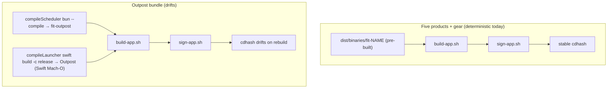
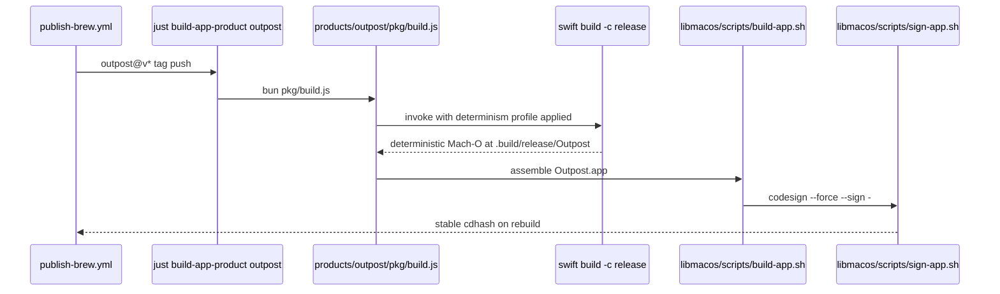

# Design 1170-a — Deterministic Outpost.app bundle for brew lane

Architecture for [spec 1170](./spec.md). Spec frames the WHAT/WHY of restoring
`Verify cdhash stability` to green for `outpost@v*` tag pushes and explicitly
defers the four candidate non-determinism sources and four investigations from
[issue #1036](https://github.com/forwardimpact/monorepo/issues/1036) to design.
Design commits a hypothesis, names the localisation step that confirms it
before the plan patches anything, and scopes the hardening to the single point
of variance against the six bundles that already publish without drift.

## Asymmetry argument

The six other brew-shipped bundles — five products (`fit-guide`, `fit-landmark`,
`fit-map`, `fit-pathway`, `fit-summit`) plus the gear meta-bundle (`fit-gear`)
— all run through `libraries/libmacos/scripts/build-app.sh` against an
Info.plist, entitlements, static resources, and pre-built
`dist/binaries/fit-NAME` artifacts produced upstream by
`just build-binary` (`bun build --compile`). All six pass the cdhash gate
today. Outpost's bundle adds one component the other six do not have: a
Swift launcher built by `swift build -c release` under
`products/outpost/macos/Outpost/`. That single component is the only
structural difference between the deterministic six and the drifting one.

Issue #1036's first three hypotheses (embedded timestamps, Swift symbol
ordering, debug-info paths) all point inside the Swift compile step; the
fourth (captured runtime metadata) is the only one that would touch the bundle
assembly path libmacos shares with the deterministic six. The asymmetry makes
hypothesis 4 the least likely a-priori — but it stays falsifiable through the
gating diffoscope step (Decision 2), which would surface a non-Swift drift
location if one exists.

## Components

| Component | Role | Where |
|---|---|---|
| **Determinism profile** (new) | A named bundle of build-time settings injected into the existing Swift compile invocation to remove the non-determinism. The set of categories the profile covers is fixed at Decision 4; the exact flag literals are plan scope. | input to `products/outpost/pkg/build.js` `compileLauncher()` |
| **Build pipeline (unchanged shape)** | `products/outpost/pkg/build.js` orchestrates scheduler + launcher compile; `libraries/libmacos/scripts/build-app.sh` assembles the bundle; `libraries/libmacos/scripts/sign-app.sh` codesigns. No new pipeline nodes — the determinism profile is an input to the existing `compileLauncher` step. | as today |
| **CI gate (unchanged contract)** | `.github/workflows/publish-brew.yml` § `Verify cdhash stability` (lines 78–104) — its inputs change, its logic stays. | `.github/workflows/publish-brew.yml` |

The determinism profile is the only new architectural element. No new
libraries, no new scripts, no new pipeline nodes — the spec's success criteria
are met by hardening one existing call site.

## Data flow

The CI gate's rebuild path traverses the identical sequence; the determinism
profile is encoded in source, so it applies on every invocation without
workflow-level coordination.

## Key decisions

| # | Decision | Rejected alternative & why |
|---|---|---|
| 1 | **Commit hypothesis: the Swift launcher build is the source.** Hardening is scoped to `compileLauncher()`; `compileScheduler()` (the `bun build --compile` step) is left untouched. | _Investigate `bun build --compile` first._ The six other product bundles run the same `bun build --compile` step on every tag push and pass the gate; re-investigating it ignores the asymmetry signal. _Investigate Info.plist or static resources first._ `plutil -replace` writes constant values for a given tag, and the resources under `config/` and `templates/` are static text files copied verbatim. The asymmetry rules these out as load-bearing without further evidence. |
| 2 | **The flag set depends on a diffoscope localisation finding.** The design declares a data dependency: the choice of flags inside the determinism profile depends on a diffoscope finding that identifies which file(s) inside `dist/apps/fit-outpost.app` differ between two consecutive builds. A non-Swift finding vetoes Decision 1 and reroutes the plan to the file diffoscope names. How and when the plan satisfies the dependency is plan scope. | _Skip diffoscope and patch all four hypotheses simultaneously._ Wastes signal — the eventual green build leaves it ambiguous which fix was load-bearing, and any future regression re-incurs the same investigation. _Skip diffoscope and rely on the asymmetry argument alone._ The argument is strong but not airtight; a stale `templates/` regeneration step or an `Info.plist` plutil quirk could still differ between runs in a way the visual diff above does not catch. Cheap reconnaissance buys the certainty. |
| 3 | **Determinism profile expressed in `pkg/build.js`, not as a wrapper in `libraries/libmacos/`.** The non-determinism is Swift-specific; `build-app.sh` is shared with six bundles that already pass. Localising the flags to the variance point matches the locality of the problem. | _Add a `libraries/libmacos/scripts/build-swift.sh` wrapper that bundles the determinism profile._ Premature abstraction — there is one Swift-launcher product in the monorepo today. If a future bundle adds a second Swift target, extract the profile then; until then a wrapper carries one caller and one call site at one extra indirection. _Bake the flags into a `libmacos` helper that `pkg/build.js` calls._ Same critique. |
| 4 | **Categories of hardening fixed at design level; specific flag literals left to plan.** Three orthogonal categories cover the three Swift-side hypotheses from issue #1036: (a) compiler symbol-order determinism (hypothesis 2 — addresses how Swift seeds symbol-table and section layout), (b) debug-info absolute-path scrubbing (hypothesis 3 — addresses absolute paths embedded in DWARF), (c) timestamp suppression in compiler-captured build metadata (hypothesis 1 — addresses build-time clock values, distinct from (b)'s path values). The plan picks exact flag names against the Swift 5.9 toolchain the runner ships (Package.swift declares `swift-tools-version: 5.9`) and validates against the diffoscope output. | _Pin specific `-Xswiftc -Xfrontend` flag strings in the design._ Couples design to a toolchain detail the plan should select against actual runner behaviour. The Swift frontend flag set is non-trivially version-coupled; choosing exact names here would force a design amendment if Apple renames a flag in a future Xcode bump. _Cap the categories at one (e.g., symbol-order alone)._ Single-axis fix risks an incomplete diffoscope-clean result, since the three Swift-side hypotheses come from independent compiler subsystems. _Add a fourth category for captured runtime metadata (hypothesis 4)._ Hypothesis 4 belongs to bundle assembly, not the Swift compile; the asymmetry argument rules it out as the load-bearing source, and Decision 2's diffoscope dependency catches it if wrong. |
| 5 | **No change to `Package.swift` `swift-tools-version` (stays at 5.9).** | _Bump to 5.10 to use the native `-deterministic` driver flag._ Couples the cdhash fix to a toolchain-version migration of its own; the three category-(a)/(b)/(c) hardenings reach the same end on 5.9 toolchains. If a later spec migrates the Swift package to 5.10 for an unrelated reason, that spec can drop the manual flags and switch to `-deterministic`. |
| 6 | **No change to `.github/workflows/publish-brew.yml`.** The CI gate's logic stays exactly as today; only its inputs change. | _Add a per-bundle `expected-cdhash` constant to the workflow as a regression catch._ Conflates "the bundle is deterministic" (gate's job) with "the bundle's cdhash matches a frozen value" (no business value before the first user-installed release; would need updating on every legitimate source change). The existing self-comparison gate is the right contract — keep it. _Relax the gate to tolerate drift._ Explicitly out of spec scope (spec § Out of scope ¶3); the gate is load-bearing for TCC carry-forward. |
| 7 | **Scope stops at the Outpost bundle.** SC4's verification window watches the six non-outpost bundles for 60 days as a regression detector; the design itself does not modify their build path. | _Generalise the determinism profile to all product bundles as a preventive measure._ Spec § Out of scope ¶1 defers this — those bundles publish without drift today, and applying flags they do not need couples six green build paths to a refactor risk for the one red path's sake. |
| 8 | **Single design variant.** No design-b — the asymmetry argument plus the diffoscope gate cover both "Swift is the source" and the residual chance it is not, without committing to an unverified alternative. | _Author a design-b that hardens both Swift and Info.plist/resources at once._ Decision 2 already provides the falsifier; pre-committing to design-b duplicates plan work. If diffoscope vetoes Decision 1, the design returns to draft and design-b is authored against the actual finding. |

## Risks

- **Diffoscope localises the drift outside the Swift binary.** Decisions 1 and
  3 invert; design returns to draft and design-b is authored against the actual
  finding. The diffoscope output captured in the plan PR body documents the
  reroute trigger so the design history stays auditable.
- **Determinism flags do not close the gap on Swift 5.9.** Decision 5 inverts
  — a `Package.swift` `swift-tools-version` bump becomes load-bearing and gets
  its own design variant. The risk surfaces when the post-hardening diffoscope
  finding still shows Swift-binary drift after all three categories are
  applied.
- **A determinism flag becomes a binary-format change.** A flag the Swift
  frontend renames or drops in a future Xcode version silently breaks the
  gate. Decision 6 leaves the gate in place precisely to catch that — the
  drift is the alarm; the fix is the next plan against the renamed flag.

## Out of scope (deferred to plan / future spec)

- Exact `-Xswiftc -Xfrontend` flag literals and their order — plan scope (HOW).
- Whether the determinism profile applies to `compileScheduler()` as a
  belt-and-suspenders measure — explicitly held to the variance point unless
  diffoscope shows scheduler-side drift.
- Backfilling the brew lane with intermediate outpost tags — spec § Out of
  scope ¶4 defers; the design re-establishes the contract on the next tag.
- A general determinism profile for `libraries/libmacos/scripts/` — premature
  per Decision 3; revisit if a second Swift bundle arrives.

— Staff Engineer 🛠️
