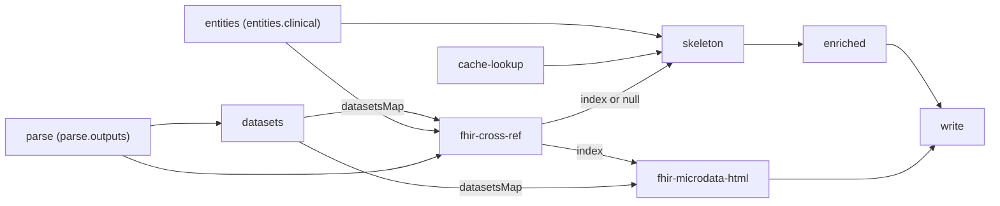

# Design 1190 — FHIR Microdata HTML Output Format

## Architecture

A new render format keyword `fhir_microdata_html` makes Synthea-produced
FHIR Patient bundles visible to the libresource RDF ingest by emitting
Schema.org microdata HTML. The format reads sibling FHIR datasets
(`<id>_patient`, `<id>_condition`, `<id>_procedure`,
`<id>_medicationrequest`) from the `datasets` pipeline node and emits one
HTML file per Patient plus an index. A separately constructed cross-ref
index (FHIR Condition → DSL `clinical.conditions[].id`, using the same
matching rule `filterByConditions` already applies) is consumed by both
this new format and by the `skeleton` pipeline node so that when a
Synthea Patient dataset is rendered through this format, the spec 1140
trial-card / condition-explainer / site-description pages gain outgoing
patient links — and when no such format is wired, they render
byte-identically to before.



## Components

| Component | Where | Responsibility |
| --- | --- | --- |
| `renderFhirMicrodataHtml(input, config)` | `libraries/libsyntheticrender/src/render/fhir-microdata.js` | Render one `Person` main-item HTML file per FHIR Patient (with inline `MedicalCondition` / `MedicalProcedure` / `DrugPrescription` items) plus one `index.html`. `input`: `{ patients: FhirPatient[], conditions: FhirCondition[], procedures: FhirProcedure[], medRequests: FhirMedicationRequest[], crossRef: CrossRefIndex, domain: string }` — the four resource arrays are FHIR JSON records as Synthea emits them (`dataset.records`); `crossRef` is the non-null `CrossRefIndex` (the node `null`-gates upstream so this function is only invoked when an output declares the format). Returns `Map<string,string>` keyed by relative path. |
| `buildFhirCrossRef({ patients, conditions, clinical, domain })` | `libraries/libsyntheticrender/src/render/fhir-microdata.js` | Single named-arg input. `patients` is the FHIR Patient array (`<id>_patient`), `conditions` is the FHIR Condition array (`<id>_condition`), `clinical` is `entities.clinical`, `domain` mints patient IRIs. Walks the Condition array, applies the spec §4 matching rule against `clinical.conditions[].id`, and returns the `CrossRefIndex` defined in § Cross-ref derivation. Pure function. |
| `fhir-patient.html` / `fhir-patient-index.html` | `libraries/libsyntheticrender/templates/` | Mustache templates emitting Schema.org microdata; index lists `{name, condition-summary, iri}` per patient (spec §6). |
| `fhir-cross-ref` pipeline node | `libraries/libterrain/src/nodes.js` | `deps: ["parse", "entities", "datasets"]`. The node body short-circuits to `null` when no `parse.outputs[i].format === "fhir_microdata_html"` — this is the **primary gate** and the only signal `skeleton` reacts to for spec criterion 7's byte-identity contract. Secondary safety: also returns `null` when `entities.clinical` is missing or when `datasets.datasetsMap` lacks the expected `<id>_patient` / `<id>_condition` keys (a misconfigured DSL — the planner surfaces this with an `info`-level log so the failure is not silent). Otherwise unwraps the sibling Dataset objects in `datasetsMap` into FHIR record arrays and calls `buildFhirCrossRef`. |
| `fhir-microdata-html` pipeline node | `libraries/libterrain/src/nodes.js` | `deps: ["parse", "datasets", "fhir-cross-ref"]`. Node body short-circuits when **either** `parse.outputs` contains no `fhir_microdata_html` entry **or** `fhir-cross-ref` returned `null` — the two gates compose, so any path that leaves the cross-ref null also skips rendering. This guarantees `renderFhirMicrodataHtml` is only ever invoked with a non-null `crossRef`, matching its input contract. Otherwise unwraps sibling Dataset objects from `datasetsMap` into FHIR record arrays and calls `renderFhirMicrodataHtml`. Returns `{ files }`. |

## Modifications

| Where | Change |
| --- | --- |
| `libraries/libsyntheticgen/src/dsl/tokenizer.js` KEYWORDS list and `libraries/libsyntheticgen/src/dsl/parser-standard.js` `DATASET_FORMATS` set | Register `fhir_microdata_html`. |
| `libraries/libsyntheticgen/src/tools/synthea.js` | Export `normalizePatientRef` — `buildFhirCrossRef` calls the same UUID-prefix-stripper to stay consistent with `filterByConditions` matching. |
| `libraries/libterrain/src/nodes.js` `datasets` node return shape | Add `datasetsMap: Map<string, Dataset>` alongside the existing `files`. Early-return path returns `datasetsMap: new Map()` so downstream readers never see `undefined`. Additive — `mergeOutputFiles` destructures `.files` only (nodes.js:419), so other consumers are unaffected. |
| `libraries/libterrain/src/nodes.js` `renderDatasetOutputs` | Skip outputs whose `format === "fhir_microdata_html"` explicitly at the top of the loop. The new dedicated node owns this format's rendering. Explicit filter (not incidental skip-via-dataset-not-found) so the existing `info` log "Skipping output 'patients': dataset not generated" does not fire on every Synthea run. |
| `libraries/libterrain/src/nodes.js` `skeleton` node | Add `"fhir-cross-ref"` to deps; pass the (possibly `null`) cross-ref into `renderer.renderSkeleton`. |
| `libraries/libsyntheticrender/src/render/renderer.js` `Renderer.renderSkeleton`, `libraries/libsyntheticrender/src/render/html.js` `renderHTML`, `libraries/libsyntheticrender/src/render/html-clinical.js` `renderClinicalPages` | Signature chain: `Renderer.renderSkeleton(entities, prose, { fhirCrossRef } = {})` → `renderHTML(entities, prose, templates, { fhirCrossRef } = {})` → `renderClinicalPages(files, entities, prose, templates, domain, pageWrap, fhirCrossRef = null)`. Public-facing methods use an **options object** appended after existing positional args (zero shift in positional indices); the internal `renderClinicalPages` helper takes `fhirCrossRef` as a trailing positional with `null` default so existing call paths inside `renderHTML` need only thread the new arg from the options bag. Existing callers passing no options observe identical behaviour (spec criterion 7). |
| `libraries/libsyntheticrender/src/render/html-clinical.js` `buildTrialCardData` / `buildConditionData` / `buildSiteData` | Optional `fhirCrossRef`; when present, append `enrolledPatientLinks` / `affectedPatientLinks` / `servedPatientLinks` arrays of `{iri}` to each record. Absent or empty → templates render no new sections. |
| Templates `trial-card.html` / `condition-explainer.html` / `site-description.html` | Add conditional Mustache sections inside the existing `itemscope` block emitting `<link itemprop="..." href="{{{iri}}}" />` per § Vocabulary. |
| `libraries/libterrain/src/nodes.js` `write` node deps + `mergeOutputFiles` | Add `fhir-microdata-html` to deps and merge its files. |

## Vocabulary

libresource accepts both `https://schema.org/` and
`https://www.forwardimpact.team/schema/rdf/` as main-item itemtype
prefixes and accepts predicates from either namespace within microdata
items. Patient pages use Schema.org **itemtypes** per the spec § Proposal
mapping; Patient→clinical-resource relations and the §5 reverse links use
fit: namespace **itemprops**.

**Itemprop emission.** The `microdata-rdf-streaming-parser` resolves bare
itemprop tokens against the enclosing itemtype's vocabulary, so
`itemprop="hasCondition"` inside `https://schema.org/Person` would emit
the wrong predicate `https://schema.org/hasCondition`. fit: predicates
are therefore emitted as **full absolute URIs** in the itemprop attribute
(microdata permits this), e.g.
`itemprop="https://www.forwardimpact.team/schema/rdf/hasCondition"`.

Spec §3 calls for "Schema.org properties" between Patient and its inline
resources, but Schema.org's `Person` (the spec's chosen itemtype) has no
predicate to `MedicalCondition`/`MedicalProcedure`/`DrugPrescription`.
This design reads "Schema.org properties" as the Schema.org microdata
model (itemprop → RDF predicate) and uses fit: predicates where
Schema.org has no fit. Criterion 3's "predicates linking to each item"
is satisfied since libresource emits the predicate regardless of
namespace; D9 carries the trade-off.

| Direction | Predicate IRI |
| --- | --- |
| Patient → Condition (inline) | `https://www.forwardimpact.team/schema/rdf/hasCondition` |
| Patient → Procedure (inline) | `https://www.forwardimpact.team/schema/rdf/hasProcedure` |
| Patient → MedicationRequest (inline) | `https://www.forwardimpact.team/schema/rdf/hasMedicationRequest` |
| Patient → Trial (spec §4) | `https://www.forwardimpact.team/schema/rdf/enrolledIn` |
| Trial → Patient (spec §5 trial-card) | `https://www.forwardimpact.team/schema/rdf/enrolledPatient` |
| Condition → Patient (spec §5 condition-explainer) | `https://www.forwardimpact.team/schema/rdf/affectedPatient` |
| Site → Patient (spec §5 site-description) | `https://www.forwardimpact.team/schema/rdf/servedPatient` |

Itemtypes (`Person`, `MedicalCondition`, `MedicalProcedure`,
`DrugPrescription`) remain Schema.org per the spec table — the existing
`isMainItem` check in libresource matches on `rdf:type` value against either
namespace, so per-Patient pages still register as main items.

## Cross-ref derivation

`buildFhirCrossRef` matches each FHIR Condition's `code.coding[].code`
exactly against `clinical.conditions[].id`, or its `display` normalized to
lowercase-underscored form — the same rule `filterByConditions` applies
today. Let `dslConditionId` denote `clinical.conditions[].id` and
`dslTrialId` denote `clinical.trials[].id`. `CrossRefIndex` is shaped:

```text
CrossRefIndex = {
  patientToTrialIris:        Map<patientIri,     Set<trialIri>>,
  conditionIdToPatientIris:  Map<dslConditionId, Set<patientIri>>,
  siteIdToPatientIris:       Map<dslSiteId,      Set<patientIri>>,
}
```

Keying is asymmetric on purpose: patient pages start from a patient IRI;
1140 templates start from a DSL id. `siteIdToPatientIris` is derived
transitively: for each `(patient, dslTrialId)` matched by the §4 rule, add
the patient under every `dslSiteId ∈ clinical.trials[id=dslTrialId].sites`.
This is the design's interpretation of spec §5 for site pages (D10) —
the spec leaves the patient↔site relation implicit and §4 only defines
condition matching. Trial IRIs in `patientToTrialIris` derive from
`clinical.trials[].iri` (already present on entities.clinical per spec
1140); the dslTrialId↔trialIri mapping is constructed at the start of
`buildFhirCrossRef` from `clinical.trials`.

## Data Flow

1. DSL emits
   `parse.outputs[i] = { dataset: "patients", format: "fhir_microdata_html", config: { path } }`.
2. `datasets` node generates the FHIR datasets Map via Synthea, exposes
   `datasetsMap` on its return, and continues rendering standard formats inline
   (unchanged).
3. `fhir-cross-ref` returns `null` when no output declares the new format;
   otherwise walks the FHIR Condition dataset (looked up as
   `datasetsMap.get("<id>_condition")`) and returns the index.
4. `skeleton` receives the (possibly `null`) cross-ref and threads it through
   `renderClinicalPages`. `null` → spec 1140 pages render byte-identically to
   before (spec criterion 7).
5. `fhir-microdata-html` renders one HTML file per Patient at
   `{config.path}/{patient_id}.html` plus `{config.path}/index.html`. Each
   per-patient page carries one `Person` main item at
   `https://{domain}/id/clinical/patient/{patient_id}` with inline microdata
   items for that patient's Conditions, Procedures, and MedicationRequests under
   the predicates in § Vocabulary. When `patientToTrialIris.get(patientIri)` is
   non-empty, the page emits `<link itemprop="enrolledIn" href="{trial_iri}" />`
   for each entry.

## Invariants

- **Synthea `Patient.id` is a UUID.** No slugging needed; both the IRI segment
  and the filename `{patient_id}.html` use the UUID verbatim. Encoded in a
  runtime assertion in `renderFhirMicrodataHtml` to fail fast if Synthea ever
  emits a non-UUID id.
- **Synthea dataset naming `<id>_<type-lowercased>`.** Load-bearing contract
  between `SyntheaTool.generate()` and this format. Asserted by the end-to-end
  test in spec criterion 1.
- **`datasetsMap` is additive on the `datasets` node return.** Existing readers
  consume `{files}`; only the two new nodes read `datasetsMap`. No out-of-tree
  consumer reads it.

## Key Decisions

| # | Decision | Rejected alternative |
| --- | --- | --- |
| D1 | Format keyword `fhir_microdata_html`. Names what the format produces (microdata HTML from FHIR), parallel to spec 1140's `supabase_migration` / `embeddings_jsonl` naming. | `patient_html` — too narrow; format also renders Conditions/Procedures/MedicationRequests inline. `synthea_html` — leaks tool name; FHIR is the contract, not the producer. |
| D2 | One HTML file per FHIR Patient at `{path}/{patient_id}.html` plus one `index.html`; filename and IRI segment are the same UUID. | Single aggregate file — fails spec criterion 1 (one file per record) and libresource's "main item per file" stability. Per-resource-type files — explodes file count without IRI-stability benefit. |
| D3 | Inline `Condition` / `Procedure` / `MedicationRequest` as nested `itemscope` items within the Patient page, joined to the Patient by fit: predicates from § Vocabulary. | Standalone microdata files per resource — explodes file count without ingest benefit; nested-item microdata is the right tool for "X is part of Y" relations. |
| D4 | Patient IRI is `https://{domain}/id/clinical/patient/{patient_id}` where `{patient_id}` is the FHIR `Patient.id` UUID verbatim. | Hash or remint — breaks determinism. A separate `/id/synthea/…` namespace — breaks the spec §2 requirement that DSL-declared and synthetically-generated entities share `/id/clinical/`. |
| D5 | Cross-ref built once by a dedicated `fhir-cross-ref` node, consumed by both the new format and the `skeleton` node. | Rebuild per render function — N×M walk per page. Hang the cross-ref on `entities.clinical` — couples entity generation to a downstream dataset and breaks the "entities precede datasets" sequencing. |
| D6 | Reverse links (spec §5) emit via `buildXxxData` functions in `html-clinical.js` accepting optional `fhirCrossRef`. Absence renders unchanged. | DOM post-process the rendered HTML — fragile, fights Prettier. Re-render spec 1140 a second time — wastes work, duplicates prose-cache reads. |
| D7 | New format reads sibling FHIR datasets from `datasets`-node-exposed `datasetsMap` by Synthea naming (`<output.dataset>_patient`, etc.). | Re-parse Synthea bundles from disk — couples to filesystem layout. Pass FHIR records through `parse.outputs` config — leaks tool internals into DSL parsing. |
| D8 | `fhir-cross-ref` returns `null` when no output declares the format; `skeleton` branches on `null`. | Always build the cross-ref — does work even when no Synthea dataset is wired. Feature-flag the §5 reverse-links — output presence is the only signal needed. |
| D9 | fit: namespace predicates for Patient→resource inline relations and §5 reverse links; Schema.org itemtypes for the four mapped resources. | Pure Schema.org — Person/MedicalTrial/MedicalCondition have no clean predicates for these relations and inventing semantic-mismatched ones (e.g. abusing `subjectOf`) misleads downstream RDF consumers. Pure fit: namespace — discards spec § Proposal's explicit Schema.org type mapping. |
| D10 | `siteIdToPatientIris` derives transitively from `patientToTrialIris` + `clinical.trials[].sites`. Spec §5 says the reverse-links use "the same matching rule as §4" (Condition→DSL-condition-id); on a site page the matching condition can only reach the site through the trial-hosting graph (`trials → conditions` ∧ `trials → sites`), since neither sites nor patients carry a direct site relation. | Direct Synthea-encounter→site matching — FHIR Encounter is out of scope per spec § Excluded. Defer site-description reverse links to a follow-up spec — fails spec criterion 5 which lists site-description explicitly. |
| D11 | `datasets` node exposes `datasetsMap` directly on its return; new `fhir-cross-ref` is a separate node, not fused into `datasets`. | Fuse cross-ref into `datasets` — couples Synthea-tool concerns to cross-DSL-entity matching, which `datasets` otherwise has no business with; the separation keeps each node's deps minimal. Side-channel via `ctx` — bypasses the explicit dep graph, brittle for testing. |
| D12 | `skeleton` gains `fhir-cross-ref` as a direct dep (which transitively pulls in `datasets`). Spec criterion 7's byte-identity contract holds via the null-cross-ref path; the cross-ref node returns `null` in O(1) when no `fhir_microdata_html` output is declared, so the additional latency is one graph hop. | Post-render mutation pass — reads spec 1140 output files, re-injects reverse links after `skeleton`/`enriched` complete. Avoids serializing `skeleton` behind `datasets` for non-FHIR runs but introduces a stateful post-process that fights Mustache as the source of truth and risks formatting drift; the null-path latency cost is judged smaller than the post-process complexity cost. |

## Risks

- **Synthea dataset naming convention is load-bearing.** A future rename in
  `SyntheaTool.generate()` would silently produce empty patient pages. Surfaced
  by spec criterion 1's file-count assertion.
- **Cross-ref accuracy depends on `normalizePatientRef` parity.**
  `Condition.subject.reference` formats vary (`Patient/<id>`, `urn:uuid:<id>`);
  the shared helper is the only safe reuse. Export it (see Modifications) rather
  than re-implementing.
- **Null cross-ref contract** must be respected throughout the clinical-render
  path: `buildXxxData` truthy-check on `fhirCrossRef` before reaching into its
  maps. A regression here silently breaks spec criterion 7.
- **Skeleton sequencing change** is covered in D12 as a deliberate trade-off;
  the residual risk here is only that the null-path latency on existing runs
  proves larger than projected. CI delta is the only signal — if observable, the
  D12 rejected alternative (post-render mutation pass) re-opens.
- **Set iteration order for reverse-link arrays** governs snapshot stability. JS
  `Set` preserves insertion order; the cross-ref builder inserts patients in
  FHIR Patient array order, so `enrolledPatientLinks` order is deterministic
  across runs given the same seed.

## Out of scope (per spec § Excluded, restated)

FHIR resources beyond `Patient` / `Condition` / `Procedure` /
`MedicationRequest`; RDF serializations (Turtle/JSON-LD); LLM enrichment
of patient prose; libresource or Guide ingest changes; modifications to
`filterByConditions`; generalization to non-FHIR datasets.

— Staff Engineer 🛠️
