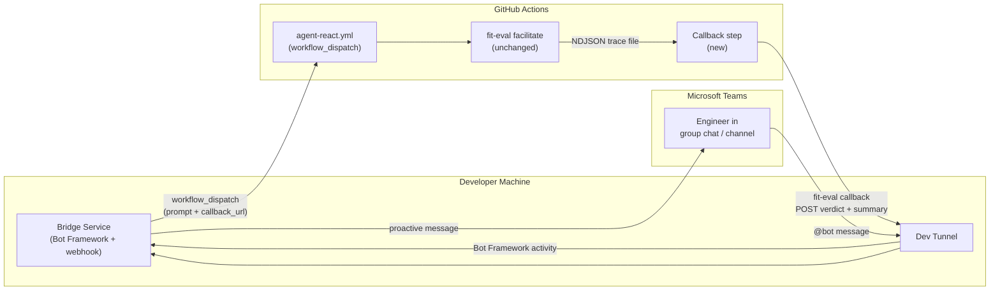
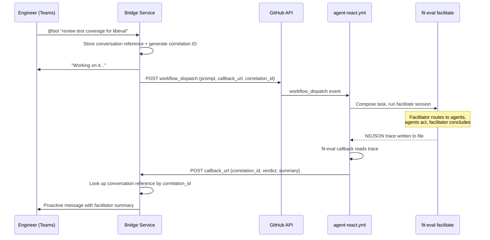

# Design 1200-a — Microsoft Teams Bridge for the Kata Agent Team

Architectural design for [spec 1200](spec.md). Three components: a bridge
service, a workflow return-path extension, and a dev-tunnel exposure.

## Components



| Component | Location | Role |
|---|---|---|
| **Bridge service** | `services/msteams/` | Receives Teams messages, triggers workflow_dispatch, receives callbacks, posts responses |
| **Callback step** | `.github/workflows/agent-react.yml` | Invokes a libeval CLI utility that reads the NDJSON trace and POSTs the conclusion to the caller-supplied URL |
| **Dev tunnel** | External tooling (devtunnel / ngrok) | Exposes the bridge's localhost endpoints to Teams and GitHub Actions |

## Data Flow



## Interfaces

### Bridge → GitHub (outbound trigger)

GitHub REST API `POST /repos/{owner}/{repo}/actions/workflows/{id}/dispatches`:

```json
{
  "ref": "main",
  "inputs": {
    "prompt": "<user message + conversation context>",
    "callback_url": "https://<tunnel>/api/callback/<token>",
    "correlation_id": "<uuid>"
  }
}
```

`callback_url` and `correlation_id` are new optional inputs on
agent-react.yml's `workflow_dispatch`. Existing callers (manual dispatch
via GitHub UI) omit them and behavior is unchanged.

### Workflow → Bridge (callback)

A small CLI utility in libeval (`fit-eval callback` or similar) reads
the NDJSON trace file produced by the facilitate session, extracts the
orchestrator summary event (`{type: "summary", verdict, summary, turns}`),
and POSTs it to the callback URL (capability URL — the token in the path
authenticates the caller). The post-step in agent-react.yml invokes this
utility.

Payload:

```json
{
  "correlation_id": "<uuid>",
  "verdict": "success",
  "summary": "Routed to staff-engineer who reviewed...",
  "run_url": "https://github.com/.../actions/runs/12345"
}
```

This requires the fit-eval step to write its NDJSON trace to a file
(via `--output`). The callback utility reads the trace, finds the
summary event, and delivers it — no stdout parsing needed.

### Bridge ↔ Teams (Bot Framework)

Standard Bot Framework v4 activity protocol over HTTPS. The bridge uses
the `ConversationReference` stored on the inbound turn to send proactive
messages back to the same thread. No Adaptive Cards — plain text only.

## Conversation Continuity

The bridge maintains an in-memory map keyed by Teams thread ID:

```
threadId → {
  conversationReference,  // Bot Framework proactive-messaging handle
  history: [              // rolling window of prior exchanges
    { role: "user", text: "..." },
    { role: "assistant", text: "..." }
  ]
}
```

Follow-up messages in the same thread prepend the history to the
workflow_dispatch prompt so the facilitator has conversation context.
The history window is bounded (the plan determines the limit) to stay
within the `prompt` input's size constraints.

## Key Decisions

| Decision | Chosen | Rejected | Why |
|---|---|---|---|
| Return path | Callback webhook | Polling GitHub API for run completion | The bridge already exposes a public endpoint (required for Teams). Callback delivers the response immediately on session completion; polling adds latency and a background loop. |
| Trigger mechanism | `workflow_dispatch` | `repository_dispatch` / new workflow | workflow_dispatch already exists on agent-react.yml with a free-form prompt. Adding optional inputs is a smaller change than a new event type or workflow. |
| Bot framework | Bot Framework SDK v4 (Node.js) | Direct Microsoft Graph API | Bot Framework handles Teams authentication handshake, conversation references, and proactive messaging. Direct Graph API requires manual OAuth and state management. |
| Conversation store | In-memory Map | File or database | Prototype is single-process, local-only. Persistent storage adds complexity without prototype value. State is lost on restart — acceptable for a demo. |
| Bridge location | `services/msteams/` | Standalone repo / products/ | It is a running service (protocol bridge), consistent with `services/mcp` which bridges MCP to backend services. Unlike gRPC services it uses HTTP/Bot Framework and does not follow the `server.js`/`proto/` structure — this divergence is acceptable for a prototype; production placement is a follow-up concern. |
| Summary extraction | CLI utility in libeval reads NDJSON trace | Parse stdout / modify fit-eval action outputs | The NDJSON trace already contains the structured summary event. A small CLI utility in libeval reads it directly — no stdout parsing fragility, no fit-eval action changes. |

## Workflow Changes

agent-react.yml gains two additions (no existing behavior changes):

1. **New optional inputs** on `workflow_dispatch`: `callback_url` (string,
   optional) and `correlation_id` (string, optional). Absent inputs
   preserve current behavior — the callback step is skipped.

2. **New post-step** after "Assess and Act": extracts the facilitator's
   verdict and summary, and POSTs them to `callback_url` with the
   `correlation_id`. Fires regardless of whether the facilitate session
   succeeded or failed.

## Security

- **Callback authentication**: The bridge embeds an unguessable token in
  the callback URL path (capability URL pattern — the URL itself is the
  credential). The bridge generates and stores the token per dispatch;
  the callback step does not need a separate secret input. This avoids
  passing secrets through workflow_dispatch inputs, which are visible in
  the Actions UI and API.

- **Tunnel exposure**: The dev tunnel exposes only the bridge's two HTTP
  endpoints (Bot Framework messaging endpoint, callback webhook). No
  filesystem or shell access.

- **GitHub token scope**: The bridge uses a personal access token (or
  GitHub App token) with `actions:write` scope to trigger
  workflow_dispatch. No broader repository access needed for the trigger
  path.

## What This Design Does Not Cover

- Teams bot publishing or Azure AD multi-tenant registration (prototype
  uses a single-tenant dev registration).
- Rich formatting, Adaptive Cards, or file attachments.
- The specific CLI subcommand name and argument interface for the
  callback utility (plan concern).
