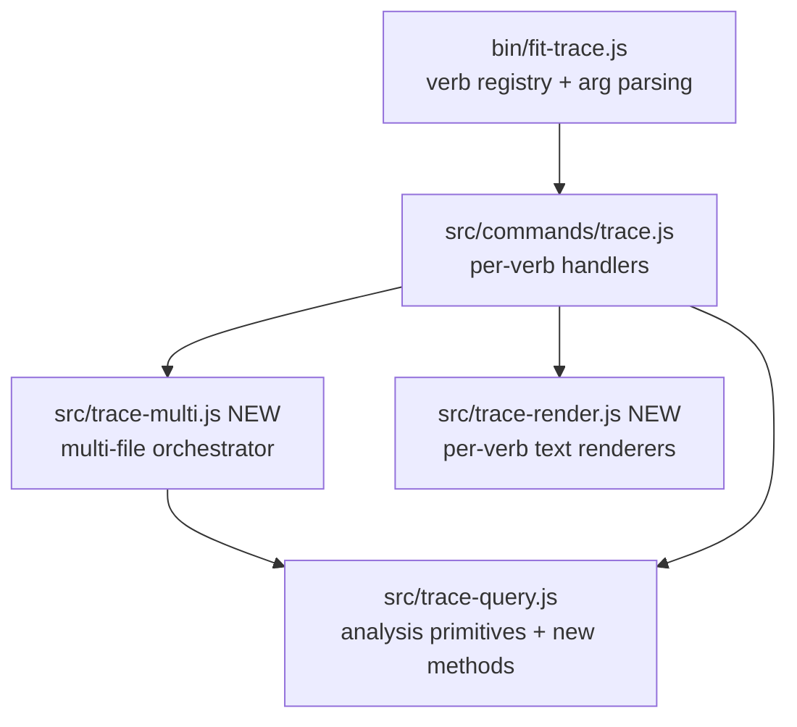

# Design (a): fit-trace CLI quality-of-life for browse-mode analysis

## Problem restated

Spec 1220 ships six user-visible `fit-trace` CLI changes: three aggregator
verbs (`tool-calls`, `commands`, `paths`), multi-file input with source
attribution on cross-trace-meaningful verbs, a `compare` verb, default
human-readable output with `--format json` opt-in, and `stats --by-tool` /
`--summary`. The user-facing promise is that the documented grounded-theory
method no longer requires Python wrappers.

## Convention: libcli InvocationContext

`fit-trace` handlers run on libcli's `InvocationContext` convention (spec
1370, on `main`): a handler takes one `ctx`, reads flags from `ctx.options`,
named positionals from `ctx.args.<name>`, host collaborators from `ctx.deps`
(`{ runtime, config }`), does all IO through `ctx.deps.runtime`, and returns
`{ ok: true }` (or `{ ok: false, code, error }`). `dispatch()` binds each
declared positional name to exactly one argv token (a named-slot contract,
no variadic — [`cli.js`:151-154](../../libraries/libcli/src/cli.js)); this
design takes that as fixed and carries multiple files via repeated `--file`,
never variadic positionals (Key Decisions row "Multi-file input mechanism").

## Component map



Two new modules (`trace-multi.js`, `trace-render.js`), three existing files
extended (`bin/fit-trace.js`, `commands/trace.js`, `trace-query.js`), and two
documentation surfaces updated (the `fit-trace` SKILL.md and the trace-analysis
guide).

## Multi-file data flow

```mermaid
sequenceDiagram
  participant H as handler (ctx)
  participant M as trace-multi
  participant Q as trace-query
  participant R as trace-render
  H->>M: runOver(resolveFiles(ctx), q, load)  [per-record verbs]
  loop file in files
    M->>Q: q(load(file)) — load reads via runtime.fsSync
    Q-->>M: records
  end
  M-->>H: concat; tag source iff N>1
  Note over H,M: aggregate(files, q, key, load) merges by key, sums count,<br/>emits sources:[] iff N>1
  H->>R: render(records, {multi:N>1, signatures})
  R-->>H: text → runtime.proc.stdout (or pass-through JSON under --format json)
```

`runOver` is the per-record path; `aggregate` the frequency rollup; both take
an injected `load` so `trace-multi` stays IO-policy-free. The handler resolves
`ctx.options.file` into a sorted flat list, expanding glob values via
`runtime.fsSync.globSync` (Node 22). The resolved-file count — not the `--file`
flag count — drives the multi decision and source attribution.

## Verb classification

| Class | Verbs | Input shape |
| --- | --- | --- |
| Cross-trace (multi-file, source-tagged when resolved count >1) | `overview`, `count`, `head`, `tail`, `tools`, `errors`, `reasoning`, `timeline`, `stats`, `init`, `filter`, `tool-calls`, `commands`, `paths` | repeated `--file <path-or-glob>` (`ctx.options.file: string[]`) |
| Single-file (declared positional binds one file) | `batch`, `tool <name>`, `turn <index>`, `search <pattern>` | unchanged (`args: ["file", …]`) |
| Two-file (positional pair) | `compare` | `args: ["file-a", "file-b"]` |
| Admin / IO (out of scope) | `runs`, `download`, `by-discussion`, `split`, `assert` | unchanged |

`count` and `timeline` emit plain text today; the format flip is a no-op but
they stay cross-trace so multi-file invocation still gets source attribution.
`init` and `filter` are cross-trace because their per-trace output reads better
with source attribution than under shell loops — the same reason as the
aggregators.

## Query primitives — `src/trace-query.js`

| Addition | Returns | Notes |
| --- | --- | --- |
| `toolCalls()` | `[{turnIndex, name, toolUseId, input, result}]` | `result` is `{content, isError}` joined by `toolUseId`; orphaned calls emit `result: null` (see Key Decisions) |
| `commands(re?)` | `[{turnIndex, toolUseId, command}]` | Filters `tool_use` blocks where `name === "Bash"`; optional regex tested against `input.command` |
| `paths(prefix?)` | `[{path, count}]` sorted by `count desc`, `path asc` tiebreak | Distinct `input.file_path` across `Read`, `Edit`, `Write`; optional `startsWith` prefix |
| `compare(other, {aIdentity, bIdentity})` | `{a, b, toolDelta, pathDelta}` (see below) | `other` is a peer `TraceQuery`; `aIdentity`/`bIdentity` are basename-derived `{caseName, participant}` surfaced as each side's `metadata`. See Key Decisions "`compare()` return shape", "per-trace surface", "identity source" |
| `statsByTool()` | `{perTool:[{tool, turns, inputTokens, outputTokens, costShare}], totals}` | Each `tool_use` block gets an equal share of its host turn's usage; no-`tool_use` turns go to `(no-tool)`. Cost-share basis/rounding in Key Decisions. Criterion-6 invariant (`Σ inputTokens`, `Σ outputTokens` per bucket equal `stats()` totals) holds by construction |
| `statsSummary()` | `{totals}` | Existing `stats().totals`; suppresses `perTurn` |

Per-side shape for `compare`: each of `a` and `b` carries
`{metadata:{caseName, participant}, turnCount, tools:string[], paths:string[],
pathCount, cost}`. `metadata` is the passed-in `{caseName, participant}` (the
basename parse lives in Key Decisions row "`compare` identity source"), printed
unconditionally so a null `participant` is visible, not dropped. `tools` is the
distinct tool-name list, `paths` the distinct file-path list (criterion 4
"distinct tools used" / "paths touched"); `pathCount` is `paths.length`; `cost`
is `stats().totals.totalCostUsd`. `toolDelta` is `[{tool, a, b, diff}]` over the
union of both tool sets; `pathDelta` is `[{path, a, b, diff}]` over the union of
both path sets, sorted by `|diff| desc`. Identical traces emit zero deltas;
empty traces emit zeroed counters, empty lists, and `metadata.marker =
"(empty)"` on the affected side(s).

A generalised `Map<toolUseId, {turnIndex, name, input}>` over every assistant
`tool_use` block (optionally name-filtered) is the shared join key feeding
`toolCalls()`, `commands()`, and the existing `tool(name)` path.

## Multi-file orchestrator — `src/trace-multi.js`

Every function takes an injected `load` so the module imports no `node:fs`; the
handler passes `(file) => loadTrace(runtime, file)`, wiring the IO seam once.

| Function | Behaviour |
| --- | --- |
| `runOver(files, query, load)` | Loads each file (basename → `TraceQuery`) via `load`, calls `query(tq)`, tags each emitted record with `source: <basename>` only when N>1. Concatenates file-then-record order. |
| `aggregate(files, query, key, load)` | Merges record arrays keyed by `key(record)` summing `count`; produces a single frequency-sorted list. Used by `paths` and `tools`. Records carry `sources: string[]` only when N>1 (see Key Decisions row "Aggregated `sources` plurality") |
| `compareTwo(a, b, load)` | Loads two files via `load`, derives each side's `{caseName, participant}` from its basename (the convention parse), and threads them into `traceA.compare(traceB, {aIdentity, bIdentity})` — the `TraceQuery` has no filename of its own. Not multi-file. |

Distinct functions, not one branching parameter — the verb-class table pins which each handler reaches for.

## Output rendering — `src/trace-render.js`

One named export per renderable verb; each accepts the query result plus
`{multi, signatures}` and returns a string.

| Renderer | Default text shape |
| --- | --- |
| `renderToolCalls` | `[turnIdx] <Tool> <toolUseId>` header, `  in: <one-line input>`, `  out: <one-line result or "(no result)">` per block |
| `renderCommands` | `[turnIdx] <command-text>` one per line (grep-friendly, newlines in command text escaped) |
| `renderPaths` | `<count>\t<path>` columns, frequency-sorted |
| `renderCompare` | Two-column block: metadata header (prints `caseName` and `participant` for both sides unconditionally — `participant` renders as `(none)` when null, mirroring the `(no-tool)`/`(empty)` parenthesised sentinels, so the field is never silently omitted in text), per-row metric, then `Tool \| A \| B \| Δ` toolDelta table and `Path \| A \| B \| Δ` pathDelta table |
| `renderStatsByTool` | Columns: `Tool \| Turns \| In \| Out \| Share` sorted by `Share desc` |
| `renderStatsSummary` | Totals block only (matches today's `stats().totals` lines) |
| `renderSearch` | `[turnIdx] <match-prefix>: <excerpt>` one record-line per match. Under `--format json`, the matched-block interior carries the new representation per spec criterion 5's `search` exception (top-level envelope shape preserved, interior may change) |
| Default rule (every other renderable verb) | Existing JSON shape textified — one record per block, fields newline-separated, no JSON braces or quotes. Applies to `overview`, `head`, `tail`, `tools`, `errors`, `reasoning`, `init`, `filter`, `tool`, `turn`, `batch`, `stats` (un-flagged) |

Under multi-file invocation, record-per-line renderers prepend `<basename>:`
(`grep -H` convention) and block renderers emit a `# <basename>` header per
block; suppressed when N==1.

## CLI surface — `bin/fit-trace.js`

The registry uses the array-form `args` plus `argsUsage` that spec 1370
established on `main`. Cross-trace verbs declare `args: []` and read files
from `--file`; `compare` and single-file verbs keep their declared
positionals.

| Change | Detail |
| --- | --- |
| Verb registry adds `tool-calls`, `commands`, `paths`, `compare` | `tool-calls`/`commands`/`paths`: `args: []`, files via `--file`. `compare`: `args: ["file-a", "file-b"]`, `argsUsage: "<file-a> <file-b>"` |
| Cross-trace verbs drop the file positional, gain `--file` | The 11 existing cross-trace verbs change from `args: ["file"]` to `args: []` and add `--file <path-or-glob>` (`type:"string"`, `multiple:true`). Declared per-verb (not global) so it appears only where cross-trace input is meaningful and never collides with `compare`/single-file positionals |
| `head`/`tail` carry `--lines <n>` instead of the optional `[n]` positional | See Key Decisions for rationale and rejected alternative |
| New global option `--format <text\|json>` | Default `text`; `json` opts back into today's JSON envelope. Distinct from the pre-existing global `--json` boolean (controls `--help` rendering only). Accepted on every verb; a no-op on `count`, `timeline`, and admin verbs (they emit their existing text on both settings) |
| `commands` flag `--match <regex>` | Filters records on Bash command text |
| `paths` flag `--prefix <string>` | Filters by `startsWith` |
| `stats` flags `--by-tool`, `--summary` | Existing per-turn output is the default when neither flag is set. Flags compose: `--by-tool` switches the per-turn array to per-tool buckets; `--summary` further suppresses any per-bucket/per-turn array, emitting `totals` only. Behaviour under multi-file invocation is governed by Key Decisions row "Multi-file `stats` aggregation" |

A shared `resolveFiles(runtime, ctx)` helper in `commands/trace.js` reads
`ctx.options.file`, expands globs, sorts, and returns `{ ok: false }` when zero
files resolve. `--signatures` is preserved; `--format json` honours it on every
verb. `compare`'s two positionals bypass the orchestrator.

## Key decisions

| Decision | Choice | Rejected | Why |
| --- | --- | --- | --- |
| Text renderer location | New `src/trace-render.js` | Inline in `commands/trace.js` | Existing `src/render/` is for live-stream renderers; trace renderers are query-output formatters with a different lifecycle. A separate module keeps `commands/trace.js` focused on dispatch and lets tests import the renderers directly |
| Multi-file orchestrator location | New `src/trace-multi.js`, IO-policy-free via an injected `load` | Inline per handler; orchestrator imports `node:fs` | The same load-tag-concat / aggregate-and-sort logic repeats across 14 cross-trace verbs; central residence is the only way to keep source-attribution and aggregation rules consistent. Injecting `load` keeps the module off the `ctx.deps.runtime` IO seam so it unit-tests with a stub loader |
| Aggregating vs per-record dispatch | Two functions (`runOver`, `aggregate`) | One function with a branching policy parameter | A split read cleaner than a parameter switch; the verb-class table pins membership so the choice is not a per-call-site decision |
| Multi-file input mechanism | Repeated `--file <path-or-glob>` option (`multiple:true`), globs expanded via `runtime.fsSync.globSync` | Variadic positionals (`<files...>`); a positional file slot plus shell-glob | libcli's `dispatch()` binds each declared positional name to exactly one argv token ([`cli.js`:151-154](../../libraries/libcli/src/cli.js)) — there is no variadic positional, and extra shell-glob tokens past the first slot are silently dropped. `--file` is the only mechanism that carries an unbounded file list inside libcli's named-slot contract. The owner directed this over changing libcli. Glob expansion is in-handler so a quoted `--file 'traces/*.ndjson'` works regardless of shell, while an unquoted glob the shell already expanded arrives as several `--file` values and is handled identically |
| `head`/`tail` `[n]` positional | Move to `--lines <n>` flag | Keep the optional `[n]` positional alongside `--file` | With files now in `--file`, a lone `[n]` positional would parse, but `--lines` keeps line-count on a flag like every other tuning knob and avoids a stray bare-number positional whose meaning isn't obvious next to `--file`. The flag migration is bounded by spec Risks row 1c |
| Multi-file `stats` aggregation | One block per file via `runOver`; no cross-file token sum | Cross-file sum into a single combined block | Per-file blocks preserve the criterion-6 invariant inside each block and let the analyst spot per-trace cost asymmetry; cross-file sums hide which trace contributed which bucket and break the structural-equivalence story under multi-file. Structural equivalence is excluded under multi-file per criterion 5 |
| `tool-calls` name | Keep the spec's proposed `tool-calls` | Rename to `calls` / `invocations` | Risk row 5 in the spec accepts cross-referencing in `--help` and the published guide as the mitigation; renaming creates a search-term the existing reflection doesn't anticipate |
| `commands` filter semantics | Regex via `new RegExp(val)` tested against `input.command` | Substring | `search` already uses regex on trace content; consistency wins over a second pattern syntax. Substring is achievable via literal regex |
| `paths` filter semantics | Prefix via `String.prototype.startsWith` | Regex | Spec calls out prefix; matches the file-path mental model; avoids regex-escaping path separators |
| `compare()` return shape | `{a, b, toolDelta, pathDelta}` — per-side objects plus two delta arrays keyed by metric type | Flat `{metric, a, b, diff}[]` with per-trace facts as delta metadata | Per-side objects keep "distinct tools/paths" structurally separate from the per-tool/per-path deltas the way criterion 4 reads them; the flat shape forces consumers to filter metadata rows out of metric rows |
| `compare()` per-trace surface | Per-side `tools: string[]`, `paths: string[]`, plus `pathDelta` mirroring `toolDelta` | Cardinality-only (`tools: number`) with no `pathDelta` | Cardinality-only drops the comparison signal criterion 4 promises (tool/path identity lost; no per-path delta surface) for one saved field per side |
| `compare` identity source | Parse `caseName`/`participant` from the input basename via the `split` convention `trace--<case>--<participant>.<role>.ndjson`; on no match, basename minus its trailing `.ndjson` extension becomes `caseName` (extension only, not a presumed `.<role>.ndjson` tail) and `participant` is null, rendered explicitly as `(none)` | Read `metadata:{caseName, participant}` from the trace's `metadata` block; or use the raw untrimmed basename as the fallback `caseName` | `TraceCollector` only writes `metadata` on the `init` event (`{timestamp, sessionId, model, claudeCodeVersion, tools, permissionMode}`) — no case/participant — so reading them there yields `undefined` and criterion 4 ("case name, participant MUST appear") fails. The basename is the only carrier of that identity, consistent with the `source: <basename>` attribution. Trimming only the extension keeps the fallback `caseName` readable without guessing a role token a non-matching name doesn't reliably carry; stripping a presumed `.<role>.ndjson` would mangle dotted names. The always-present `participant` key (null in fallback) is rendered explicitly by `renderCompare`, never omitted — the null is the transparency signal |
| `compare` edge cases | Empty trace emits zeroed counters with `metadata.marker = "(empty)"`; `caseName`/`participant` still resolve from the basename | Throw on empty | Spec criterion 4 requires non-error behaviour; sentinel parenthesised string mirrors `(no-tool)`. Basename-derived identity means even an init-less empty trace still names its side |
| Orphan-call sentinel in `tool-calls` | `result: null` (key always present) | `{}` empty object; omitting the key | Spec line 136 requires "present and explicitly empty, never silently dropped". `null` carries that signal in one token without inventing a sub-object shape (`{}` would also have to define what "missing fields" means for `content`/`isError`, expanding the contract); always-present key keeps the JSON shape uniform so downstream `jq` queries don't branch |
| `stats --by-tool` non-tool bucket | Sentinel `(no-tool)` | Bucket name like `_text` or `null` | Claude API tool names are camelCase identifiers; parentheses are guaranteed never to collide |
| `stats --by-tool` cost-share basis | Total tokens — `(input + output) / Σ(input + output)` | Output-only; model-priced USD; input-only | Spec wording is "token-proportional cost share"; total-tokens captures both sides of the bill, doesn't depend on a model-price table that drifts, and stays inside the `[0,1]` invariant. Model-priced share would tie the contract to pricing data outside the trace; output-only ignores the input cost dominant on Sonnet/Opus |
| Cost-share rounding strategy | Largest bucket absorbs the residual so the column sums to exactly 1.0 | Largest-remainder method; banker's rounding | Single-bucket absorption is one line of code and the binding test fixture can assert `sum === 1.0` without modelling rounding error; the residual is bounded by per-bucket precision and never material against `[0, 1]` |
| Structural-equivalence binding | JSON fixtures per affected verb are the binding reference; `--format json` output deep-equals the fixture via `JSON.parse` | Re-derive shapes from runtime | Risks row 2 mitigation pins fixtures as the binding reference; runtime derivation defeats the contract. (Fixture capture cadence is a plan-step concern.) |
| Source attribution shape | `source: <basename>` in JSON; `<basename>:` line / `# <basename>` block prefix in text | Full path; relative-path-from-cwd; parent-dir prefix only on collision | Basename is what aggregation needs and stays grep-friendly; full or relative paths inflate width and leak local layout; parent-prefix-on-collision adds runtime detection and asymmetric output. **Accepted collision risk**: two traces sharing a basename across directories collide — disambiguation is the caller's job (rename, or run from one directory). Collision behaviour is documented in the published guide |
| Aggregated `sources` plurality | `aggregate()` records carry `sources: string[]` | Singular `source` for parity with `runOver` | Frequency-rolled records merge entries from multiple files; one source loses provenance for any path/tool in more than one trace. Criterion 3's singular "source filename" is satisfied by `runOver`; the aggregator widening is bounded to the rollup path and shape-stable because `sources` only appears when N>1 (criterion 5 excludes multi-file per Risks row 4) |

## Out of scope (deferred to plan)

- Exact CHANGELOG copy and migration-note wording (libeval package)
- Test fixture filenames, the deep-equality assertion harness, and
  fixture-capture step ordering (the binding-fixture contract is this
  design's; sequencing is the plan's, per spec Risks row 1a)
- The enumeration of in-repo `fit-trace` callers the same-PR update sweep
  touches (the spec Risks row 1c contract is in-scope; only the inventory is
  plan-deferred)
- Wording of the `--help` cross-references and the parallel guide edits

— Staff Engineer 🛠️
