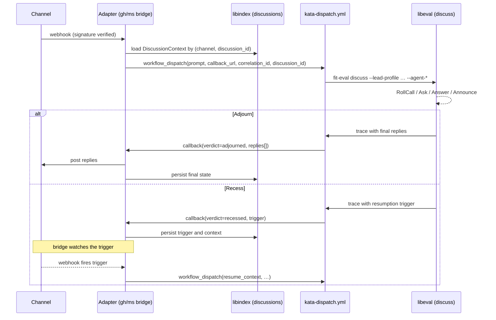

# Design 1230-a — Threaded discussion bridges

## Overview

The agent team treats every threaded channel through a single bridge
pattern: a per-channel adapter service receives webhooks, dispatches a
channel-agnostic workflow, and delivers replies via a structured callback.
libeval gains a `discuss` mode whose orchestration loop is suspendable
across workflow runs, making long-running RFCs and the daily storyboard
tractable.

## Components

| Component | Responsibility |
|---|---|
| `libraries/libbridge` | Webhook intake skeleton, callback registration, workflow dispatch, history capping, rate limiting, typing/progress patterns, durable state interface over libindex. Channel-agnostic. |
| `services/ghbridge` | GitHub adapter. Verifies Kata App webhook signatures. Translates Discussion events to a prompt. Posts replies via the `addDiscussionComment` GraphQL mutation. |
| `services/msbridge` | Microsoft Teams adapter (renamed from `services/msteams`). Verifies Bot Framework JWTs. Posts replies via `continueConversationAsync`. |
| `kata-dispatch.yml` | Renamed `agent-react.yml`. Channel-agnostic worker. Triggers: issue/PR/review events plus `workflow_dispatch` from bridges. |
| `kata-shift.yml` | Renamed `agent-team.yml`. Scheduled rotation. Rename only. |
| libeval `discuss` mode | New orchestration mode: async, durable, resumable. CLI: `fit-eval discuss`. |
| Consolidated libeval CLI | `--lead-profile` and `--lead-model` for the lead role across `supervise`, `facilitate`, and `discuss`. `--agent-*` for participants. |

## Data flow



## Interfaces

### Bridge → workflow

`workflow_dispatch` inputs:

| Input | Purpose |
|---|---|
| `prompt` | Composed task text built from thread history + the new event. |
| `callback_url` | Per-invocation URL with a token registered on the bridge. |
| `correlation_id` | Stable id matching dispatch to callback. |
| `discussion_id` | Stable id for the threaded conversation; carried through traces for linking. |
| `resume_context` | Optional. Serialized prior state when resuming a recessed run. |

### Workflow → bridge

Callback payload, extending the existing Teams contract:

```ts
type Callback = {
  correlation_id: string;
  verdict: "adjourned" | "recessed" | "failed";
  summary: string;
  run_url?: string;
  replies?: Array<{
    addressee?: string;
    body: string;
    in_reply_to?: string;
    thread_id?: string;
  }>;
  trigger?: {
    kind: "responses" | "elapsed" | "either";
    responses?: number;
    elapsed?: string;
  };
};
```

### libeval `discuss` mode tools

| Tool | Behaviour |
|---|---|
| `RollCall` | Enumerate / ping participants for the session. |
| `Ask` | Directed question to a named participant. |
| `Answer` | Reply to an Ask. |
| `Announce` | Broadcast to current participants. |
| `RequestForComment` | Fire-and-forget to a configured channel via the bridge; returns `{thread_url, correlation_id, channel}`. |
| `Recess` | Suspend the run with a resumption trigger. |
| `Adjourn` | Terminate with a final outcome record. |

The lead role (Chair) defaults to `release-engineer` and is configurable
per invocation via `--lead-profile`.

## State

`DiscussionContext`, keyed by `(channel, discussion_id)`, persisted via
libindex JSONL:

| Field | Notes |
|---|---|
| `discussion_id` | Stable identifier; flows through every workflow run on this thread. |
| `channel` | `github-discussions` \| `msteams` \| future. |
| `history` | Bounded ring of recent exchanges. |
| `participants` | Roster (agent profiles + external human ids). |
| `open_rfcs` | Active `RequestForComment` correlation ids and their triggers. |
| `lead` | Profile name of the current Chair. |
| `pending_callbacks` | Token → correlation_id registry. |

libindex provides JSONL-backed read/write; bridge code consumes
`IndexBase` / `BufferedIndex` rather than implementing storage.

## Key decisions

| Decision | Chosen | Rejected | Why |
|---|---|---|---|
| Where channel events enter | Per-channel adapter service | Direct webhook to the dispatch workflow (status quo for Discussions) | Symmetry with Teams; the workflow stays channel-agnostic; reply delivery is consistent across channels. |
| Bridge structure | Shared `libbridge` + per-channel services | One unified bridge process hosting all channels | Channel SDKs (Bot Framework, Octokit) drag heavyweight dependencies; per-service deploys and scales independently; avoids god-object risk. |
| Async orchestration home | New libeval `discuss` mode | Extend `facilitate` mode | `facilitate`'s loop assumes synchronous within-run coordination; suspend/resume is a fundamentally different control flow; conflating them confuses the system prompt and tool semantics. |
| Resumption store | libindex JSONL | Wiki markdown files | Wiki has no concurrency guarantees and surfaces orchestration metadata humans should not edit; libindex provides typed read/write with buffered persistence. |
| Resumption mechanism | Bridge re-dispatches the workflow on trigger | Long-running workflow with polling | GitHub Actions caps run duration; RFCs span up to 14-day horizons; in-run polling wastes minutes. |
| Reply structure | Structured `replies[]` on the callback payload | Facilitator emits GraphQL mutation strings into the workflow | Model-produced mutation strings are unvalidated; structured replies render deterministically per channel; multi-addressee logic leaves the model prompt. |
| Trace continuity | One NDJSON per workflow run, linked by `discussion_id` | Concatenated multi-run NDJSON | Simpler; existing TraceCollector unchanged; fit-trace gains a `by-discussion` lookup over the carried id. |
| Lead-role CLI surface | Consolidated `--lead-profile` / `--lead-model` | Keep mode-specific flags (`--supervisor-*`, `--facilitator-*`) | Three modes × two flags = six surface area; consolidation halves the CLI footprint and clarifies that "lead" is one role concept across modes. |
| `coordination-protocol.md` | Keep Discussions as the RFC channel | Remove Discussions from the protocol entirely | The runtime path changes, but Discussions remain the semantic home for RFCs and unsettled questions; agents still need that routing guidance. |

## Out of scope (deferred to plan)

- Concrete file paths and module layout inside `libbridge`.
- Exact libindex schema, file location, and migration of the existing
  Teams in-memory conversation map.
- Per-channel webhook signature verification implementation details.
- Bot Framework SDK upgrade or pinning.
- Internal refactoring of `kata-shift.yml` beyond the rename.
- `coordination-protocol.md` text edits beyond the runtime-mechanism note.
