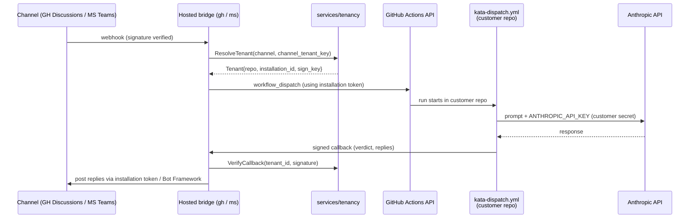

# Design 1240-a — Public hosting for Kata bridges

Architectural design for [spec 1240](spec.md). Builds on the bridge pattern
established by [design 1230-a](../1230-threaded-discussion-bridges/design-a.md):
adds tenancy to `libbridge`, multi-tenant modes to `services/ghbridge` and
`services/msbridge`, and a new `services/tenancy` service that owns the
installation-to-repository registry. The kata-dispatch workflow contract is
unchanged.

## Components

| Component | Responsibility |
|---|---|
| `libraries/libbridge` | Adds a `TenantResolver` abstraction over the existing transport. Resolves an incoming event to a `Tenant` record. In single-tenant mode the resolver returns a fixed `default` tenant; in multi-tenant mode it calls the tenancy service. |
| `services/tenancy` | New gRPC service. Owns the tenant registry: `(channel, channel_tenant_key) → Tenant`. Owns the GitHub App installation id ↔ customer repository mapping. Owns the per-tenant outbound signing keys. |
| `services/ghbridge` | Gains multi-tenant mode. Holds one Kata App private key in process. Mints installation tokens per tenant on demand using the resolved `installation_id`. Posts replies via the per-tenant installation. |
| `services/msbridge` | Gains multi-tenant mode. Holds one multi-tenant Bot Framework credential. Validates inbound JWTs against any consenting Microsoft tenant. Resolves tenant via the Bot Framework activity's tenant id. |
| Hosted GitHub App | Registration artifact (no code). One App owned by Forward Impact, public install URL. Permissions identical to the self-hosted Kata App. |
| Hosted Azure AD app + Bot resource | Registration artifact (no code). Multi-tenant, consent-on-install. One Bot Framework resource shared across consenting tenants. |
| `TRUST.md` | Repository root document. Enumerates operator access surface for both deployment paths. |

## Data flow



The control plane participates in event transit (webhook → dispatch) and reply
transit (callback → channel). It does not participate in agent execution. The
Anthropic key, prompt processing, tool results, and conversation execution
live entirely inside the customer's GitHub Actions runner.

## Tenancy abstraction

`libbridge` introduces:

```ts
interface Tenant {
  tenant_id: string;        // stable uuid, registry-owned
  channel: "github-discussions" | "msteams";
  channel_tenant_key: string;   // installation_id (GH) | azure_tenant_id (MS)
  repo: { owner: string; name: string };  // customer's GitHub repository
  installation_id?: string;     // GitHub App installation token target
  sign_key_id: string;          // identifier into the tenancy keystore
}

interface TenantResolver {
  fromWebhook(req: HttpRequest): Promise<Tenant>;
  fromBotActivity(activity: Activity): Promise<Tenant>;
}
```

`DiscussionContext` keys gain a tenant prefix: `(tenant_id, channel,
discussion_id)`. The libstorage backend prepends `tenant_id` to every path,
so cross-tenant reads are not expressible in the API.

## Tenant registry

The tenancy service persists:

| Field | Notes |
|---|---|
| `tenant_id` | UUID. Registry-owned. |
| `channel_tenant_key` | GitHub `installation_id` or MS Entra `tenant_id`. Unique per channel. |
| `repo` | Customer's `owner/name`. Set during onboarding; rotatable via re-onboarding. |
| `sign_key_id` | Key identifier; the actual Ed25519 material lives in the tenancy service's keystore, never returned over RPC. |
| `created_at` / `last_active_at` | Lifecycle bookkeeping. |
| `state` | `pending_consent` \| `active` \| `revoked`. |

The keystore is a libindex JSONL-backed file in single-instance form;
production deployment substitutes a managed KMS later (out of scope here).

## Onboarding

| Path | Trigger | Handler | Effect |
|---|---|---|---|
| Hosted GH | GitHub App `installation` webhook on install / install_repositories | `ghbridge.onInstallation` | Creates a `Tenant` row keyed by `installation_id`. Marks `pending_consent` until the customer posts their `owner/name` via a one-shot config endpoint. |
| Hosted MS | Bot Framework `installationUpdate` activity with `action=add` | `msbridge.onConsent` | Creates a `Tenant` row keyed by Entra `tenant_id`. Marks `pending_consent` until the customer maps it to a `owner/name`. |
| Self-hosted GH / MS | `kata-setup` skill | Local registration | No tenancy service involved; bridge runs in single-tenant mode with `tenant_id="default"`. |

`pending_consent` rejects inbound channel events until the customer
completes the repo mapping step.

## Key decisions

| Decision | Chosen | Rejected | Why |
|---|---|---|---|
| GitHub App model | One Forward Impact-owned App, multi-installation | One App per customer | GitHub's App model is already multi-install. Per-customer Apps duplicate registration without changing the trust shape — the operator still holds whichever private key is in use. |
| Azure AD app model | One multi-tenant Azure AD app | One per customer tenant | Bot Framework supports multi-tenant validation natively. Per-tenant apps would require operator action per onboard. |
| Tenant resolver | gRPC service (`services/tenancy`) | In-process map in each bridge | Two bridges share the same registry. A service surface keeps the registry authoritative and lets future channels join without code duplication. |
| Storage isolation | Tenant prefix on every key in libstorage | One libstorage instance per tenant | Single libstorage instance handles all tenants with the prefix discipline enforced by the bridge. Per-tenant instances complicate process startup and offer no extra guarantee against a buggy bridge. |
| Anthropic key path | Stays in customer's repo secrets; control plane has no access | Proxy through control plane | Proxying would put the key in the operator's blast radius. BYOK keeps the credential, the prompt, and the response on the customer's runner. |
| Workflow execution | Customer's GitHub Actions runner via `workflow_dispatch` | Hosted runners managed by Forward Impact | Hosted execution would expand the trust surface to include the agent's tool calls and repo writes. Dispatching into the customer's runner keeps execution in the customer's blast radius. |
| Self-hosted code path | Same code, single-tenant mode flag | A separate self-hosted-only bridge | One code path, exercised in two configurations. Avoids drift between hosted and self-hosted behaviour. |
| Trust model artifact | `TRUST.md` at repo root | Section in CLAUDE.md / README | A standalone document is linkable from external onboarding pages, the marketplace listing, and the Teams app submission. CLAUDE.md is internal. |
| Per-tenant signing keys | Ed25519 in tenancy keystore | Shared HMAC across all tenants | Per-tenant material means a compromised callback cannot impersonate another tenant. Ed25519 over HMAC because keys do not need to be present at verification on the customer side. |
| Callback URL routing | Per-tenant callback URL path: `/callback/{tenant_id}/{token}` | One URL with tenant inferred from body | Path-level scoping rejects mis-addressed callbacks before body parsing; aligns tenant id with rate-limit and audit dimensions. |
| Tenancy persistence | libindex JSONL (MVP) | Postgres / managed DB | libindex is the established pattern in this repo. Production hardening (managed DB, KMS) is deferred. |

## Self-hosted preservation

Self-hosted deployments use the existing libbridge transport with a fixed
`tenant_id = "default"`. The tenancy service is not started; the bridge's
`TenantResolver` returns the default tenant unconditionally. No code branch
exists that requires the tenancy service when `SERVICE_*_MULTI_TENANT` is
not set.

`kata-setup` continues to produce a self-hosted deployment by default. A
later skill update — out of scope here — can add a hosted-onboarding
shortcut alongside the existing self-hosted flow.

## What this design does not cover

- The marketplace listing copy, App icon, screenshots, or any publish-time
  artefact for the GitHub App and the Teams app catalog entry.
- The concrete protobuf schema for `services/tenancy`.
- Rate limiting, abuse prevention, and DoS posture on the hosted control
  plane beyond per-tenant scoping.
- KMS integration and rotation procedures for the App private key and the
  Bot Framework secret.
- Replacement of libindex JSONL with a managed datastore.
- The exact text of `TRUST.md` — content is in scope, drafting is a plan
  concern.
- Migration paths between self-hosted and hosted deployments.
