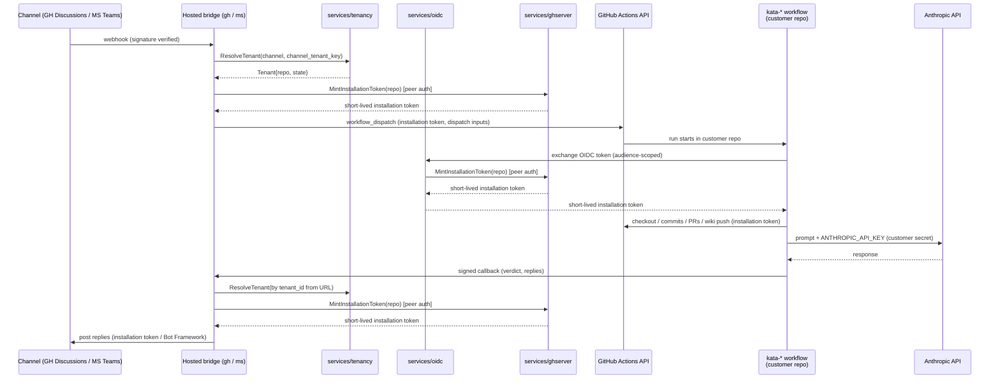

# Design 1270-a — Public hosting for the Kata Agent Team

Architectural design for [spec 1270](spec.md), building on
[design 1230-a](../1230-threaded-discussion-bridges/design-a.md). Adds
to the self-hosted architecture (detailed in § Components): two
control-plane services — `services/ghserver` (pure-gRPC custody point that
mints repo-scoped installation tokens) and `services/oidc` (stateless HTTP
front validating GitHub Actions OIDC, delegating minting over gRPC — the
`services/oauth`→`services/ghauth` pattern) — a `services/tenancy` registry,
a `TenantResolver` in `libraries/libbridge`, and multi-tenant behaviour in
the existing `ghbridge`/`msbridge`/`bridge` services. The kata-dispatch
input shape and callback payload schema are unchanged; the callback URL
gains a `{tenant_id}` segment.

## Components

| Component | Responsibility |
|---|---|
| `services/ghserver` | New. Pure gRPC service — the single point of App-key custody. Holds the Forward Impact-owned App private key in process and mints short-lived, **repo-scoped** installation tokens. Consults `services/tenancy.resolveByRepo` and enforces the per-tenant issuance ceiling before minting. Exposes one transport (gRPC), matching the one-transport-per-service convention in `services/CLAUDE.md` § Architecture. Two classes of control-plane caller, both peer-authenticated (substrate is a plan concern): the hosted bridges (replies, reactions, dispatch) and `services/oidc`. |
| `services/oidc` | New. Stateless HTTP front reached from GitHub Actions runners. Validates the inbound **GitHub Actions OIDC** token (issuer, audience, JWKS), extracts the `repository` claim, and calls its configured provider (`services/ghserver`) over gRPC to mint the `repository`-scoped token. Holds **no** key material. Provider is swappable via config, mirroring `services/oauth`→`services/ghauth`; exposed publicly via its own tunnel. |
| `services/tenancy` | New. Owns the `(channel, channel_tenant_key) → Tenant` registry. Does not hold App-credential material (that lives only in `services/ghserver`) and holds no new cryptographic primitive — callback verification tenant-binds the inherited 1230 single-use token, not a new signature scheme. |
| `libraries/libbridge` | Adds a channel-agnostic `TenantResolver` interface. Bridges supply the resolver; libbridge imports no channel SDKs. Single-tenant mode returns a fixed `default` tenant; multi-tenant mode calls `services/tenancy`. |
| `services/ghbridge` | Gains multi-tenant mode. Replaces its in-process `createAppAuth` installation-token derivation with a `services/ghserver` mint for the GraphQL reply/reaction path. Resolves tenant by newly parsing `installation.id` (carried in App webhook deliveries, not read today). |
| `services/msbridge` | Gains multi-tenant mode. Holds the multi-tenant **Bot Framework credential** in process — outside `services/ghserver`'s scope (the GitHub App key only); Bot Framework custody hardening is a follow-on. Builds a multi-tenant authenticator that accepts JWTs from any consenting Microsoft tenant (single-tenant today) and resolves the tenant from the activity's Entra id (`channelData.tenant.id`). Calls `services/ghserver` for the GitHub App credential used to dispatch the customer workflow. |
| `services/bridge` | Existing canonical threaded-discussion store — the single source of truth both bridges reach via the `DiscussionAdapter` over gRPC (owns `data/bridges/*.jsonl`). Gains per-tenant record scoping by `tenant_id`; single-tenant mode adds no prefix, so existing keys are unchanged. |
| Hosted GitHub App | Registration artifact (no code). One App owned by Forward Impact, public install URL. Permissions identical to the self-hosted Kata App; webhook subscriptions extended to include `installation`. |
| Hosted Azure AD app + Bot resource | Registration artifact (no code). Multi-tenant, consent-on-install. One Bot Framework resource shared across consenting tenants. |
| `kata-setup` workflow templates | Hosted-path templates carry no reference to the hosted App's private key, replacing every customer-side path that today consumes `KATA_APP_PRIVATE_KEY` with a single OIDC call to `services/oidc`. The upstream actions and input names being replaced are a plan concern. Self-hosted templates unchanged. |
| `TRUST.md` | Repository root document, structured as the six aspects in spec § Proposal 5, each with a hosted-vs-self-hosted comparison column — including what `services/ghserver` can mint and on whose behalf, and that the only publicly-reachable control-plane process (`services/oidc`) holds no signing material. Drafting the prose is a plan concern. |

## Data flow

The hosted control plane participates in event transit, reply transit,
and **token issuance** for every kata workflow — never in agent execution.



Scheduled and event-triggered kata workflows (every workflow in spec
§ Proposal 2 other than the bridge-dispatched `kata-dispatch.yml` above)
start at `GH->>WF` with no bridge upstream and re-mint via the same
`WF->>OI->>AT` OIDC step. Anthropic processing stays on the runner.

## Workflow identity

`services/ghserver` is the single point of App-key custody: the key never
leaves this gRPC process and callers receive only short-lived tokens.
`services/oidc` performs OIDC validation; `services/ghserver` performs
custody policy — tenancy check, per-repo scoping, rate ceiling.

| Caller | Reaches | Authentication | Token scope |
|---|---|---|---|
| Customer kata workflow run | `services/oidc` → `services/ghserver` | GitHub Actions OIDC, terminated at `services/oidc`, which validates the token (issuer, audience, JWKS) and passes the asserted `repository`. `services/ghserver` consults `services/tenancy.resolveByRepo` to confirm that `repository` has an `active` Tenant row before minting. | The single repository named in the OIDC claim. |
| Hosted bridge | `services/ghserver` directly | Mutual peer authentication inside the control plane (substrate — mTLS, signed JWT, mesh-issued credential — is a plan concern). The bridge passes the tenant's resolved `repo` from `services/tenancy`. | The single repository on the active `Tenant` row. |

`services/ghserver` rejects mints when the repo is not an `active` tenant
row or the per-tenant rate ceiling is exceeded. Token TTL is GitHub's
installation-token maximum; long runs re-mint.

## Tenancy abstraction

`libbridge` introduces a channel-agnostic resolver. Channel-specific
extraction (parsing a webhook or Bot Framework activity into a
`(channel, channel_tenant_key)` pair) lives in the calling bridge,
keeping libbridge free of channel SDK dependencies.

```ts
type ChannelTenantKey = { channel: "github-discussions" | "msteams"; key: string };

interface Tenant {
  tenant_id: string;        // stable uuid, registry-owned
  channel: "github-discussions" | "msteams";
  channel_tenant_key: string;   // GitHub: "{installation_id}:{owner}/{name}"; MS: azure tenantId
  repo?: { owner: string; name: string };  // required when state === "active"
  state: "pending_consent" | "active" | "revoked";
}

interface TenantResolver {
  resolve(k: ChannelTenantKey): Promise<Tenant>;     // active tenants only
  resolveByRepo(repo: { owner: string; name: string }): Promise<Tenant>;
  resolveByTenantId(tenant_id: string): Promise<Tenant>;     // for callback path
}
```

`resolveByRepo` serves `services/ghserver`'s mint path, driven by the
OIDC-asserted `repository` that `services/oidc` forwards (no
`channel_tenant_key`); both methods return only `active` tenants. A
GitHub installation may cover many repos — the registry creates one row
per `(installation_id, repo)` pair on `repositories_added`. Teams
`pending_consent` rows lack `repo` until the customer self-serves it.

Per-tenant storage isolation lands in `services/bridge` (reached via the
`DiscussionAdapter` over gRPC). Multi-tenant mode scopes every record by
the resolved `tenant_id` — per-id keys gain a `{tenant_id}:` prefix and the
cross-record RPCs (correlation lookup, recess list, inbox drain, sweep)
filter by tenant, so no list/aggregate response crosses tenants. Single-
tenant mode adds no prefix or filter, leaving keys and JSONL unchanged.

## Tenant registry

| Field | Notes |
|---|---|
| `tenant_id` | UUID. Registry-owned. |
| `channel_tenant_key` | GitHub: composite `"{installation_id}:{owner}/{name}"`. MS Entra: tenant id. Unique per channel. |
| `repo` | Customer's `owner/name`. Set during onboarding; rotatable via re-onboarding. |
| `created_at` / `last_active_at` | Lifecycle bookkeeping. |
| `state` | `pending_consent` \| `active` \| `revoked`. Only `active` tenants resolve. |

Per-tenant callback verification reuses the inherited 1230 single-use
token: the dispatcher registers it bound to `(correlation_id,
tenant_id)`, the URL is `/callback/{tenant_id}/{token}`, and the bridge
rejects on consume if the URL's tenant id mismatches — the verification
state is the existing `CallbackRegistry` binding. Production hardening of
the registry substrate is deferred.

## Onboarding

Hosted-mode onboarding is event-driven; self-hosted is configuration.

| Trigger | Handler | Effect |
|---|---|---|
| GitHub App `installation` webhook (`created` / `repositories_added`) | GitHub install handler in `ghbridge` | One `state = active` row per `(installation_id, repo)` pair in the event's repository set. No mapping step — the installation event already names the repos the App may act on. |
| Bot Framework `installationUpdate` activity (`action=add`) | Teams consent handler in `msbridge` | One `state = pending_consent` row keyed by Microsoft `tenantId`. The customer self-serves the repo mapping via a hosted onboarding endpoint; the operator takes no action between consent and mapping. |

A `Tenant` in `pending_consent` does not resolve and `services/ghserver`
does not mint for it. Self-hosted mode is a deploy-time flag (name is a
plan concern): off → bridge returns the `default` tenant; `tenancy`,
`ghserver`, and `oidc` are not started (self-hosted workflows use
`KATA_APP_PRIVATE_KEY` directly); `msbridge` builds a single-tenant Bot
Framework authenticator from `MICROSOFT_APP_TENANT_ID`. On → the bridge
resolves per request and `msbridge` accepts JWTs from any `active` tenant.

## Key decisions

| Decision | Chosen | Rejected | Why |
|---|---|---|---|
| GitHub App model | One Forward Impact-owned App, multi-installation | One App per customer | GitHub's App model is already multi-install. Per-customer Apps duplicate registration without changing the trust shape — the operator still holds whichever private key is in use. |
| Azure AD app model | One multi-tenant Azure AD app | One per customer tenant | Bot Framework supports multi-tenant validation natively. Per-tenant apps would require operator action per onboard. |
| App private key custody | Centralized in `services/ghserver` | (a) Each bridge holds the key in process; (b) the key lives in every customer repository's Actions secrets | (a) Duplicates the master credential across processes and forces every bridge to embed key-handling code. (b) Replicates the master credential across every customer's CI environment and is the disqualifying property the spec calls out — incompatible with public-App security. |
| In-workflow authentication to the control plane | GitHub Actions OIDC (terminated at `services/oidc`) | (a) A long-lived per-customer secret installed in repository Actions secrets; (b) bridge-issued tokens carried as `workflow_dispatch` inputs | (a) Reintroduces the customer-side long-lived credential the spec exists to eliminate. (b) Bridge-issued tokens cannot reach scheduled workflows (`kata-shift`, `kata-storyboard`) which have no upstream bridge, and a single dispatched token cannot survive a multi-hour run. OIDC reaches every workflow surface uniformly and supports mid-run re-mints. |
| Workflow identity coverage | Every kata workflow on the hosted path uses the same OIDC-to-`services/oidc` mint step | Only `kata-dispatch.yml` goes through the broker; scheduled workflows keep a customer-side secret | Mixed-model coverage leaves `KATA_APP_PRIVATE_KEY` in customer repositories and defeats the spec's master-credential criterion. One mechanism across all kata workflows is also one surface to audit. |
| Hosted dispatch identity | `services/ghserver`-minted installation token | Per-user OAuth via `services/ghauth` | Per-user OAuth requires every dispatcher to complete a one-time link flow before they can post — incompatible with the spec's setup-floor reduction. `services/ghauth` remains the dispatch identity for self-hosted operators who want per-user attribution. |
| Token scoping | Per-repo from OIDC claim / per-tenant `repo` row | Per-installation (broader scope) | Per-installation tokens can act on every repository the installation covers; per-repo tokens confine blast radius to the one repository named in the request and align with the OIDC claim used to authenticate the caller. |
| Registry packaging | Standalone gRPC service (`services/tenancy`) | (a) Library inside `libbridge`; (b) table inside `services/ghbridge` shared via direct DB access | Two bridges (and the ghserver service) share one authoritative registry. A library forces every caller to embed the same persistence code. A table inside ghbridge couples msbridge and ghserver to ghbridge's lifecycle. |
| Tenant resolver placement | Channel-agnostic interface in `libbridge`; channel-specific extraction in the calling bridge | Resolver lives entirely in `libbridge` and imports channel SDKs | Putting channel SDK imports in `libbridge` violates its existing "no channel SDKs" invariant. Keeping extraction in the bridge service preserves libbridge as channel-agnostic transport. |
| Storage isolation | Tenant-scope records inside `services/bridge` (the shared canonical store) by `tenant_id`, passed through the `DiscussionAdapter` over gRPC | (a) Per-tenant store instances inside each bridge process; (b) one shared unscoped store with tenant-keyed entries | (a) misplaces isolation in a process that holds no store — the bridges own only a gRPC client to `services/bridge`. Scoping at the store keeps one authoritative isolation point and leaves `libindex`/`libstorage` (used by `services/bridge`, not by the bridge processes) caller-injected and unchanged; (b) risks cross-tenant key collisions in a single file. |
| Anthropic key path | Stays in customer's repo secrets; control plane has no access | Proxy through control plane | Proxying would put the key in the operator's blast radius. BYOK keeps the credential, the prompt, and the response on the customer's runner. |
| Workflow execution | Customer's GitHub Actions runner via `workflow_dispatch` and scheduled triggers | Hosted runners managed by Forward Impact | Hosted execution would expand the trust surface to include every tool call and repo write the agents make. Dispatching into the customer's runner keeps execution in the customer's blast radius. |
| Self-hosted code path | Same code, single-tenant mode flag | A separate self-hosted-only bridge | One code path, exercised in two configurations; avoids hosted/self-hosted behaviour drift. |
| Trust model artifact | `TRUST.md` at repo root | Section in CLAUDE.md / README | A standalone document is linkable from external onboarding, the marketplace listing, and Teams app submission. |
| Bot Framework credential custody | Held in `services/msbridge` process | Centralize in `services/ghserver` alongside the GitHub App key | The GitHub App key is consumed by every kata workflow (high-fanout); centralising it gives a uniform OIDC-mint path. The Bot Framework credential is consumed only by `msbridge` (no fanout), so centralising it does not justify the new in-process boundary; its custody hardening is deferred (§ What this design does not cover). |
| Callback authentication | Tenant-bind the inherited 1230 single-use token (registry stores `(correlation_id, tenant_id)` on register; bridge rejects on consume if the URL's tenant id mismatches the token's) | (a) Add a new signature primitive (HMAC or asymmetric) over the callback body per tenant; (b) shared secret across all tenants | (a) Introduces a primitive the spec did not authorize and adds new secret-management surface for no property gain — token-binding alone gives the cross-tenant rejection property. (b) A shared secret means a leak in any tenant's workflow logs compromises all tenants. |
| Callback URL routing | Per-tenant URL path: `/callback/{tenant_id}/{token}` | One URL with tenant inferred from body | Path-level scoping rejects mis-addressed callbacks before body parsing and pairs cleanly with the token-bind-on-register approach. |
| Public ingress for OIDC mint | Dedicated stateless front `services/oidc` that validates the OIDC token and delegates to `services/ghserver` over gRPC | (a) A public HTTPS endpoint on `services/ghserver` itself, alongside its control-plane gRPC; (b) proxy OIDC mint requests through `services/ghbridge` | (a) Would make one service expose two transports, against the one-transport-per-service convention every existing service follows (`services/CLAUDE.md` § Architecture), and put the key-custody process on the public internet. The protocol-front pattern (`services/oauth`→`services/ghauth`, `services/mcp`→backend gRPC) keeps the only publicly-listening process key-free and lets internal callers reach the provider directly over gRPC. (b) Scheduled runs never call ghbridge; proxying their mints through it would expand ghbridge's attack surface and couple ghserver's availability to ghbridge's. |

## What this design does not cover

- Publish-time artefacts (marketplace listing, App icon, screenshots,
  Teams catalog metadata).
- Concrete protobuf schemas for `services/tenancy` and `services/ghserver`,
  the `services/oidc` HTTP request/response shape, and its provider config.
- Exact GitHub Actions OIDC claim-validation rules — `services/oidc` must
  scope the minted token to the OIDC-asserted `repository`.
- Rate limiting and DoS posture beyond per-tenant scoping.
- KMS/HSM custody and rotation for the hosted App private key.
- Custody hardening for the Bot Framework credential held in
  `services/msbridge`.
- Replacement of libindex JSONL with a managed datastore.
- Exact `TRUST.md` text (content is in scope, drafting is a plan concern).
- Migration paths between self-hosted and hosted deployments.
