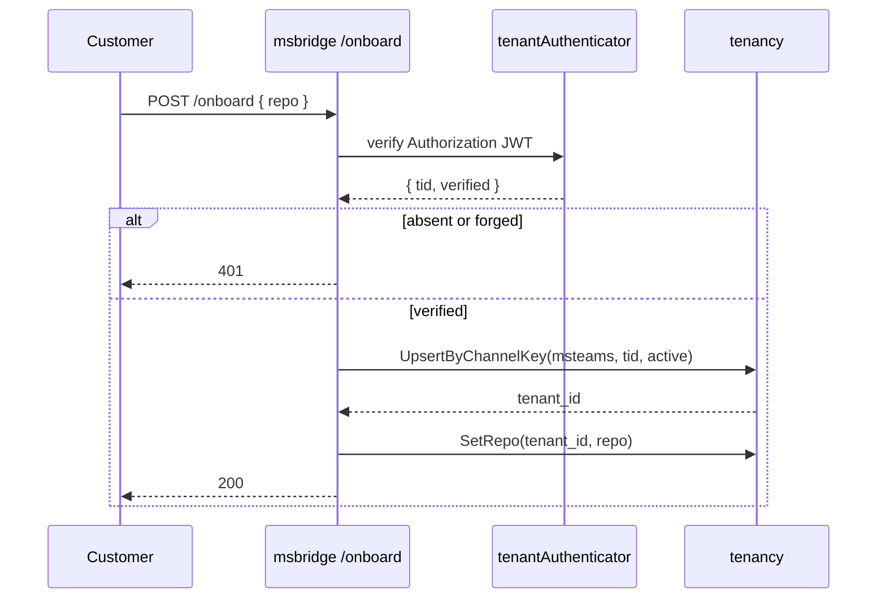
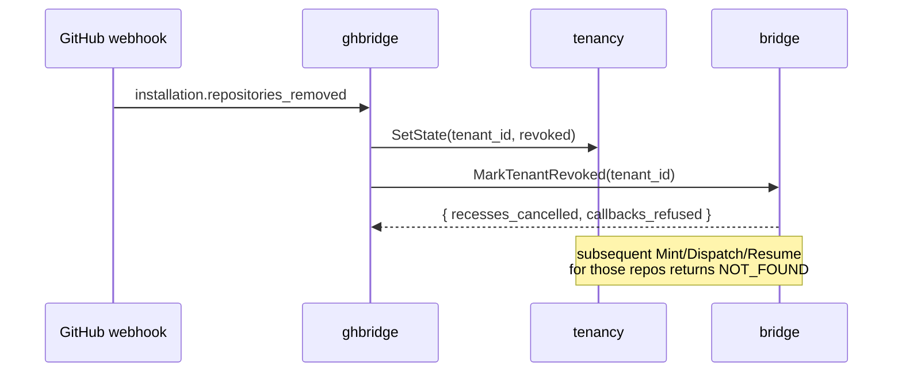
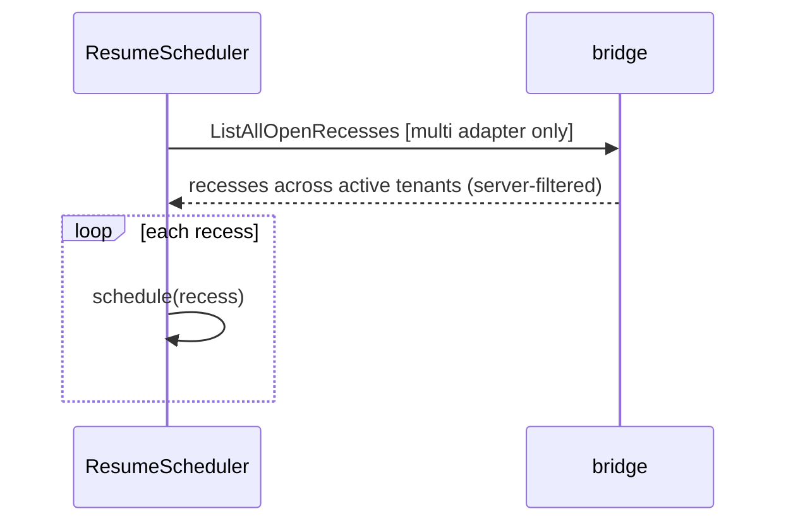

# Design 1272 — Hosted control-plane hardening

Spec [1272](spec.md) names six hosted-only gaps inherited from spec 1270's
"what this design does not cover" list. This design groups them into four
architectural moves so each lands independently:

- **A** — ghserver substrate (criteria 1–4): peer-authenticated mint surface
  - externalized App-key custody with in-place rotation.
- **B** — verified Teams onboarding (criterion 5): inject a Bot Framework JWT
  verifier so `/onboard` accepts a cryptographically proven `tid`.
- **C** — tenant lifecycle correctness (criteria 6–7): webhook-driven revoke
  that also cancels in-flight resume work, and cross-tenant enumeration so
  `ResumeScheduler.rearm()` covers every active tenant on restart.
- **D** — hosted templates run end-to-end (criterion 8): kata-setup hosted
  templates pin the sibling-action minimum versions that accept the
  `installation-token` input.

Single-tenant deployments (`*_TENANCY_MODE=single`) are untouched
(criterion 9); every new collaborator is conditioned on `multi` mode.

## Architecture

```mermaid
flowchart LR
  subgraph hosted_control_plane
    OIDC[oidc] -- signed peer token --> GHS[ghserver]
    GHB[ghbridge/multi] -- signed peer token --> GHS
    MSB[msbridge/multi] -- signed peer token --> GHS
    GHS -- fetch + cache --> KMS[(external custody)]
    GHB <-- ResolveByRepo / SetState --> TEN[tenancy]
    MSB <-- ResolveByChannelKey / SetState --> TEN
    GHB -- ListAllOpenRecesses / MarkTenantRevoked --> BR[bridge]
    MSB -- ListAllOpenRecesses / MarkTenantRevoked --> BR
  end
  GH[GitHub webhook] -. installation.* .-> GHB
  T[Teams /onboard] -. signed JWT .-> MSB
```

## Components

| Component | Move | Adds |
| --- | --- | --- |
| `services/ghserver` peer interceptor | A | gRPC interceptor that requires a signed peer token in metadata, rejects calls without it, and surfaces `peer_identity` to handlers. The existing bind-guard stays as defense-in-depth. |
| `services/ghserver` key resolver | A | Collaborator that fetches App PEM from external custody at startup, caches it, and re-fetches on a signed-request failure so rotation lands without process restart. |
| `services/msbridge` onboard verifier | B | `tenantAuthenticator(req) → { tid, verified }` collaborator; the handler depends on it directly. The default-deny fallback is removed — when no verifier is wired (single-tenant path), `/onboard` is unrouted, not 401. |
| `services/ghbridge` uninstall handler | C | New `src/uninstall-handler.js` that dispatches on `installation.deleted`, `installation.suspend`, and `installation.repositories_removed` to `tenancy.SetState(active→revoked)` then `bridge.MarkTenantRevoked`. |
| `services/bridge` `ListAllOpenRecesses` | C | New sibling RPC with no `tenant_id` field. Server-side filters to recesses whose tenant is `active` by joining against `tenancy.ResolveByTenantId`. The existing per-tenant `ListOpenRecesses` is unchanged. |
| `services/bridge` revoke sweep | C | New `MarkTenantRevoked` write RPC that walks the tenant's recess + callback records and applies per-record libstorage writes (each atomic via the rename primitive spec 1480 lands). Cross-record consistency is not required — callback delivery refuses any post-sweep callback via the existing tenancy-state check on `ResolveByTenantId`. |
| Bridge-side store adapter in `multi` | C | The bridge process's store adapter constructed at boot binds the `multi`-mode choice: `Store.listOpenRecesses()` (already no-args at libbridge/src/index.js:17) is implemented by calling `ListAllOpenRecesses` instead of `ListOpenRecesses(tenant_id)`. The libbridge typedef does not widen; `libbridge`'s `ResumeScheduler` stays mode-agnostic. |
| kata-setup hosted templates | D | Hosted `workflow-facilitate` / `workflow-react` / `workflow-agent` templates pin a minimum `kata-action-agent` / `kata-action-eval` version that accepts `installation-token`. |

## Onboarding (B)



## Revoke (C)



## Restart re-arm (C)



## Key Decisions

| # | Decision | Rejected alternative |
| --- | --- | --- |
| 1 | Peer auth surfaces `peer_identity` to handlers via a gRPC interceptor; transport is a **short-lived JWT** in `authorization` metadata signed with a per-caller asymmetric key (`aud=ghserver`, `exp` minutes). Public keys live in the same external custody as the App key — one trust root, not two. | **mTLS** — adds a second substrate (cert rotation, trust roots) on top of Decision 2's custody. **Shared HMAC secret across all callers** — a single leaked key compromises every peer and offers no per-caller revocation. |
| 2 | App private key lives in an **external secret manager** (KMS/Secrets Manager); a key-resolver collaborator fetches on startup, caches, and re-fetches on a signed-request failure so rotation lands without process restart. | **Read-once env or file** — even with operator tooling, rotation requires a redeploy; criterion 3 rules this out. |
| 3 | The `/onboard` JWT verifier wraps the Bot Framework SDK's **`ConfigurationBotFrameworkAuthentication`** — the same authenticator `services/msbridge/src/teams.js:75` already uses on the `/api/messages` path — and is injected into the handler as a collaborator. One verification path, one SDK upgrade surface. | **Verify directly against Entra JWKS** (skip the SDK) — the bridge would maintain its own Microsoft signing-key fetch + audience/issuer checks parallel to the SDK's; doubles the surface that has to track Microsoft's metadata changes. |
| 4 | Revoke is **webhook-driven** off `installation.repositories_removed` and full uninstall, mirroring `install-handler.js`. | **Reconciliation poll** — silent on missed events and contradicts the bridge's event-sourced model. |
| 5 | Cross-tenant enumeration is a **new sibling RPC `ListAllOpenRecesses`** on `services/bridge` (no `tenant_id` field). Bridge owns the recess store and the new RPC server-side joins against `tenancy.ResolveByTenantId` so the result excludes revoked tenants. The existing per-tenant `ListOpenRecesses` is untouched. | **Overload existing `ListOpenRecesses`** by allowing empty `tenant_id` — splits one RPC across two trust modes and breaks single-tenant tests that assert `INVALID_ARGUMENT` on missing tenant. **`services/tenancy.ListActive` + per-tenant fan-out** — N+1 round-trips at every restart and splits the recess query across two services. |
| 6 | Revoke cancels in-flight resume work via a new **`MarkTenantRevoked`** write RPC on `services/bridge` that walks the tenant's recess + callback records under the existing **libindex writer-lock**, drops pending recesses, and marks queued callbacks refused. | **In-process scheduler cancel only** — racy across multiple bridge replicas; a callback delivered after revoke but before in-process notice would still execute. |
| 7 | Hosted templates pin a **minimum sibling version** of `kata-action-agent` / `kata-action-eval` that accepts `installation-token`; the sibling release ships the input acceptance. The monorepo side is the pin alone (criterion 8, first clause). | **Operator-managed version** — invisible to kata-setup and re-opens the documented gap on every kata-setup re-run. |
| 8 | Decomposed into **four independently-shippable moves** (A/B/C/D) that may land in any order. Bind-address isolation is the permanent transport-level access boundary for every control-plane RPC; Move A adds peer-auth identity *on top* of it (additive, not replacement), so C's new RPCs ship behind the same isolation as today's ghserver mint surface whenever they land. D blocks externally on the sibling release. | **One serialized plan** — couples the adopter unblock (3, 5) to the heavier substrate (1, 2). **C-after-A** — keeps C unshippable until external custody is provisioned, with no security benefit because bind isolation already covers in-control-plane RPCs. |

## Suggested move ordering

A planner may sequence the four moves in any order. Smallest-first (B → C → A →
D) unblocks adopter capability earliest; substrate-first (A → C → B → D) hardens
the mint surface before extending it. D blocks externally on the sibling release
accepting `installation-token`.

## State invariants

- A `revoked` tenant row never returns from `ResolveByRepo` or
  `ResolveByChannelKey` (existing tenancy invariant) and is observable only via
  `ResolveByTenantId` so callback verification can reject mismatched-state
  callbacks.
- Every `MintInstallationToken` call traverses the peer-auth interceptor; an
  unauthenticated caller returns gRPC `UNAUTHENTICATED` before any
  `ResolveByRepo`.
- After `MarkTenantRevoked(t)` returns, every pending recess for `t` has been
  excised from the bridge store via individually-atomic libstorage writes; any
  later-arriving callback for `t` is refused by the callback handler's existing
  tenancy-state check on `ResolveByTenantId`. Cross-record atomicity is not
  required.
- `ListAllOpenRecesses` server-side filters its result against the current
  tenancy state, so a recess record for a revoked tenant cannot be re-armed even
  if `MarkTenantRevoked` raced with a restart.

## Mapping to success criteria

| Crit. | Move | Component touched |
| --- | --- | --- |
| 1 | A | ghserver peer-auth interceptor (reject path) |
| 2 | A | ghserver peer-auth interceptor (accept path) |
| 3 | A | ghserver key resolver + external custody |
| 4 | A | `services/ghserver/README.md` rotation section |
| 5 | B | msbridge onboard verifier |
| 6 | C | ghbridge uninstall handler + tenancy revoke + bridge MarkTenantRevoked |
| 7 | C | bridge `ListAllOpenRecesses` + libbridge `ResumeScheduler.rearm` |
| 8 | D | kata-setup hosted templates (sibling-version pin block) |
| 9 | all | single-tenant path unchanged (mode guards on every new collaborator) |

## Out of scope

Reaffirms spec § Out of scope: hosted discovery artefacts, `FIT_OIDC_URL`
auto-set, libindex replacement, self-hosted↔hosted migration, msbridge Bot
Framework custody hardening, broader rate-limiting, computed-key BYOK scanner.
