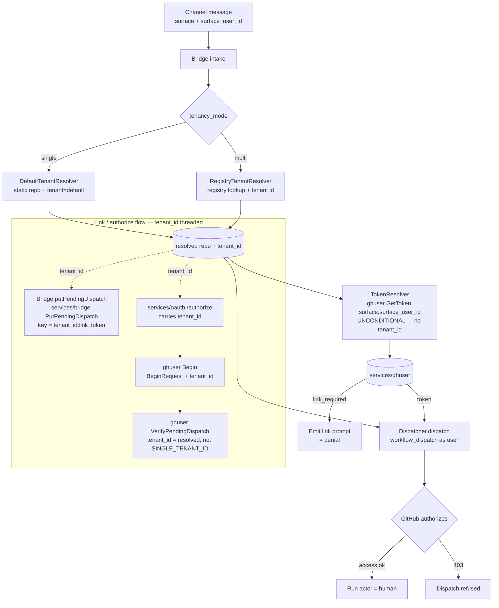

# Design 1273 — Unified per-user dispatch identity

## Problem restated

[Spec 1270](../1270-kata-bridges-public-hosting/spec.md) split the
`workflow_dispatch` credential by deployment mode: self-hosted dispatches under
a per-user OAuth token from `services/ghuser`; hosted dispatches under a
repo-scoped App installation token from `services/ghserver`. The split lives as
a `tenancy_mode` branch in both bridges and attributes hosted runs to the App
bot, not the human. Spec 1273 unifies dispatch identity on the per-user token in
both modes, and threads the resolved tenant id through `services/ghuser` so the
per-user path actually works multi-tenant.

## Scope (from the spec)

- **In:** unify the `workflow_dispatch` credential on the `ghuser`-backed
  per-user token in `services/msbridge` and `services/ghbridge`; thread the
  resolved tenant id from the bridge's `PutPendingDispatch` write through
  `services/oauth` `/authorize` → `ghuser` `Begin` → its pending-dispatch proof,
  replacing `SINGLE_TENANT_ID`; make `services/ghuser` required in both
  deployment models; update affected guides including `TRUST.md`.
- **Out:** tenant → repository resolution (registry vs static — that _is_ the
  mode definition); keyless workflow identity (`services/ghserver`, fronted by
  `services/oidc`) for a workflow's own operations; self-hosted dispatch
  (already per-user); reply/reaction credentials. This design removes
  `services/ghserver` from the dispatch path only and takes no position on its
  fate elsewhere.

## Two axes, only one mode-selected

The bridges compose two independent resolvers. Today both branch on
`tenancy_mode`. This design collapses the **dispatch-identity** branch to a
single path and leaves the **repository-resolution** branch untouched.

| Axis                                  | Today                                                                                                                        | After 1273                                                |
| ------------------------------------- | ---------------------------------------------------------------------------------------------------------------------------- | --------------------------------------------------------- |
| Dispatch identity (WHO fires the run) | `tenancy_mode` selects `TokenResolver` (single) vs `GhServerTokenResolver` (multi, gated on `multiTenant && ghserverClient`) | Always `TokenResolver` (`ghuser` per-user), unconditional |
| Repository resolution (WHICH repo)    | `tenancy_mode` selects `DefaultTenantResolver` (single) vs `RegistryTenantResolver` (multi)                                  | Unchanged — still mode-selected                           |

After this change `tenancy_mode` governs repository resolution and the
reply-token path, never dispatch identity.

## Components and interfaces

- **`libbridge` `TokenResolver`** (`token-resolver.js`) — the single dispatch
  credential resolver. Wraps the `ghuser` `GetToken` oneof into a `DispatchAuth`
  (`token` / `link_required` / `reauth_required` / `transient`). Becomes the
  only `tokenResolver` the `Dispatcher` sees in both bridges.
- **`libbridge` `GhServerTokenResolver`** (`ghserver-token-resolver.js`) — the
  App-token dispatch path. **Removed** (clean break). It minted a repo-scoped
  installation token from `services/ghserver` and attributed the run to the App,
  which is exactly the attribution loss 1273 reverses.
- **`libbridge` tenant resolvers** (`tenant-resolver.js`) —
  `RegistryTenantResolver` (multi) vs `DefaultTenantResolver` (single).
  **Unchanged.** They remain the sole `tenancy_mode` branch, and produce the
  `tenant_id` that the dispatch path now carries into `ghuser`.
- **`services/ghuser` `Ghuser.GetToken`** — the **dispatch-time** credential
  fetch, keyed by `(surface, surface_user_id)`; it carries **no** tenant. On an
  unlinked user returns `link_required` with an authorize URL; on
  revoked/expired returns `re_auth_required` (the proto field; the resolver maps
  it to the `reauth_required` kind). Unchanged. Required in both deployment
  models.
- **`services/oauth` `/authorize` → `ghuser` `Begin`** — the **link-time**
  authorize path. `services/oauth` owns the `/authorize` HTTP endpoint
  (`index.js`) and calls `ghuser`'s `Begin` with a `BeginRequest`. **New tenant
  carrier:** `services/oauth`'s `/authorize` query gains a `tenant_id`
  parameter, and `ghuser`'s `BeginRequest` proto gains a `tenant_id` field (it
  has none today). This is the load-bearing interface addition — see Key
  Decisions.
- **`services/ghuser` identity contract** (`src/identity-contracts.js`) — the
  `bridgePendingDispatchProof` contract (evaluated at `Begin`) calls
  `bridgeClient.VerifyPendingDispatch` with a hard-coded
  `tenant_id: SINGLE_TENANT_ID` (`"default"`). This design replaces that literal
  with the **resolved tenant id** carried in on `BeginRequest`, so the proof is
  keyed per tenant.
- **`services/bridge` `PutPendingDispatch` / `VerifyPendingDispatch`** — already
  tenant-scope their keyspace (`${tenant_id}:${link_token}`). **Unchanged**: the
  keyspace is correct. The bridge writes the proof via `PutPendingDispatch`
  (called from `services/msbridge` / `services/ghbridge`
  `discussion-adapter.js`, threading the resolved tenant); only `ghuser` must
  stop passing the hard-coded tenant on the verify side so its lookups land in
  the right per-tenant slot.
- **Bridge composition roots** — `services/msbridge` and `services/ghbridge`
  (`index.js` constructors + `server.js` wiring) stop selecting the dispatch
  resolver by mode and stop passing a ghserver client _for dispatch_.

### Where ghserver still lives (and why that is in scope)

`services/msbridge` constructed `ghserverClient` **only** for dispatch, so it
stops constructing it entirely. `services/ghbridge` also uses `ghserverClient`
on the multi-tenant **reply/reaction** path (`makeGraphqlClient` /
`getInstallationToken`, per-tenant GraphQL installation tokens) — that path is
out of scope, so ghbridge **retains** the client for replies and removes it only
from the dispatch wiring.

## Tenant threading (the multi-tenant addition)

Multi-tenant dispatch breaks unless the per-user proof is scoped to the
dispatching user's tenant. `services/bridge` already keys pending dispatches by
`(tenant_id, link_token)`; the single hard-coded `"default"` in `ghuser` means
its `VerifyPendingDispatch` only ever probes the default slot, so a second
tenant's proof cannot be found. This design routes the **resolved tenant id**
two ways: the bridge writes the proof via `services/bridge`
`PutPendingDispatch`, keyed by the resolved tenant; and the same tenant id is
carried through `services/oauth`'s `/authorize` into `ghuser`'s `Begin`
(`BeginRequest.tenant_id`), where the `bridgePendingDispatchProof` contract's
`VerifyPendingDispatch` call reads it, replacing `SINGLE_TENANT_ID`. Single
tenant supplies the literal `"default"`; multi-tenant supplies the
registry-resolved tenant id. One keyspace, correct per tenant. The dispatch-time
`GetToken` is untouched — it never carried a tenant.

## Authorization: delegated to GitHub

There is no separate authz layer. The per-user token grants exactly the
dispatcher's GitHub repo access, so GitHub adjudicates every dispatch:

- **Unlinked user** → `GetToken` returns `link_required`; the bridge has no
  token to fire with and emits the existing link prompt. The link prompt **is**
  the denial path.
- **Linked but unauthorized user** → a token exists, but `workflow_dispatch`
  against the resolved repo is refused by GitHub (403). No bridge-side
  allowlist.
- **Linked and authorized user** → the run executes under their identity; GitHub
  records the human as actor.

## Data flow

Two flows share the resolved `tenant_id`: the **link/authorize** flow (where the
tenant is threaded, one-time per user) and the **dispatch** flow (where
`GetToken` fetches the already-bound credential, keyed by
`(surface, surface_user_id)` only).

The mode branch is on repository/tenant resolution only; the dispatch token path
no longer forks. The resolved `tenant_id` is carried on the link/authorize path
— into `services/bridge`'s `PutPendingDispatch` write and through
`services/oauth` `/authorize` → `ghuser` `Begin` → `VerifyPendingDispatch` — not
through `GetToken`, which is keyed by `(surface, surface_user_id)` alone.

## Key Decisions

| Decision                        | Choice                                                                                                                                                                         | Rejected alternative                                                                                                                                                                                                                |
| ------------------------------- | ------------------------------------------------------------------------------------------------------------------------------------------------------------------------------ | ----------------------------------------------------------------------------------------------------------------------------------------------------------------------------------------------------------------------------------- |
| Dispatch credential             | One per-user `ghuser` token in both modes                                                                                                                                      | Keep the App token + a separate attribution layer — rejected: an attribution layer relabels logs but does not change the GitHub run _actor_, so audit fidelity stays bot-level.                                                     |
| Tenant scoping of the proof     | Thread the real resolved `tenant_id` end-to-end through the bridge's `PutPendingDispatch` write and `services/oauth` `/authorize` → `ghuser` `Begin` → `VerifyPendingDispatch` | Keep the hard-coded `"default"` tenant — rejected: a single-tenant proof keyspace cannot distinguish tenants, so cross-tenant per-user dispatch proofs would collide or fail.                                                       |
| Tenant carrier on the link path | Add a `tenant_id` query param to `services/oauth` `/authorize` and a `tenant_id` field to `ghuser`'s `BeginRequest` (neither exists today)                                     | Reuse `GetToken` to carry the tenant — rejected: `GetToken` is the dispatch-time fetch keyed by `(surface, surface_user_id)`; the binding is established once at link time, so the tenant belongs on the authorize/`Begin` path.    |
| Authorization model             | GitHub repo access via the per-user token                                                                                                                                      | A bridge-side allowlist of who may dispatch — rejected: a parallel authz surface that drifts from GitHub's own grants and duplicates state GitHub already owns.                                                                     |
| App-token dispatch path         | Clean removal of `GhServerTokenResolver` and dispatch-only `ghserverClient` wiring                                                                                             | Keep it as a fallback — rejected: a fallback _is_ the `tenancy_mode` dispatch branch this spec deletes, and it reintroduces bot-vs-human attribution; clean break per [CONTRIBUTING § Clean breaks](../../CONTRIBUTING.md#read-do). |
| `services/ghuser` dependency    | Required in both deployment models                                                                                                                                             | Optional in hosted (1270's onboarding-floor reduction) — rejected: optionality is exactly what forced the per-mode dispatch split 1273 removes.                                                                                     |

## Mapping to success criteria

| #   | Criterion                                                 | How this design satisfies it                                                                                                                   |
| --- | --------------------------------------------------------- | ---------------------------------------------------------------------------------------------------------------------------------------------- |
| 1   | Dispatch runs as the user in both modes                   | `TokenResolver` (per-user) is the unconditional dispatch credential; GitHub records the linked human as actor.                                 |
| 2   | No `tenancy_mode` branch selects the dispatch credential  | The dispatch resolver is constructed unconditionally; the only surviving mode branch selects the tenant resolver (repo).                       |
| 3   | Proof keyed by resolved tenant id, not `SINGLE_TENANT_ID` | The identity contract passes the threaded tenant id to `VerifyPendingDispatch`; `services/bridge`'s existing per-tenant keyspace then matches. |
| 4   | Unlinked/expired-link: no dispatch + link prompt          | `GetToken` → `link_required` / `reauth_required` yields no token, so the bridge fires nothing and emits the existing prompt.                   |
| 5   | Linked-but-unauthorized: GitHub-refused dispatch          | A token exists, so a dispatch is attempted; GitHub refuses `workflow_dispatch` (403). No bridge-side check (integration/manual).               |
| 6   | `ghuser` required in both models                          | `GhuserClient` is a contractual dependency of both bridges in single and multi.                                                                |
| 7   | Self-hosted dispatch unchanged                            | Single-tenant already used `TokenResolver` with `tenant_id = "default"`; its path and tests are untouched.                                     |
| 8   | Multi-tenant repo resolution unchanged                    | `RegistryTenantResolver` / `resolveByRepo` are not in scope; the repo axis is preserved verbatim.                                              |

— Staff Engineer 🛠️
