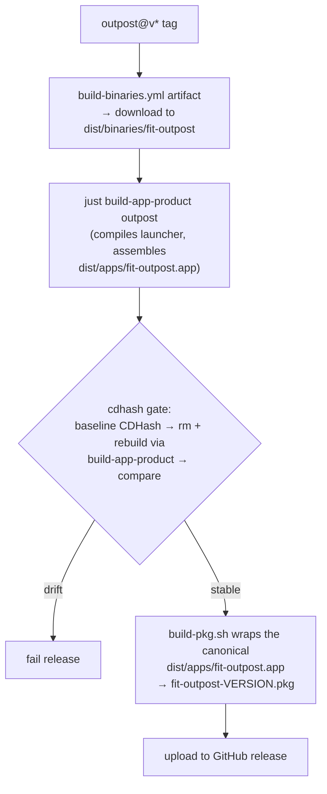

# Design 1290 — Unified macOS distribution for Gear bundles

Restates [spec 1290](spec.md): a single approach for building and publishing
every Gear macOS `.app` to brew — one bundle directory name, one install path,
one canonical build entry point, and one cdhash determinism gate covering every
release path. Six of seven brew lanes already satisfy this by construction;
Outpost's `.pkg` channel was the only divergent lane.

## Scope already satisfied on `origin/main`

The spec's Problem, Why, and even its "Status after 1420" note **are stale on
this branch** — they describe the `.pkg` lane assembling `Outpost.app` via
`--bundle-name "Outpost"` and installing to `/Applications/Outpost.app`, neither
of which is true in the code today. Authoritative state, read from `origin/main`
before designing (the spec text is not authoritative where it conflicts):

| SC | Property | Status on main | Evidence |
|---|---|---|---|
| SC1 | One `--bundle-name` per product | **Fully satisfied — no work** | `build/build-app-product.sh:23` and `products/outpost/pkg/build.js:113` (`buildApp()`) both pass `--bundle-name "fit-outpost"`. The spec's "size-2 set → reduce to 1" predicate is already a singleton; nothing here regresses it. |
| SC2 | One install path per product | **Satisfied (in-repo half) — no work** | `build-pkg.sh:45` installs to `/Applications/Forward Impact/fit-outpost.app` (commit `c1716f71`, "align the .pkg channel with the Homebrew cask"). The spec's `/Applications/fit-outpost.app` string is stale; the real path is the `Forward Impact/` subdir. The cask comparison stays a post-release verifier per the spec — this design does not touch it. |
| Info.plist | Bundle keys align with directory name | **No work — SC4 is cross-asset, not name-matching** | The spec's In-scope item (spec.md:217) and its References note (spec.md:419) conflict: one asks `CFBundleName` to match the directory name, the other preserves `CFBundleName=Outpost`. SC4 resolves it — it requires `CFBundleName` equal *across the two release assets*, which holds the moment both derive from one canonical bundle. `CFBundleExecutable=Outpost` correctly names the launcher binary. No key edit advances any SC. |

So this design owns only the remainder: **SC3** (cdhash gate on the `.pkg`
release path) and **one canonical build entry point** for the `.pkg` lane. SC4
and SC5 are post-release verifiers that hold transitively once SC3's pre-merge
predicate forces both assets to derive from the same canonical bundle.

## Components

| Component | Role today | Role after |
|---|---|---|
| `build/build-app-product.sh` | Canonical assembler: launcher → `dist/apps/fit-outpost.app`. Used by the brew lane. | Unchanged. Becomes the *sole* `.app` assembler for both lanes. |
| `products/outpost/pkg/build.js` | Three flags: `--launcher` (compile Swift), `--app` (`buildApp()` re-assembles into `products/outpost/dist/`), `--pkg` (`buildPKG()`); `--pkg` implies `--app` (`build.js:155`). | Reduced to **one flag, `--launcher`** — the only one `build-app-product` calls. `buildApp()`, `buildPKG()`, and the `--app`/`--pkg` flags are **removed**; `build.js` exits the `.app`/`.pkg` assembly path entirely. The workflow assembles via `build-app-product` and wraps via `build-pkg.sh` directly. |
| `products/outpost/package.json` | `build:app` → `pkg/build.js --app`; `build:pkg` → `pkg/build.js --pkg` (`:49–50`). | Both scripts **removed** with the flags they call; `build` (`--launcher`-equivalent) stays. No orphaned script references a deleted flag. |
| `products/outpost/pkg/macos/build-pkg.sh` | Wraps `$DIST_DIR/fit-outpost.app` into the `.pkg`. | Wraps the canonical `dist/apps/fit-outpost.app` (path supplied by the workflow). Install path unchanged. |
| `.github/workflows/publish-macos.yml` | Downloads the `fit-outpost` binary artifact to `products/outpost/dist/`, runs `pkg/build.js --pkg`, uploads `.pkg`. No determinism step. | Downloads the binary to `dist/binaries/` (where `build-app-product` reads it), assembles via `just build-app-product outpost`, runs the **cdhash determinism gate**, then wraps that exact `dist/apps/fit-outpost.app` into the `.pkg`. |
| `.github/workflows/publish-brew.yml` | Assembles via `build-app-product`, runs the cdhash gate, zips. | Unchanged. Its gate step is the contract the `.pkg` lane now mirrors. |

## Data flow — `.pkg` release path after unification

The brew lane already runs `bin → asm → gate → zip → release` for the same tag
(`publish-brew.yml`, whose gate does baseline →
`rm -rf dist/apps products/outpost/dist` → rebuild → compare); the `.pkg` lane
now shares the first three nodes' shape against the same canonical artifact. The
download-path move from `products/outpost/dist/` to `dist/binaries/` is the seam
that lets the `.pkg` job call `build-app-product` at all —
`build-app-product.sh:25` reads the CLI binary from `dist/binaries/fit-outpost`.

## Key Decisions

| Decision | Choice | Rejected alternative |
|---|---|---|
| Where the `.pkg` lane gets its `.app` | Consume `dist/apps/fit-outpost.app` from `build-app-product outpost` — the one canonical assembler. | Keep `pkg/build.js buildApp()` and gate around it. Rejected: two assemblers re-introduce the divergence the spec closes, and SC3 §2 requires the gate target the canonical artifact, not a separately-assembled one. |
| Where the binary artifact lands in the `.pkg` job | Download to `dist/binaries/fit-outpost`, the path `build-app-product.sh:25` reads. | Leave it at `products/outpost/dist/` and adapt `build-app-product`. Rejected: forking the canonical assembler per caller is the divergence SC3 forbids; moving the download is one line. |
| Where the cdhash gate lives | A step in `publish-macos.yml`, mirroring `publish-brew.yml`'s "Verify cdhash stability" predicate verbatim (baseline `codesign -dvvv \| grep CDHash` → `rm` + rebuild via `build-app-product` → compare → fail on diff). | Extract the gate into a shared composite action both workflows call. Rejected: out of scope per spec § "Workflow-split reorganisation beyond what unification requires"; the duplicated ~10-line step is cheaper than a new action contract, and a shared action is a clean follow-up once a third caller exists. |
| Fate of `pkg/build.js` assembly | Strip `build.js` to `--launcher` only; remove `buildApp()`, `buildPKG()`, the `--app`/`--pkg` flags, and the `build:app`/`build:pkg` package.json scripts. The workflow calls `build-app-product` then `build-pkg.sh` directly. | (a) Keep `--app`/`--pkg` as thin aliases to the canonical path. Rejected: a wrapper around the canonical path is the fallback CONTRIBUTING § Clean breaks forbids. (b) Keep `buildPKG()` but feed it the canonical bundle. Rejected: leaving one assembler-adjacent flag in `build.js` keeps a second entry point the planner could re-diverge through. |
| How `build-pkg.sh` locates the bundle | Caller passes `dist/apps` as the `<dist_dir>` argument; `build-pkg.sh:18` already derives `APP_PATH="$DIST_DIR/fit-outpost.app"`, so it finds the canonical bundle with no edit. | Hard-code `dist/apps/fit-outpost.app` inside `build-pkg.sh`. Rejected: couples a product script to a root build-layout path; keeping the dir an argument preserves local-build use. |
| Whether to consolidate `publish-macos.yml` into `publish-brew.yml` | No. Keep the two workflows; wire the `.pkg` lane to the canonical builder in place. | Fold the `.pkg` job into `publish-brew.yml` (PR #1153's framing). Rejected: the spec marks workflow-split reorg out of scope beyond what unification requires; both workflows already race on the same `outpost@v*` tag's `gh release create` with idempotent create, and a merge is a larger blast radius than SC3 needs. |

## Interfaces

- **`build-pkg.sh <dist_dir> <version>`** — unchanged signature; body unchanged
  except the now-wrong `Run 'bun pkg/build.js --app' first` hint (`:24`), which
  the plan updates since `--app` is gone. The workflow invokes it **directly**
  (not via `build.js`), passing `dist/apps` as `<dist_dir>`, so `APP_PATH`
  (`:18`) resolves to the canonical `dist/apps/fit-outpost.app` and the `.pkg`
  lands beside it. `IDENTIFIER=team.forwardimpact.outpost` and the
  `/Applications/Forward Impact/` payload location are unchanged.
- **`build-app-product outpost`** — unchanged. Emits
  `dist/apps/fit-outpost.app`, the single artifact both release assets derive
  from.
- **cdhash gate step** — identical predicate in both workflows: a release-asset
  job records baseline CDHash, removes and rebuilds the bundle from the same
  tree via `build-app-product outpost`, records the post-rebuild CDHash, and
  fails the job if the two differ. Satisfies SC3 §1 (same check), §2 (same
  canonical artifact), §3 (gate precedes asset upload on every asset-producing
  job).

## Risks

- **Launcher non-determinism surfaces under the new gate.** The `.pkg` lane has
  never run the cdhash check; the Swift launcher's determinism profile lives in
  `pkg/build.js compileLauncher()` (spec 1170 flags). If the launcher is not
  byte-stable across rebuilds, the gate will fail the first `.pkg` release. That
  is the gate working as designed — the failure is a spec-1170 follow-up
  (out of scope here), not a reason to weaken the gate. The plan must run the
  gate against `build-app-product outpost` (which compiles the launcher), not a
  binary-only artifact, so the launcher is in scope of the check.
- **Brew/`.pkg` release race.** Both workflows fire on `outpost@v*` and already
  treat `gh release create` as idempotent. Adding the gate to the `.pkg` job
  does not change the race; it only lengthens that job. No new mitigation
  needed.

— Staff Engineer 🛠️
