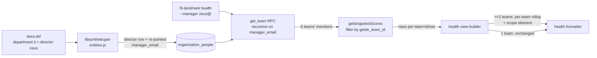

# Design 1330: Landmark director-tier rollup

Closes the gap in [spec.md](spec.md): a director-tier identity must answer
"is IT engineering, as a whole, improving?" in one `fit-landmark` command
against the seeded BioNova substrate, with a per-team breakdown that names no
individual and ranks no team.

## Leverage choice: substrate-shape for resolution, surface for the breakdown

The spec names two leverages and forbids pre-deciding. This design picks
**substrate-shape** for the resolution path and adds a **per-team breakdown
surface** to the health view. The two are not the spec's either/or — the
substrate change does all the *resolution* work (zero query/CLI code), and the
surface change is forced regardless of leverage because the spec's SC-2/4/5
require per-team rollup rows that the health view does not produce today.

| Decision | Choice | Rejected alternative |
| --- | --- | --- |
| How a director resolves six teams | Add a director identity to `data/synthetic/story.dsl` chained above the six IT team managers via `manager_email`; existing recursive `get_team` resolves the union | **Surface-shape `--department it` flag**: a new resolution axis would coexist with `--manager`, the two paths must agree on aggregation semantics (spec Risk 2), and `gdx_dept_it` carries no scores (scores generate for leaf teams only) — so a department flag still has to roll up leaf teams. More moving parts for no resolution benefit. |
| Where the director identity lives | A `director` declaration in the `department it` block, generated as a real `organization_people` row with `is_manager: true`, `manager_email: null`, and the six IT managers re-pointed to it | **Roster-adjacent fixture** outside `organization_people`: `get_team` only walks `organization_people`, so a fixture would not resolve. Must be a real row. |
| How the rollup names teams | Per-team rows keyed by `getdx_team_id` (stable slug, e.g. `gdx_team_platform_engineering`) and `team_name`, never a person | **Manager-name rows**: violates SC-2(c). The score table already carries `getdx_team_id` + `team_name`, so no new identifier is invented. |
| When the breakdown appears | Only when the resolved score set spans ≥2 `getdx_team_id`s; single-team scope renders exactly as today | **Always render a breakdown**: a one-team breakdown is noise and would change the team-manager output, breaking SC-5's projection equality. |

## Components and data flow

| Component | File(s) | Change |
| --- | --- | --- |
| DSL grammar | `libsyntheticgen` DSL parser | Accept a `director @handle` (with `name`/`title`) declaration inside a `department` block. |
| Entity generation | `libsyntheticgen/src/engine/entities.js` | Emit one director `organization_people` row per department that declares one (`is_manager: true`, `manager_email: null`, `department` set, no `team_id`/`getdx_team_id`); re-point that department's team managers' `manager_email` to the director's email. |
| Seed substrate | `data/synthetic/story.dsl` | Declare a director (`zeus`, "Director of Engineering", J090 EM) in `department it`. No other department gains one (spec out-of-scope). |
| Health view builder | `products/landmark/src/commands/health.js` | Detect the distinct `getdx_team_id` set across the resolved members. With **1 team**: build `view.drivers` exactly as today (no shape change). With **≥2 teams**: partition the resolved members and their scores by `getdx_team_id`, build `view.teamRollup` — one entry per team `{ teamId, teamName, drivers[] }` where `drivers[]` is the existing per-team driver-join (same scores, same evidence-by-member filtering) restricted to that team — and a `view.scope` field `{ teamCount, tierLabel }`. The flat `view.drivers` array is omitted under rollup so no driver row double-counts. |
| Health formatter | `products/landmark/src/formatters/health.js` | When `view.scope` is present: emit an "Across N teams (<tier>)" scope line, then one symmetric per-team block (each block is the existing driver table for that team), in DSL-declaration order. When absent: render exactly as today. |
| CLI help | `products/landmark/bin/fit-landmark.js` | Add a `health` example invocation naming the director-tier `--manager` usage that resolves to the six IT teams. |

## Key decisions

| Decision | Rationale |
| --- | --- |
| Director level/discipline = J090, engineering_management | Spec Risk 5: a J100-EM-style director must carry a discipline the starter pathway exposes. `engineering_management` is in the seeded `disciplines` block; J090 is the top declared level (no J100 in the distribution). The seeded identity may differ from the `zeus@bionova.example` testing convention (spec Scope row 2). |
| Director is `is_manager: true`, no `team_id`, no `getdx_team_id` | It manages across teams, not within one. It produces no leaf-team scores, so it never appears as a rollup row — only as the resolution root and the named tier identity (SC-4). |
| `people { count }` stays authoritative; director rows are additive | Spec Risk 1: the count declaration governs generated *fill* people. The director is an explicit named identity like team managers (which are also additive to fill), so headcount/`org show` totals shift by exactly the declared director count. Generation records the delta; no fill-count math changes. |
| Single-team projection equality enforced by construction | SC-5: the per-team rollup rows are the *same* score rows the single-team path consumes (same `getSnapshotScores` output, same driver join), partitioned by `getdx_team_id`. Restricting the rollup to one team yields the identical driver rows the `--manager <team-mgr>` path yields, on every team-manager column; scope columns are rollup-only. |
| No ranking surface | SC-6: the per-team section lists every in-scope team symmetrically in DSL-declaration order with its own scores; no sort-by-score, no delta-vs-mean, no top-N. |
| Each per-team rollup block is built from that team's own members | SC-5 requires a single team's rollup rows to equal what `--manager <team-mgr>` produces, on every column the team-manager rollup produces — including the per-skill evidence counts, which are team-scoped. So the rollup partitions the resolved union by each member's `getdx_team_id` (a column on `organization_people`, migration `20250504000001`) and builds each team's driver rows from that team's member emails and score subset. This makes per-team equality hold by construction, not by post-hoc filtering. |
| Team size ≥ 2 holds in the seed | SC-2(d): the six IT teams are sizes 8–15 in `story.dsl`; no single-person team appears in the rollup. No new constraint code needed. |

## What this does not change

- `get_team` SQL, `org.js`, `snapshots.js` query logic, and the `--manager`
  flag definition: untouched. Resolution rides the existing recursion.
- Non-IT departments, CTO-tier rollup, scoring math, JTBD language: out of
  scope per spec.
- Snapshot/score generation: leaf-team scores are unchanged; the director adds
  no scores.

## Risks

- **Seed regeneration is not automatic.** The director row only exists after the
  synthetic generator re-runs and downstream artefacts (`data/synthetic/`
  rendered output the product reads) regenerate. The plan must regenerate and
  commit them, or the substrate stays at the old `manager_email: null` state.
- **Re-pointing manager_email shifts `org team` output for IT managers.** An IT
  team manager now has a manager, so `org team --manager zeus@` is non-empty and
  `get_team` from a team manager is unchanged (it walks *down*). Verified by
  SC-5 projection equality; the plan adds a test that a team manager's own team
  resolution is byte-identical before/after.

— Staff Engineer 🛠️
