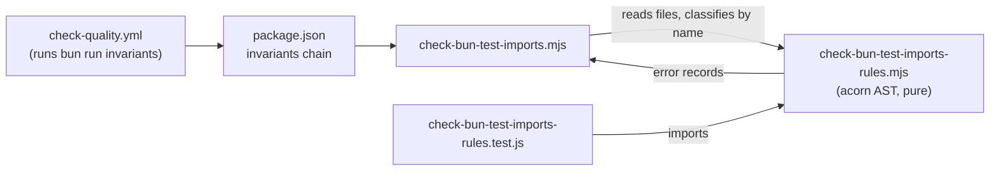

# Design 1410 — `bun:test` Universal-Subset Allowlist Guard

Architecture for the spec 1410 guard: an allowlist check on `bun:test`
imports/re-exports, wired into the invariants aggregator, plus the 0650
in-place amendment and one canonical policy paragraph. Mirrors the existing
`check-libmock` triplet (script + rules module + regression test) named as
informative precedent in the spec.

## Components

| Component | File | Responsibility |
| --- | --- | --- |
| Rules module | `scripts/check-bun-test-imports-rules.mjs` | Pure function: given source text + a "is this a `*.test.js` file" flag, return structured error records. AST-based via `acorn`. No filesystem, no process. |
| Check script | `scripts/check-bun-test-imports.mjs` | Walks the allowlist directory set, classifies each file as test/non-test by filename, calls the rules module, prints structured errors, exits non-zero on any finding. |
| Regression test | `tests/check-bun-test-imports-rules.test.js` | Exercises the nine partition leaves (SC5) against the rules module directly under `bun test`. |
| Aggregator entry | `package.json` `scripts` | New `invariants:check-bun-test-imports` member added to the `invariants` chain. |
| 0650 amendment | `specs/0650-bun-test-runner/spec.md` | One Non-goals bullet replaced + footnote (SC6). |
| Canonical policy | `CONTRIBUTING.md` | One paragraph: allowlist, source/test split, snapshot out-of-scope, link to this spec (SC7). |



## Data flow & interface

The rules module is the single source of detection truth; the script is a thin
file-walker, exactly as `check-libmock.mjs` delegates to
`check-libmock-rules.mjs`.

**Rules module interface:**

```js
// scripts/check-bun-test-imports-rules.mjs
export const ALLOWLIST = new Set([
  "describe", "test", "it", "expect",
  "beforeAll", "beforeEach", "afterEach", "afterAll",
]);

/**
 * @param {string} text  Source text of one file.
 * @param {boolean} isTestFile  True when the path matches **/*.test.js.
 * @returns {Array<{file?, line, kind, name, pointer}>}  Empty when clean.
 */
export function bunTestFindings(text, isTestFile);
```

Each finding is the SC1c structured error: `{ line, kind, name, pointer }`
(`file` is attached by the script). `kind` is `"symbol"` or `"shape"`.
For `kind="symbol"`, `name` is the **imported** binding (not the local alias);
`pointer` is a per-symbol replacement when one exists (e.g. `spyOn` →
`libmock spy()`), else a reference to the allowlist. For `kind="shape"`,
`name` is one of `default | namespace | side-effect | re-export-named |
re-export-namespace | re-export-default-as`; `pointer` is the single
allowlist reference.

**Detection (AST, not regex).** Parse the source as an ES module with `acorn`,
then walk top-level import/export nodes whose source value is `"bun:test"`:

| Node shape | Test file verdict | Non-test source verdict |
| --- | --- | --- |
| `ImportDeclaration`, named specifiers | allow per imported name ∈ ALLOWLIST; else `kind=symbol` finding on the imported name | every specifier → `kind=symbol` finding |
| `ImportDefaultSpecifier` | `kind=shape name=default` | `kind=shape name=default` |
| `ImportNamespaceSpecifier` | `kind=shape name=namespace` | `kind=shape name=namespace` |
| Side-effect import (no specifiers) | `kind=shape name=side-effect` | `kind=shape name=side-effect` |
| `ExportNamedDeclaration` w/ source | `re-export-named` (or `re-export-default-as` when a specifier's local is `default`) | same |
| `ExportAllDeclaration` w/ source | `re-export-namespace` | same |

Renamed imports verdict on the **imported** side (the binding before `as`), so
`import { test as bunTest }` is allowed and `import { spyOn as track }` is
rejected — satisfying the spec's renamed-import rule without special-casing.

**SC5 leaf traceability.** The nine SC5 partition leaves map to detection
branches one-to-one: (i) named allowlisted import and (ii) renamed allowlisted
import → the named-specifier row, imported-name ∈ ALLOWLIST, no finding;
(iii) named banned import and (iv) renamed banned import → same row,
imported-name ∉ ALLOWLIST, `kind=symbol` finding; (v.a) default →
`kind=shape name=default`; (v.b) namespace → `name=namespace`; (v.c)
side-effect → `name=side-effect`; (vi.a) re-export in a `*.test.js` file and
(vi.b) re-export in a non-test source file → the export rows, which fire
regardless of `isTestFile` (re-export is banned in both). The regression test
holds at least one assertion per leaf.

**File classification.** Test-file status is decided by filename suffix
`.test.js`. The bound is by filename, per § Scope clause: `*.spec.js`,
`*.test.ts`, `*.test.mjs` are
non-test source. The walker scopes to the seven-directory allowlist set from
the spec (`libraries`, `services`, `products`, `tests`,
`.github/workflows/test`, `.claude/skills/kata-interview/test`, `websites`),
skipping `node_modules`. The script's own regression test
(`check-bun-test-imports-rules.test.js`) is exempted by name, exactly as
`check-libmock.mjs` exempts its own regression test, because it embeds the very
shapes it detects.

## Key decisions

| Decision | Choice | Rejected alternative |
| --- | --- | --- |
| Detection mechanism | `acorn` AST walk | Regex line-matching (libmock style) — cannot reliably separate imported-name from local-alias or the six export shapes the spec enumerates; SC1c needs structured per-node data. |
| Module split | Pure rules module + thin walker | Single monolithic script — the regression test (SC5) must exercise detection without filesystem; the split is the established precedent's reason for existing. |
| Allowlist as data | One exported `Set` of 8 symbols | Hard-coded inline literals — the regression test and the structured-error `pointer` map both reference it; one home avoids drift. |
| Error shape | Structured records (`{file,line,kind,name,pointer}`) returned, serialized by the script | Throwing/`console.error` strings only — SC1c requires named fields; returning records keeps the rules module pure and testable. |
| 0650 amendment | In-place edit of the one bullet + dateless footnote | New superseding doc / appended note — spec mandates in-place replacement so any reader of 0650 sees current policy (SC6, Risk 2). |
| Canonical policy home | `CONTRIBUTING.md` | A new doc — CONTRIBUTING.md already carries shaped policy paragraphs; SC7c forbids a second contradictory policy doc. |
| Runtime | `node`-runnable `.mjs` (acorn import) | `bun`-only — the other invariants run under `node`; the aggregator uses both, and `acorn` is already a dependency used by `check-ambient-deps.mjs`. |

## Scope faithfulness

- No file migration (spec § Out of scope). The guard passes on the landing
  tree: SC4a holds because no non-test **source** file imports `bun:test`
  (the 37 importers are all `*.test.js`); SC4b holds because no file re-exports
  from `bun:test`; and the 37 test-file importers use only allowlisted symbols,
  so SC4c (guard exits 0) holds. The design adds a guard and a note; it changes
  no test file.
- Clean break: the new guard is the sole enforcement path. No fallback or shim
  — the 0650 bullet is replaced, not wrapped.
- `vi.*` and snapshot serializers stay out of scope (not `bun:test` imports);
  the design does not attempt to guard them, matching the spec.

## Risks (implementer-facing)

- **acorn must parse every walked file.** A syntactically invalid or
  non-module file under the scope set would throw. Mitigation: the walker only
  parses files it reads as modules; a parse failure should surface as a guard
  error naming the file rather than crash silently — the plan must specify the
  try/parse boundary. `check-ambient-deps.mjs` already parses the same trees
  with acorn without incident, bounding this risk.
- **`websites/` and the two discovery roots may be large.** The walker must
  skip `node_modules`/`dist`/`generated` (precedent `SKIP_DIRS`) to stay fast.

## References

- `scripts/check-libmock.mjs`, `scripts/check-libmock-rules.mjs`,
  `tests/check-libmock-rules.test.js` — triplet precedent.
- `scripts/check-ambient-deps.mjs` — acorn-based module walking precedent.
- `package.json` `scripts.invariants` — aggregator chain.

## Implementation note

The precedent moved before the guard landed: the repository migrated every
`scripts/check-*.mjs` invariant (including `check-libmock`) into the discovered
`.coaligned/invariants/*.rules.mjs` host that `bunx coaligned invariants` runs,
and retired the per-script `package.json` chain. The guard landed in that
convention, which preserves the design's module split intact — a pure detection
core plus a thin discovered host:

| Designed component | Landed as |
| --- | --- |
| Rules module + check script | `.coaligned/invariants/bun-test-imports.rules.mjs` — exports `bunTestFindings` (the pure verdict, unchanged) and the `{ name, build, rules }` host shape; reuses shared `lib/ast.mjs` (acorn) and `lib/walk.mjs`. |
| Regression test | `tests/bun-test-imports.test.js` — same nine-leaf partition; repo-root so acorn resolves. |
| Aggregator entry | Membership in `.coaligned/invariants/` (no `package.json` entry). |

The acorn-AST detection, the eight-symbol allowlist, the structured
`{line,kind,name,pointer}` records, and the source/test split are unchanged from
the tables above.

**Canonical policy home.** CONTRIBUTING.md is at its L2 word budget
(`instructions.word-budget`, 1407/1408) on `main`, so a new invariant bullet
cannot land there without trimming unrelated governance prose. The spec
anticipated this — SC7b permits the canonical reference to be "the canonical
doc **or to this spec § Scope**," and the References note makes CONTRIBUTING the
home only "unless design surfaces a stronger candidate." The word budget is that
signal: this spec's § Scope is the canonical human-facing policy. The 0650
amendment (SC6) already defers to `spec 1410 § Scope` (SC7b), and the allowed
mention set (SC7c) is `{spec 1410, spec 0650}` — no CONTRIBUTING bullet, no
contradiction.

— Staff Engineer 🛠️
