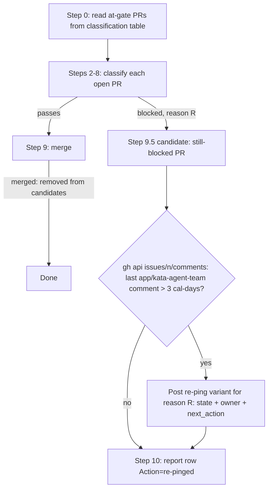

# Design 1440 — Re-ping cadence for blocked PRs in `kata-release-merge`

Architecture for [spec.md](spec.md): give `kata-release-merge` a named rule
that re-comments on stale at-gate PRs, a per-gate re-ping template variant, and
a Classification Report action category that names re-pings distinctly.

## Problem restated

The skill posts one block comment when a gate first fails, then never
re-comments. Awaited owners lose the thread; approvals stall (spec § Problem).
The fix is additive prose + templates inside the existing skill — no gate logic
changes (spec § Excluded).

## Components

All changes live under `.claude/skills/kata-release-merge/`. No code, no new
files — the skill is markdown read by an agent.

| Component | File | Change |
| --- | --- | --- |
| Re-ping rule | `SKILL.md` (new Step between Step 9 merge and Step 10 report) | Named **Re-ping Rule** — parameters and candidate set defined in § The re-ping rule below |
| Re-ping templates | `references/templates.md` (new § Re-ping Comments) | One variant per gate; each body has `state` / `owner` / `next_action` sections |
| Report action category | `references/templates.md` § Report Summary + `SKILL.md` Step 10 | `re-pinged` Action value distinct from `blocked`, one row per re-pinged PR |
| Owner taxonomy | `SKILL.md` re-ping step (table) | Six-gate → owner-role map from spec § Per-gate owner taxonomy |

## Key Decisions

| # | Decision | Why | Rejected alternative |
| --- | --- | --- | --- |
| D1 | **Fresh-query path** for the staleness timestamp: the rule reads the most-recent `app/kata-agent-team` comment time via `gh api …/issues/<n>/comments` each run; the per-week classification table gains **no** maintained timestamp column | Spec § Observed drift records the table "is not maintained after the snapshot"; a maintained column is new per-run state that drifts silently (the coach's flagged risk). The comment thread is already authoritative and queried in Step 7's comment gate | Table path (spec design-input option 1): adds a column written every run for every at-gate PR. Rejected — re-introduces the drift the spec names and the silent-loss risk the coach flagged |
| D2 | Re-ping is a **new Step 9.5**, after merge (Step 9) and before the report (Step 10) | Placing it after Step 9 makes the candidate set the run's settled list: PRs that passed all gates merged and are gone, leaving only the truly-blocked PRs. A pre-merge pass would have to re-exclude PRs about to pass | A Step 0 pre-pass: classifies before gates resolve, so it would consider PRs that then pass and merge the same run — wasted comment, contradicts § Excluded comment-storm intent |
| D3 | Window keyed off the **bot's** most-recent comment, not the PR's `updatedAt` | `updatedAt` moves on any push/label/review; keying off the bot comment measures actual silence on the thread, matching spec § In scope ("timestamp of the most recent PR comment authored by `app/kata-agent-team`") | `updatedAt`: a rebase-push would reset the window and suppress a due re-ping |
| D4 | Re-ping **reuses the existing per-gate block reason** already computed in Steps 2–8; it does not re-run the gates | The PR is a known at-gate PR (spec § At-gate PR); its block reason is in hand from the current run's classification. The re-ping only re-formats it | Re-deriving the reason inside the re-ping step: duplicates gate logic, risks divergence from the run's own verdict |
| D5 | Re-ping templates are **separate variants**, not the existing Skip Comments with extra fields | Spec success criterion 2 checks for `state`/`owner`/`next_action` section headers per gate; a distinct § keeps the first-block comment (terse) and the re-ping (structured, owner-named) independently testable | Extending the five Skip Comments in place: muddies first-block vs re-ping; the criterion's "one re-ping variant per gate" read becomes ambiguous |

## Data flow

## The re-ping rule (Step 9.5 shape)

Named **Re-ping Rule**. Three parameters, matching spec success criterion 1:

- **Window**: 3 calendar days of silence.
- **Trigger scope**: every release-merge run — scheduled sweep and on-demand
  single-PR run alike.
- **Reset**: each re-ping resets the window from its own timestamp; the fresh
  comment becomes the new most-recent bot comment, so the next re-ping on the
  same PR is no sooner than 3 calendar days later. This makes the rule
  self-limiting to once-per-window without separate bookkeeping (spec
  § Excluded comment-storm).

Candidate set: open PRs marked **blocked** this run (after Step 9 merges
removed any that passed). For each, query the most-recent `app/kata-agent-team`
comment timestamp; if older than 3 calendar days, post the re-ping variant for
that PR's already-computed block reason.

**First-block vs re-ping (no collision).** The candidate test is purely the
silence window, so the rule needs no separate at-gate-from-prior-run check:

- A PR **first blocked this run** already received its terse first-block Skip
  Comment in Steps 2–8 of this same run. That comment is now the most-recent
  `app/kata-agent-team` comment, dated to this run, so the window is **not**
  expired and the re-ping does not fire. First block and re-ping never collide
  on the same run.
- A PR with **no prior bot comment at all** (e.g. opened and blocked for the
  first time) is covered by the same fact — Steps 2–8 just posted its first
  block comment — so the window is fresh. If, by exception, a blocked PR has
  zero bot comments when Step 9.5 runs, the absent timestamp is treated as
  **due**: the re-ping fires, guaranteeing every blocked PR carries at least
  one owner-named comment. The 3-cal-day window then governs all subsequent
  runs.

## Owner taxonomy

The re-ping `owner` section names the role that unblocks the PR, carried
verbatim from spec § Per-gate owner taxonomy. Role → concrete login resolution
reuses existing skill mechanisms (Step 2 top-7 lookup, comment-gate.md
unresolved-author read) — no new resolution logic (spec § In scope).

| Gate (attribute) | Block reason | `owner` role |
| --- | --- | --- |
| trust | Untrusted Author | A trusted human (top-7 contributor) who can review |
| type | Unsupported PR Type | A trusted human who can re-title or close the PR |
| CI | CI Failing | The PR author (agent or human) |
| mechanical readiness | Substantive Conflict | The PR author |
| approval | Awaiting Approval Signal | A trusted human who can apply the approval signal |
| open comments | Awaiting trusted-contributor reply | The named trusted-contributor whose comment remains open |

## Re-ping template shape

`references/templates.md` gains § Re-ping Comments: one variant per gate. Each
variant body carries three named sections so the rule populates them uniformly
and the success criterion can spot-check them:

- **`state`** — the current gate state (e.g. CI still red on checks X, STATUS
  row still at `draft`).
- **`owner`** — the role from the taxonomy above, resolved to a login where the
  existing mechanisms supply one.
- **`next_action`** — the single action that would unblock the PR.

Each variant references the Re-ping Rule by name so a reader connects template
to trigger (success criterion 2).

## Classification Report

Step 10 and § Report Summary gain a `re-pinged` Action value, distinct from
`blocked`. A PR that was blocked and re-pinged this run reports `re-pinged`;
a PR blocked but inside its silence window reports `blocked` as today. One row
per re-pinged PR (success criterion 3). The 3+-consecutive-run escalation flag
is unchanged.

## Scope guard

In: the rule, the templates, the report category, the owner taxonomy. Out
(spec § Excluded): gate logic, every-run storms, out-of-band notifications,
table-column timestamp (D1 takes fresh-query), cadence tuning, backfill, and
release-engineer free-form summary content. Clean break: the re-ping rule is
new prose; nothing is wrapped in a compatibility shim.

— Staff Engineer 🛠️
