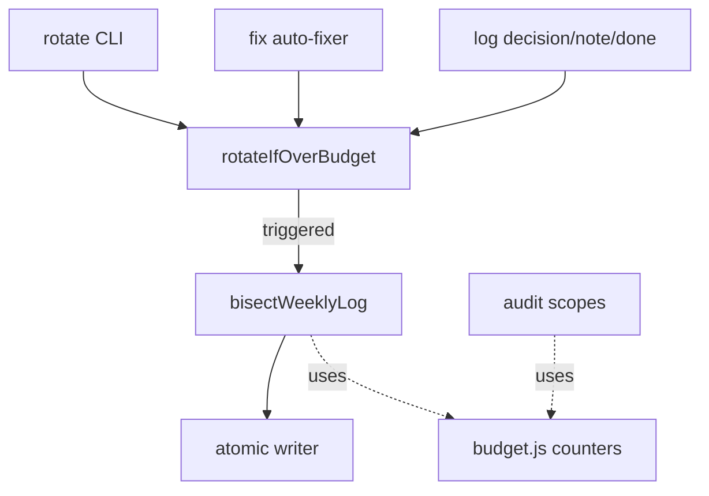
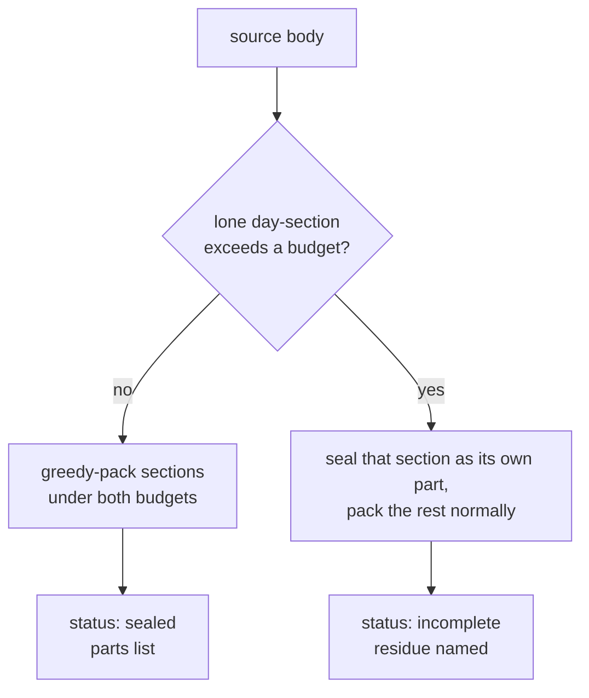

# Design 1450 — Bisecting seal for the libwiki rotation primitive

Spec: [spec.md](spec.md). The rotation primitive's seal stops being a plain
rename and becomes a **bisecting seal**: it splits an over-budget weekly-log
source at its `## YYYY-MM-DD` day-section seams into one-or-more sealed parts,
each at-or-under both the line- and word-budget. Refuse-and-error survives only
as the irreducible-residue floor (a lone day-section that alone exceeds a
budget). The under-budget short-circuit and the rotation trigger are unchanged.

## Components

All changes live in `libraries/libwiki`. No new library; no service touched.

| Component | Location | What changes |
|---|---|---|
| Rotation primitive | `src/weekly-log.js` `rotateIfOverBudget` | Once rotation triggers, calls the bisecting seal instead of one `renameSync`. Returns a tagged result (below). The non-`force` line-budget short-circuit is untouched. |
| Bisecting seal | `src/weekly-log.js` (new `bisectWeeklyLog`) | Pure split: H1 + preamble + day-sections → an ordered list of `{ h1, body }` parts, each conforming to both budgets, plus an optional residue descriptor for a lone over-cap section. No I/O. |
| Atomic writer | `src/weekly-log.js` (new helper) | Writes the part files, then replaces the source as the final step (see Atomicity decision). |
| Shared budget counters | new `src/budget.js` | The audit's `countWords` and `countLines` move here as the one canonical pair, imported by both the seal and the audit. Today the primitive has **no** word counter at all and carries its own char-based `countLines` separate from the audit's split-based one (the two line counts already agree; the word count is the real gap). |
| `fit-wiki rotate` handler | `src/commands/rotate.js` | Prints every produced part. Exits non-zero only on bisect-incomplete, naming the un-splittable section. Clean multi-part seal exits zero. |
| `fit-wiki fix` auto-fixer | `src/commands/fix.js` `rotateOverBudgetMainLogs` | Same call site; consumes the tagged result. An over-cap multi-day current log now resolves clean — only a genuine residue still flows to the human-flag set. |
| Append paths | `src/commands/log.js` (`decision`/`note`/`done`) | Begin consuming the result (today they discard it). On any seal outcome the append proceeds against the fresh current file; an `incomplete` residue is reported to stderr (the residue is a sealed part, never the live file) without blocking the append. |
| Sealed-part hint text | `src/audit/rules.js` | `weekly-log-part.{line,word}-budget` hints reworded: a sealed part over budget now means a hand-edited part or an irreducible single-day section — the cases a human should still act on. The rules stay `remediation: "flag"`. |

## Bisecting seal

The source is one H1 (`# <agent> — YYYY-Www`), optional preamble above the
first day-section, then `## YYYY-MM-DD` day-sections (the seam adopts
`log.js`'s `lastDateHeading` regex `/^## (\d{4}-\d{2}-\d{2})/gm` — date at
line-start, trailing text tolerated, e.g. `## 2026-05-19 (third activation)`).
Bisect packs sections greedily into parts under both budgets. The H1 + preamble
travel with the first part.
Each part is rendered with a conforming part H1 `# <agent> — YYYY-Www (part N of
M)`; the H1's fixed line/word cost is charged against the budget during packing.

**Content-preserving.** The parts' bodies below their part H1s, in order, equal
the original body below its H1 — no section dropped, duplicated, or split across
two parts.

## Result shape — tagged union

A clean break from `{ rotated, fromPath, toPath }`. Three outcomes, no two
sharing a caller-visible shape:

| `status` | Fields | Meaning |
|---|---|---|
| `"noop"` | `fromPath` | No rotation needed (under-budget short-circuit). |
| `"sealed"` | `parts: string[]`, `fromPath` | Source sealed into one-or-more conforming parts. |
| `"incomplete"` | `parts: string[]`, `residue: { path, section, lines, words }`, `fromPath` | Bisected as far as day seams allow; a lone over-cap section is named. |

Callers branch on `status`. `parts` is always the full ordered list of files
produced (one or many), replacing the single `toPath`.

## Key Decisions

| Decision | Choice | Rejected alternative |
|---|---|---|
| Seal behaviour | Bisect at day seams into conforming parts | Plain rename (today) — seals born-over-budget parts. Pure refuse-and-error (spec's earlier (b)) — leaves CI red until a human bisects. |
| Counting source of truth | One shared `countLines`/`countWords`, imported by both primitive and audit | Give the primitive its own word counter — a second implementation can drift from the audit's, so the seal could call a part conforming that the audit then flags. |
| Result shape | Tagged `status` union | Extend `{ rotated, toPath }` with a `parts` array — `sealed` and `incomplete` would share a shape, breaking the spec's "tell the three apart". |
| Part numbering | `N of M` local to the parts this seal produces; existing `*-partN.md` files keep their slots and H1s | Renumber every existing week part into a global `N of M` — not atomic, rewrites already-sealed history. |
| Atomicity | Stage all M parts at their slots, then replace the source as the single commit point; on any failure unlink the staged parts so the source (path/contents/inode) is untouched | Truncate/rename the source first (today's order) — a mid-write failure loses the source body. |
| Bin packing | Greedy left-to-right | Optimal/balanced packing — extra complexity for no gain; greedy already meets the per-part cap. |

## Caller data flow

- **`fit-wiki rotate`** (force): `sealed` → print each part, exit 0;
  `incomplete` → print parts + name the residue section + point at manual
  recovery, exit non-zero; `noop` → "no rotation needed", exit 0.
- **`fit-wiki fix`** (force, via `rotateOverBudgetMainLogs`): on `sealed` the
  re-audit is clean and the run exits 0; on `incomplete` the residue part's
  budget finding survives to the human-flag set (exit 2) — only the irreducible
  case still needs a human; `noop` leaves the file untouched.
- **Append paths** (non-force, line-budget trigger): rotate, then append the new
  dated entry to the fresh current file regardless of outcome; an `incomplete`
  residue signal is surfaced but does not block the append.

## Scope-faithful notes

- The under-budget short-circuit, the rotation trigger, and the cap values are
  untouched (spec § Out of scope).
- Finer-than-day splitting stays a future `bisectStrategy`; this design flags an
  irreducible single-day section rather than splitting within it.
- The CI `wiki` job stays read-only — the fix runs in `fit-wiki fix`, and the
  next audit passes.
- The central behavioural shift: where an over-cap multi-day current log today
  seals into a relabelled over-cap part (flagged for a human), it now seals into
  conforming parts and the re-audit is clean.

— Staff Engineer 🛠️
