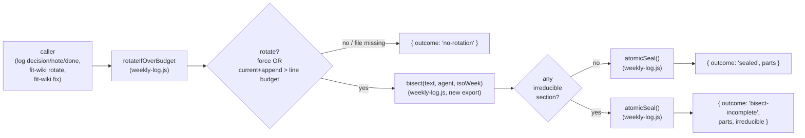

# Design 1450a — libwiki rotate bisects an over-cap source

Spec: [`spec.md`](./spec.md). Lifecycle: WHICH/WHERE; the plan picks
HOW/WHEN.

## Architecture overview

Today `rotateIfOverBudget` is a single fall-through with a `renameSync`. The
design pulls the seal step out of the rotation gate, so the gate keeps its
"should we rotate?" judgement and the seal becomes a content-shaping step
that always emits budget-conforming parts (or a structured residue signal).
The seal step replaces a plain rename, never wraps it.



`force: true` sets the gate to `yes` unconditionally except when the source
file is missing (no source = `no-rotation` under force or non-force);
otherwise the append paths drive the gate via `current+append > line
budget`.

| Component | Role | Where |
|---|---|---|
| `rotateIfOverBudget` | Gate + delegation to bisect/atomicSeal; returns the discriminated outcome | `libraries/libwiki/src/weekly-log.js` |
| `bisect(text, agent, isoWeek)` | Pure transformation; `isoWeek` is a `YYYY-Www` string (the form `isoWeekString` already returns); exported so the unit suite drives it directly | `libraries/libwiki/src/weekly-log.js` |
| `atomicSeal` (internal) | Stages all bodies as tmps, commits via a fixed rename sequence, recovers a mid-commit failure by unlinking already-renamed parts; throws on any fs failure leaving source byte-identical | `libraries/libwiki/src/weekly-log.js` |
| `nextPartIndex` (replaces `nextPartPath`) | Returns first free `partN` integer over committed `*-partN.md` siblings; seal constructs the M paths from `N..N+M-1` | `libraries/libwiki/src/weekly-log.js` |
| Shared budget surface (`countLines`, `countWords`, `WEEKLY_LOG_LINE_BUDGET`, `WEEKLY_LOG_WORD_BUDGET`) | Single source of truth for bisect (producer) and audit (verifier); `countLines` is `split + endswith`, `countWords` is the char-walk — both lifted from `audit/scopes.js`; constants stay in `constants.js`, the new module re-exports them so the audit and weekly-log import one surface | new `libraries/libwiki/src/util/budget.js` |
| `fit-wiki rotate` handler | Branches on outcome; prints each part path; exits 2 only on `bisect-incomplete`; catches the `atomicSeal` throw, writes a one-line stderr message, returns `{ok:false, code:1}` | `libraries/libwiki/src/commands/rotate.js` |
| `fit-wiki log decision/note/done` handlers | Branch on outcome; on `bisect-incomplete` surface the residue to stderr and still append; catch the `atomicSeal` throw, write a one-line stderr warning, still append against the un-rotated source, return `{ok:true}` (a missed rotation must not lose the user's entry) | `libraries/libwiki/src/commands/log.js` |
| `fit-wiki fix` auto-fixer (`rotateOverBudgetMainLogs`) | Consumes the new outcome (no `res.rotated`); on `'sealed'` logs each `parts[i].path`, on `'bisect-incomplete'` logs sealed parts and the re-audit flows the irreducible part to the human-flag set; catches the `atomicSeal` throw, writes a stderr line, continues with the next finding | `libraries/libwiki/src/commands/fix.js` |
| Sealed-part audit rule hints | Hint text updated to "hand-edited or irreducible single-day section — split by hand"; rule remediation stays `flag` (the seam, not the audit, produced the part) | `libraries/libwiki/src/audit/rules.js` |

Tests follow the same split as today: `weekly-log.test.js` (unit, libmock
fs) covers `bisect` over fixture strings; `weekly-log.integration.test.js`
(real fs) covers `atomicSeal`, outcome discrimination, and the rollback
contract (induce a rename failure with a chmod'd dest path).

## The bisect step

A weekly log is an H1, an optional preamble, and a sequence of `## YYYY-MM-DD`
day-sections. `bisect` is the only place that knows the layout:

1. Tokenise into the prologue (H1 + everything above the first
   `## YYYY-MM-DD`) and an ordered day-section list. The date-heading
   regex shape `commands/log.js`'s `lastDateHeading` already carries; the
   plan picks where the shared form lives.
2. Greedy fill: open part 1 with the prologue body (preamble below the
   original H1); part H1s are stamped in pass 2. Append each next
   day-section; if the candidate part would exceed **either** budget,
   flush and open a new part empty. If a single section
   alone-with-its-part-H1 still exceeds either budget, seal it as its own
   part and mark `irreducible: true` — preserves "no silent over-budget
   part." If the prologue alone exceeds either budget (rare: only when a
   weekly log carries a long preamble), part 1 is sealed as just the
   prologue and marked irreducible — same floor. If the source contains
   no `## YYYY-MM-DD` at all (corrupt log), bisect still emits one part —
   either under-budget (sealed) or irreducible — never zero parts.
3. **Two-pass H1 stamping**: pass 1 emits bodies and counts (M = parts.
   length); pass 2 prepends `# <agent> — YYYY-Www (part N of M)` to each
   part body, where `<agent>` and `YYYY-Www` are inputs to `bisect`. The
   original H1 line is replaced by the part-N-of-M H1; the preamble below
   the original H1 travels with part 1.
4. **Content preservation invariant**: the concatenation of every part's
   body *below its stamped part H1*, in order, equals the original source's
   body *below its original H1*, byte-for-byte. Bisect MUST NOT add, drop,
   reorder, or reshape bytes between day-section boundaries. The test
   against success criterion #2 is a single equality check against this
   invariant.

`bisect` is pure: no filesystem, no path construction. Budgets it enforces
are the shared module's — a sealed part cannot re-flag by construction.

## The atomic seal

The seal owns four invariants:

- **Single commit topology**: stage every part body to `<part-path>.tmp`,
  stage the fresh source H1 to `<source>.tmp`, then rename all part tmps
  into final position, then rename `<source>.tmp` over the source **last**.
  This ordering is architectural — any other order leaves a window where
  the source is replaced before parts exist (data loss). The plan executes
  this exact ordering; deviation is a plan bug.
- **Source intact on any failure**: the source's rename is the last act;
  any failure before it leaves the source's path, contents, and inode
  unchanged. The `staging` failure mode (tmp-write fails: ENOSPC, EACCES,
  …) unlinks every staged tmp; the `commit` failure mode (a `renameSync`
  fails during the part-rename loop, e.g. EIO mid-loop) unlinks every
  part already renamed into final position, then unlinks every remaining
  tmp. Both failure modes throw with the original fs error attached so
  callers can compose a stderr message. Best-effort rollback only — if the
  rollback's own unlinks throw, the original fs error is the cause and the
  residue is surfaced as documented file-system damage; the audit re-flags.
- **Tmp-namespace blindness with bounded sweep**: `.tmp` siblings are
  invisible to the audit (`.endsWith(".md")`), to `nextPartIndex` (matches
  `*-partN.md`), and to wiki sync. Before staging, atomicSeal sweeps only
  `<source-basename>.tmp` and `<source-basename>-part*.md.tmp` siblings
  (constrained to the source's agent prefix), so a concurrent rotate of
  another agent's log is not affected.
- **`atomicSeal` is the seam that attaches `path`**: it consumes bisect's
  body-shaped `parts[]` and emits the path-shaped `parts[]` the caller
  receives. Bisect's unit tests see body-shaped; caller tests see
  path-shaped; the plan picks the seam in code.

Kernel-crash-mid-commit (the OS dies between two renames so rollback never
runs) is the only failure mode no POSIX primitive solves — accepted as
documented residue (committed parts on disk + source intact; the next audit
flags the source's budget breach and a curator re-runs `fit-wiki rotate`).

## Result shape

The primitive returns one of three discriminated outcomes; fs failures
throw. The prior `{ rotated, fromPath, toPath }` shape collapses through a
boolean and a single `toPath`; the spec asks for three distinct outcomes.

```js
// no-rotation
{ outcome: "no-rotation", fromPath }
// sealed — 1..M parts, every parts[i].irreducible === false
{ outcome: "sealed", fromPath,
  parts: [{ path, lines, words, irreducible: false }, ...] }
// bisect-incomplete — 1..M parts, ≥1 parts[i].irreducible === true
{ outcome: "bisect-incomplete", fromPath,
  parts: [{ path, lines, words, irreducible: boolean }, ...],
  irreducible: [{ section, lines, words, path }, ...] }
```

`parts[i].irreducible` is the **canonical** flag; top-level `irreducible[]`
is the projection. `section` carries the day-section's `YYYY-MM-DD`, or the
sentinel `"prologue"` for the prologue-overflow case (decision 11).

## Caller surfaces

The CLI table covers the three outcomes; the rightmost column covers the
fs-failure throw each caller catches.

| Surface | `no-rotation` | `sealed` | `bisect-incomplete` | `atomicSeal` throws |
|---|---|---|---|---|
| `fit-wiki rotate` stdout | `no rotation needed for <agent>` | one `sealed <part-path> (lines/words)` per `parts[i]` | per-part lines, prefixed `irreducible` on `parts[i].irreducible === true` | — |
| `fit-wiki rotate` stderr | — | — | one `irreducible: <part-path> carries '## YYYY-MM-DD' (lines/words); split it by hand and re-run` per `irreducible[]` entry | `rotate failed: <fs-error message>; source unchanged` |
| `fit-wiki rotate` exit | 0 | 0 | 2 | 1 |
| `fit-wiki log …` stdout | unchanged | unchanged | unchanged — append proceeds against the fresh current | unchanged — append proceeds against the un-rotated source |
| `fit-wiki log …` stderr | — | — | the same residue lines as `rotate` | `rotate failed: <fs-error message>; logged anyway against the over-budget source` |
| `fit-wiki log …` exit | 0 | 0 | 0 — residue is a signal, not a failure of the log command | 0 — recording the entry is the log command's job |
| `fit-wiki fix` (pre-pass) | skip | log `parts[i].path` lines; re-audit goes clean | log `parts[i].path` lines; re-audit flags the irreducible part to the human-flag set | stderr line `rotate failed: <fs-error message>`; continue to the next finding |

Decision 5 still holds: the three outcomes are the spec's contract; the
throw is an orthogonal failure axis, not a 4th outcome.

## Compatibility & out-of-scope

All spec § Out of scope items honoured: no finer-than-day-section seam, no
retroactive re-bisection, no CI mutation, no budget changes, no rotation
trigger change. No back-compat shim — the result shape is a clean break;
the three in-tree callers update in the same change.

## Key decisions

| # | Decision | Rejected alternative |
|---|---|---|
| 1 | `bisect` pure + exported; `atomicSeal` internal; both in `weekly-log.js` | Separate `bisect.js` — premature for one caller |
| 2 | Greedy fill at day-section seams; **both** budgets constrain every flush | Line-only flush — word-overflow part re-flags |
| 3 | Single fixed commit topology; mid-commit rename failure rollback unlinks already-committed parts before re-throwing | Crash leaves born-over-cap part the audit cannot disambiguate from a hand-edited part; or no rollback, source intact but partial parts remain (spec criterion #10 fails) |
| 4 | Two-pass H1 stamping (count parts then stamp `N of M`) | One-pass; M unknown when part 1's H1 is written |
| 5 | Three-outcome union; fs failures throw and each caller catches | Add a 4th `staging-failed` outcome — exceeds spec's three-outcome contract |
| 6 | `parts[i].irreducible` canonical; top-level `irreducible[]` is the projection | Top-level canonical — caller iterates parts anyway; two sources drift |
| 7 | Share counters via `util/budget.js`; lift audit's `split+endswith` countLines + char-walk countWords; constants stay in `constants.js`, re-exported via the new module | Duplicate counters — bisect's budget drifts from audit's; sealed part re-flags |
| 8 | Replace `nextPartPath` with `nextPartIndex` (returns integer N); seal builds `N..N+M-1` paths | Call `nextPartPath` M times — returns same slot (no intermediate writes) |
| 9 | `fit-wiki rotate` exits 2 only on `bisect-incomplete`, 1 on caught throw | Exit 2 on any seal — defeats the auto-fixer's "resolve common case end-to-end" criterion |
| 10 | `log {decision,note,done}` always exits 0 (residue stderr-only; throw logs entry against un-rotated source) | Log inherits rotate's exit code — per-day note becomes CI-failing |
| 11 | Prologue overflow (rare) seals as irreducible part 1; `irreducible[].section = "prologue"` sentinel | Refuse with error — preserves nothing the floor doesn't already preserve |
| 12 | Kernel-crash-mid-commit out of scope (only failure POSIX cannot recover); documented residue (parts on disk + source intact); audit re-flags | Manifest-file pattern — POSIX-overhead for a failure mode rollback already covers for fs errors |
| 13 | Bounded pre-stage tmp-sweep over `<source-basename>.tmp` and `<source-basename>-part*.md.tmp` only | Unbounded sweep — corrupts concurrent rotates of sibling agents' logs |
| 14 | Sealed-part audit rules keep `remediation: "flag"`; only hint text changes | Add a re-bisect remediation — out of scope (already-sealed parts) |

— Staff Engineer 🛠️
