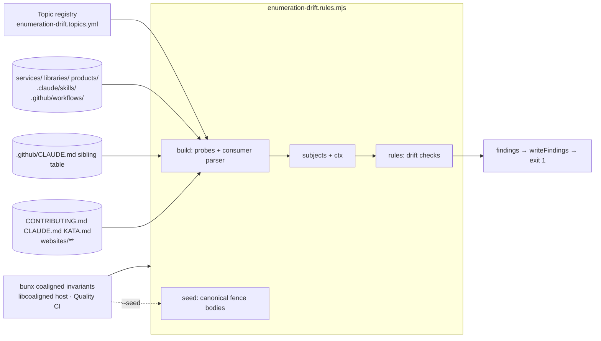

# Design 1460-a — Build-time enumeration-drift assertion

Spec: [`spec.md`](spec.md) — assert that every registered consumer's
enumeration block matches its source-of-truth set, failing the build
with an actionable message on drift.

Substrate: repo invariants are declarative `*.rules.mjs` modules under
`.coaligned/invariants/`, discovered and run by `bunx coaligned
invariants` (`bun run invariants`, the `invariants` job of Quality CI
on every PR). This design adds one rule module plus one adjacent
registry data file to that host — no new build step, no new wiring.

## Components



| Component | Responsibility | Placement |
|---|---|---|
| **Topic registry** | One declarative data file: every topic carries a `source` (glob or selector + optional `exclude`) and a `consumers[]` list with per-consumer `property` ∈ {`count`, `list`, `both`}. The single named registry path the spec's single-source criterion verifies; a 7th topic is a one-file edit. The plan picks the exact YAML schema | New `.coaligned/invariants/enumeration-drift.topics.yml`, adjacent to its module exactly as `ambient-deps.allow.yml` sits beside `ambient-deps.rules.mjs` |
| **Rule module** | Default export `{ name: "enumeration-drift", build, rules, seed }` per the libcoaligned host contract. The host auto-discovers `*.rules.mjs` — landing the file is the wiring | New `.coaligned/invariants/enumeration-drift.rules.mjs` |
| **Source probes** | Pure functions inside `build()`, one per source *kind*, not per topic: `fs-glob` (registry-declared glob + `exclude` → sorted basename set, over the shared `lib/walk.mjs` `collectFiles`) serves five topics; `md-table` (registry-declared file + column selector → sorted cell set) serves the sibling-composite-actions topic. Probes own normalisation; topic identity lives only in registry data, so a 7th topic reusing an existing kind is a registry-only edit — only a genuinely new source kind adds probe code | Inside the rule module |
| **Consumer parser** | Inside `build()`: reads each registry-listed consumer path — and only those; fences in unregistered files are out of scope, consistent with the accepted residual risk below — locates fenced enumeration blocks under the marker convention, returns the observed value per block; ignores fences inside fenced-code regions so docs documenting the convention do not self-trigger | Inside the rule module |
| **Subjects + ctx** | `build()` returns one subject per registry assertion (consumer path × declared property, carrying expected set and observed value or fence-absence) plus one subject per discovered fence (for unknown-topic detection); registry parse/IO errors become a registry-path subject rather than a throw, mirroring `ambient-deps`'s parse-error pattern, so authors never see a raw stack | `build()` return value |
| **Drift rules** | Declarative `rules[]` entries the shared `runRules` engine applies over the subjects; each emits a finding `{ id, level, path, message, hint }` that the host prints via `writeFindings` and converts to exit 1 | `rules[]` in the module |
| **Seed output** | `seed()` prints the canonical fence body per topic from current probe output; `bunx coaligned invariants --seed enumeration-drift` seeds the hand-authored fence bodies at landing, the same affordance `ambient-deps` uses for its deny-list | `seed()` in the module |
| **Metric writeback convention** | Spec § Outcome metric requires the `kata-documentation` writeback to tag post-merge findings `enumeration-drift:<topic-id>:` in its metrics-row notes; the implementation PR updates that convention where the skill defines its metrics rows so the post-landing series can populate | `kata-documentation` skill's metrics reference (`.claude/skills/kata-documentation/`) |

The plan owns the YAML schema, fence-body grammar (including
word-form counts such as "Sixteen"), sort definition for list
blocks, empty-list/sub-bullet rules, and any decomposition into the
existing `.coaligned/invariants/lib/` helpers. Those are HOW
questions.

## Per-consumer property commitments

The spec assigns naming each consumer's committed property to the
design. Commitments reflect each consumer's restatement shape at
this design's `main` HEAD:

| Topic | Consumer | Property |
|---|---|---|
| `services-tree` | `websites/fit/docs/getting-started/contributors/index.md` (inline name list) | `list` |
| `services-tree` | `websites/fit/gear/index.md` ("… and N services") | `count` |
| `libraries-list` | `websites/fit/gear/index.md` ("N libraries …") | `count` |
| `sibling-composite-actions` | `CLAUDE.md` § Distribution Model (brace-expansion list) | `list` |
| `sibling-composite-actions` | `KATA.md` § Architecture ("Five external composite actions" + named list) | `both` |
| `published-skills` | `KATA.md` § Skills (kata-skill table) | `list` |
| `published-skills` | `websites/kata/index.md` (hero count + stat) | `count` |
| `products-tree` | `CONTRIBUTING.md` § Monorepo layout (products block) | `list` |
| `kata-workflows` | `websites/fit/docs/internals/kata/index.md` (workflow count) | `count` |
| `kata-workflows` | `KATA.md` § Workflows (workflow table) | `list` |

Two reconciliations against the spec's 2026-06-02 consumer snapshot,
both grounded in HEAD:

- **Collapsed restatements are omitted, not re-created.**
  `CONTRIBUTING.md`'s services/libraries entries are now
  non-enumerating placeholders (`<name>/`, `lib*/`), and `KATA.md`
  and `websites/fit/docs/products/index.md` no longer restate
  services or products. Re-adding those enumerations just to fence
  them would rebuild the drift surface the collapse removed, so the
  registry omits the pairs; every topic keeps at least one consumer
  outside `websites/fit/docs/`, preserving that spec criterion.
- **Prose that conflicts with the source definition is reconciled at
  landing.** Both `kata-workflows` consumers currently count five
  workflows including `kata-interview`; the spec's source excludes
  it. The landing PR's consumer edits scope each fenced claim to the
  PDSA set (mentions of `kata-interview` stay outside the fence) —
  within the atomic-landing edits the design already requires.

## Marker convention

Every registered consumer carries a fenced block per asserted
property, `<!-- enum:TOPIC:PROPERTY -->` … `<!-- /enum -->`:

```
<!-- enum:services-tree:list -->
…content the plan defines…
<!-- /enum -->
```

- `TOPIC` is one of the six registry topic ids
  (`services-tree`, `libraries-list`, `sibling-composite-actions`,
  `published-skills`, `products-tree`, `kata-workflows`).
- `PROPERTY` is `count` or `list`.
- Consumers asserting `both` carry two fences, one per property,
  each placed where its claim lives in the prose — they need not be
  adjacent. The registry's per-consumer `property` says which
  fences must exist on each path; a missing required fence is a
  drift just as a wrong value is.
- Fences do not nest. The parser pairs each open fence with the
  next bare `<!-- /enum -->` outside any fenced-code region.

The fence is invisible in rendered HTML, so reader pages keep their
narrative shape. The `enum:` prefix does not collide with `libdoc`'s
`<!-- part:type:path -->` content-partial token — different prefix,
and that token is single-shot rather than a fence pair; the two
parsers ignore each other's markers.

## Landing strategy

The implementation PR is **atomic**: it introduces the registry, the
rule module, **and** every required consumer fence in one diff (the
why lives in the Key decisions row). `--seed enumeration-drift`
output at the landing PR's `HEAD` supplies the seed values for the
hand-authored fence bodies, so the gate is green on its own merge.

Spec criterion "Existing consumers pass at landing" is therefore
falsifiable before merge: `bun run invariants` on the implementation
branch must exit 0 against `main` HEAD, and the plan's `Affected
paths` declaration must include every modified consumer file
alongside the new module and registry files.

## Failure modes and diagnostics

| Failure mode | Rule | Author-visible finding |
|---|---|---|
| Required fence missing on a registered consumer | `enum.fence-missing` | `<consumer-path> :: <topic>:<property> :: required fence not found` |
| Fence with an unknown `TOPIC` id (typo, vestigial) | `enum.unknown-topic` — hard-fail, never silent-ignore | `<consumer-path> :: <topic> :: unknown topic; remove the fence or add the topic to the registry` |
| Malformed fence on a registered consumer (unknown `PROPERTY` token, or an open fence with no closing `<!-- /enum -->`) | `enum.malformed-fence` — hard-fail | `<consumer-path> :: <fence text> :: malformed fence (bad property / unclosed)` |
| `list` drift | `enum.list-drift` | `<consumer-path> :: <topic>:list :: missing=[…] extra=[…]` |
| `count` drift | `enum.count-drift` | `<consumer-path> :: <topic>:count :: actual=<n> expected=<m>` |
| Source-side-only PR (a registered source changed; no consumer file in the PR diff) | same drift rules | Same shape as a consumer-side drift; the finding names the consumer path the author must touch to land the source change, satisfying the spec's "actionable" criterion when the failing path is outside the PR diff |
| Malformed registry, unreadable consumer, probe failure | `enum.registry-invalid` | Finding on the registry (or consumer) path with the reason — `build()` maps internal errors to subjects, so no raw stack reaches the author |
| Registered topic with zero registered consumers | none — vacuous pass | Gate green; spec § Excluded "Adding a 7th topic happens through a content edit to one file" means a new topic can land before its first consumer wires up |
| Unregistered consumer that paraphrases a registered topic | none — not detected | Accepted residual risk per spec § Excluded "Automatic registry updates"; addressed by amending the registry when a future drift surfaces |

The implementation PR description names exactly one build
invocation: `bun run invariants` (→ `bunx coaligned invariants`).
Rule ids are internal handles; the host command is the single named
build step the toolchain already calls.

## Key decisions

| Decision | Choice | Rejected alternative | Why |
|---|---|---|---|
| Gate placement | Rule module under `.coaligned/invariants/`, hosted by `bunx coaligned invariants`, which Quality CI's `invariants` job runs on every PR with no path filter | (a) `fit-doc` pre-build hook via the `justfile` `just build` shim; (b) standalone script + root `package.json` entry | (a) fires only on PRs that rebuild a site, missing source-side-only edits to `services/`, `libraries/`, or `.github/CLAUDE.md`; the invariants job covers those for free. (b) is the pattern PR #1639 deleted — reintroducing a one-off script forks the repo's single invariant idiom and re-creates the aggregate-wiring this substrate removed |
| Registry shape | Adjacent declarative YAML data file; no other file in the diff declares a topic | Topics declared inline in the rule module | Spec landing gate requires a single named registry path and that a 7th-topic PR edits exactly one file; a data file keeps registry edits content edits, makes the single-source criterion mechanically checkable, and follows the `ambient-deps.allow.yml` config-beside-module precedent. The schema admits a per-source `exclude` list so Topic 6's `kata-interview.yml` exclusion is registry-side data, not probe code |
| Marker convention | HTML comment fences `<!-- enum:TOPIC:PROPERTY -->…<!-- /enum -->` applied uniformly across every registered consumer, including the unnamed-section consumers (`websites/fit/gear/index.md`, `websites/kata/index.md`) | Unique section heading per topic per consumer; fenced YAML metadata block | Section headings are fragile to prose rewrites and cannot delimit count-only blocks; fenced YAML blocks render visibly. HTML comments are invisible in rendered output and the spec's "applies it uniformly … including unnamed-section consumers" criterion is met by construction |
| Per-consumer property declaration | Registry entry declares `count`, `list`, or `both`; consumer must carry exactly the declared fence(s) | Auto-detect property from the block | Auto-detection conflates "block missing" with "block wrong shape." Explicit declaration lets findings name the missing property |
| Source-side PR scope | Gate runs on every PR via the invariants job, catching source-side-only PRs before merge | Run only on PRs that touch a registered consumer path | Symmetric coverage costs nothing extra and removes the failure mode where a source-side PR lands clean and the next consumer-touching PR inherits red CI |
| Landing migration | Implementation PR atomically introduces registry, module, and every consumer fence; `--seed` output at `HEAD` seeds the hand-authored fence bodies | Two-step landing (gate first, then consumer fences) or auto-generated fence bodies | Two-step lands the gate red on its own merge. Auto-generation removes the human's chance to phrase the count or list context naturally and would require a `--fix` mode the spec does not ask for; the host's existing `--seed` affordance gives machine-accurate values with human-authored placement |
| Failure-message shape | One finding per drift through the host's `writeFindings` — `{ id, level, path, message, hint }` naming consumer path + topic + property + diff (set sym-diff for `list`, integer delta for `count`); identical shape for source-side drifts and internal errors | Custom formatter or aggregated "see logs" summary | Spec criterion "Failure messages are actionable" requires the author can correct in one edit; per-finding shape gives that for every failure mode, and reusing the host's emitter keeps output uniform with every other invariant |

— Staff Engineer 🛠️
