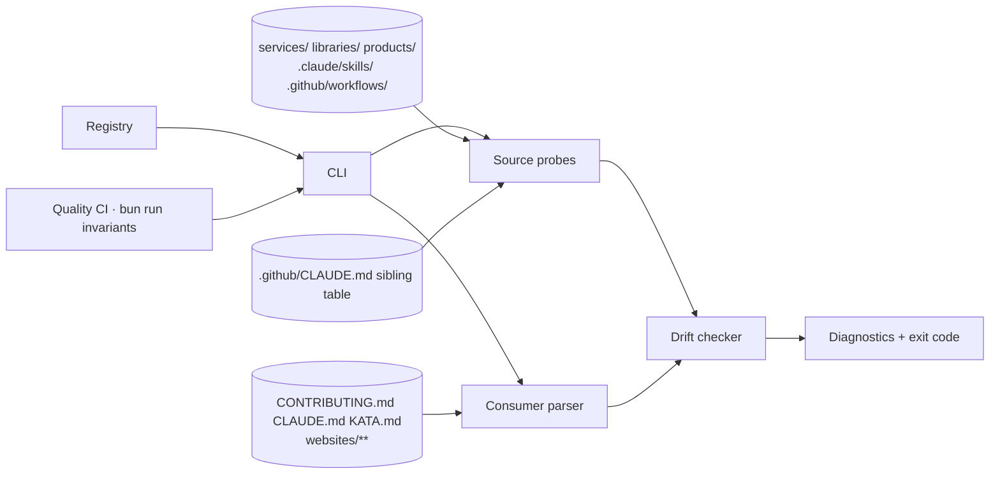

# Design 1460-a — Build-time enumeration-drift assertion

Spec: [`spec.md`](spec.md) — add an enumeration-drift check to the
`bun run invariants` aggregate that asserts every registered
consumer's enumeration block matches its source-of-truth set.

## Components



| Component | Responsibility | Placement |
|---|---|---|
| **Registry** | One declarative file: every topic carries a `source` (glob or selector + optional `exclude`), an ordered `consumers[]` list, and per-consumer `property` ∈ {`count`, `list`, `both`}. Single source of truth for the registry-coverage success criterion | New file under `scripts/`; the plan picks the exact path and YAML schema |
| **Source probes** | Per-topic pure function: registry source → canonical sorted `Set<string>` of identifiers. Probes own normalisation (basenames, table-row filtering); the parser stays dumb. Six probes correspond to the six topics, including the only non-filesystem-glob probe (sibling composite actions parses the `.github/CLAUDE.md` § Third-party actions table). Adding a 7th probe is the plan's path, not this design's | New invariant script |
| **Consumer parser** | Reads a markdown file, locates fenced enumeration blocks under the marker convention, returns observed value per block; ignores fences inside fenced-code regions so docs that document the convention itself do not self-trigger | Same script |
| **Drift checker** | Compares observed vs source per consumer entry; emits `{path, topic, property, observed, expected, diff}` records. `list` → symmetric difference; `count` → integer equality with `|source|` | Same script |
| **CLI entry** | Loads registry, runs probes, walks consumers, prints actionable diagnostics, exits non-zero on any drift. Top-level try/catch maps any internal throw (malformed registry, unreadable consumer, probe failure) to a drift-record on the registry path so authors see the spec's required message shape, never a raw Node stack | New invariant script |
| **Wiring** | New `invariants:check-enumeration-drift` entry chained into the existing `invariants` aggregate in root `package.json`; runs under Node like the existing five Node-based invariants — no Bun-specific dependency needed | Root `package.json` |

The plan owns file decomposition (single script vs `scripts/lib/…`
split), YAML schema, fence-body grammar, sort definition for list
blocks, and empty-list/sub-bullet rules. Those are HOW questions.

## Marker convention

Every registered consumer carries a fenced block per asserted
property:

```
<!-- enum:services-tree:list -->
…content the plan defines…
<!-- /enum -->
```

- `TOPIC` is one of the six registry topic ids
  (`services-tree`, `libraries-list`, `sibling-composite-actions`,
  `published-skills`, `products-tree`, `kata-workflows`).
- `PROPERTY` is `count` or `list`.
- Consumers asserting `both` carry two adjacent fences, one per
  property. The registry's per-consumer `property` says which
  fences must exist on each path; a missing required fence is a
  drift just as a wrong value is.
- Fences do not nest. The parser pairs each open fence with the
  next bare `<!-- /enum -->` outside any fenced-code region.

The fence is invisible in rendered HTML, so reader pages keep
their narrative shape; the machine-asserted block sits inside the
prose the human writes. The `enum:` prefix is namespaced and does
not collide with `libdoc`'s existing `<!-- part:type:path -->`
content-partial token, which is single-shot rather than a
fence-pair — the two parsers ignore each other's markers by
prefix.

## Landing strategy

The implementation PR is **atomic**: it introduces the registry,
the script, the `package.json` wiring, **and** every required
consumer fence in one diff. The probes' outputs at `HEAD` of the
landing PR are the seed values for the hand-authored fence
bodies, so the gate is green on its own merge. There is no
two-step landing where fences arrive in a follow-up PR — `bun run
invariants` would block the implementation PR itself.

Spec criterion "Existing consumers pass at landing" is therefore
falsifiable before merge: running `bun run invariants` on the
implementation branch must exit 0 against `main` HEAD, and the
plan's `Affected paths` declaration must include every modified
consumer file alongside the new registry, script, and
`package.json` entry.

## Failure modes and diagnostics

| Failure mode | Gate behaviour | Author-visible message |
|---|---|---|
| Required fence missing on a registered consumer | drift | `<consumer-path> :: <topic>:<property> :: required fence not found` |
| Fence with an unknown `TOPIC` id (typo, vestigial) | drift, hard-fail — never silent-ignore | `<consumer-path> :: <topic> :: unknown topic; remove the fence or add the topic to the registry` |
| `list` drift | drift | `<consumer-path> :: <topic>:list :: missing=[…] extra=[…]` |
| `count` drift | drift | `<consumer-path> :: <topic>:count :: actual=<n> expected=<m>` |
| Source-side-only PR (a registered source changed; no consumer file in the PR diff) | drift on the consumer path | Same shape as a consumer-side drift; the message names the consumer path the author must touch to land the source change, satisfying the spec's "actionable" criterion when the failing path is outside the PR diff |
| Unhandled internal exception (YAML parse error, IO error, probe throw) | drift on the registry path; non-zero exit; never a raw stack trace surfaces to the author | `<registry-path> :: gate :: <reason>` |
| Registered topic with zero registered consumers | vacuous pass — gate green; spec § Excluded "Adding a 7th topic happens through a content edit to one file" means a new topic can land before its first consumer wires up |  |
| Unregistered consumer that paraphrases a registered topic | not detected — accepted residual risk per spec § Excluded "Automatic registry updates"; addressed by amending the registry when a future drift surfaces |  |

The implementation PR description names exactly one build
invocation: `bun run invariants`. The leaf script name
(`invariants:check-enumeration-drift`) is an internal handle the
spec criterion does not require; the aggregate is the single
named build step the rest of the toolchain already calls.

## Key decisions

| Decision | Choice | Rejected alternative | Why |
|---|---|---|---|
| Gate placement | New invariant script chained into `bun run invariants`, which Quality CI already runs on every PR | `fit-doc` pre-build hook via the `justfile` `just build` shim | The invariants aggregate runs on every PR, including source-side-only edits to `services/`, `libraries/`, or `.github/CLAUDE.md`; the doc-build hook only fires on PRs that rebuild a site. Spec § Excluded explicitly leaves the source-side-PR trigger to the design, and this placement covers it for free |
| Registry shape | Single declarative file under `scripts/`, no other file in the diff declares a topic | Code-based registry inside the script | Spec landing gate requires a single named registry path and that no other file in the implementation diff outside `specs/1460-…/` declares a topic. A data file makes that property mechanically verifiable and lets the 7th-topic PR be a one-file edit. The schema admits a per-source `exclude` list so Topic 6's `kata-interview.yml` exclusion is registry-side data, not script-side code |
| Marker convention | HTML comment fences `<!-- enum:TOPIC:PROPERTY -->…<!-- /enum -->` applied uniformly across every registered consumer, including the unnamed-section consumers (`websites/fit/gear/index.md`, `websites/kata/index.md`) | Unique section heading per topic per consumer; fenced YAML metadata block | Section headings are fragile to prose rewrites and cannot delimit count-only blocks; fenced YAML blocks render visibly. HTML comments are invisible in rendered output, fit the existing `libdoc` HTML-comment idiom by family (different token shape, same comment family), and the spec's "applies it uniformly … including unnamed-section consumers" criterion is met by construction |
| Per-consumer property declaration | Registry entry declares `count`, `list`, or `both`; consumer must carry exactly the declared fence(s) | Auto-detect property from the block | Auto-detection conflates "block missing" with "block wrong shape." Explicit declaration makes failure messages name the missing property |
| Source-side PR scope | Gate runs on every PR via the invariants aggregate, catching source-side-only PRs before merge | Run only on PRs that touch a registered consumer path | Symmetric coverage costs nothing extra and removes the failure mode where a source-side PR lands clean and the next consumer-touching PR inherits red CI |
| Landing migration | Implementation PR atomically introduces registry, script, wiring, and every consumer fence; probe output at `HEAD` seeds the hand-authored fence bodies | Two-step landing (gate first, then consumer fences) or auto-generated fence bodies | Two-step lands the gate red on its own merge. Auto-generation removes the human's chance to phrase the count or the list context naturally and would require a `--fix` mode the spec does not ask for |
| Failure-message shape | One record per drift, naming consumer path + topic + property + diff (set sym-diff for `list`, integer delta for `count`); identical shape for source-side-only PRs and for internal exceptions | Aggregated summary or "see logs" pointer | Spec criterion "Failure messages are actionable" requires the author can correct in one edit; per-record shape gives that for every failure mode the gate emits |

— Staff Engineer 🛠️
