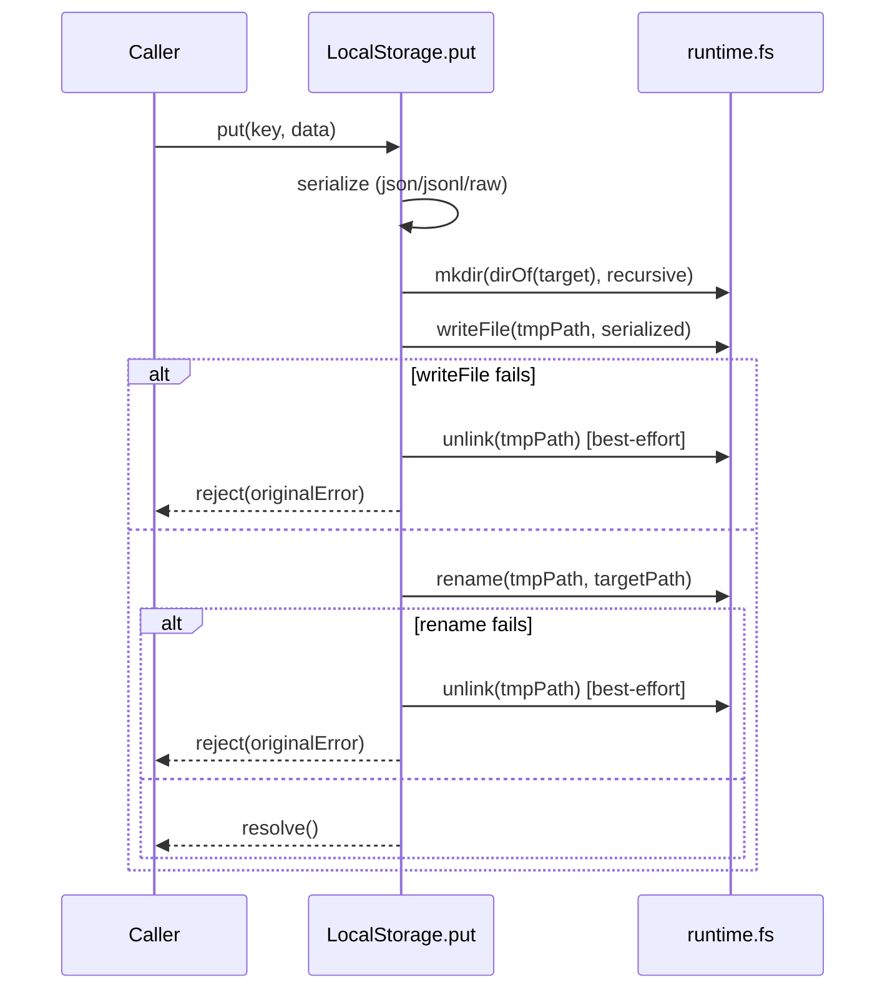

# Design 1480 — libstorage put: write-tmp + atomic rename

Aligns `LocalStorage.put`'s runtime with the same-target atomic file-replace
contract that `libindex.compact()` and `services/bridge` already document
against. The library — not each consumer — owns the plumbing.

## Architecture

`put` becomes a three-step sequence over the runtime's `fs` collaborator:
ensure target directory exists, write payload to a same-directory sibling
tmp, rename tmp onto the target. POSIX `rename(2)` is atomic against a
concurrent `get`, so the target file is readable at exactly the prior
content or the new content — never an intermediate prefix. Failures
between `writeFile` and `rename` trigger best-effort tmp cleanup before
the rejection propagates. Listing surfaces skip the tmp sentinel so a
process-kill survivor cannot leak into a consumer's view of the store.

## Components

| Component | Role | Surface |
|---|---|---|
| `LocalStorage.put` | Public method; serialises data, drives the three-step sequence, surfaces the originating error on any step. | `libraries/libstorage/src/local.js` |
| Tmp-path builder | Internal: derives a same-directory, collision-free sibling path from the target path and a per-call nonce. Names the sentinel suffix that the listing filter recognises. | private to `local.js` |
| Listing filter | `#traverse` rejects entries whose filename carries the tmp sentinel suffix **before** the caller-supplied `fileFilter` runs, so tmp survivors are invisible regardless of the consumer's filter shape (`list`, `findByPrefix`, and `findByExtension` all flow through `#traverse`). | private to `local.js` |
| Doc surfaces | `libindex.compact()` JSDoc, `services/bridge` inline comment, `libraries/libstorage/src/index.js` `StorageInterface` JSDoc, `libraries/libstorage/README.md`. | text only |

`LocalStorage.append`, `get`, `delete`, `exists`, `getMany`, `findByExtension`,
`path`, `ensureBucket`, `bucketExists`, and `#traverse`'s sort/recursion
logic are unchanged in shape; `#traverse` gains only the sentinel-suffix
predicate.

## Data flow

| Step | Before | After |
|---|---|---|
| Target file presence | Truncated and rewritten in place. | Untouched until `rename` succeeds; appears in one transition from prior content to new content. |
| Same-key concurrent `get` during `put` | Can observe a half-written prefix. | Observes prior or new bytes only. |
| Failed `put` (any step) | Target may be partially written. | Target equals its pre-call content; tmp is unlinked best-effort; promise rejects with the originating error. |
| Process kill mid-`put` (no cleanup) | Target may be partially written. | Target equals its pre-call content (rename has not yet occurred); a tmp file may survive on disk but is excluded from `list`/`findByPrefix`/`findByExtension`. |
| First `put` on absent key | `writeFile` creates target. | `rename` creates target; same observable outcome. |

## State invariants

For every `put(key, data)` call, observers see the target at exactly one
of two states: **prior content** (the bytes the target held when `put`
started, including absence if the key did not exist) or **new content**
(the serialized form of `data`). No third state is observable through
`get`, `list`, `findByPrefix`, or `findByExtension`.

`exists(key)` follows the target's transition: it returns `true` once the
target exists (either because the prior content existed, or because the
rename has landed); it never returns `true` while only the tmp exists.

## Key decisions

| # | Decision | Rejected alternative | Why this over the alternative |
|---|---|---|---|
| 1 | Same-directory tmp sibling + `rename(2)`. | `O_TMPFILE` + `linkat`; write-to-target with a side-channel manifest tracking the prior content. | `rename(2)` is the POSIX-defined atomic file-replace primitive. `O_TMPFILE`/`linkat` is Linux-specific and unsupported on the runtime collaborator surface (`runtime.fs` is `node:fs/promises`-shaped). The manifest variant moves the partial-write window to a different file without removing it. |
| 2 | Collision-free tmp name derived from a per-call nonce sourced through the `runtime` collaborator bag (e.g. `libsecret`'s UUID surface), never `Math.random`. | Predictable `${target}.tmp` suffix. | A predictable suffix collides on the second concurrent `put` to the same key inside one process; a nonce-suffixed tmp uniquely identifies its writer and lets the plan satisfy the concurrent-`put` invariant the spec leaves to it. Pinning the nonce source to the runtime keeps the seam mockable and forbids the `Math.random` regression. The trade-off — a tmp file that outlives a process kill cannot be reclaimed by its writer — is paid back by the listing filter (decision 4). |
| 3 | `fsync` is out of scope. | `fsync(tmpFd)` before rename plus `fsync(parentDirFd)` after. | The spec's no-half-written-target invariant is a property of POSIX rename and does not require flushing to stable storage. `fsync` is a durability concern — surviving a power loss after the kernel acknowledged the rename but before the page cache flushed — and the spec explicitly excludes that shape. A future spec can add durability if a consumer surfaces a gap. |
| 4 | Listing surfaces filter by tmp sentinel suffix. | Trust the unlink-on-failure path to keep listings clean. | Unlink-on-failure handles the rejected-promise path. A process kill between `writeFile` and `rename` leaves a tmp on disk that no cleanup runs over; without the filter, a subsequent `compact()` or `findByPrefix` would surface the tmp as if it were a real key. The filter is one shared predicate across `list`/`findByPrefix`/`findByExtension` (`#traverse` already centralises the recursion). The filter hides surviving tmps from in-process consumers; disk reclamation of those bytes remains operator-owned (per spec § Out of scope). |
| 5 | Tmp-on-failure cleanup is best-effort; cleanup errors are swallowed and the originating error propagates. The cleanup-failure path is not surfaced via logger or tracer — `LocalStorage` carries no logger collaborator today and the spec does not introduce one. | Surface cleanup errors via `AggregateError` or a logged warning. | The caller cares about the put-shape failure, not the cleanup-shape failure; an `ENOENT` on cleanup (the most common case, when `writeFile` never created the tmp) is not actionable. The state model (no third observable state) is preserved either way; raising cleanup errors would mask the originating cause without giving the caller a useful new affordance. |
| 6 | Scope limited to `LocalStorage`. `S3Storage` and `SupabaseStorage` `put` are unchanged. | Apply a `_putAtomic` wrapper at the `StorageInterface` level so every backend re-affirms the contract. | S3 `PutObject` and Supabase's storage API are atomic on the wire; their consumers already observe the invariant. A wrapper would add a no-op for those backends and would not fit the spec's `LocalStorage`-only scope. The `StorageInterface` JSDoc records the contract as a backend obligation, not a wrapper-provided service. |
| 7 | Doc surfaces update in the same change as the runtime. | Land runtime first, follow-up PR for docs. | The spec's contract-matches-runtime success criterion is the work; splitting the PR risks a window where the runtime is correct but the docstring still hedges (or, after a revert, the inverse). The diff is small and the review surface is single. |
| 8 | Same-key concurrent `put` invariant is named here, satisfied in the plan. | Acquire an in-process per-key lock at the design level. | The collision-free tmp name (decision 2) already gives each concurrent call a unique tmp; the plan picks the rename-ordering shape (last-rename-wins is sufficient and matches today's last-writer-wins outcome). A design-level lock would over-specify and forbid valid implementations. |

## Mapping to success criteria

| Spec claim | Where it is met |
|---|---|
| Interrupted `put` leaves target at prior or new content. | Sequence: target is untouched until `rename`; POSIX rename is atomic. (Decisions 1, 3) |
| Failed `put` surfaces the error and leaves the target at prior content. | Failure-arm of the sequence + cleanup. (Decisions 1, 5) |
| Concurrent `get` observes prior or new content. | Same as #1; `get` reads target only. (Decision 1) |
| `libindex.compact()` survives a restart. | Consumer of `put`; inherits the new guarantee unchanged. (Decision 7 updates JSDoc.) |
| No orphan tmps observable to subsequent `LocalStorage` calls / listing surface. | Unlink-on-failure for the rejected-promise path; listing filter for the process-kill survival path. (Decisions 4, 5) |
| Contract surfaces describe the runtime guarantee. | Doc-surfaces table; landed in same change. (Decision 7) |

## Out of scope (confirmations from spec)

- `append()` atomicity — separate spec.
- Cross-process concurrent-writer correctness — last-writer-wins preserved.
- `S3Storage` / `SupabaseStorage` `put` shape — already atomic; unchanged.
- Retroactive recovery of half-written files already on disk — operator-owned.
- Cross-filesystem rename semantics — `path(key)` keeps tmp and target in
  the same directory by construction; absolute-path callers inherit
  today's constraint.
- Consumer refactors beyond comment/JSDoc updates.

— Staff Engineer 🛠️
