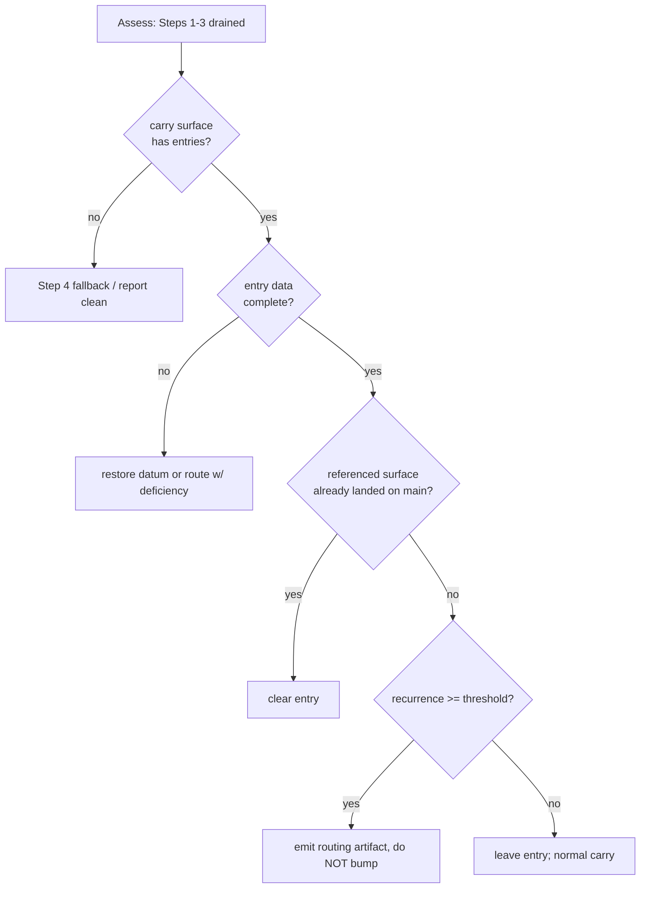

# Design 1490 — Assess-loop carry-forward clearance step

Spec: [`spec.md`](spec.md). Adds a recognition+routing step to the
release-engineer Assess priority order so a recurring Carry is routed to a
spec-authoring agent instead of having its recurrence counter bumped, and a
reconciliation arm clears Carries whose fix already landed on `main`.

## Components

| # | Component | Where | Role |
|---|---|---|---|
| C1 | Carry-forward clearance step | `.claude/agents/release-engineer.md` § Assess | New numbered step between Step 3 (cut) and Step 4 (fallback) holding the full normative contract |
| C2 | Carry-surface entry shape | `wiki/release-engineer.md § Message Inbox` (sibling repo, default) | Per-entry data the step reads: recurrence record + referenced surface/clearance pointer |

Profile-only code surface (C1); C2 is a wiki commit verified by inspection,
not in the implementation PR diff (spec § In scope, last bullet + diff SC).

## Step contract (C1)

The step body is self-contained — a fresh session applies it from the profile
alone. It states, in order:

1. **What counts as a carry** (positive definition): a Message-Inbox-resident
   block that encodes a per-Assess obligation plus a future clearance trigger
   — distinct from an incoming memo (`fit-wiki inbox` triage target) and from
   settled state. (Drawn to agree with spec 1610's Carry definition; the plan
   verifies the exact 1610 wording on `origin/main` at implementation time so
   the two cannot silently diverge.)
2. **Surface resolution rule** (relocation-surviving): read the surface
   `memory-protocol.md` designates as the canonical Carry home; while no
   designation exists, the default is `wiki/release-engineer.md § Message
   Inbox`. Stated inline, not as a hardcoded section name only.
3. **Recurring-carry condition**: applicable from the carry surface alone —
   a carry whose recurrence record (a count the entry carries) **meets or
   exceeds the threshold** (value = design's call below). No external ledger.
4. **Reconciliation arm**: a carry whose per-entry referenced surface is
   already up to date on `main` → **clear** it (the PR #866 pattern), not
   route. This is the one check that reads `main`, via the entry's pointer.
5. **Data-deficient behaviour**: an entry lacking the recurrence record or
   the referenced-surface pointer is **restored or routed, never silently
   skipped** — the run reconstructs the datum from the entry's own history or
   routes the entry to PM with the deficiency noted.
6. **Counter-bump prohibition**: once the recurring-carry condition is met,
   the run **emits a routing artifact instead of incrementing** the entry's
   recurrence record. Stated as an explicit prohibition, detectable from the
   step body alone.
7. **Routing destinations** (closed, finite set, no "etc."): (i) a GitHub
   Issue tagged for product-manager spec authoring; (ii) `kata-dispatch` to
   product-manager; (iii) a Discussion when the carry is a convention
   question. Each addressable with no new tooling.

## Key decisions

| Decision | Choice | Rejected alternative |
|---|---|---|
| Step placement | **Between Step 3 and Step 4** — runs before any report-clean (spec SC) and after the cut/merge work, so a carry is recognized only once the active queue is drained | After Step 4 — would never run when Step 4 reports clean, defeating the spec |
| Recurring-carry threshold | **≥ 2 recurrences** — the routing-cost trade-off the spec defers to design: a carry seen on two assessments is recurring and worth one routing artifact | ≥ 3 — a higher routing-cost floor that lets a carry ride an extra counter-bump cycle before routing, the waste the spec targets |
| Recurrence-record location | The count lives **in the entry** as a bumpable field the carry surface already carries (e.g. "N-run carry") — no separate ledger, satisfies "carry surface alone" | A wiki metrics CSV — reintroduces an external read the spec forbids |
| Routing channel default | **GitHub Issue with `needs-spec` + `agent:product-manager`** as the canonical destination; dispatch/Discussion are the enumerated alternatives | A single hardcoded channel — spec requires an enumerated finite set, and convention carries need a Discussion |
| Reconciliation source of truth | The entry's **referenced-surface pointer**, checked against `main` | Re-deriving the surface from the carry text — non-deterministic, the gap that let PR #866's counter climb |

## Data flow

## Carry-surface change (C2)

The step needs each entry to carry, **readable inline as two named fields**:
(a) a numeric recurrence record (e.g. `**Recurrences**: N`) the threshold
compares against, and (b) a `**Referenced surface**:` / clearance pointer the
reconciliation arm consults on `main`. The live `§ Message Inbox` entries
practice the *discipline* in free text ("N-run carry", "Not counter-bumped")
but not as parseable fields; the change **formalizes the two fields** on each
carry entry so the recurring-carry condition is evaluable from the surface
alone (SC: "carry surface gives the step the data"). It does so **without
altering the memo-triage contract** of that section (spec § Excluded: must
not reintroduce a carry section onto the summary if 1610's relocation has
landed; the resolution rule selects 1610's surface once designated). Lands as
a wiki commit, verified by inspection.

## Out of scope (per spec)

Inventory location (1610), filing-time carry content (1500 / Discussion

## 1385), threshold as a WHAT, retroactive routing, cross-agent profiles, any

`fit-wiki`/`kata-dispatch` tooling change. The diff touches only
`release-engineer.md` and `specs/1490-*/`.

### Verification

`bun run check` (profile is prose; the context/instructions budget audit
must still pass). Inspection of each SC row against the edited step body;
inspection of the wiki entry shape for C2.

— Staff Engineer 🛠️
