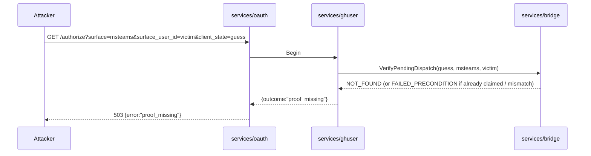

# Design 1520-a — `/authorize` requires bridge-originated proof of intent

## Architecture summary

`services/ghuser`'s single-surface `GITHUB_ID_SURFACES` allowlist is
replaced by a **per-surface identity-proof registry**. Every surface
declares one contract; lookup miss collapses to the same outcome as a
failed proof so the configured set is not enumerable. `msteams` adopts a
`bridge_pending_dispatch_proof` contract that cross-validates the
asserted `(surface, surface_user_id, client_state)` against a single-use
record in `services/bridge`. `github-discussions` keeps its existing
account-equality contract. The structural fix retires the kill-switch
(#1399) and the `GetToken` quarantine (#PM-option-c) in the same release
tag, paired with a migration that drops every pre-fix `msteams` binding.

## Trust model

The bridge-proof contract is sound only when the `link_token` is
confidential between the bridge and the surface user. In Microsoft
Teams, the Bot Framework binds `conversation.id` to one AAD user iff
`conversationType === "personal"`; group chats and team channels deliver
the URL to multiple AAD users, so any participant could race the
legitimate user's `/authorize` and bind the asserted identity to their
own GitHub. The design declares **1:1 personal Bot Framework
conversations** a load-bearing invariant for any surface whose contract
is `bridge_pending_dispatch_proof`. Ratified on `main` at `46b299df`
(spec.md § Scope row "Channel confidentiality for surfaces using
bridge-pending-dispatch proof (amendment 2026-06-03)" and the paired
Success Criterion at line 121): the spec now names the conversation-type
restriction as the trust-model invariant, with fail-closed handling of
unrecognised or absent `conversationType` as the enforcement contract.
The msteams ingress's Bot Framework signature verification (today at
`services/msbridge`'s activity-handler entry) is a transitive dependency
of this invariant — a forged `conversationType` would bypass the gate.
Preserving that ingress posture is implicit; weakening it in a future
refactor unravels the proof model.

## Components

| Component | Where | Role |
|---|---|---|
| Identity-proof registry | `services/ghuser/src/identity-contracts.js` (new) | Surface → contract record `{evaluatedAt: "Begin" \| "Complete", evaluate({req, bridgeClient, flow}) → Promise<{outcome:"ok"} \| {outcome:"proof_missing"} \| {outcome:"identity_mismatch"}>}`. Adding a new surface requires registering one such record. Lookup miss returns the same `{outcome:"proof_missing"}` as a failed proof. |
| `bridge_pending_dispatch_proof` contract | Registry entry — every non-`github-discussions` surface today (`msteams`) and every future channel by default | Calls `bridgeClient.VerifyPendingDispatch`. Any non-`OK` return (transport error, `NOT_FOUND`, `FAILED_PRECONDITION`) → `{outcome:"proof_missing"}` (**fail closed**). Evaluates at `Begin`. |
| `github_account_equality` contract | Registry entry for `github-discussions` | The existing `authorizedGithubId === flow.surface_user_id` check. Evaluates at `Complete`. The existing `untrusted_origin` invariant at `Complete` is independent of the registry and untouched. |
| Bridge verification RPC | `services/bridge` `VerifyPendingDispatch(VerifyPendingDispatchRequest{link_token, expected_surface, expected_surface_user_id, tenant_id}) → common.Empty` | gRPC contract: returns OK iff the pending entry matches and is not already claimed. Errors as `NOT_FOUND` (no entry) or `FAILED_PRECONDITION` (mismatch or already claimed). `tenant_id` mirrors the existing bridge-proto idiom; ghuser supplies empty string. Today's pending lookups are not tenant-keyed (`services/bridge/index.js:215` keys on `link_token` only, see `PutPendingDispatch:198-207`), so empty `tenant_id` does not break correspondence with the matching `PutPendingDispatch` write. Forward-looking invariant: if pending lookups are ever tenant-partitioned (multi-tenant spec), `VerifyPendingDispatch` and `PutPendingDispatch` must be updated in the same tag so the keyspace stays uniform. Multi-tenant tenant-keyed semantics are deferred. |
| Claimed-dispatches index | `services/bridge` `claimed_dispatches.jsonl` (new, sibling to `pending_dispatches.jsonl`) | Append-only single-use ledger. `VerifyPendingDispatch` performs check-then-append in one synchronous handler body — pending-exists + claimed-index-miss + `(expected_surface, expected_surface_user_id)` match are all evaluated, and the `{link_token}` append runs, with no `await` straddling the check and the append. Two concurrent verifies for the same `link_token` cannot both observe "unclaimed" because gRPC handlers serialise on the event loop (same single-instance-per-tenant invariant `ResolvePendingDispatch.compact()` relies on; see `services/bridge/index.js:234-239`). Independent of `pending_dispatches.jsonl` so the legitimate `/api/link-complete` `ResolvePendingDispatch` destructive consume is unaffected. |
| Migration index | `services/ghuser` `migrations.jsonl` (new, sibling to `bindings.jsonl`) | Records run migrations as `{id: "1520-drop-pre-fix-bridge-proof-bindings", ran_at}`. Separate namespace prevents collision with `BindingStore.keyOf("surface:userId")` and survives `BindingStore.loadData`'s deleted-record filter. |
| Pre-fix binding migration | `services/ghuser/src/migrations/` (new), invoked from `server.js` after stores load and before `server.start()` | Iterate `bindings.jsonl`; for each record whose surface's registry contract is `bridge_pending_dispatch_proof`, call `BindingStore.delete`. Records the run in `migrations.jsonl`. Idempotent — second boot reads the marker and skips. **Failure semantics**: if the migration throws, ghuser refuses to start (boot abort) — a half-run migration could leave vulnerable bindings live, so the safe trade is no-traffic over partial-traffic. Migration does not call `bridgeClient`, so bridge reachability at boot is independent; if the bridge is down at startup, new `/authorize` calls fail closed (`proof_missing`) until it recovers, but boot itself succeeds. Bindings whose surface is no longer in the registry at migration time are left untouched — registry-config drift is out of scope; an unregistered surface returns `proof_missing` at `/authorize` so the binding is inert. |
| msbridge personal-conversation gate | `services/msbridge` activity-handler, **upstream of `#stashAndPostLink`** at the `dispatch_declined` link-decision point — so `prepareLinkResume` and `PutPendingDispatch` are never reached for non-personal conversations | When `activity.conversation.conversationType !== "personal"` (fail-closed on `undefined` / unknown values for forward-compatibility with future Bot Framework conversation types), skip link issuance and post a static "DM the bot to link your account" message. **Bridge-parity invariant**: any bridge adopting `bridge_pending_dispatch_proof` MUST implement an equivalent link-token-confidentiality gate at its own ingress — this gate is the msteams instance of that requirement (matches spec § In scope "Bridge parity"). Today only msbridge declares `bridge_pending_dispatch_proof`; ghbridge keeps `github_account_equality` and needs no equivalent gate. The msteams test suite gains a `personal-conversation-gate.test.js` covering personal, group, channel, and undefined-conversationType. |
| Bridge client wiring | `services/ghuser/server.js`, `libraries/librpc`-generated client | `GhuserService` gains a `bridgeClient` collaborator. New `createServiceConfig("ghuser", …)` keys `bridge_host`, `bridge_port` asserted-non-empty at boot. |
| Atomic three-removal | Same release tag retires (in `services/ghuser/index.js`) the `BEGIN_ALLOWED_SURFACES` constant + its kill-switch gate + the `surface_not_supported` outcome, the `DISPATCH_ALLOWED_SURFACES` constant + its `GetToken` gate, and the `GITHUB_ID_SURFACES` constant + its `Complete`-time identity-mismatch gate (now folded into the registry); plus `services/ghuser/test/query-quarantine.test.js`, the kill-switch row in `services/oauth/test/authorize.test.js`, and the `surface_not_supported` assertions in `services/ghuser/test/identity-verification.test.js` (rewritten per row below). The `services/oauth` `result.outcome → HTTP` table needs no change: `proof_missing` reuses the same generic `outcome → 503` path the kill-switch's `surface_not_supported` already travels. | One release tag, no intermediate state. |
| Identity-verification test rewrite | `services/ghuser/test/identity-verification.test.js` — bound to the same release tag as the row above | Rewritten to assert the registry semantics in § Test contract. Other ghuser query tests (`query-linked`, `query-reauth`, `query-unlinked`, `smoke`) are audited and updated: any test asserting `surface_not_supported` outcome or surface-allowlist-based `link_required` as steady state is rewritten or removed. |

## Data flow — successful msteams link

```mermaid
sequenceDiagram
  participant U as User (Teams DM)
  participant MB as msbridge
  participant B as services/bridge
  participant O as services/oauth
  participant GU as services/ghuser
  U->>MB: message; no binding; conversationType="personal"
  MB->>B: PutPendingDispatch({link_token, msteams, aad-id})
  MB->>U: DM link with client_state=link_token
  U->>O: GET /authorize?surface=msteams&surface_user_id=aad-id&client_state=link_token
  O->>GU: Begin(req)
  GU->>B: VerifyPendingDispatch(link_token, msteams, aad-id)
  B-->>GU: OK (link_token appended to claimed_dispatches.jsonl)
  GU-->>O: 302 → github.com
  Note over U,GU: user authorizes at GH, returns to /callback
  O->>GU: Complete
  GU->>GU: registry["msteams"].evaluatedAt === "Begin" → no further check
  GU->>GU: isTrusted(idpOrigin, trustedOrigins) → ok
  GU->>GU: upsert binding (msteams, aad-id) → token
  GU-->>O: redirect_uri + completion_ticket
  O-->>U: 302 → msbridge /api/link-complete
  U->>MB: GET /api/link-complete?state=link_token&ticket=…
  MB->>B: ResolvePendingDispatch(link_token, aad-id) — destructive
  B-->>MB: discussion_id (entry consumed from pending_dispatches.jsonl)
```

## Data flow — attacker without matching pending entry, or racing the legitimate user



The single `proof_missing` outcome covers: unknown surface, no matching
pending entry, `(surface, surface_user_id)` mismatch, entry already
claimed, and any transport error reaching the bridge. Collapsing
prevents enumeration of the configured surface set and prevents a
fresh-vs-claimed timing oracle.

## Key decisions

| Decision | Choice | Rejected alternative |
|---|---|---|
| Proof mechanism | Bridge-originated proof (spec option 2) | **Per-surface signed identity assertion** (option 3) — duplicates the `link_completion_ticket_secret` rotation surface; introduces a second signed-token shape with its own expiry/replay semantics; doesn't avoid the channel-confidentiality issue (the assertion would also be delivered through the channel). Option 2 reuses the bridge's authoritative state and folds the confidentiality requirement into one architectural lever (1:1 conversation). |
| `link_token` confidentiality | 1:1 personal Bot Framework conversations only | **Any conversation type** — multi-party chats deliver the URL to every member; the proof model would verify "someone in the conversation has a pending dispatch", not "you are the surface user". Bridge-side scope-restriction is the only sound mitigation; this is the spec-amendment item flagged in § Trust model. |
| Single-use semantics | Separate `claimed_dispatches.jsonl` index in `services/bridge`, append-only | **In-place `claimed: bool` mutation on the pending entry** — the existing `BufferedIndex` is append-and-compact, not in-place mutate; an in-place flip would require new persistence primitives. **No single-use at all** — within the 10-minute pending TTL a second `/authorize` could write a second binding even in a 1:1 conversation if the URL leaks via, e.g., logs; defense-in-depth. |
| Where the contract evaluates | At `Begin` for bridge-proof; at `Complete` for github-account-equality | **Always at `Complete`** — for the bridge contract all inputs are known at `Begin`; rejecting there avoids minting a flow id and a GitHub round-trip on every forged attempt. github-account-equality needs the authorizer's id, only known after token exchange. |
| Default for new surfaces | Registry lookup miss returns the same `proof_missing` outcome | **Distinct `unknown_surface` outcome** — side channel for enumerating configured surfaces. **Boot-time refusal on missing contract** — surfaces are discovered from request fields, not config, so there is no static set to validate at boot. |
| Bridge availability failure mode | Fail closed — any non-`OK` from `VerifyPendingDispatch` → `proof_missing` | **Fail open on transport error** — re-opens the original defect during bridge outages. Trade accepted: legitimate users see `proof_missing` equally with attackers during an outage and have no in-band signal distinguishing the two; msbridge gates non-personal conversations and issues a fresh `link_token` per message, so a transient outage clears on the user's next message. UX-level retry hints (banner, structured error) are out of scope; the architecture intentionally avoids per-cause messaging to keep the outcome collapse intact. |
| Pre-fix binding invalidation | Drop every binding whose surface uses the bridge-proof contract; legitimate users re-link | **Quarantine-as-permanent** — leaves vulnerable records indefinitely. **Re-key under fix** — no field disambiguates victim from attacker writes. |
| Migration marker location | Separate `migrations.jsonl` index | **Sentinel record inside `bindings.jsonl`** — collides with `BindingStore.keyOf("surface:userId")` namespace and lives in the same filter-vulnerable space (`stores.js:37-42` strips `deleted:true` rows). |
| `tenant_id` plumbing | Bridge proto carries `tenant_id` for idiom parity; ghuser supplies empty string. Pending lookups are not tenant-keyed today (see Bridge verification RPC row), so this is a no-op at the lookup layer. | **Thread `tenant_id` through `/authorize` query, `BeginRequest` proto, `prepareLinkResume`, and `msbridge` activity inspection** — cross-cutting plumbing larger than the spec scope; the spec does not name multi-tenant isolation as a goal. **Omit the field entirely** — rejected because every other bridge RPC carries it; omitting breaks the idiom and a future multi-tenant spec would need to re-cut the proto. Deferred to a separate spec. |

## Test contract

| Test | Invariant |
|---|---|
| bridge-proof surface with no pending entry returns proof_missing | `Begin({surface:"msteams", surface_user_id:"aad", client_state:"forged"})` with no `PutPendingDispatch` → `{outcome:"proof_missing"}`; no flow; no binding. |
| bridge-proof surface with mismatched surface_user_id returns proof_missing | After `PutPendingDispatch({link_token, msteams, aad-A})`, `Begin(…, surface_user_id:"aad-B", client_state:link_token)` → `proof_missing`. |
| bridge-proof surface with valid proof binds exactly once | After valid `PutPendingDispatch`, a full `Begin→Complete` round-trip writes exactly one binding. A second `Begin` with the same `link_token` returns `proof_missing` (claimed); no second binding. |
| unknown surface returns proof_missing | A surface absent from the registry → `{outcome:"proof_missing"}`; no flow. |
| bridge transport error fails closed | Bridge `VerifyPendingDispatch` raising any error → `Begin` returns `proof_missing`; no flow. |
| github-discussions retains account-equality contract | `Begin→Complete` with authorizer ≠ `surface_user_id` → `identity_mismatch`; no binding. |
| msbridge refuses to issue link in non-personal conversation | Personal-conversation gate test file (new in `services/msbridge/test/`) covers `personal` (link sent), `groupChat` / `channel` / `undefined` (link skipped, static DM-redirect message posted). |
| migration drops pre-fix bridge-proof bindings exactly once | First boot with two msteams bindings → both marked `deleted:true`; `migrations.jsonl` records the run. Second boot reads the marker; no re-iteration. |

— Staff Engineer 🛠️
