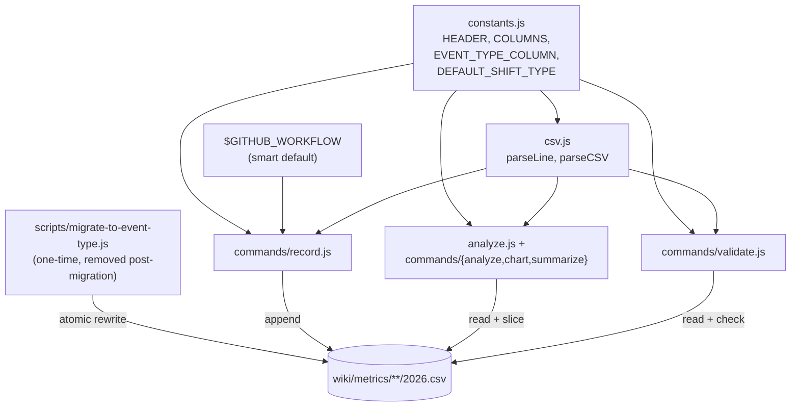

# Design 1540 — per-agent metrics CSV separates dispatch-boot from shift-work

## Architecture

The schema gains a trailing `event_type` column whose value is the **exact
GitHub workflow name** that produced the row (e.g. `Kata: Dispatch`,
`Kata: Shift`, `Kata: Coaching`). The migration is **clean-break**: every
CSV under `wiki/metrics/**/2026.csv` — every per-agent CSV *and* every
kata-skill CSV — is rewritten once during this PR series. Runtime code
(recorder, validator, analyzer, chart, summarize) assumes the new column
unconditionally; there is no schema-version branch, no header dispatch, no
v1/v2 coexistence. The migration is performed by a one-time script that is
removed from the codebase in the same PR series.

`libxmr` owns the schema constants, the recording surface's smart default,
the validator's contract, the analyzer's default filter, and the migration
script. The recording surface accepts `--event-type <name>` and falls back
to `$GITHUB_WORKFLOW` from the environment — set automatically by GitHub
Actions to the workflow's `name:` field — so an agent invoked from
`kata-shift.yml` records `Kata: Shift` without any change at the call site.

> **Reviewer feedback (PR #1494) overrules two spec rulings.** The known
> set is open-ended workflow names, not the closed `dispatch-boot` /
> `shift-work` enum the spec § Out-of-scope row implies; and every CSV
> migrates in one shot, including the kata-skill CSVs the spec § Out of
> scope deferred. Both changes are deliberate to honour "exactly match the
> GitHub workflow name", "smart default to `$GITHUB_WORKFLOW`", "CLEAN
> BREAK and no schema version logic", and "all CSVs migrated".

## Components

| Component | Interface | Responsibility |
|---|---|---|
| `constants.js` | `HEADER` (seven-column header line), `COLUMNS` (column-name array), `EVENT_TYPE_COLUMN = 'event_type'`, `DEFAULT_SHIFT_TYPE = 'Kata: Shift'` | Single source of truth for the schema. Recorder, validator, parser, and analyzer import the same symbols; renaming any one surfaces every consumer as a static error. |
| `csv.js` | `parseLine`, `parseCSV`, `validateHeader` | Reads the file's first line and rejects a header that does not match `HEADER` with a column-diff message — the post-migration runtime treats a non-matching header as an error, not a version. Every parsed row carries `eventType`. |
| `commands/record.js` | `--event-type <name>` flag; reads `$GITHUB_WORKFLOW` env when flag absent | Resolves `event_type` from flag (highest precedence), then `$GITHUB_WORKFLOW`, then exits non-zero with a clear error. Appends the row with `event_type` as the trailing column. |
| `commands/validate.js` | reads target CSV | Header must equal `HEADER` (mechanical static check); every row must carry a non-empty `event_type`. Missing or empty rejected with line number. |
| `analyze.js` + `commands/{analyze,chart,summarize}.js` | `--event-type <name>` filter | Default filter: `event_type = DEFAULT_SHIFT_TYPE` (`Kata: Shift`). Every surface output names the filtered slice in its header ("filtered to event_type=Kata: Shift" or, with `--event-type=*`, "all rows; no event_type filter"). |
| `scripts/migrate-to-event-type.js` | One-time CLI script: `node libxmr/scripts/migrate-to-event-type.js` | Walks every CSV under `wiki/metrics/**/2026.csv`. For per-agent CSVs: group by `run`, apply the cross-row classifier (§ Key Decisions) to stamp `Kata: Dispatch` or `Kata: Shift`. For kata-skill CSVs: apply a per-skill default workflow mapping (`kata-dispatch` → `Kata: Dispatch`; `kata-coaching` → `Kata: Coaching`; everything else → `Kata: Shift`). Rewrites each file atomically (tmp + rename). Prints a per-file row count by event_type on exit so reviewers can verify spec § Success Criteria row 4 empirically. **Removed from the repo in the same PR series that ships the migration commits.** |

## Data Flow

**Write path.** Agent → `fit-xmr record --skill <agent> --metric <name> --value <n> [--event-type <name>] --run <id> --note <free text>`. `record.js` resolves `event_type` from `--event-type`, falling back to `process.env.GITHUB_WORKFLOW`. Exits non-zero if neither resolves. Appends `date,metric,value,unit,run,note,event_type`.

**Read path.** Consumer → `fit-xmr analyze|chart|summarize <csv-path>` → `csv.parseCSV` validates the header against `HEADER` → apply `--event-type` filter (default `DEFAULT_SHIFT_TYPE`) before XmR computation → output names the slice in its header. The pre-existing `--event-type=*` escape hatch yields the unfiltered series and is named as such in the output.

**Migration path (one-shot, this PR series only).** A single invocation of `node libxmr/scripts/migrate-to-event-type.js` walks `wiki/metrics/**/2026.csv`, applies the classifier per file, and rewrites in place. The migration commits land in the same PR series as the runtime patch and the script removal — after merge, `git log` is the record of how the migration happened; the codebase carries no migration code.

**Storyboard refresh.** `fit-wiki refresh` regenerates storyboard chart blocks by calling `analyze()` + `renderChart()` from `libxmr`. No code change in `libwiki`; the shift-work default propagates because every downstream caller of `analyze` inherits it.

**Validation path.** `fit-xmr validate <csv-path>` enforces header equality and per-row non-empty `event_type`. No version branch — a non-matching header is an error, full stop.

## Key Decisions

| Decision | Choice | Rejected | Why |
|---|---|---|---|
| `event_type` value semantics | The **exact GitHub workflow name** (e.g. `Kata: Dispatch`, `Kata: Shift`, `Kata: Coaching`). Open set; the validator only enforces non-empty | Closed enum (`dispatch-boot` / `shift-work`); short tag values; structured `{workflow, run-kind}` tuple | Reviewer feedback (PR #1494): the column value *is* the workflow name. PDSA Study naturally groups runs by workflow, so the value carries the grouping with zero translation. Open set follows from there — workflow names are owned by `.github/workflows/`, not by `libxmr`. |
| Smart default at write time | `--event-type <name>` flag wins; otherwise read `$GITHUB_WORKFLOW` from the environment; otherwise reject | Required flag; required env var; default to a literal `shift-work` constant | GitHub Actions sets `$GITHUB_WORKFLOW` to the workflow's `name:` value on every step. The env fallback makes the call site zero-friction inside the workflow; the explicit flag wins so a local script or a future test harness can record any workflow name without spoofing env. Rejecting when neither resolves means a row never lands without a value. |
| Schema versioning | **None.** Single schema, clean-break migration | Header-as-version-selector with v1 + v2 coexistence (prior design revision); migrating only per-agent CSVs and deferring kata-* | Reviewer feedback: "CLEAN BREAK and no schema version logic; all code should assume the new column." Runtime never branches on schema; migration is one-shot and disappears. |
| Migration scope | **Every** `wiki/metrics/**/2026.csv` — per-agent and kata-skill alike | Per-agent only (spec § Out of scope); skill CSVs deferred to follow-up | Reviewer feedback: "All CSVs should be migrated to the new schema as part of this." Required to enable the no-versioning runtime — leaving any CSV on the old shape would force a schema branch somewhere. |
| Single source of truth for the column shape | `HEADER`, `COLUMNS`, `EVENT_TYPE_COLUMN`, `DEFAULT_SHIFT_TYPE` constants in `constants.js`; record, validate, analyze import the same symbols | Per-component literal arrays; per-row schema inference; registry file referenced by string id | One import. Renaming any symbol surfaces every consumer as a static error. Spec § Success Criteria "divergence is mechanically detectable" satisfied at the column-shape level (the natural home for it once the value set is open). |
| Backfill classifier rule (per-agent CSVs) | Group rows by `run` column. Look up rows by `metric`: classify as `Kata: Dispatch` iff (i) the `duration_seconds` row's `note` matches `/^boot-append from Kata: Dispatch/` AND (ii) the `prs_opened`, `commits_pushed`, and `file_writes` rows' `value` are all `0`. Otherwise `Kata: Shift`. Stamp every row of the run group with the result. | Note-substring alone; single-metric-row predicate; ML/heuristic over multi-row context | Reviewer: "best-effort is ok"; this remains the most defensible cross-row predicate using signals already in the schema. Resolves Exp SE 1432-A's 6 known misclassifications (boot-append note on `duration_seconds` + non-zero work signals elsewhere in the same run). |
| Backfill classifier rule (kata-skill CSVs) | Per-skill default workflow mapping: `kata-dispatch` → `Kata: Dispatch`; `kata-coaching` → `Kata: Coaching`; all other `kata-*` → `Kata: Shift` | Inspect each row for workflow signals; defer kata-* migration; leave field empty | Reviewer: "best-effort is ok; don't spend too much effort." Skill CSVs record skill invocations whose dominant workflow is well known per skill. The default-by-skill mapping is auditable, runs in milliseconds, and produces non-empty values for every row so the validator stays strict. Future records always carry the true workflow name via the `$GITHUB_WORKFLOW` default — the heuristic only colours the migrated tail. |
| Spec § Decisions (c) `run`-prefix alternative | Not adopted. `run` stays as a pure activation identifier; the workflow name lives in its own column | Encode workflow name into a prefix on `run` | Per spec: `run` is consumed by trace correlation, panel attribution, and audit logs as an identifier; re-prefixing every value re-keys every downstream consumer that joins on `run`. The typed column carries the classification without disturbing the identifier contract. |
| Validator strictness | Reject empty or missing `event_type`. Accept any non-empty string. Reject any header that does not equal `HEADER` exactly | Reject values outside a closed known set; warn-only on header drift | The known set is open (workflow names). Accepting any non-empty value matches the smart default's behaviour and avoids brittle coupling to a workflow inventory that the recorder cannot lock down. Strict header check is the mechanical drift detector. |
| Migration mechanism | One-time script in `libxmr/scripts/`, run during this PR series, **removed afterward** | Persistent `fit-xmr migrate` subcommand; inline migration on first record; manual sed | Persistent subcommand implies ongoing dual-schema awareness — exactly the schema version logic the reviewer rejects. One-time script keeps runtime clean; reproducibility is satisfied by `git log` on the migration commits. |
| CLI default when no `--event-type` filter on read | Filter to `DEFAULT_SHIFT_TYPE` (`Kata: Shift`); every surface output names the slice on every invocation | All rows; default to whichever value has most rows | Spec asserts consumers default to shift-work. CLI carries the convention; naming the slice on output guards against the misread risk the spec calls out. |

## Reversibility

The change is additive at the row level — a consumer that drops the
trailing column reads the pre-migration shape. To revert: `git checkout`
each pre-migration commit on the CSV files and revert the runtime patch.
No `--to-old` migration path is provided because the migration script is
single-use and removed from the codebase — recovery is `git`-based by
design, consistent with the no-schema-version constraint.

## What this design does not change

- The Wheeler/Vacanti `xRule1` / `xRule2` / `xRule3` / `mrRule1` detection
  logic in `signals.js` and `stats.js`. The chart reads against a different
  *input* (the filtered series); the *rules* are unchanged.
- The CSV substrate. The schema stays CSV; no migration to a different store.
- The `note` column convention. `boot-append from Kata: Dispatch …` notes
  remain useful per-row context (run id, durationMs); they stay where they
  are. The classifier reads them, but the runtime never relies on them.
- The agent-side call site. Agents continue to invoke `npx fit-xmr record`;
  the env-driven default means most call sites need no change at all.

— Staff Engineer 🛠️
