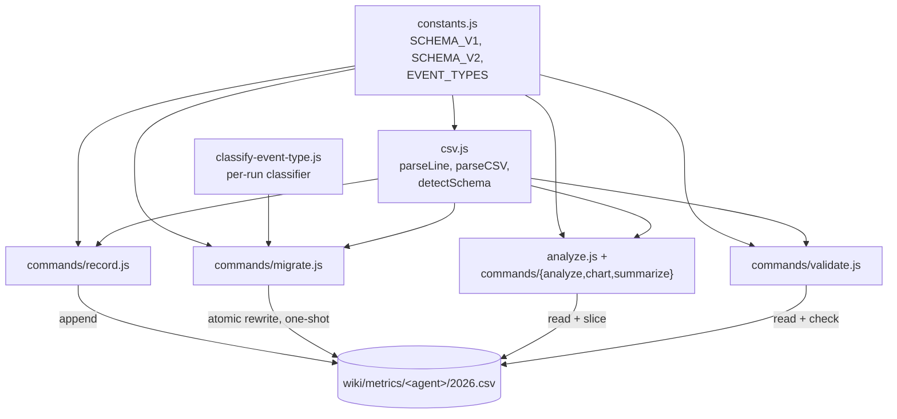

# Design 1540 — per-agent metrics CSV separates dispatch-boot from shift-work

## Architecture

The schema gains a trailing `event_type` column whose presence is declared by
the CSV header line itself. The header line is the **schema-version selector**:
every reader matches the file's first line against a known set of header
strings and dispatches the rest of its work against that version's parsing,
validation, and filtering rules. Per-agent CSVs adopt **schema v2** through a
one-shot migration; the kata-skill CSVs (out of scope) stay on **schema v1**
until their own migration spec.

`libxmr` owns the schema: the header strings, the `event_type` known set, the
classifier, the validator, the analyzer's default-filter behaviour, and the
migrator. Six call sites — recorder, validator, analyzer, chart, summarize,
migrator — all import from the same module. The agent-side recording surface
is unchanged — agents continue to invoke `npx fit-xmr record`; the contract on
that command changes (`--event-type` is now required when the target CSV is
v2, rejected when v1) but the call site is the same.

## Components

| Component | Interface | Responsibility |
|---|---|---|
| `constants.js` | `SCHEMA_V1`, `SCHEMA_V2`, `EVENT_TYPES`, `detectSchema(headerLine)` | Single source of truth. Each schema record carries `version`, `header`, `columns`, `eventTypeColumn`. `EVENT_TYPES` is the known set; renaming the symbol surfaces every consumer mechanically. |
| `csv.js` | `parseLine`, `parseCSV`, `validateCSV` | Reads the file's header, calls `detectSchema`, dispatches per-row parsing to the matched schema. Parsed rows on v2 carry an `eventType` field; on v1 the field is absent. |
| `classify-event-type.js` | `classifyRun(runRows) → 'dispatch-boot' \| 'shift-work'` | Pure function. The migrator groups CSV rows by their `run` column first, then hands each run's rows here. Each metric name (`commits_pushed`, `prs_opened`, `file_writes`, `duration_seconds`) is one row in that group; the classifier looks up rows by metric name and reads each row's `value`. Rule below in § Key Decisions. |
| `commands/record.js` | `--event-type <type>` option | Reads target CSV header. v2: require `--event-type ∈ EVENT_TYPES`, reject empty/unknown. v1: reject `--event-type` (drift surfaced loudly). Appends the row with `event_type` at end on v2. |
| `commands/validate.js` | Reads target CSV header | v2: every row must carry an `event_type` ∈ `EVENT_TYPES`; missing or unknown rejected with line number and offending value. v1: behaviour unchanged. |
| `commands/migrate.js` | `fit-xmr migrate <csv-path>` | One-shot v1 → v2: parse, group by `run`, call `classifyRun`, write atomically (tmp file + rename) with v2 header and seven-column rows. Idempotent (no-op if file already v2). |
| `analyze.js` + `commands/{analyze,chart,summarize}.js` | `--event-type <type>` filter option | v2 default: filter to `event_type=shift-work`. v1: no filter, no column. Every surface output names the slice it rendered ("filtered to event_type=shift-work" or "all rows; no event_type column"). |

## Data Flow

**Write path.** Agent → `fit-xmr record --skill <agent> --metric <name> --value <n> --event-type <type> --run <id> --note <free text>` → `record.js` reads `csvPath` first line → `detectSchema` → if v2, assert `--event-type` present and ∈ `EVENT_TYPES` → append `date,metric,value,unit,run,note,event_type`.

**Read path.** Any consumer → `fit-xmr analyze|chart|summarize <csv-path>` → `detectSchema` → on v2 apply `--event-type` filter (default `shift-work`) before XmR computation → output names the slice in its header.

**Migration path (one-shot per CSV).** `fit-xmr migrate <csv-path>` → parse v1 → group rows by `run` column → `classifyRun(rows)` per group → write tmp file with v2 header + per-row `event_type` → `fs.rename(tmp, csvPath)`. Reversible: `git checkout` the pre-migration file. The migrator's exit output prints the resulting `dispatch-boot:shift-work` row count per file — this is the empirical anchor a reader uses to verify spec § Success Criteria row 4 (at least one run-61 `xRule1` fire resolves differently on the shift-work slice), since whether that criterion holds depends on how many shift-work rows the classifier surfaces.

**Storyboard refresh.** `fit-wiki refresh` regenerates storyboard chart blocks by calling `analyze()` + `renderChart()` from `libxmr`. No code change in `libwiki`; the v2 default propagates because every downstream caller of `analyze` inherits the default-slice behaviour.

**Validation path.** `fit-xmr validate <csv-path>` → `detectSchema`. v2 enforces `event_type` is present and in `EVENT_TYPES`; v1 unchanged.

## Key Decisions

| Decision | Choice | Rejected | Why |
|---|---|---|---|
| Where does `event_type` live | Trailing column on each v2 row; full header line declares the schema version per file | Path-based dispatch (`wiki/metrics/<agent>/` ⇒ v2 schema); optional column whose presence varies row by row | The file itself declares its version, so parser/validator/recorder/analyzer act on data, not file layout. Path predicate breaks if metric files move. Optional column needs a per-row "am I v2" predicate anyway and silently passes empty values. |
| Single source of truth for the known set | `EVENT_TYPES = ['dispatch-boot', 'shift-work']` in `constants.js`; record, validate, migrate, and analyze import the same symbol | Per-component literal arrays; separate registry file referenced by string id | One import. Renaming the symbol surfaces every site mechanically. Drift becomes a static error a build catches, not a runtime data mismatch. Satisfies the spec's "divergence is mechanically detectable" criterion. |
| CLI default when no `--event-type` filter on a v2 file | Default to `event_type=shift-work`; the surface output names the rendered slice on every invocation | Default to "all rows"; default to "shift-work" silently | Spec asserts consumers default to shift-work. CLI carries the convention so the PDSA reader gets the right verdict by default. Naming the slice in output guards against the misread risk the spec calls out. |
| `fit-xmr record` accepts `--event-type` | Required when target CSV is v2; rejected when target is v1 | Optional with default (e.g. `shift-work` unless env var set); ignored silently on v1 | Spec: "value is named at the recording surface rather than inferred." Required-on-v2 surfaces the convention at write time. Rejecting on v1 surfaces version drift loudly instead of writing a column the file's header does not declare. |
| Backfill classifier rule | Group CSV rows by their `run` column. Within each group, look up the rows named by their `metric` column: `prs_opened`, `commits_pushed`, `file_writes`, `duration_seconds`. Classify the run as `dispatch-boot` iff (i) the `duration_seconds` row's `note` matches `/^boot-append from Kata: Dispatch/`, (ii) the `prs_opened` row's `value` is `0`, (iii) the `commits_pushed` row's `value` is `0`, and (iv) the `file_writes` row's `value` is `0`. Otherwise `shift-work`. Stamp every row of the group with the result | Note prefix alone (spec § Scope: 6 known misclassifications); single-metric-row predicate; ML/heuristic over multi-row context | Exp SE 1432-A's 6 misclassifications carry the boot-append note on the `duration_seconds` row but non-zero `prs_opened`/`commits_pushed`/`file_writes` rows in the same run group. The composite cross-row predicate matches that evidence using signals already in the schema, runs deterministically, and is auditable per spec § Success Criteria. |
| Spec § Decisions (c) `run`-prefix alternative | Not adopted. `run` stays as a pure activation identifier; the classification lives in its own column | Encode `dispatch-boot` / `shift-work` into a prefix on the `run` value | Per spec § Decisions: `run` is consumed by trace correlation, panel attribution, and audit logs as an identifier; re-prefixing every value re-keys every downstream consumer that joins on `run`. The typed column carries the classification without disturbing the identifier contract. |
| Migration mechanism | New `fit-xmr migrate <csv-path>` subcommand; one invocation per per-agent CSV (6 total) | Inline migration on first record; one-shot script outside the CLI | Subcommand is discoverable (`--help` lists it), testable in isolation, idempotent (no-op on v2), and reusable when the next agent CSV joins the cohort. Inline migration blurs the version transition into a write path. |
| Out-of-scope `kata-*` CSV compatibility | Stay on v1 indefinitely; v1 schema path remains in `libxmr` until those CSVs' own migration ships | Force-migrate all CSVs in this spec; remove v1 support after this spec | Spec excludes kata-skill CSVs. Header-as-version-selector lets v1 and v2 coexist without a code-path entanglement — each file declares its version, each command reads it. Removing v1 support is its own future spec. |
| `event_type` value emitted by the agent recording surface | The agent skill or workflow step that invokes `fit-xmr record` passes the value as a literal `--event-type <type>` flag, named at the call site | A new `LIBEVAL_EVENT_TYPE` env var read by `record.js`; auto-inference from process state | Spec: "value is named at the recording surface rather than inferred from the `note` string later." Flag-at-call-site is the smallest surface that satisfies that requirement and matches `--skill`'s contract today. |

## Reversibility

The change is additive at the row level. To revert a single file: `git
checkout` the pre-migration commit (the migration writes one CSV per commit).
To revert the schema: drop the v2 branch from `constants.js` and remove the
trailing column from every per-agent CSV. A consumer that ignores `event_type`
reads the same series it reads today — v2 rows differ from v1 rows only in the
trailing column. `fit-xmr migrate` is idempotent and could be paired with a
future `fit-xmr migrate --to v1` if a full reversion were ever needed; not
shipped in this spec because revertibility is satisfied by `git`.

## What this design does not change

- The Wheeler/Vacanti `xRule1` / `xRule2` / `xRule3` / `mrRule1` detection
  logic in `signals.js` and `stats.js`. The chart reads against a different
  *input* (the filtered series); the *rules* are unchanged.
- The CSV substrate. The schema stays CSV; no migration to a different store.
- The `note` column convention. `boot-append from Kata: Dispatch …` notes
  remain useful per-row context (run id, durationMs); they stay where they are.
- The 16 `wiki/metrics/kata-*/2026.csv` skill series (out of scope).

— Staff Engineer 🛠️
