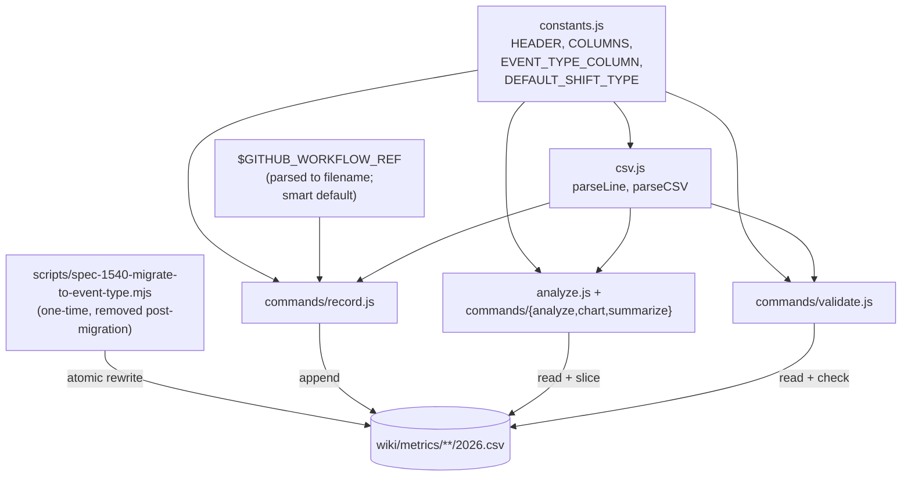

# Design 1540 — per-agent metrics CSV separates dispatch-boot from shift-work

## Architecture

The schema gains a trailing `event_type` column whose value is the
**workflow's machine name** — the workflow filename without its `.yml`
extension (e.g. `kata-dispatch`, `kata-shift`, `kata-coaching`). The
migration is **clean-break**: every CSV under `wiki/metrics/**/2026.csv`
*whose existing header matches the pre-migration `EXPECTED_HEADER`* —
every per-agent CSV *and* every kata-skill CSV — is rewritten once
during this PR series. Two files in that glob already diverge from
`EXPECTED_HEADER` on `main` and are carved out by name; see § Outlier
CSVs. Runtime code (recorder, validator, analyzer, chart, summarize)
assumes the new column unconditionally; there is no schema-version
branch, no header dispatch, no v1/v2 coexistence. The migration is
performed by a one-time script that is removed from the codebase in the
same PR series.

`libxmr` owns the schema constants, the recording surface's smart default,
the validator's contract, and the analyzer's default filter. The one-time
migration script lives at the root `scripts/` directory (alongside
`scripts/spec-1060-migrate-wiki.mjs`) because it is a repo-level
operational tool removed post-migration, not part of the library's
published surface. The recording surface accepts `--event-type <name>` and
falls back to the workflow filename parsed from `$GITHUB_WORKFLOW_REF` —
set automatically by GitHub Actions to e.g.
`owner/repo/.github/workflows/kata-shift.yml@refs/heads/main` — so an
agent invoked from `kata-shift.yml` records `kata-shift` without any
change at the call site.

> **Reviewer feedback (PR #1494) overrules three spec rulings.** The
> known set is open-ended workflow machine names (filenames without
> `.yml`), not the closed `dispatch-boot` / `shift-work` enum the spec
> § Out-of-scope row implies; every CSV migrates in one shot, including
> the kata-skill CSVs the spec § Out of scope deferred; **and the two
> non-conformant outliers (kata-product-issue, trace-attestation) come
> into line within this PR series rather than as a downstream spec**
> (see § Outlier CSVs). All three changes honour "the machine name of
> the workflow", "smart default from the GitHub Actions environment",
> "CLEAN BREAK and no schema version logic", and "all CSVs migrated".



## Components

| Component | Interface | Responsibility |
|---|---|---|
| `constants.js` | `HEADER` (seven-column header line), `COLUMNS` (column-name array), `EVENT_TYPE_COLUMN = 'event_type'`, `DEFAULT_SHIFT_TYPE = 'kata-shift'` | Single source of truth for the schema. Recorder, validator, parser, and analyzer import the same symbols; renaming any one surfaces every consumer as a static error. |
| `csv.js` | `parseLine`, `parseCSV`, `validateHeader` | Reads the file's first line and rejects a header that does not match `HEADER` with a column-diff message — the post-migration runtime treats a non-matching header as an error, not a version. Every parsed row carries `eventType`. |
| `commands/record.js` | `--event-type <name>` flag; parses `$GITHUB_WORKFLOW_REF` env when flag absent (`basename(ref.split('@')[0], '.yml')`) | Resolves `event_type` from flag (highest precedence), then from `$GITHUB_WORKFLOW_REF`'s filename, then exits non-zero with a clear error. Appends the row with `event_type` as the trailing column. |
| `commands/validate.js` | reads target CSV | Header must equal `HEADER` (mechanical static check); every row must carry a non-empty `event_type`. Missing or empty rejected with line number. |
| `analyze.js` + `commands/{analyze,chart,summarize}.js` | `--event-type <name>` filter | Default filter: `event_type = DEFAULT_SHIFT_TYPE` (`kata-shift`). Every surface output names the filtered slice in its header ("filtered to event_type=kata-shift" or, with `--event-type=*`, "all rows; no event_type filter"). |
| `scripts/spec-1540-migrate-to-event-type.mjs` | One-time CLI script: `node scripts/spec-1540-migrate-to-event-type.mjs` | Walks every CSV under `wiki/metrics/**/2026.csv` *and* performs the two outlier-onboarding moves named in § Outlier CSVs (path relocation for the trace-attestation log; column split for `kata-product-issue`). **Pre-flight for in-place rewrites: each file's first line must equal the pre-migration `EXPECTED_HEADER` (`date,metric,value,unit,run,note`) exactly; any non-match terminates non-zero with the offending header.** For conformant per-agent CSVs: group by `run`, apply the cross-row classifier (§ Key Decisions) to stamp `kata-dispatch` or `kata-shift`. For conformant kata-skill CSVs: apply a per-skill default workflow mapping (`kata-dispatch` → `kata-dispatch`; `kata-coaching` → `kata-coaching`; everything else → `kata-shift`). Rewrites each file atomically (tmp + rename). Prints a per-file row count by event_type on exit so reviewers can verify spec § Success Criteria row 4 empirically. **Removed from the repo in the same PR series that ships the migration commits.** |

## Data Flow

**Write path.** Agent runs:

```sh
fit-xmr record --skill <agent> --metric <name> --value <n> [--event-type <name>] --run <id> --note <free text>
```

`record.js` resolves `event_type` from `--event-type`, falling back to parsing
the workflow filename out of `process.env.GITHUB_WORKFLOW_REF`
(`basename(ref.split('@')[0], '.yml')`). Exits non-zero if neither resolves.
Appends `date,metric,value,unit,run,note,event_type`.

**Read path.** Consumer → `fit-xmr analyze|chart|summarize <csv-path>` →
`csv.parseCSV` validates the header against `HEADER` → apply `--event-type`
filter (default `DEFAULT_SHIFT_TYPE`) before XmR computation → output names the
slice in its header. The pre-existing `--event-type=*` escape hatch yields the
unfiltered series and is named as such in the output.

**Migration path (one-shot, this PR series only).** A single invocation of
`node scripts/spec-1540-migrate-to-event-type.mjs` walks
`wiki/metrics/**/2026.csv`, applies the classifier per file, rewrites in place,
and performs the two outlier-onboarding moves (see § Outlier CSVs). The
migration commits land in the same PR series as the runtime patch and the script
removal — after merge, `git log` is the record of how the migration happened;
the codebase carries no migration code.

**Storyboard refresh.** `fit-wiki refresh` regenerates storyboard chart blocks
by calling `analyze()` + `renderChart()` from `libxmr`. No code change in
`libwiki`; the shift-work default propagates because every downstream caller of
`analyze` inherits it.

**Validation path.** `fit-xmr validate <csv-path>` enforces header equality and
per-row non-empty `event_type`. No version branch — a non-matching header is an
error, full stop.

## Key Decisions

| Decision | Choice | Rejected | Why |
|---|---|---|---|
| `event_type` value semantics | The **workflow's machine name** — the workflow filename without `.yml` (e.g. `kata-dispatch`, `kata-shift`, `kata-coaching`). Open set; the validator only enforces non-empty | Closed enum (`dispatch-boot` / `shift-work`); short tag values; structured `{workflow, run-kind}` tuple; the workflow display `name:` field (e.g. `Kata: Shift`) | Reviewer feedback (PR #1494): use the workflow's machine name, not its title. The filename is the stable, mechanical identifier — owned by `.github/workflows/`, immune to display-name cosmetic edits (rename `name: "Kata: Shift"` → `name: "Daily Shift"` and the filename stays `kata-shift.yml`, so the slice stays stable). PDSA Study naturally groups runs by workflow file; the machine name carries the grouping with zero translation. Open set follows from there — workflow filenames are owned by the workflows directory, not by `libxmr`. |
| Smart default at write time | `--event-type <name>` flag wins; otherwise parse the filename out of `$GITHUB_WORKFLOW_REF` (split on `@`, `basename` the path, strip `.yml`); otherwise reject | Required flag; default to `$GITHUB_WORKFLOW` (the workflow's display `name:`); default to a literal `shift-work` constant | GitHub Actions sets `$GITHUB_WORKFLOW_REF` on every step to e.g. `owner/repo/.github/workflows/kata-shift.yml@refs/heads/main`. Parsing the filename gives the machine name with zero call-site friction. `$GITHUB_WORKFLOW` was rejected because it carries the display title — exactly the value the reviewer asked us to avoid. The explicit flag wins so a local script or a future test harness can record any machine name without spoofing env. Rejecting when neither resolves means a row never lands without a value. |
| Schema versioning | **None.** Single schema, clean-break migration | Header-as-version-selector with v1 + v2 coexistence (prior design revision); migrating only per-agent CSVs and deferring kata-* | Reviewer feedback: "CLEAN BREAK and no schema version logic; all code should assume the new column." Runtime never branches on schema; migration is one-shot and disappears. |
| Migration scope | **Every file under `wiki/metrics/**/2026.csv` conforms to the unified schema after this PR series.** Conformant files are rewritten in place; two outliers are onboarded in-PR via path relocation (trace-attestation) and column split (kata-product-issue) per § Outlier CSVs. **No carve-out remains** — the migration script's pre-flight rejects any divergent file with non-zero exit going forward | Skip-list outliers with audit-at-exit (prior design revision); per-agent only (spec § Out of scope); kata-skill CSVs deferred; force-rewrite ignoring extra columns | Reviewer feedback (PR #1494, 2026-06-09): "Onboard all metrics files; I don't see a good reason why they should remain outliers." Carve-outs erode the standard — every retained outlier becomes a permanent footnote in `libxmr`'s read surface. Both outliers come into line within this PR series; the script's pre-flight then enforces the standard going forward, not just reports skips. PR description names PM and RE as affected owners; design freezes pending their concurrence on the outlier moves. |
| Single source of truth for the column shape | `HEADER`, `COLUMNS`, `EVENT_TYPE_COLUMN`, `DEFAULT_SHIFT_TYPE` constants in `constants.js`; record, validate, analyze import the same symbols | Per-component literal arrays; per-row schema inference; registry file referenced by string id | One import. Renaming any symbol surfaces every consumer as a static error. Spec § Success Criteria "divergence is mechanically detectable" satisfied at the column-shape level (the natural home for it once the value set is open). |
| Backfill classifier rule (per-agent CSVs) | Group rows by `run` column. Look up rows by `metric`: classify as `kata-dispatch` iff (i) the `duration_seconds` row's `note` matches `/^boot-append from Kata: Dispatch/` AND (ii) the `prs_opened`, `commits_pushed`, and `file_writes` rows' `value` are all `0`. Otherwise `kata-shift`. Stamp every row of the run group with the result. | Note-substring alone; single-metric-row predicate; ML/heuristic over multi-row context | Reviewer: "best-effort is ok"; this remains the most defensible cross-row predicate using signals already in the schema. The note substring (`Kata: Dispatch`) is the *display title* preserved in legacy boot-append notes — it stays as a stable historical detection signal even though new rows carry the machine name in `event_type`. Resolves Exp SE 1432-A's 6 known misclassifications (boot-append note on `duration_seconds` + non-zero work signals elsewhere in the same run). |
| Backfill classifier rule (kata-skill CSVs) | Per-skill default workflow mapping: `kata-dispatch` → `kata-dispatch`; `kata-coaching` → `kata-coaching`; all other `kata-*` → `kata-shift` | Inspect each row for workflow signals; defer kata-* migration; leave field empty | Reviewer: "best-effort is ok; don't spend too much effort." Skill CSVs record skill invocations whose dominant workflow is well known per skill. The default-by-skill mapping is auditable, runs in milliseconds, and produces non-empty values for every row so the validator stays strict. Future records always carry the true machine name parsed from `$GITHUB_WORKFLOW_REF` — the heuristic only colours the migrated tail. |
| Spec § Decisions (c) `run`-prefix alternative | Not adopted. `run` stays as a pure activation identifier; the workflow name lives in its own column | Encode workflow name into a prefix on `run` | Per spec: `run` is consumed by trace correlation, panel attribution, and audit logs as an identifier; re-prefixing every value re-keys every downstream consumer that joins on `run`. The typed column carries the classification without disturbing the identifier contract. |
| Validator strictness | Reject empty or missing `event_type`. Accept any non-empty string. Reject any header that does not equal `HEADER` exactly | Reject values outside a closed known set; warn-only on header drift | The known set is open (workflow filenames under `.github/workflows/`). Accepting any non-empty value matches the smart default's behaviour and avoids brittle coupling to a workflow inventory that the recorder cannot lock down. Strict header check is the mechanical drift detector. |
| Migration mechanism | One-time script in root `scripts/` (`scripts/spec-1540-migrate-to-event-type.mjs`, alongside `scripts/spec-1060-migrate-wiki.mjs` precedent), run during this PR series, **removed afterward** | Persistent `fit-xmr migrate` subcommand; inline migration on first record; manual sed; nest under `libraries/libxmr/scripts/` | Reviewer feedback (PR #1494, 2026-06-09): the migration script is a one-time repo-level operational tool, not part of `libxmr`'s published surface — it belongs at the root `scripts/` directory next to the existing `scripts/spec-1060-migrate-wiki.mjs` precedent. Persistent subcommand implies ongoing dual-schema awareness — exactly the schema version logic the reviewer rejects. One-time script keeps runtime clean; reproducibility is satisfied by `git log` on the migration commits. |
| CLI default when no `--event-type` filter on read | Filter to `DEFAULT_SHIFT_TYPE` (`kata-shift`); every surface output names the slice on every invocation | All rows; default to whichever value has most rows | Spec asserts consumers default to shift-work. CLI carries the convention; naming the slice on output guards against the misread risk the spec calls out. |
| `DEFAULT_SHIFT_TYPE` couples to a workflow file's filename | Accepted. The constant is a literal `'kata-shift'` in `constants.js`; if `.github/workflows/kata-shift.yml` is ever renamed or removed, the read default silently re-slices to an empty result | Compute the default by globbing `.github/workflows/` at build time; symlink the name through a registry | Workflow file renames are far rarer than `name:` display-title edits (which the machine-name choice already isolates us from), and a no-rows-after-filter result is highly visible at the next storyboard refresh. A build-time glob adds a moving part for a problem with a loud failure mode. Mitigation: a doc-comment on `DEFAULT_SHIFT_TYPE` and a one-line CHANGELOG check item ("if you rename a workflow file under `.github/workflows/`, search `libxmr` constants and rg `wiki/metrics/` for the old filename"). |
| Open-set validator cannot catch typos at write time | Accepted. The validator only checks non-empty; a typo like `kata-shfit` lands without complaint | Closed enum; soft-warn against a known-set registry; require a per-workflow allowlist | The smart default removes the dominant typo path — when `$GITHUB_WORKFLOW_REF` is the source, the value is the filename by construction and a typo would mean a workflow file that doesn't run. The residual risk is on explicit `--event-type <name>` invocations, which are rare and post-hoc auditable. A closed enum re-introduces the closed-set drift the open-set decision was made to avoid. Mitigation: storyboard `analyze` lists distinct `event_type` values seen — a typo shows up as a one-row slice. |

## Outlier CSVs — onboarding plan

Two files under `wiki/metrics/**/2026.csv` diverge from `EXPECTED_HEADER`
on `main`. Both come into line with the standard within this PR series;
the migration script performs each move below. **No carve-outs remain
after merge** — the script's pre-flight rejects any divergent file
non-zero going forward, so the script itself becomes the standard's
enforcement edge until removed.

**`wiki/metrics/kata-release-engineer-trace-attestation/2026.csv` — relocate.**
Header is
`date,activation_run_id,prior_run_id, p1_header_present,p2_prior_marked_unverified,p3_was_false_positive,note`,
zero overlap with `EXPECTED_HEADER`. The file records per-activation P1/P2/P3
attestation booleans, not `metric`/`value`. It lives under `wiki/metrics/**` by
directory convention only. The migration script performs an atomic rename to
**`wiki/release-engineer/trace-attestation-2026.csv`** (off `wiki/metrics/**`
entirely) and updates the trace-attestation writer in the release-engineer skill
to the new path. Semantic content unchanged; RE Exp #1468 (verdict horizon 7/01)
reads the same series at the new path. **RE concurrence required before merge.**

**`wiki/metrics/kata-product-issue/2026.csv` — split.** Header is
`date,metric,value,unit,run,note,predicate_resolution`; the first six columns
match `EXPECTED_HEADER`, the trailing `predicate_resolution` is a skill-private
extension tied to PM Exp 41 (locked 2026-06-05; verdict horizon ~2026-06-19).
The migration script splits the file: rows are rewritten to the unified 7-col +
`event_type=kata-product-issue` schema in place, and the `predicate_resolution`
data is extracted to a new PM-owned file at
**`wiki/product-manager/exp-41-predicate-resolutions-2026.csv`** keyed by
`(date, run)` (only rows where `predicate_resolution != n/a`). The
`kata-product-issue` skill writer is updated to record predicate resolutions to
the new file; the metric CSV's row arity downstream readers see is the standard
seven. **PM concurrence required before merge** — PM may propose an alternative
onboarding (fold into `note`, defer the split to post-Exp 41) and the design
re-iterates if so.

Cross-agent coordination: PR description names PM and RE as affected
owners and links this section. If either objects, the design freezes at
the objection and re-iterates rather than ship the move unilaterally.

## Reversibility

The change is additive at the row level — a consumer that drops the
trailing column reads the pre-migration shape. To revert: `git checkout`
each pre-migration commit on the CSV files and revert the runtime patch.
No `--to-old` migration path is provided because the migration script is
single-use and removed from the codebase — recovery is `git`-based by
design, consistent with the no-schema-version constraint.

## What this design does not change

- The Wheeler/Vacanti `xRule1` / `xRule2` / `xRule3` / `mrRule1` detection
  logic in `signals.js` and `stats.js`. The chart reads against a different
  *input* (the filtered series); the *rules* are unchanged.
- The CSV substrate. The schema stays CSV; no migration to a different store.
- The `note` column convention. `boot-append from Kata: Dispatch …` notes
  remain useful per-row context (run id, durationMs); they stay where they
  are. The classifier reads them, but the runtime never relies on them.
- The agent-side call site. Agents continue to invoke `npx fit-xmr record`;
  the env-driven default means most call sites need no change at all.

— Staff Engineer 🛠️
