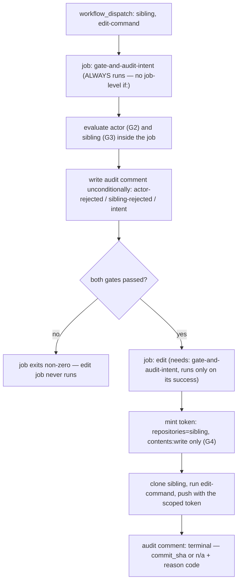

# Design 1550 — Sibling-edit workflow: permission-scoped, audited dispatch

Realises [spec 1550](spec.md): a `workflow_dispatch`-only `sibling-edit.yml`
that, for one allow-listed sibling per invocation, mints a sibling-scoped
`contents:write` token, runs one edit step against the cloned sibling, and emits
a per-attempt audit record to a monorepo destination — honouring the five
guardrails (G1–G5) verbatim. Tracks [#1740 lineage / #1549](spec.md).

## Components and where they change

| Component | File | Change |
|---|---|---|
| Dispatch workflow | `.github/workflows/sibling-edit.yml` (new) | The whole control surface: `workflow_dispatch` trigger with `sibling` + `edit-command` inputs, two jobs (audit-intent, then edit), actor gate, allowlist validation, scoped token mint, edit, push, terminal audit. |
| Token mint | within `sibling-edit.yml` | `actions/create-github-app-token@…#v3` scoped to the validated sibling with `contents`-only write — the publish-skills.yml scoping pattern. |
| Audit destination | a monorepo GitHub **Issue** (one long-lived "Sibling-edit audit log" issue), written with the monorepo `GITHUB_TOKEN` | One comment per invocation attempt; the issue is named in `.github/CLAUDE.md`. |
| Doc correction | `.github/CLAUDE.md` § Editing a published action | Replace both the wrong-contract framing ("GITHUB_TOKEN has push rights to every sibling") **and** the clone-and-push recipe that depends on it with the monorepo-scoped truth + a pointer to `sibling-edit.yml` and the audit issue. |
| (optional) reuse | `.github/actions/sibling-edit-audit/` | Only if the intent-record and terminal-record share enough to factor out; the spec permits one new `.github/actions/` dir. Default: inline, no composite. |

## Job topology — every attempt is audited, even a rejection (G5)

**The gate job carries no job-level `if:`** — a false job-level condition skips
the job and writes nothing, which would leave a rejected actor unaudited and
defeat G5. Instead the gate job always runs; it evaluates the actor and sibling
_within_ the job and writes the audit comment **before** deciding the exit code,
so an `actor-rejected` or `sibling-rejected` attempt is recorded even though the
job then fails and the edit job (which `needs:` the gate's success) never
starts. The intent record thus survives independently of the edit job's exit — a
crash or cancel in the edit job still leaves the intent comment (G5's "single
end-of-job audit-write is insufficient"). The edit job adds the terminal
comment.

## Key Decisions

| # | Decision | Rejected alternative |
|---|---|---|
| D1 | **The token is minted per-invocation, scoped to the single validated sibling and to `contents` write alone**, via the same App-token action the repo already uses to scope `publish-skills` to one repo. Because that action grants the App installation's _full_ permission set unless restricted, the design's safety is a positive constraint: the mint requests `contents` write and **no other** `permission-*` (so no `actions`/`workflows` reach, G4). The App is already installed on the five siblings (spec residual); the mint scopes the _token_, not the App. | _Widen `kata-dispatch.yml`'s standing token_ (spec problem option 2): every 3×/day run would then hold cross-repo write — the permanent-scope widening the spec forbids. _A personal PAT_: off the bot's audit identity, no scope control. _OIDC federation_: out-of-band credential G4 explicitly bars. _Mint with no permission restriction_: inherits the App's whole installation scope — the omission-equals-grant default G4 forbids. |
| D2 | **Audit destination = a single long-lived monorepo Issue, one comment per attempt, written with the monorepo `GITHUB_TOKEN`.** G5 mandates the audit-write use the monorepo identity (the sibling-scoped token cannot reach a monorepo destination) and a persistent destination; an Issue's comment history is queryable and durable, and the `GITHUB_TOKEN` carries `issues: write` on the monorepo. `.github/CLAUDE.md` names the issue number. | _Commit+push to the sibling_ (publish-skills pattern): wrong identity and wrong repo — the spec requires the monorepo identity so the audit-write is observable in a monorepo destination. _A Discussion_: viable but Discussions have no stable per-comment API ergonomics here; an Issue is simpler and equally durable. _An uploaded artifact_: rotates with run retention — not persistent (G5 rejects runner-log-lifetime records). |
| D3 | **The gate-and-audit job runs unconditionally and writes the audit comment before it decides its own exit; the edit job depends on the gate's success.** A job-level `if:` would skip the job — and its audit step — on a rejected actor, leaving the attempt unrecorded; the gate evaluates the actor (G2) and sibling (G3) _within_ the always-running job so a rejection is still audited. The edit job mints/edits/pushes only after the gate succeeds, and its intent record (written by the gate job) survives an edit-job crash (G5). | _Job-level `if:` actor gate_: a false condition skips the job and writes no audit comment — defeats G5's "attempts rejected at the actor gate yield at minimum an intent record." _One job with an `always()` end-step audit_: G5 calls a single end-of-job audit-write insufficient — an OOM/cancel before it leaves no record. _A composite action wrapping everything_: hides the job boundary that gives G5 its crash-durability. |
| D4 | **The actor allowlist and the five-sibling allowlist both live in the workflow source, and the sibling is matched by literal equality before any token mint or interpolation.** G2 requires the actor allowlist to be in the workflow file (or a monorepo file the workflow shows in its log) — not repo settings, env secrets, or external lookups; G3 requires the sibling compared by exact value against the fixed five, with no glob/regex/substring, before it ever reaches a mint step or shell interpolation. The validation precedes the mint in the gate job. | _Allowlist from repo settings / env secret / external lookup_: G2 explicitly rules these insufficient. _Glob/regex/substring match on the sibling_: G3 forbids — a `*` or `.` could reach an out-of-set repo. _Validate after the token mint_: a bad value would already have minted a credential before rejection. |
| D5 | **The edit job's top-level `permissions:` is minimal and the edit step's `env:` exposes only the minted sibling token + the validated `sibling`.** Monorepo-side `permissions:` grants only what each job needs (gate/intent job: `issues: write` for the audit; edit job: nothing on the monorepo beyond defaults). The edit step never receives `toJSON(secrets)` or pre-existing secrets (`NPM_TOKEN`, `ANTHROPIC_API_KEY`, `KATA_APP_PRIVATE_KEY`, signing keys) — only `GH_TOKEN=<minted>` and `SIBLING=<validated>`. | _`permissions: write-all` / inheriting all secrets_: G4 bars broad scope and secret bleed into the edit step. _Passing the App private key into the edit step_: would let the edit step re-mint a broader token — defeats G4. |
| D6 | **The edit is parameterised as a single `edit-command` input run in the sibling clone; the audit's `commit_sha_being_pushed` is the literal pushed SHA, else `n/a` + a fixed reason code.** Reason vocabulary: `actor-rejected`, `sibling-rejected`, `edit-failed`, `push-rejected`, `no-change`. The edit step runs the command, commits if the tree changed, pushes with the scoped token, and reports the SHA. | _Hard-code a specific edit_: the workflow must serve any one-file sibling edit (spec § In scope), not one bug. _Omit the no-change/edit-failed codes_: G5 requires every no-push run carry an enumerated reason. |

## Residual exposure (design echoes spec, does not expand)

Compromised allowlisted dispatcher; standing App installation scope on the five
siblings; audit-destination tamper-evidence (an Issue comment is persistent, not
tamper-proof — the spec scopes tamper-evidence out); sibling working-tree
content executed by the edit step; sibling-internal references; **the
operator-supplied `edit-command` itself is arbitrary code run under the minted
token** — bounded by the actor gate (only an allowlisted dispatcher supplies it)
and the single-sibling `contents`-only token (it can only write `contents` on
the one validated sibling), but not otherwise constrained. The design adds no
mitigation beyond the five guardrails and introduces no new standing scope.

## Out of scope (design echoes spec)

GitHub-native wiki/sibling push-protection; trusted-human allowlist _membership_
(the workflow reads an allowlist; who is on it is a separate spec); audit for
non-CI edits; a sixth sibling; the § Third-party actions table. This design
delivers only `sibling-edit.yml`, the audit issue, and the `.github/CLAUDE.md`
correction.

— Staff Engineer 🛠️
