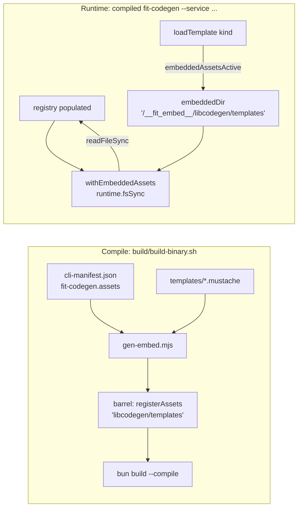

# Design 1560 — Compiled `fit-codegen` Runs Codegen to Completion

Spec: [spec.md](spec.md). The compiled `fit-codegen` binary launches (spec
1420 SC#3) but throws `Missing service.js.mustache` once codegen reaches a
render call: `CodegenBase.loadTemplate` resolves templates relative to
`import.meta.url`, and `bun build --compile` does not mount the `templates/`
directory into the binary.

## Mechanism choice

Spec 1420 already built the embedded-asset infrastructure the spec defers to:
`build/gen-embed.mjs` inlines a CLI's declared assets as text imports and calls
`registerAssets(mount, files)` (`libraries/libcli/src/embed.js`) before the
entry runs; `embeddedDir(mount)` returns a sentinel virtual directory; and
`withEmbeddedAssets(runtime)` overlays `runtime.fsSync` so `existsSync` /
`readFileSync` on that virtual directory serve from the registry, delegating
every other path to disk. `fit-terrain` consumes this exact pattern today
(`libraries/libterrain/src/cli-helpers.js`, `bin/fit-terrain.js`).

This design **reuses that mechanism unchanged** for `fit-codegen`'s templates.
No new embedding machinery is introduced; the work is wiring `libcodegen` and
the `fit-codegen` bin into the existing one, declaring the asset, and tightening
the build gate.

## Components

| Component | Role | Change |
|---|---|---|
| `build/cli-manifest.json` | Declares per-CLI compile assets | Add an `assets` entry to the `fit-codegen` CLI: `from: libraries/libcodegen/templates`, `mount: libcodegen/templates`. `gen-embed.mjs` then inlines the 5 `.mustache` files into the binary. |
| `CodegenBase.loadTemplate` (`libraries/libcodegen/src/base.js`) | Resolves a template kind to its file body via the injected `fs` | Swap the base-directory expression: when `embeddedAssetsActive()`, join the filename directly onto `embeddedDir("libcodegen/templates")` (a complete sentinel path, no `import.meta.url` / `..` / `templates` segments); else keep the existing `fileURLToPath(import.meta.url)` → `../templates` join. The `existsSync`/`readFileSync` calls and the throw-on-missing contract are unchanged. |
| `fit-codegen` bin (`libraries/libcodegen/bin/fit-codegen.js`) | Constructs the runtime and injects `fs` into `CodegenBase` | Inject the embedded-overlay sync fs (`withEmbeddedAssets(runtime).fsSync`) into the codegen instances so `loadTemplate`'s reads of the virtual directory hit the registry. Non-codegen disk reads in the bin keep the bare `fs`. |
| `CodegenServices.runExports` / `CodegenDefinitions.runExports` | Build the two exports files from a directory scan | Sort the `fs.readdirSync(...)` iteration (`services.js:55`, `definitions.js:62`) so output is deterministic across filesystems — the spec's "Rendered output" byte-equivalence repair. |
| `.github/workflows/build-binaries.yml` | Per-binary build gate (spec 1420) | Replace the generic `--help` smoke for `fit-codegen` with a generation invocation that exercises all five render paths (see § Build gate). Every other CLI keeps the `--help` smoke. |

## Data flow

In source / `npx` / test execution nothing registers, `embeddedAssetsActive()`
is false, `loadTemplate` takes the `import.meta.url` branch, and the overlay is
a no-op — the existing on-disk path is preserved exactly. This is also what
holds spec SC#5 (the npm-consumer invariant): a `@forwardimpact/libcodegen`
installed from `npm pack` ships `templates/**` (package `files`) and runs
unregistered, so its render paths resolve templates through the unchanged
`import.meta.url` branch with no caller-supplied template. The compiled-binary
work is purely additive to the npm path.

## Build gate

The spec requires the gate to exercise at least one render path per template
kind — the five rendered today (`service`, `client`, `definition`,
`services-exports`, `definitions-exports`) — and to fail on any
template-resolution or render-time error. The gate is **replaced for
`fit-codegen` only**, keyed on the CLI name, leaving the generic `--help` smoke
for every other binary.

The replacement invokes the compiled binary with
`--service --client --definition` against the same proto set
`bunx fit-codegen --all` resolves on `main` (the codegen step already runs
`just codegen` in the cell, so the `node_modules/@forwardimpact/*/proto` set is
present). That flag combination drives `generateArtifact` for
`service`/`client`/`definition` plus `runExports` for
`services-exports`/`definitions-exports` — all five mustache loads — without
invoking the `protobufjs-cli` pbjs subprocess that `--type` would (pbjs
resolution is a separate, pre-existing concern outside this spec's
template-resolution scope). The per-kind render paths fire only after a service
proto parses (`generateArtifact` returns early for pure-message protos), so the
gate's coverage rests on the resolved set containing at least one service proto
— which the `main` proto set does; the gate inherits the same set `--all` uses.
The cell's default `set -e` shell fails the gate on the binary's non-zero exit,
which is exactly the `Missing *.mustache` failure mode today.

**Negative-path demonstration (recorded per spec SC#3):** with the
`cli-manifest.json` asset entry removed, the compiled `fit-codegen --service`
exits non-zero with `Missing service.js.mustache` and the gate's `set -e`
fails the cell; restoring the asset entry turns it green. This is verified in
the implementation step and noted in the PR.

## Key Decisions

| Decision | Choice | Rejected alternative |
|---|---|---|
| Template embedding mechanism | Reuse spec 1420's `registerAssets` / `embeddedDir` / `withEmbeddedAssets`, declaring templates as a manifest asset | **Inline templates as string literals in `dist/`** — would fork the resolution story from `fit-terrain`, duplicate the build-time inlining `gen-embed.mjs` already does, and add a second source of truth for the 5 templates; rejected as redundant given working infrastructure. |
| Where resolution lives | Library-internal (`loadTemplate` consults `embeddedDir`); consumers still call render paths without supplying templates | **Consumer-side resolution** (each `bin` passes a template dir in) — would change the public render-path API the spec lists as an invariant and push the compiled-vs-source branch into every future consumer; rejected. |
| fs injected into codegen | `withEmbeddedAssets(runtime).fsSync` (overlay-or-passthrough) | **Conditionally swap fs only when compiled** — adds a branch in the bin for a value `withEmbeddedAssets` already returns unchanged in source execution; rejected as needless. |
| Gate flag set | `--service --client --definition` (5 render paths, no pbjs) | **Full `--all`** — also runs `--type` (pbjs subprocess) and `--metadata`, widening the gate to a pre-existing pbjs-in-binary concern this spec does not own; rejected to keep the gate scoped to template resolution. |
| Gate shape | Replace the smoke step for `fit-codegen` only, keyed on CLI name | **Add a second always-on step for all CLIs** — only `fit-codegen` reaches a render path; a generic generation gate is meaningless for the others; rejected. |
| Determinism repair | Sort both `runExports` `readdirSync` iterations | **Leave unsorted, hedge byte-equivalence** — the spec explicitly removed the reproducibility hedge and pinned byte-equivalence; an unsorted scan would make SC#2 flaky across filesystems; rejected. |

## Risks

- `runtime.fsSync` is the full `node:fs` sync surface (`createDefaultRuntime`);
  `withEmbeddedAssets` overlays only `existsSync`/`readFileSync` and spreads the
  rest, so `readdirSync`/`statSync`/`writeFileSync`/`mkdirSync` remain. Swapping
  the bare `fs` for `runtime.fsSync` in the codegen instances must keep those
  methods reachable — verified by the source-parity run (SC#4).
- The gate runs inside the existing `build` matrix cell after `just codegen`;
  the proto set must already be materialized there. The cell's `Ensure codegen
  is current` step guarantees this; the gate adds no new fetch.

## Out of scope

Per spec: Windows binaries, the `loadTemplate("exports")` orphan jsdoc kind
(Issue #1450), and forward-compat verification for hypothetical second compiled
consumers. The pbjs-subprocess resolution under `--type` is likewise untouched.

— Staff Engineer 🛠️
