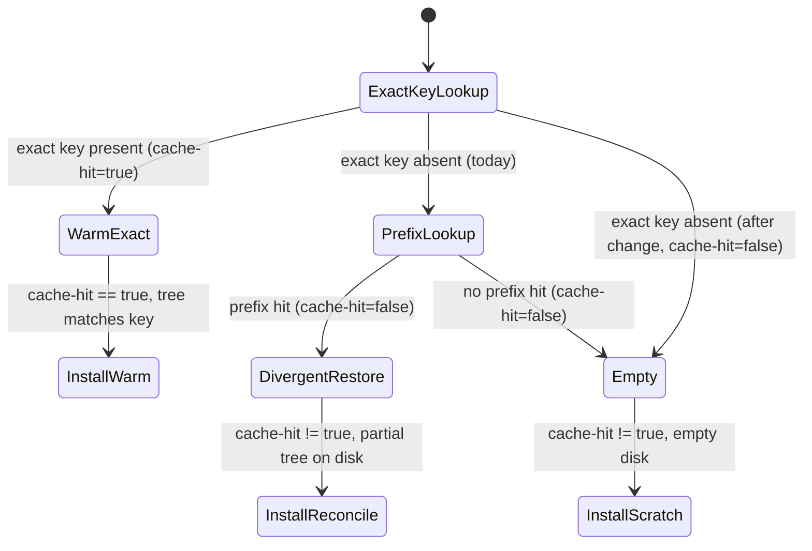
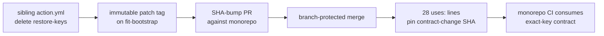

# Design 1580-a — `fit-bootstrap` environment cache integrity

## Architecture summary

The change is the removal of one input from one composite-action step,
plus the propagation of that change into the monorepo's runtime by
advancing an immutable reference. No component is added; one input
(`restore-keys`) is deleted, turning a prefix-fallback restore into an
exact-key-or-nothing restore. The architectural surface spans two repos
the monorepo owns: the sibling `forwardimpact/fit-bootstrap` (where the
contract lives) and the monorepo workflow set (which consumes it by SHA
pin). The cache *write* path, the key composition, and every action
input/output/step-id are unchanged.

## Components

| Component | Where | Role |
|---|---|---|
| Environment-cache restore step | `forwardimpact/fit-bootstrap` `action.yml`, step `id: env-cache` | Holds the contract. Today declares `key` + `restore-keys`; after the change declares `key` only. The deletion is the entire contract change. |
| Cache key (unchanged) | same step, `key` input | Content-addresses the resolved tree via `hashFiles(...)` over the six globs the spec names. Untouched — the change is in fallback semantics, not in the addressed inputs. |
| Cache write (unchanged) | `actions/cache` post-step | Uploads the workspace tree under the resolved key on job success. A cold exact-key cycle installs from lockfile, succeeds, and writes a clean tree — closing the cross-cycle loop without a write-path edit. |
| Contract documentation | `forwardimpact/fit-bootstrap` `README.md` | Names the cache as exact-key-restore-only and links spec 1580 for rationale. |
| Monorepo reference sites | `.github/workflows/*.yml`, 28 `uses:` lines across 19 files | Each pins `forwardimpact/fit-bootstrap` by SHA (`@<hash> # v1`, established by spec 1310's implementation). Propagation advances the hash to the contract-change commit. |

## Restore-path state machine

The defect is a state the prefix fallback admits; removing the fallback
deletes the divergent-restore state entirely.

The install step keys on `cache-hit`. Today `cache-hit != 'true'` reaches
two states: `InstallReconcile` (a partial tree restored under a *different*
key — the Issue #1458 failure mode) and `InstallScratch`. Removing
`restore-keys` deletes the `PrefixLookup`/`DivergentRestore`/`InstallReconcile`
path entirely, so `cache-hit != 'true'` now reaches only `InstallScratch`:
an empty disk that resolves the lockfile from scratch. That is the
before/after gate semantic the spec emphasizes — after the change,
`cache-hit != 'true'` *implies* an empty environment. `WarmExact` is the
sole non-empty restore, where the tree provably matches the key. The
`actions/cache` output semantics for `cache-hit` are unchanged.

## Cross-repo data flow

The monorepo half is a SHA advance, not an edit to action logic. This
routes through the same immutable-reference + Dependabot/SHA-bump path
spec 1310 established; the monorepo never inlines the action.

## Key decisions

| Decision | Choice | Rejected alternative |
|---|---|---|
| Where the contract lives | Delete `restore-keys` on the sibling `action.yml`; the monorepo only advances its SHA pin. | Fork the bootstrap logic into a monorepo-local composite action — abandoned: duplicates the single-source-of-truth action and diverges from `.github/CLAUDE.md` § Third-party actions. |
| Fallback removal vs. fallback repair | Remove `restore-keys` entirely (clean break). | Keep `restore-keys` but validate the restored tree against the new key — abandoned: re-introduces the mismatch-reconcile path the spec calls structural, and adds a verification step with no exact-key benefit. |
| Sequencing against spec 1310 | Consume 1310's SHA pin; advance the existing `@<hash> # v1` pin to the contract-change hash. | Force-move the sibling `v1` tag — abandoned: that is the mutable-tag procedure spec 1310 retired; the SHA pin is the durable path. |
| Cache write path | Leave untouched; rely on `actions/cache` post-step writing a clean tree after the first cold exact-key cycle. | Add an explicit cache-clear/clean-write step — abandoned: the cold-cycle clean write already closes the poisoning loop; an extra step is unrequested scope. |
| Prefix-bump interaction | Treat the interim `env-v2- → env-v3-` prefix bump as orthogonal; evaluate every criterion at the contract-change commit, not against current-main. | Re-author the prefix bump here — abandoned: explicitly excluded by the spec; it is the release engineer's unblocking move. |

## Sequencing precondition (ground truth)

The spec's stated snapshot (spec.md § Ordering dependency: references
still `@v1`, no 1310 implementation pass) has since been superseded.
Spec 1310's implementation merged and pinned all 28 monorepo
`forwardimpact/fit-bootstrap` references to SHA
`22e7a8a0…` (`# v1`) on `main` — the precondition the spec names as
required before this spec's monorepo PR opens is now satisfied. The
remaining ordering constraint is internal to this spec's
implementation: the sibling contract-change commit must exist before
the monorepo pins can advance to it. The plan owns that ordering.

## Scope boundary

In: the `restore-keys` deletion on the sibling step; a sibling
`README.md` note; advancing the 28 monorepo SHA pins. Out (per spec):
the interim prefix bump, `scripts/bootstrap.sh`, the cache-write path,
the key composition, the other sibling actions (audit tracked in Issue
#1471), and non-environment cache behaviour in consuming workflows.

— Staff Engineer 🛠️
