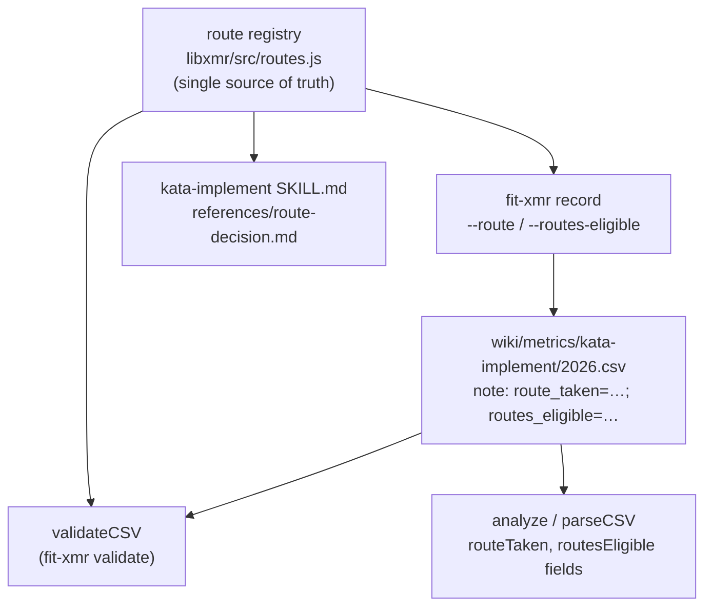

# Design A — kata-implement zero rows record route-decision context

Spec: [spec.md](./spec.md). Closes the gap where every zero row of
`wiki/metrics/kata-implement/2026.csv` reads identically, so the xRule2
streak cannot be partitioned into attempt-zeros vs route-conservation-zeros.

## Problem restated

The metrics CSV schema (`date,metric,value,unit,run,note,event_type`) is
**shared by every skill** (`libxmr` owns one `HEADER` constant; ~24 skill
CSVs use it). Route-decision context applies only to route-bearing metrics
(`implementations_shipped`). The route taxonomy (Route 1–4) lives only in
prose. There is one append surface (`fit-xmr record`) and one validator
(`fit-xmr validate` → `validateCSV`); both are skill-agnostic today.

## Architecture

Route context is a **structured sub-grammar inside the existing `note`
field**, not new top-level CSV columns. `libxmr` gains a single
source-of-truth route registry; the recorder writes the sub-grammar from
typed flags, the validator enforces it conditionally, and `analyze`/the
reader parse it into typed fields for partitioning.



### Why the sub-grammar, not typed columns

The recent zero rows on `origin/main` already carry
`route_taken=N; routes_eligible=[…]` text at the head of `note`. The
design ratifies that shape as a parsed grammar rather than inventing a new
column layout.

| Concern | Sub-grammar in `note` (chosen) | New typed columns | Sidecar file |
|---|---|---|---|
| Blast radius on the shared `HEADER` | None — global schema unchanged; SC4 (slots 40–66 byte-identical) holds by construction | Every skill CSV gains empty columns; mass header migration | None on CSV, but a second file to keep in sync per row |
| Machine-readable partition | Yes — parse a fixed prefix grammar, not free prose | Yes | Yes, but join key needed |
| Reversibility (spec § Reversibility) | Drop the grammar → notes are plain text again | Header rewrite to undo | Delete sidecar |
| Per-row self-containment | Yes | Yes | No — row + sidecar |

Rejected — **typed columns**: SC4 requires slots 40–66 unchanged and the
header is global; adding columns mutates the schema for ~24 unrelated
skill CSVs. Rejected — **parse free text** (spec direction b) and
**trace-reconstruct** (direction c): the spec's Decisions table already
rules both out; restated here only as the boundary the grammar respects.

### Components

| Component | Location | Responsibility |
|---|---|---|
| Route registry | `libraries/libxmr/src/routes.js` (new) | Exports `ROUTES` (the closed set: ids `1,2,3,4` with labels), the sentinel `none`, `ROUTE_BEARING_METRICS` (`["implementations_shipped"]`), `CONVENTION_START`, and `parseRouteContext(note)` / `formatRouteContext({routeTaken, routesEligible})`. The **single source of truth** all consumers import. |
| Recorder flags | `libraries/libxmr/src/commands/record.js` | New `--route <id>` and `--routes-eligible <list>` options. When the metric is route-bearing, the recorder prepends `formatRouteContext(...)` to `note`; rejects an out-of-set route or a missing route on a route-bearing metric before writing. |
| Validator | `libraries/libxmr/src/csv.js` (`validateRow`) | When `row.metric` ∈ `ROUTE_BEARING_METRICS` **and** `row.date ≥ CONVENTION_START` (the plan-implementation merge date, a new `libxmr` constant), parse the note grammar; on missing or out-of-set route, push `{line, field:"route_taken", message}`. Pre-`CONVENTION_START` rows are not route-checked, so the existing file (slots 40–64 carry no grammar) stays valid — SC4 holds. Surfaced unchanged by `fit-xmr validate` (line + field, exit 1). |
| Reader fields | `libraries/libxmr/src/csv.js` (`parseLine`) | `parseLine` calls `parseRouteContext(note)` and stamps `routeTaken` and `routesEligible` on every row object (empty when absent). The per-row fields are the read substrate the partition surface filters on. |
| Partition surface | `libraries/libxmr/src/commands/analyze.js` | A `--route <id>` filter (and `--routes-eligible-includes <id>`) that filters parsed rows **before** aggregation, restricting output to rows whose `routeTaken`/`routesEligible` match. `analyze` is the canonical reader for SC2 (it is already the storyboard's reader); `list.js` is not extended. |
| Convention doc | `.claude/skills/kata-implement/references/route-decision.md` (new) + `metrics.md` link | Documents the four routes and the recording rule (call `fit-xmr record --route … --routes-eligible …`). SKILL.md references it. Generic by design — names the published CLI, not monorepo paths. |
| Drift guard | `.coaligned/invariants/route-registry.rules.mjs` (new) | Asserts the route ids/labels documented in `route-decision.md` match `ROUTES` in `routes.js`; fails `bun run invariants` with `path:line` on divergence (SC6). |

### Data grammar

`note` for a route-bearing row begins with the grammar, then free text:

```text
route_taken=3; routes_eligible=[3,4]; <existing free-text note continues>
```

- `route_taken=` one **bare id** (`1`/`2`/`3`/`4`) from the closed set, or
  `none` (a read-zero leg that fired no implementation route). This is the
  on-disk form the pilot rows already use; the spec's SC1/SC2 `Route N`
  phrasing names the route, the bare id is its serialized key. The
  partition surface accepts `--route 1` and matches `route_taken=1`; the
  `Route N` ↔ `N` mapping is declared once in `ROUTES`.
- `routes_eligible=[…]` a bracketed comma list of ids; may be empty `[]`.
- `parseRouteContext` returns `{routeTaken, routesEligible}`; absence →
  `{routeTaken:"", routesEligible:[]}` so pre-convention rows parse clean
  and chart unchanged.

### Source-of-truth coupling (SC6)

`routes.js` is the sole declaration. `record.js`, `csv.js`
(`validateRow`/`parseLine`), and `analyze.js` import `ROUTES` and
`ROUTE_BEARING_METRICS` directly — a code consumer cannot drift silently.
`route-decision.md` is prose, so the invariant rule parses its documented
route table (the same text-scrape shape `public-cli-set.rules.mjs` uses)
and diffs the ids/labels against `ROUTES`, failing `bun run invariants`
with a `path:line` naming which side drifted.

## Key Decisions

| Decision | Rejected alternative | Why |
|---|---|---|
| Route context is a parsed sub-grammar inside `note`. | New typed CSV columns. | The `HEADER` is global to all skills; SC4 forbids mutating slots 40–66, and typed columns would migrate ~24 unrelated CSVs. |
| Route registry lives in `libxmr/src/routes.js`. | A wiki data file or a `.coaligned` rule as the data home. | The recorder and validator are libxmr code; importing a JS constant gives build-time coupling. Routes are a kata-implement domain concept, generic enough to ship in the published library. |
| Validation is conditional on `ROUTE_BEARING_METRICS`. | Validate route fields on every row. | Only `implementations_shipped` is route-bearing; other skills' CSVs (kata-spec etc.) must stay valid with plain notes. |
| Backfill is not attempted; slots 40–66 (incl. pilot rows 65–66) are pre-convention. | Infer route context for existing rows. | Spec § Backfill: an inferred classifier misclassifies silently (Exp SE 1432-A). `parseRouteContext` returns empty for unparseable rows, so they chart unchanged. |
| `route_taken=none` is a valid value for a fired-no-route leg. | Require a numbered route on every row. | Read-zero legs (facilitated meetings) genuinely fire no implementation route; the spec's population split needs them distinguishable, not rejected. |

## Risks

- **Pilot rows 65–66 already match the grammar** and must be excluded from
  SC7's ≥20 count even though they parse. The follow-up spec owns that
  count; this design only guarantees they parse without error — the
  exclusion is a query-time filter (date-before-merge), not a parse rule.
- **`csvField` quoting**: the recorder's `csvField` quotes a `note` only
  when it contains `"`, `,`, or newline — a `routes_eligible=[3,4]` list
  carries a comma, so multi-id rows are quoted; a single-id `[3]` is not.
  Either way `parseLine` strips surrounding quotes before
  `parseRouteContext` reads the prefix, so the grammar parses correctly in
  both cases. The pre-existing `""`-escape gap in `parseLine` can only
  corrupt a free-text tail that embeds a literal quote, never the
  route prefix.

— Staff Engineer 🛠️
