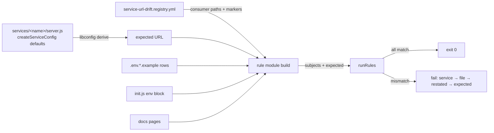

# Design 1600 — Service URL-default source-of-truth assertion

Architecture for [spec.md](spec.md): declare each in-scope service's listen
URL in its own `createServiceConfig` manifest, then assert — at build time —
that every registered consumer surface restates the URL that manifest
produces. This protects the spec's primary tenant: the agent driving an install
from the published docs, who must reach the same URL the surface it just
consulted named.

## Components

| Component | Where | Responsibility |
|---|---|---|
| **Manifest declaration** | each `services/<name>/server.js` `createServiceConfig` defaults | The single authoritative source per service. libconfig already derives `url` from a `protocol`+`host`+`port` triple (or an explicit `url`) and resolves `SERVICE_<name>_URL` overrides against it (`config.js:150-174`). |
| **Producer** | `build()` of the new rule module, via a shared `expected-url.mjs` helper | `services/<name>/server.js` is a side-effecting entrypoint (top-level `await service.start()`) and cannot be imported for its defaults. The producer instead AST-parses the file (`lib/ast.mjs` `parseModule`/`walkAst`), extracts the `createServiceConfig("<name>", {…})` defaults object literal, and applies libconfig's documented network derivation (`protocol`→`grpc`, `host`→`0.0.0.0`, `port`→`3000` when absent; `url` if explicit) to compute the expected URL — no service boot. |
| **Registry** | `.coaligned/invariants/service-url-drift.registry.yml` | One entry per in-scope service: the manifest module to read, plus the concrete consumer paths and locator marker per surface kind. Adding a service is a registry-only edit. |
| **Gate** | `.coaligned/invariants/service-url-drift.rules.mjs` | A rule module on the live `coaligned invariants` host: `build()` returns the consumer subjects + expected URLs; `rules` flag any consumer whose restated URL ≠ expected. |
| **Audit** | `scripts/audit-service-urls.mjs` | A standalone script — independent of the rule module's assertion code per criterion 2 — that reads each manifest's expected URL (via the same `expected-url.mjs` helper, which does the AST read, not the rules) and prints the full `service → path → restated → expected` table. |
| **Consumer sweep** | one-time edits to registered consumer surfaces | Aligns every divergent surface so the gate's first run is green (criterion 6). |

## Data flow

## Host: the live coaligned invariants mechanism

`bun run invariants` is `bunx coaligned invariants`, which auto-discovers every
`.coaligned/invariants/*.rules.mjs` module (`libcoaligned/src/invariants.js`
`loadRuleModules`/`runRuleModules`) and is already wired into CI on every PR via
`bun run check`. Spec 1600's gate is one more rule module on that host —
`service-url-drift.rules.mjs` with a `.registry.yml` companion — following the
`model-defaults.rules.mjs` precedent, which is the existing scalar-value
invariant (a source-of-truth JS module + ripgrep'd consumer restatements
asserted for equality). No workflow edit is needed and the gate runs on every
PR, so a stale consumer cannot land — including a manifest-only change that
leaves consumers stale, because the module's `build()` reads the manifest fresh
each run and compares against the on-disk consumers regardless of which side a
PR touched.

The audit (`scripts/audit-service-urls.mjs`) and the rule module share only the
`expected-url.mjs` AST-extraction helper; the audit owns its own table-emit
logic and does not call the rules' `check`/`message`, keeping it independent of
the assertion code as criterion 2 requires.

## Key Decisions

| Decision | Choice | Rejected alternative |
|---|---|---|
| Gate host | A new rule module on the live `.coaligned/invariants` host, in the `model-defaults.rules.mjs` mold (source-of-truth read + scanned consumer restatements asserted for equality). | A standalone `scripts/check-*.mjs` outside the host — that family was migrated into `.coaligned/invariants`; a one-off script would sit outside the discovered run and the shared `rg`/`ast` helpers. |
| Manifest read | AST-parse `server.js` for the static `createServiceConfig` defaults literal (the file is a side-effecting entrypoint, not importable for its defaults). | Import `server.js` to read its config — boots the service (top-level `await service.start()`), so the read must be static, unlike `model-defaults`, which imports a pure constants module. |
| Expected-URL source | Apply libconfig's documented derivation to the extracted defaults, so the assertion targets the produced URL. | Re-implement a divergent `protocol`+`host`+`port`→`url` concatenation — would drift from libconfig's runtime behaviour. |
| Manifest declaration shape | `protocol`+`port` in defaults (the `host` stays the bind-default `0.0.0.0`). libconfig overwrites any explicit `url` key from `protocol://host:port` (`config.js:154`), so a `url` string in defaults does not survive — only the triple's components reach the produced URL. | A `url` string in defaults (the spec's other permitted form) — clobbered by libconfig's unconditional `url` re-derivation, so it never takes effect. |
| URL equality (host normalization) | Compare protocol + port + a **normalized host**, collapsing `0.0.0.0`, `localhost`, `127.0.0.1`, and `<name>.guide.local` to one token. The manifest produces `<proto>://0.0.0.0:<port>` (bind host) while consumers and the client (`librpc/src/client.js:54-57`) use `localhost`/`<name>.guide.local`; equality must see through that. | Raw string equality — would force every consumer to write `0.0.0.0`, contradicting the `localhost` convention the env files, docs, and client connection all use. |
| Registry format | YAML, one row per service: manifest module + per-surface consumer paths + locator marker. | Hard-code consumer paths in the module — adding a service would edit assertion logic, breaking the registry-only-edit criterion. |
| Consumer locator | A parseable per-row anchor only (env `SERVICE_<NAME>_URL=` line, `init.js` literal, a docs code-block/`curl` URL pinned by an explicit marker). | Scanning free prose for URLs — the spec excludes sentence-form mentions (e.g. init.js's "ports 3001–3005"); only structurally anchored restatements are asserted. |
| Registry scope | Only in-repo `SERVICE_<name>_URL` rows with a single declared default. | Including `_CALLBACK_BASE_URL`/`_LINK_BASE_URL` (per-deployment, no in-repo default) or out-of-repo consumers (published packs, downstream `.env`, sibling repos) — neither has an in-repo declared URL the gate can assert against (spec § Excluded). |
| Source-of-truth channel | Assert each manifest's declaration travels through libconfig's existing network-default derivation. | Hardening libconfig to remove its implicit `grpc://0.0.0.0:3000` default — a separate question the spec defers; this gate assumes that channel persists. |

## Surface kinds and locator markers

Per registered service the registry names the consumers and how the module
extracts each restated URL:

| Surface kind | Path(s) | Locator |
|---|---|---|
| Manifest (source) | `services/<name>/server.js` | libconfig-derived URL — the expected value, not a consumer |
| Operator examples | `.env.local.example`, `.env.docker-native.example`, `.env.docker-supabase.example` | `^#?\s*SERVICE_<NAME>_URL=` line, commented or not |
| Bootstrap CLI | `products/guide/src/commands/init.js` | `SERVICE_<NAME>_URL:` literal in the env block |
| Public docs | `websites/fit/docs/services/<topic>/index.md`, `websites/fit/docs/internals/<topic>/index.md` | code-block URL / `curl …/health` host:port, each pinned by an explicit per-row marker the plan records from the on-disk page |

Each registry row carries only the surfaces that service has on disk; the plan
phase reads the live tree to populate the exact set (MCP shows three
`typed-contracts` docs hits at `3008`; embedding shows the `internals/vectors`
hit). The 16-service count the spec cites at filing is the registry's initial
population target; the plan reads `services/<name>/` at implementation time and
registers each service that produces a `SERVICE_<name>_URL`, so the registry's
final row count is whatever the live tree yields, not a frozen 16.

## Disjointness from spec 1460

Both gates can live on the same `.coaligned/invariants` host yet share no
registry row and no asserted value: 1460 asserts list-shaped enumerations
(services tree, library counts, sibling tables) and 1600 asserts scalar
`SERVICE_<name>_URL` strings. The topology separation is structural — a URL
scalar never appears in a list-enumeration registry and a tree-count never
appears in `service-url-drift.registry.yml` — so co-residence on the host does
not couple the two registries.

## Error surface

On any disagreement the rule's `message` names the service, the consumer file
(with line, since each consumer subject carries the line from its ripgrep
match), the restated value, and the expected value; `severity: "fail"` makes
the run non-zero. The host emits one finding
per stale consumer — the unambiguous one-line-fix output criteria 3, 4, and 5
require — and the shape is identical whether the stale row belongs to an
initial-registry service or a newly added one (criterion 5).

## Risks

- **Docs marker ambiguity.** Prose pages restate URLs in varied forms (code
  block, `curl` probe). The plan must record a concrete per-page anchor in the
  registry; free-prose mentions stay out of scope per the spec.
- **libconfig load side-effects.** Loading a manifest for its defaults must not
  start the service or require its runtime collaborators. The producer reads
  the `createServiceConfig` defaults object and applies libconfig's
  network-default derivation in isolation.
- **Port-value collisions during the sweep.** The sweep assigns one canonical
  URL per service; the plan must choose values that avoid binding collisions
  (init.js currently disagrees with the env files on mcp).

— Staff Engineer 🛠️
