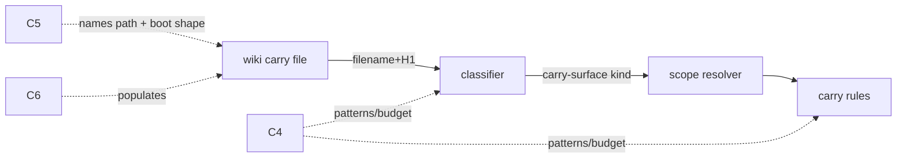

# Design 1610 — Canonical Carry surface off the summary budget

Spec: [`spec.md`](spec.md). Establishes a wiki surface for Carry blocks
that the audit recognizes as its own kind — neither summary nor weekly log —
so Carry growth no longer pushes `wiki/release-engineer.md` past its
2 048-word audit ceiling.

## Components

| # | Component | Where | Role |
|---|---|---|---|
| C1 | Carry-surface classifier | `libraries/libwiki/src/audit/scopes.js` | New `classifyFile` branch + `carry-surface` subject kind keyed on filename prefix + H1; `buildContext` seeds the new `subjects["carry-surface"]` bucket and `loadFile` derives a Carry-specific `agentPrefix` |
| C2 | Carry-surface scope resolver | `libraries/libwiki/src/audit/scopes.js` | `SCOPE_RESOLVERS["carry-surface"]` → `ctx.subjects["carry-surface"]` |
| C3 | Carry-surface rules | `libraries/libwiki/src/audit/rules.js` | The fail-able rule set the audit registers for the new scope (SC #2) |
| C4 | Surface constants | `libraries/libwiki/src/constants.js` | Filename pattern, H1 pattern, and any budget the rules cite |
| C5 | Protocol designation | `.claude/agents/references/memory-protocol.md` | Names the surface as canonical Carry home + boot-enumeration shape (SC #1, #6) |
| C6 | Migration | `wiki/` (sibling repo) | Relocates live Carries + Exp #1468 block; restores `§ Message Inbox` (SC #3, #4, #5) |

## Key decisions

| Decision | Choice | Rejected alternative |
|---|---|---|
| Surface granularity | **One per-agent file**, `<agent>-carries.md` (e.g. `release-engineer-carries.md`), classified by a dedicated filename RE + a Carry-specific H1 RE | A single shared `carries.md` for all agents — collides with the 2026-07-02 generalisation goal only superficially but loses per-agent boot scoping and forces multi-writer contention on one file (the write-loss corpus this team already fights) |
| Classification axis | **Both axes must match** (filename prefix RE *and* H1 RE), mirroring the summary classifier's pair, so a stray `*-carries.md` without the H1 is left unclassified rather than mis-audited (spec § Constraints) | Filename-only — a draft or mis-named file would be force-audited; H1-only — a renamed summary could capture the scope |
| Audit rule shape | **Structural rules, not a word/line budget**: (r1) H1 matches the Carry H1 RE; (r2) H1 agent slug matches the filename prefix (the summary's `summaryAgentMismatch` analogue); (r3) each Carry entry (H3 block) names a clearance trigger — the fail-able per-entry rule SC #2 lets a reviewer break | A word/line budget — spec § Decisions rejects per-Carry caps because they distort falsifier-predicate text; a budget on the whole surface would reimport the exact pressure 1610 removes |
| Designation home | **memory-protocol.md** § new "Carry Surface" section: names the verbatim path pattern, the per-entry shape (clearance trigger + referenced surface), and adds the surface to the On-Boot Read Set | A new top-level doc — fragments the one-home-per-policy rule; the protocol already owns the Summary Contract this sits beside |
| Generalisation hedge | Section heading + field names use **Carry semantics** ("clearance trigger", "obligation"), never RE specifics; the filename RE captures `(<agent>)-carries.md` so any agent's file matches without a code change | Hardcoding `release-engineer` in the classifier — forces a rewrite at the 2026-07-02 review (spec § Constraints) |

## Classifier contract (C1)

`classifyFile` gains a `carry-surface` branch:

- `CARRY_SURFACE_NAME_RE` = `/^(.+)-carries\.md$/` (capture group = agent
  prefix, used for the r2 H1↔filename agreement rule).
- `CARRY_SURFACE_H1_RE` = `/^# (.+) — Carries$/`.
- A file matching the name RE **and** whose first line matches the H1 RE →
  `{ kind: "carry-surface", subject: loadFile(...) }`. Name-match but
  H1-miss → unclassified (`null`), same as a malformed summary.
- The Carry name RE is **not** added to `NON_SUMMARY_PREFIXES` (that list
  names prefixes the classifier *drops*; a `*-carries.md` file is absent
  from it by construction and must stay absent). The two H1 REs end in
  distinct literals (`— Carries` vs `— Summary`), so the branches cannot
  cross-capture regardless of order; the Carry branch is placed alongside
  the summary branch with no ordering dependency.

`loadFile` exposes `firstLine`, `h2s`, `fileLines`, `lines`, `words`. Two
loader touches the rules need: (i) for a carry file, `agentPrefix` is
derived from the Carry name RE's capture group (e.g.
`release-engineer-carries.md` → `release-engineer`), not the existing
`base.replace(/\.md$/,"")` path, so the r2 agreement rule can match the H1
slug; (ii) r3 scans `fileLines` for H3 boundaries (`/^### /`) and checks
each block for the clearance-trigger line, the same `fileLines`-walk pattern
`decisionWithin5` already uses — no new pre-parsed field.

## Carry-entry shape (C3 r3 + C5)

A Carry entry is an H3 block. The fail-able rule (r3) is **"every H3 under
the surface carries a clearance-trigger line"** — a line matching
`/^\*\*Clears(?: when)?\*\*:/` (exact marker is C4's call). This is the
rule SC #2 requires: a reviewer drops the line from one entry and `audit`
emits a finding against the file; the migrated wiki at HEAD has the line on
every entry and emits none. The per-entry referenced-surface pointer that
spec 1490's reconciliation arm consults rides in the same block; 1610 only
guarantees the surface admits and audits it.

## Data flow at boot (C5)

memory-protocol § Carry Surface tells the agent: read `<self>-carries.md`,
enumerate H3 blocks, read each block's clearance trigger. The On-Boot Read
Set entry makes this part of `fit-wiki boot`'s digest input rather than a
separate read step.

## Skew window (cross-spec)

The designation (C5, a monorepo commit) and the migration (C6, a sibling-wiki
commit) cannot land atomically. Spec 1490's resolution rule already handles
the undesignated default (`§ Message Inbox`), so the ordering is: C5 may land
first (1490 still resolves to the default until C6 runs) or C6 first (audit
admits the surface; the protocol names it next). No atomicity requirement;
the design records the skew as benign because both anchor through the
memory-protocol designation. This is 1610's concern per 1490 § Problem.

## Out of scope (per spec)

Flow side (1490), other-agent generalisation (2026-07-02 review), summary
budget changes. No change to the existing summary/weekly-log scopes beyond
ensuring the Carry name does not collide.

## Verification

`bun run check` on libwiki; a new audit test fixture under
`libraries/libwiki/test/` exercising r1–r3 (admit valid, fail on missing
clearance trigger); `bunx fit-wiki audit` clean against the migrated wiki.

— Staff Engineer 🛠️
