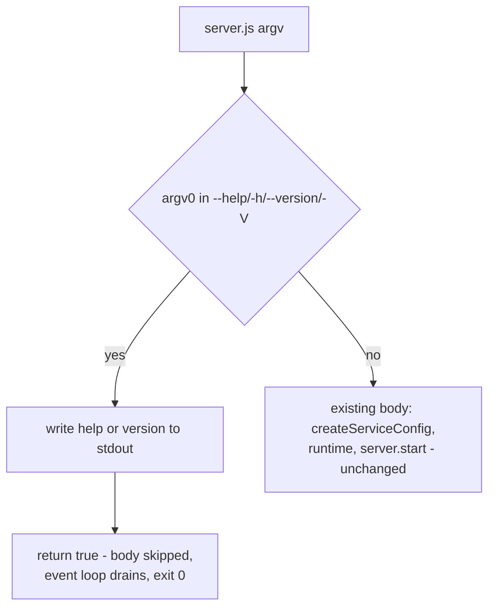

# Design A — Service CLIs Honour `--help`/`--version`

Design for [spec 1620](spec.md). Five gear-bundled service binaries
(`fit-svcgraph`, `fit-svcmcp`, `fit-svcpathway`, `fit-svctrace`,
`fit-svcvector`) gain a print-and-exit short-circuit for
`--help`/`-h`/`--version`/`-V` as first argument, and the two CI carve-outs
that compensated for its absence are removed.

## Components

| Component                                       | Role                                                                                                                                                                                                 |
| ----------------------------------------------- | ---------------------------------------------------------------------------------------------------------------------------------------------------------------------------------------------------- |
| `@forwardimpact/libcli/server-flags` (new)      | One exported function, `serverFlagsShortCircuit(...)` — strict first-token match, prints help or version, returns `true` when it handled the token, `false` otherwise. New subpath export in libcli. |
| `services/{graph,mcp,pathway,trace,vector}/server.js` | Each entry point calls the helper immediately after the preflight import; the existing server-start body moves unchanged inside `if (!handled) { … }`.                                          |
| `.github/workflows/build-binaries.yml`          | Smoke gate runs for every matrix cell; the `server` cell projection, the `if: matrix.server != true` guard, and the comment blocks describing the exemption are deleted.                              |
| `.github/workflows/publish-brew.yml`            | Gear smoke invokes the bundle's primary executable (first gear manifest entry — the same `GEAR[0]` that `build-app-gear.sh` passes as `--primary-exec`); the `.server != true` substitution and its deferral comment are deleted. |
| Per-service `test/bin-smoke.integration.test.js` (new ×5) | Follows the spawn-the-real-bin shape of the five product bin-smoke suites (e.g. `products/map/test/bin-smoke.integration.test.js`), extended for this spec: spawns `server.js` with each of the four tokens under an env stripped of `SERVICE_*`, with a per-spawn timeout, asserting exit 0, non-empty output, and no case-insensitive `listening` line. |

## Interface

```js
// @forwardimpact/libcli/server-flags
serverFlagsShortCircuit({
  name,           // "fit-svcgraph"
  description,    // one-line service summary for the help block
  packageJsonUrl, // new URL("./package.json", import.meta.url)
  argv,           // process.argv.slice(2)
  proc,           // default: process — injected for tests
  fsSync,         // default: node:fs — wrapped as { fsSync } into the
                  // runtime-shaped bag resolveVersion({ packageJsonUrl,
                  // runtime }) expects; callers never build a full runtime
}) => boolean
```

- Matches **only** `argv[0]` strictly equal to one of `--help`, `-h`,
  `--version`, `-V`. Anything else — including `--help` in second position,
  `--port 8080`, or no arguments — returns `false` and the caller proceeds to
  the untouched server-start path.
- `--help`/`-h` writes a short static usage block: name, description, the four
  tokens, and a line stating any other invocation starts the service.
- `--version`/`-V` writes the result of libcli's existing
  `resolveVersion({ packageJsonUrl, runtime })` — compiled binaries get the
  build-time `--define`-injected `LIBCLI_PACKAGE_VERSION` literal; source
  execution reads the service's `package.json`.

## Data Flow



The guard runs as the first statement of the module body, **before**
`createServiceConfig` — the first env-dependent call. Hoisted module imports
evaluate earlier than any check can, so the design relies on two existing
invariants that stay true:

1. **Imports are env-independent.** Importing `libconfig`/`librpc`/etc. has no
   env-dependent side effects (the `SERVICE_SECRET` crash of
   [#1041](https://github.com/forwardimpact/monorepo/issues/1041) happens in
   calls, not imports). The intentional exception, `libpreflight/node22`, is
   env-independent and must keep running first — a binary on an unsupported
   runtime should fail loudly even for `--help`.
2. **Imports create no live handles.** Natural event-loop drain only exits if
   no hoisted import opens a timer, socket, or watcher at module top level
   (true today across the five dependency graphs). A future violation would
   hang `--help` rather than fail it; the per-spawn timeout in the new
   bin-smoke suites turns that hang into a per-PR test failure instead of a
   30-minute CI cell timeout.

## Key Decisions

| Decision                                                        | Rejected alternative and why                                                                                                                                                                                                              |
| --------------------------------------------------------------- | ------------------------------------------------------------------------------------------------------------------------------------------------------------------------------------------------------------------------------------------ |
| Shared helper in libcli, new `./server-flags` subpath export    | Inline per service: five drifting copies of the same block. `libpreflight`: wrong concern — it is a side-effect import with no access to name/version, and conflating runtime preflight with argv handling muddies both.                  |
| Strict first-token match, no parsing                            | Full libcli `Cli`/`parseArgs`: would reject unknown options like `--port 8080` and re-order help/version semantics — an observable change to the non-token path the spec explicitly excludes.                                              |
| Handled tokens end by **natural event-loop drain** (helper returns `true`, body skipped) | `process.exit(0)` inside the helper: piped stdout writes may be truncated on exit, and both CI smoke gates capture output via command substitution — a flush race would make the exact gate this spec fixes flaky.       |
| Version via libcli `resolveVersion`                             | Direct `package.json` read in the helper: `bun build --compile` binaries ENOENT on runtime `readFileSync` of an unmounted file; the `--define` injection path already exists in libcli and is exercised (as a runtime env override) by the five product bin-smoke suites. |
| Guard lives in `server.js`, not `services/*/index.js`           | `index.js` is the service implementation consumed by tests and other composition sites; argv is an entry-point concern. Putting it in `index.js` would also run it behind eager entry-point initialization, defeating the short-circuit.   |
| Subpath export (`./server-flags`) rather than re-export from `.` | Re-exporting from libcli's index would pull the full `Cli`/help-renderer/format surface into five service dependency graphs for a ~40-line concern; a subpath keeps the bundle additive only where used.                                  |
| Workflow `server` projection deleted along with the `if:` guard | Keeping the unread matrix field: the manifest flag itself stays (spec out-of-scope, cleanup tracked under [#1347](https://github.com/forwardimpact/monorepo/issues/1347)), but a workflow cell field with no reader is dead weight that invites a future conditional. |
| Per-service integration smoke tests spawn `server.js` directly  | Relying on CI binary smoke alone: the compiled-binary gate runs only on release workflows and only with `--help`; a `bun test`-visible suite covers all four tokens on every PR, in the same pattern the five product packages already use. Four-token verification against **compiled** binaries (where `--define` injection differs from source) is the one-time implementation-verification step the spec's first three success criteria prescribe — a permanent CI gate for it is not added. |

## Behaviour Matrix

| Invocation (first arg)             | Result                                                                                  |
| ---------------------------------- | ---------------------------------------------------------------------------------------- |
| `--help`, `-h`                     | Usage block → stdout, exit 0, no port bind, no `SERVICE_*` env required                  |
| `--version`, `-V`                  | Version string → stdout, exit 0, same guarantees                                          |
| none, `--port 8080`, anything else | Existing server-start path, byte-for-byte the same module body — same ports, same errors |

## Scope Check

- Five `server.js` files change shape (guard + indentation), zero behaviour
  change on the non-token path; `services/*/index.js` untouched.
- libcli gains one module + one export-map line; existing exports untouched.
- The manifest `"server": true` flag is left emitted-but-unread per the spec's
  out-of-scope note; only its two workflow readers go.
- No new service dependencies beyond `@forwardimpact/libcli`.

— Staff Engineer 🛠️
