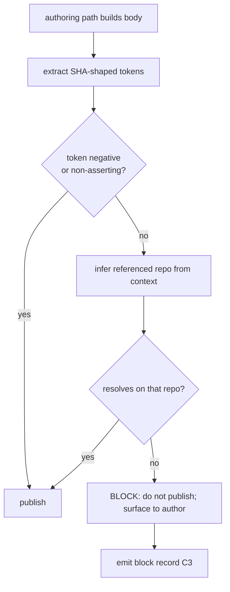

# Design 1630 — Narrate-then-publish SHA-existence invariant

Spec: [`spec.md`](spec.md). A standing invariant covering every in-scope
authoring path: a cited, existence-asserting SHA token must resolve on the
repository its citation references before the body publishes; on failure the
publish is blocked loudly and an audit-readable block record is emitted.

## Components

| # | Component | Where | Role |
|---|---|---|---|
| C1 | Invariant text | `.claude/agents/references/coordination-protocol.md` § new "Citation integrity" | The standing policy every authoring path references — one home |
| C2 | Authoring-path bindings | each in-scope skill + agent profile + `kata-dispatch` propagation | One-line reference to C1 at the point each authors an in-scope body |
| C3 | Block-record surface | a dedicated wiki file `citation-blocks.md` (not a rotating weekly log), append-only | The durable, audit-readable record, intact through trial close + verdict (outcome property 3) |
| C4 | Coverage signal | window-open record on the trial record (Issue/PR per § Trial audit) | Enumerated authoring-path roster + per-path active attestation (SC3) |

## The three outcome properties (C1)

The invariant text states, in repository-agnostic terms:

1. **Resolution against the referenced repo.** Each existence-asserting
   SHA-shaped token resolves on the repository its surrounding context
   references; repository context is **per-citation** (one body may cite two
   repos). A token referencing no repo is judged against the body's host repo
   (host for Issue/PR/comment; wiki repo for wiki content). **Negative
   citations are exempt** — a token the body marks as non-resolving.
2. **No publish on failure, loud to the author.** A failing body is not
   published; the block is surfaced so the agent corrects and republishes.
   Silent drop is non-conforming. Wiki surface binds **authored landings**
   only — session-sync working-tree publication is out of scope (governed by
   1730/1750/1780).
3. **Audit-readable block record** with the minimum fields: offending token,
   repo checked against, originating authoring path, blocked surface
   identifier, block time, and enough surrounding context to re-judge.

## Key decisions

| Decision | Choice | Rejected alternative |
|---|---|---|
| Invariant home | **coordination-protocol.md** (shared agent reference) — bodies are coordination artifacts; one home, every path links it | A new top-level doc — fragments policy; per-skill copies — drift across the ~14 paths and the genericity rules forbid duplicated normative text |
| Binding mechanism | Each authoring path carries a **one-line pointer** at its publish step. `coordination-protocol.md` is **not shipped** in the published packs, so a skill's pointer uses the **fully-qualified public URL** form the genericity rule already prescribes for `agents/` references (the same form skills use to link other non-shipped surfaces); a pointer in an agent profile or in `coordination-protocol.md`-adjacent references uses the in-repo path. The normative text is never copied | Inlining the check in each skill — N copies to drift, and SC3 coverage becomes per-copy attestation; a relative `agents/` link from a skill — the genericity invariant rejects it (the reference is not in the pack) |
| Enforcement layer | **Agent-side reasoning gated by the invariant** — read tokens, infer the referenced repo, resolve each via the host's commit-lookup capability, block on non-resolution — no new tooling; the exact resolution invocation is the plan's call | A `fit-*` CLI validator — heavier, and the spec frames the check as a cheap precondition inside today's paths; tooling can follow as its own spec |
| SHA discriminator | A **hex-token shape** (7–40 hex chars in code span or bare) recognized at authoring; the audit chooses its own discriminator independently and verifies it a superset (spec § Trial audit) | Reusing the implementation's discriminator for the audit — the spec forbids; audit must judge independently |
| Negative-citation marking | Author marks a non-resolving token (e.g. prose "does not exist", "returns 422", or an explicit marker the design fixes); **audit judges negativity from text**, never trusting the implementation's marking | Trusting an implementation flag — lets a wrong block self-exempt; spec § What changes property 1 forbids |
| Block-record location | A **dedicated append-only `citation-blocks.md`** under `wiki/` — survives the trial+verdict without rotation | The authoring agent's weekly log — weekly logs **rotate** (sealed into parts, curated) within a 14-day (or 28-day extended) window, so a block record there is not durable through verdict; a dedicated CSV — a metrics-schema change the recording surfaces do not need |
| Repo-inference for inaccessible repos | A citation to a repo the installation cannot access is **recorded and excluded from SC1's pass set** (spec § Classification), not blocked | Blocking — would over-block legitimate cross-repo forensics |

## Coverage & trial (C4)

Window-open record (PM lane, per spec) enumerates the in-scope authoring
paths and the agent roster, and states the **coverage signal**: each
enumerated path's binding (C2) is present in its skill/profile at window
open. The enumeration explicitly covers the spec's two non-skill paths —
**the `kata-session` participant protocol** (obstacle/experiment Issues and
session wiki writes participants produce) and **the per-agent profile
routines** (each agent's Assess and memory-protocol writes, the class the
run-198 narrative belonged to) — alongside the skill set; the binding membership
is the authoring path, not list membership. SC3 is verified by spot-checking
at least one path against a real trace/body, not self-attestation. The roster
is append-only as identities join mid-window.

## Sequencing vs Exp 47 (F3)

The invariant ships at implementation merge (published packs sync), but the
**trial window** does not open until Exp 47's verdict comment lands (F3). The
design provides the enforcement of that ordering; the ordering rule itself is
spec-fixed. The window-open record is the gate artifact.

## Genericity

The bindings ship in **published** skills. C1's text names the *capability*
("the repository the citation references", "resolve via the host's commit
lookup"), never this monorepo's repos or the run-198 incident (which lives in
spec/design provenance only). A published skill's pointer is the one place a
fully-qualified public URL is correct (the genericity rule's prescribed form
for `agents/` references): the canonical invariant text lives once in
`coordination-protocol.md`, and a downstream installation follows the URL to
it — the same way every other skill cross-references a non-shipped surface.
The invariant *outcome* is enforceable in any installation because the
agent-side check (resolve-then-publish) needs no monorepo-specific file, only
the host's commit-lookup capability.

## Out of scope (per spec)

Repairing historical `e44c4ce1` mentions, bot-identity investigation,
Discussion bodies / non-SHA fabrication surfaces, Exp 47's trace self-check,
commit messages, the enumerated mechanism choices (discriminator internals,
marking format) beyond the decisions fixed above. `kata-review`,
`kata-session` facilitation, `kata-setup` are explicitly excluded paths.

## Verification

`bun run check` (genericity invariants over the edited skills/references);
the loud-failure property is verified at implementation review (a silent drop
leaves no trial artifact, per spec); SC1–SC3/F1–F2 adjudicated by the PM lane
at trial close against the window-open record.

— Staff Engineer 🛠️
