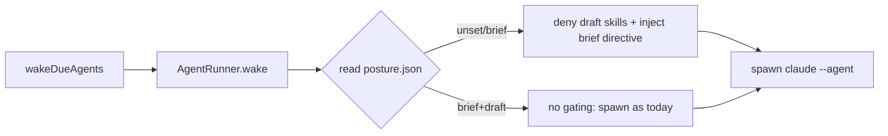

# Design 1640 — Outpost brief mode separated from draft-on-behalf at init

Translates [spec.md](spec.md). The spec commits to two adoption postures —
`brief` and `brief+draft` — recorded at `init`, honoured on every wake, and
named on the landing page. This design picks the components, the posture
record's home, the per-skill membership table, and the deterministic wake-path
gate that carries SC1/SC3 even though bundled agents run with
`bypassPermissions`.

## Components

| Component                       | Home                                              | Role                                                                                               |
| ------------------------------- | ------------------------------------------------- | -------------------------------------------------------------------------------------------------- |
| Posture record                  | `~/.fit/outpost/posture.json`                     | Single source of truth for the active posture. Written only by `init` and the SC5 affordance.      |
| Skill-posture manifest          | `products/outpost/config/skill-postures.json`     | Static, version-controlled membership table classifying every bundled skill `brief` or `draft`.    |
| `posture` module                | `products/outpost/src/posture.js`                 | Pure read/write of the record + manifest; resolves the disallowed-skill set for a given agent.     |
| `init` command                  | `outpost.js` → `KBManager.init`                   | Records default posture `brief` when none exists.                                                  |
| `posture` command (SC5)         | `outpost.js` dispatch                             | One-shot recording affordance for posture-less installs; documented in `--help`.                   |
| `status` command                | `outpost.js` → `showStatus`                       | Reads the record; emits `posture: <value>` when present, `posture: unset` when absent (SC6).       |
| Wake gate                       | `AgentRunner.wake`                                | Reads posture + manifest, denies draft-side skills and injects a posture directive into the spawn. |
| Landing-page posture subsection | `websites/fit/outpost/index.md`                   | Names both postures before the first `fit-outpost init` (SC7/SC8).                                 |

## Where the posture lives, and why a second file

The record is its own file, `posture.json`, **not** a key inside
`scheduler.json`. The spec's SC12 invariant — "no wake alters the posture" —
is only enforceable if the wake path never writes the file that holds it. The
wake path already reads and (on failure recovery) rewrites `state.json` and
reads `scheduler.json`; folding posture into either couples the load-bearing
invariant to code that legitimately writes. A dedicated file the wake path
opens read-only makes the invariant a property of the call graph, not a
convention. Shape: `{ "posture": "brief" | "brief+draft" }`.

The record sits inside `~/.fit/outpost/`, which is itself a clause-1 permitted
write zone (spec §What), so a brief-eligible skill could in principle write it
and self-promote. SC12's structural defense is twofold: (a) no bundled skill
writes `posture.json` — none does today, and the manifest-validation check
guards new ones; and (b) the brief directive the wake gate injects
(§Wake-path gate) forbids the agent from writing the posture record. The wake
path reads the posture and never persists it.

**Rejected — posture key in `scheduler.json`:** fewer files, but the migration
step and any future scheduler edit would touch the same file that must never be
wake-written, so SC12 would rest on reviewer vigilance rather than structure.

**Rejected — posture key in `state.json`:** `state.json` is rewritten on every
wake (`AgentRunner.wake` sets `status: active` then `idle`). Storing the
posture there directly violates SC12.

## Membership table (design deliverable, SC3-fixture binds to it)

Applying the §What boundary rule to every bundled skill's outbound surface.
**Draft-side** fails clause 1 (writes outside KB / `~/.fit/outpost/` /
`~/.cache/fit/outpost/`) or clause 2 (content authored as the user for delivery
to a third party).

| Skill            | Class   | Clause failed / why brief-eligible                                          |
| ---------------- | ------- | --------------------------------------------------------------------------- |
| draft-emails     | draft   | Clause 2 — composes an email reply as the user; `send-email.mjs` delivers.  |
| send-chat        | draft   | Clause 2 — sends a chat message as the user via browser to a 3rd-party app. |
| organize-files   | draft   | Clause 1 — moves files within `~/Desktop/`, `~/Downloads/` (outside KB).    |
| deck-create      | draft   | Clause 1 — writes `~/Desktop/presentation.pdf` (outside KB).                |
| doc-create       | draft   | Clause 2 — a proposal/report authored as the user for a third party.        |
| candidate-report | draft   | Clause 2 — a report authored for a named recipient, staged for delivery.    |
| sync-apple-mail  | brief   | Writes only `~/.cache/fit/outpost/`; ingest, no authored output.            |
| sync-apple-calendar | brief | Writes only `~/.cache/fit/outpost/`.                                        |
| sync-teams       | brief   | Writes only `~/.cache/fit/outpost/`.                                        |
| extract-entities | brief   | Writes only `knowledge/`.                                                    |
| manage-tasks     | brief   | Writes only `knowledge/Tasks/`.                                              |
| meeting-prep     | brief   | Writes briefings to `knowledge/Briefings/`; for the user, not a 3rd party.  |
| weekly-update    | brief   | Writes only `knowledge/Weeklies/`; for the user.                            |
| hyprnote-process | brief   | Writes only `knowledge/`.                                                    |
| hyprnote-follow  | brief   | Writes only `knowledge/` / cache.                                           |
| hyprnote-trim    | brief   | Edits a transcript in place under cache.                                    |
| deck-summarize   | brief   | Writes a markdown brief to `knowledge/`.                                    |
| doc-collab       | brief   | Edits documents inside the KB for the user; no 3rd-party delivery.          |
| req-track        | brief   | Writes only `knowledge/Candidates/`.                                        |
| req-screen       | brief   | Writes only `knowledge/Candidates/`.                                        |
| req-assess       | brief   | Writes only `knowledge/Candidates/`.                                        |
| req-decide       | brief   | Writes only `knowledge/Candidates/`.                                        |
| req-forget       | brief   | Deletes within `knowledge/Candidates/`.                                     |
| req-scan         | brief   | Writes only `knowledge/Prospects/`; never contacts candidates.             |
| req-workday      | brief   | Writes only `knowledge/`.                                                   |
| upstream-skill   | brief   | Produces a changelog inside the repo; developer-facing, not 3rd-party.     |

The manifest stores `{ "<skill>": "brief" | "draft" }` for all bundled skills.
The 6 bundled agents bind two draft-side skills: postman→`draft-emails`,
librarian→`organize-files`. The remaining draft-side skills are bundled but
unbound; the wake gate denies them by name regardless, so a future binding
cannot leak under `brief`.

## Wake-path gate (carries SC1, SC3, SC12)

Agent behaviour is prompt-directed, so skill gating alone is insufficient (spec
§Notes). The gate uses **two levers** the installed `claude` CLI already
exposes:

1. `--disallowedTools Skill(<name>)` for every draft-side skill (whole bundled
   set, not just the agent's bindings) — a deterministic deny the agent cannot
   override even under `bypassPermissions`.
2. `--append-system-prompt` carrying a fixed brief directive that neutralises
   any draft-side prose in the materialised agent definition (e.g. postman's
   "drafts replies") and forbids writing the posture record (SC12 defense b).

A posture-less record reads as `brief` (interim window, SC1). `brief+draft`
spawns exactly as today — no flags added — so SC4 (no suppression) holds by
construction.

**Rejected — settings.json `deny` rewrite per posture:** would mutate a file
shared with `update`/merge logic and require a rewrite on every wake, colliding
with SC12 and the clean-break rule. The spawn flags are per-invocation and
touch no persisted file.

**Rejected — strip skills from the materialised KB at `init`:** under `brief`
the KB would physically lack draft-side skills, but `brief+draft` installs and
later posture recording (SC5) could not restore them without re-running
`update`; SC10's superset guarantee would be hard to keep. Gating at spawn time
keeps every skill installed and toggles availability by posture.

## Migration (SC1, SC5, SC9, SC10)

`update` runs against pre-1640 installs that have every skill enabled. The
migration step is a no-op on the posture record: it never writes `posture.json`
(SC9 preserves `enabled: false` flags untouched; SC10 — skill availability only
ever grows across `update`, since `copyBundledFiles` adds, never removes). A
posture-less install therefore reads `brief` at the next wake (interim window)
until the user records one via the `posture` command (SC5). Migration never
flips configuration in either direction (SC9/SC10) because it does not touch
posture at all.

**Rejected — auto-record `brief` during `update`:** would satisfy SC1 sooner
but writes the record without the user's one-shot affordance, blurring SC5's
"user records a posture" contract and the interim-window definition. Leaving the
record absent and defaulting reads to `brief` keeps the affordance the sole
writer for upgrades.

## Key Decisions

| Decision                                          | Choice                                          | Rejected alternative                                                            |
| ------------------------------------------------- | ----------------------------------------------- | ------------------------------------------------------------------------------- |
| Where the posture is observed (SC6)               | Plain-text `posture: <value>` line in `status`  | `--json` mode — out of scope per spec.                                          |
| Default for posture-less reads                    | `brief`                                         | `brief+draft` — opt-out trust contract the spec rejects.                        |
| Manifest format                                   | Static JSON checked into `config/`              | A structured field in each `SKILL.md` — spec §Notes records none exists today.  |
| SC5 affordance surface                            | `fit-outpost posture <brief\|brief+draft>`      | A flag on `init` — `init` refuses to run on an existing KB, so upgrades need a separate command. |

## Risks

- The `Skill(<name>)` deny token must match the installed `claude` skill-tool
  naming. The plan verifies the exact token against the installed CLI before
  wiring the flag; if it differs, the deny list adjusts, the design holds.
- The manifest must be re-reviewed when a bundled skill is added. The plan adds
  a validation check that every bundled skill appears in the manifest so a new
  unclassified skill fails CI rather than silently defaulting.

— Staff Engineer 🛠️
