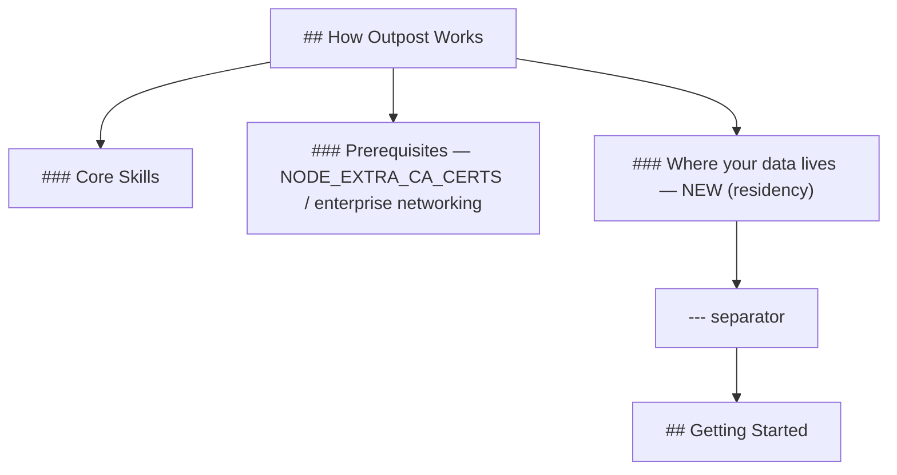

# Design 1650 — Outpost data-residency landing-page subsection

Architecture for the [spec](spec.md). The spec is a documentation change: add
one subsection to the Outpost landing page
(`websites/fit/outpost/index.md`) that answers the three data-residency
questions before the install step, plus a traceability table committed to this
spec's directory (SC5). No product code changes.

## Components

| Component | Role | Where |
|---|---|---|
| Residency subsection | New `###` section answering the three questions (storage locations, AI-call egress, Forward Impact role) plus the no-attestation stance and the non-model egress note. | `websites/fit/outpost/index.md`, placed before `## Getting Started`. |
| Traceability table | One row per declarative factual sentence in the subsection, pairing each sentence with its grounding surface (path, subprocess, doc URL, policy artefact, or named closed surface for absence claims). | `specs/1650-outpost-data-residency-landing/traceability.md` (committed by the implementing change). |
| Grounding surfaces | Read-only evidence the subsection's sentences cite. No surface is modified. | Outpost source + templates (see § Grounding map). |

## Placement and reading order

The page's current source order is: hero → What becomes possible → How Outpost
Works (Core Skills, Prerequisites) → **Getting Started** → macOS Privacy. SC4
requires the subsection's heading above `## Getting Started` in source order.

The subsection is a peer `###` under the existing `## How Outpost Works`
`##`-section, appended after `### Prerequisites` and before the `---` that
precedes `## Getting Started`. This keeps it inside the "how it works" narrative
(where data flow belongs) and structurally adjacent-but-distinct from the
`NODE_EXTRA_CA_CERTS` Prerequisites note, satisfying the spec's "distinguishable
from enterprise networking" requirement without a new top-level `##`.

**Rejected: a new top-level `## Data Residency` section before Getting
Started.** A peer `##` would read as a co-equal product pillar and pull weight
the finding does not warrant; nesting under "How Outpost Works" frames residency
as a property of how the product runs, which is what it is. Heading level is a
design choice (SC4 explicitly does not grade it); `###` under the existing `##`
is the lightest placement that still lands before Getting Started.

## Content structure (one SC per content unit)

The subsection's prose maps one block per success criterion so the reviewer's
SC checks (rendered-subsection reads) and the SC5 traceability rows align.

| Block | Content | Satisfies |
|---|---|---|
| Lead sentence | Frames the subsection as the data-flow answer, distinct from the CA-bundle note. | SC4 placement anchor |
| On-device storage list | The five named locations (KB path + drafts dir, cache directory, Apple Mail store, Apple Calendar store, scheduler home with its bounded-excerpt log/state files), each on-device. The existing IMAP/CalDAV disclosure lives in the Getting Started blockquote (`index.md:83-88`), which renders *after* this subsection; rather than forward-reference it, the storage list links to the Getting Started section by anchor so the buyer can follow the account-pickup detail without the subsection re-authoring it. | SC1 |
| AI-call paragraph | Three facts: Outpost delegates to the local Claude Code install and selects no endpoint; endpoint is whatever Claude Code is configured to reach (default Anthropic API); each prompt carries the assembled user content. No env-var enumeration. | SC2 |
| Non-model egress sentence | Default-template agents also make outbound calls beyond the model endpoint: scheduled public-source scans and chat-web-app browser automation. | SC7 |
| Forward Impact role sentence | No Forward Impact-operated server processes user content in the Outpost product; names the default third-party provider (Anthropic) that does receive calls. | SC3 |
| No-attestation stance | A structurally separate paragraph/list item: no BAA, SOC 2, or DPA exists today; regulated buyers run their own approval process. | SC6 |

Form: the storage locations render as a bullet list (shared structure, five
items); the AI-call/role/egress facts render as prose; the no-attestation stance
is its own paragraph to keep it structurally distinct from SC3 (SC6 requires the
separation).

**Rejected: a single dense paragraph covering all six SCs.** It would obscure
the SC6/SC3 structural separation the spec mandates and make SC5 row-mapping
ambiguous (which sentence grounds which fact). One block per SC keeps the
traceability table deterministic.

## SC5 traceability table

A standalone `traceability.md` in this spec's directory, not embedded in the
landing page (the page is buyer-facing; the table is a reviewer gate). Columns:
**Sentence** (verbatim declarative clause) · **Grounding** (the surface) ·
**Kind** (path read | path written | subprocess | doc URL | policy artefact |
absence-surface). Absence claims name the closed surface checked: the Outpost
product source for the no-server claim, and the published policy set for the
no-attestation claim.

**Published policy set definition (SC5 leaves this to the implementer):** the
no-attestation absence claim is grounded against the repository's shipped policy
artefacts — `SECURITY.md` and `CONTRIBUTING.md` § security — as the closed
surface where a BAA/SOC 2/DPA commitment would appear if one existed. The table
cites these by repo path; their *absence* of any such commitment is the
grounding.

**Rejected: grounding the no-attestation claim against an external trust
page.** No such page ships today; citing one would assert a surface that does
not exist. The closed surface must be an artefact in the repo.

## Grounding map (SC5 surfaces, verified on origin/main)

| Subsection fact | Grounding surface | Kind |
|---|---|---|
| KB path + drafts dir on-device | `products/outpost/src/agent-runner.js` (kbPath validated, passed as spawn cwd); `products/outpost/templates/CLAUDE.md` (`drafts/` under KB) | path |
| Cache directory holds synced content | `products/outpost/src/outpost.js:151` (`~/.cache/fit/outpost`); `products/outpost/templates/CLAUDE.md` (`apple_mail/`, `apple_calendar/`, `state/`) | path |
| Apple Mail / Apple Calendar local stores | `products/outpost/templates/CLAUDE.md` cache subdirs (`apple_mail/`, `apple_calendar/`) | path |
| Scheduler home + bounded excerpts | `outpost.js:147-150` (`~/.fit/outpost` config/state/logs/socket); `state-manager.js:106-108` (`lastDecision`/`lastError` excerpts, `slice(0,200)`) | path |
| Delegates to local Claude Code, no endpoint selection | `agent-runner.js` (`#findClaude`, spawn args; `#buildSpawnEnv` merges process env + config overrides only, never injects an endpoint) | subprocess |
| Default endpoint = Anthropic API | Claude Code published docs URL (settings/model-config) | doc URL |
| Each call carries assembled user content | `agent-runner.js` spawn (cwd = KB, `-p "Observe and act."`, agent reads KB + cache) | subprocess |
| Non-model egress: public scans + chat automation | `templates/.claude/skills/req-scan` (WebFetch public sources); the runner spawns `claude` with `--chrome` (`agent-runner.js:169`) and the `send-chat` skill drives chat-web-app browser automation | subprocess |
| No FI-operated server processes content | Outpost product source (`products/outpost/src` has only a local Unix-socket IPC server, no network server) | absence-surface |
| No BAA/SOC 2/DPA | `SECURITY.md`, `CONTRIBUTING.md` § security | absence-surface |

## Key Decisions

| Decision | Choice | Rejected alternative |
|---|---|---|
| Subsection heading level | `###` under existing `## How Outpost Works` | Top-level `##` — reads as a co-equal pillar, overweights the finding |
| Traceability table location | Standalone `traceability.md` in spec dir | Embed in landing page — pollutes buyer-facing surface with a reviewer gate |
| No-attestation grounding | `SECURITY.md` + `CONTRIBUTING.md` § security as closed surface | External trust page — does not ship today |
| Endpoint-default grounding | Link to Claude Code published docs (not Outpost source) | Cite Outpost source — Outpost selects no endpoint, so its source cannot ground the default |

## Scope guard (clean break)

This design adds content and one spec-dir artefact; it modifies no existing
landing-page section (hero, What becomes possible, Core Skills, Prerequisites
all unchanged per spec § Out of scope) and no product code. The
`NODE_EXTRA_CA_CERTS` note is left exactly as-is; the new subsection coexists
with it. No shim, no fallback — the page either has the subsection or it does
not.

## Note on SC1 location count

The committed `spec.md` SC1 verification names **five** locations (the fifth
being the scheduler home). The PR #1513 body describes an R4 round that intended
to drop scheduler home to four; that edit is not present in the committed
`spec.md`. This design implements the committed spec (five locations), grounding
the scheduler-home entry on `outpost.js:147-150` + `state-manager.js` excerpt
behaviour, which is accurate to the as-shipped architecture. The design does not
silently re-scope; the count is flagged here so the approver can settle it
(four vs. five) before the plan grounds the storage list.

— Staff Engineer 🛠️
