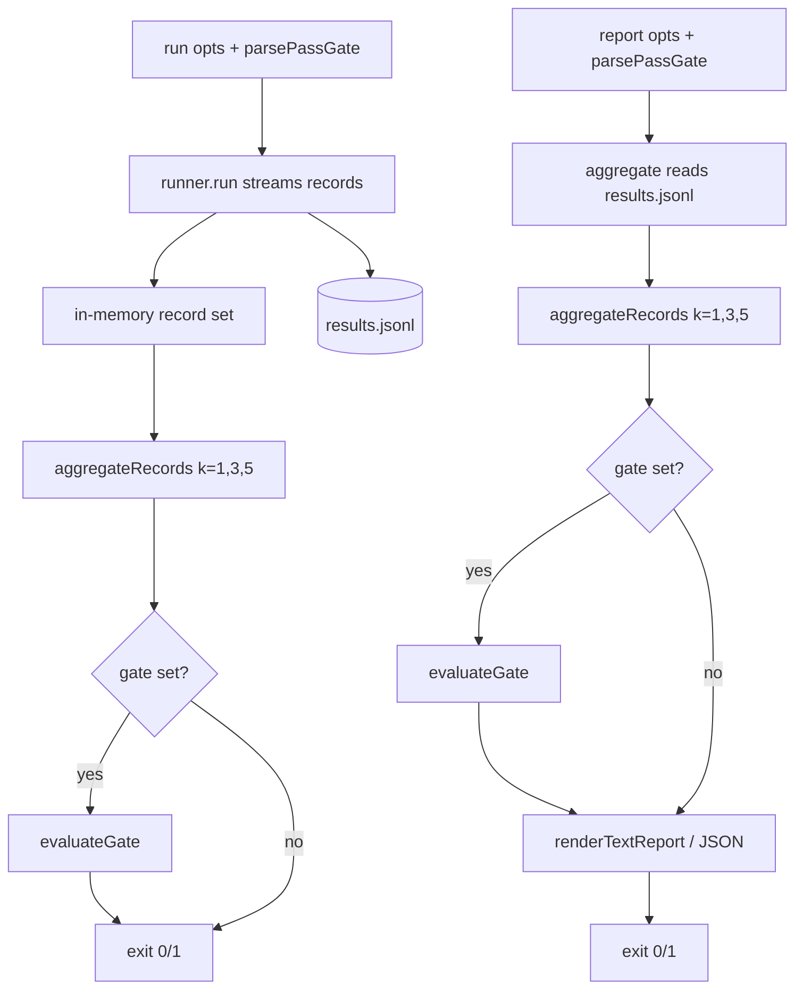

# Design 1660-a — fit-benchmark pass@k Threshold Gate

Restates [spec 1660](spec.md): decide the benchmark's pass/fail with a per-task
pass@k gate (every task must satisfy pass@`k` ≥ `t`), configured by
`--pass-k`/`--pass-threshold` on both `run` and `report`; drop `--k` and always
report pass@1/3/5; mirror the flags as `pass-k`/`pass-threshold` action inputs
and drop the `k` input; attribute failures per task. The gate replaces today's
"any run not `pass` ⇒ fail" rule. With no flags, only a harness-level failure
(no records produced) exits non-zero.

## Components

| Component | Location | Role |
|---|---|---|
| Gate module | `libeval/src/benchmark/gate.js` (new) | `parsePassGate(values)` validates and returns `{passK, passThreshold}` or `null`; `evaluateGate(report, gate)` recomputes pass@`passK` per task and returns the per-task gate result. Pure, no I/O. |
| Aggregator split | `libeval/src/benchmark/report.js` (edit) | New `aggregateRecords(records, {kValues})` holds the grouping/estimator core and validates each record through the same `validateResultRecord` filter the loader uses, so the in-memory (`run`) and persisted (`report`) sets agree; `aggregate({inputDir,...})` becomes a thin loader that reads `results.jsonl` then delegates. Display set fixed to `[1,3,5]` (caller `kValues` removed). `passAtKValue(n,c,k)` — currently module-private — is **newly exported** for the gate module. `renderTextReport()` renders gate markers when a gate result is attached. |
| Run command | `libeval/src/commands/benchmark-run.js` (edit) | Parses the gate; drops the per-record `anyFail` rule; collects the records it streams and feeds **that in-memory set** to `aggregateRecords` + `evaluateGate`; exits on the gate. No file read-back. |
| Report command | `libeval/src/commands/benchmark-report.js` (edit) | Drops `--k` parsing; parses the gate; aggregates from `results.jsonl`; attaches the gate result; exits on the gate. |
| CLI definition | `libeval/bin/fit-benchmark.js` (edit) | Adds `pass-k`/`pass-threshold` options to `run` and `report`; removes `k` from `report`; updates descriptions/examples. |
| Composite action | sibling `forwardimpact/fit-benchmark` `action.yml` | Adds `pass-k`/`pass-threshold` inputs, removes `k`, forwards to `fit-benchmark run`. Edit delivered per [`.github/CLAUDE.md`](../../.github/CLAUDE.md) § Editing a published action. |
| Docs & skill | `fit-benchmark` SKILL.md + `references/cli.md`; `run-benchmark` guides | Reflect new flags/inputs, removed `--k`/`k`, fixed 1/3/5 columns, new exit contract. |

## Interfaces

```text
parsePassGate(values) -> { passK: number, passThreshold: number } | null
  null            when neither --pass-k nor --pass-threshold present
  throws          when exactly one present, passK < 1, or threshold ∉ [0,1]

evaluateGate(report, gate) -> {
  passK, passThreshold,
  tasks: [{ taskId, passAtK, passed, insufficientRuns }],
  passed: boolean                          // false if any task failed
}
```

`TaskReport` already carries `n` and `c`, so the evaluator recomputes
pass@`passK` from each task independently of the materialized display columns —
the gated k need not be 1, 3, or 5. `passAtKValue` returns a `{error: "k > n"}`
sentinel when `n < passK`, so the evaluator branches on `n < passK` directly,
marking the task `insufficientRuns` and `passed: false`.

## Data flow



`run` gates over the **records it just produced** (the streamed set); `report`
loads them back from `results.jsonl`. Both route the same records through the
same `aggregateRecords` + `evaluateGate`, so a `run` verdict and a later
`report` verdict over those records agree by construction (the rejected
file-read-back alternative is in § Key Decisions).

## Exit-code contract

| Condition | run | report |
|---|---|---|
| Gate set, every task ≥ threshold | 0 | 0 |
| Gate set, any task < threshold (incl. insufficient runs) | 1 | 1 |
| No gate, records produced | 0 | 0 |
| Invalid/partial gate flags | 1 (handler error envelope) | 1 |
| `report --k=…` (removed option) | — | 1 (arg-parse error → top-level catch) |
| Harness cannot produce records (malformed/unreadable family) | non-zero (throws) | non-zero (throws) |

Gate-validation and removed-flag errors surface as non-zero through the existing
error paths (handler envelope `code: 1`; `cli.parse` unknown-option throw caught
by the top-level `main().catch` handler → exit 1), not as the `usageError`
exit 2 reserved for unknown commands. No
per-record operational special-case remains: a `preflightError` lowers a task's
pass@k like any other failing run, so a configured gate catches it and the
no-gate path leaves it informational.

## Key Decisions

| Decision | Choice | Rejected alternative |
|---|---|---|
| Where the gate runs | Shared `evaluateGate`, consumed by both `run` and `report` | Gate only in `report` (a bare `run`, and the action that calls it, lose a meaningful exit code); gate only in `run` (cannot re-gate an uploaded `results.jsonl` artifact without re-spending agent cost) |
| What `run` gates over | The in-memory record set it just streamed | Re-reading `results.jsonl` (runner appends, so a reused `--output` dir pools prior-run records into the verdict) |
| Gated k vs report columns | Evaluator recomputes pass@`passK` from each task's `(n,c)`; display fixed at 1/3/5 | Add `passK` to the materialized column set (couples the display surface to the gate; the spec fixes the columns) |
| `n < passK` (insufficient runs) | Fail the task, mark `insufficientRuns` | Skip the task (a task with too few runs would silently pass the benchmark); hard error (one short task should fail, not abort the report) |
| No-gate exit semantics | Non-zero only when no records are produced (harness throw); per-task outcomes are informational | Keep "any run not `pass` ⇒ fail" (the brittleness the spec removes); a per-record `preflightError` exit (indistinguishable from a task verdict fail in the record shape, and needs `includeRuns` detail the default path omits) |
| Partial config | `parsePassGate` rejects exactly-one-flag and out-of-range values | Default the missing flag (an arbitrary default threshold silently changes the gate; hides intent) |
| `--k` handling | Remove the flag; fixed `[1,3,5]` in `aggregateRecords` | Keep `--k` as a deprecated alias (the spec mandates a clean removal) |
| Action change delivery | Issue-with-diff against the sibling repo, then SHA-pin bump | Direct push (agent tokens lack rights on `forwardimpact/fit-benchmark`) |

## Risks

- **Cross-repo drift.** The action and CLI must ship the flag rename together,
  or a workflow passing `k` breaks — a coupling constraint the plan must honor
  when sequencing the CLI change and the sibling action edit + SHA bump.
- **Silent looser gate.** A user who relied on all-runs-must-pass and sets no
  threshold now gets a green build on agent failures. The guides call out the
  changed default explicitly so the looser semantics are not a surprise.

## Amendment 1 — action fully aligned with the CLI flag interface

Realizes spec § Amendment 1. No new monorepo components — the change lands in
the sibling `forwardimpact/fit-benchmark` `action.yml` and one docs page here.

| Component | Location | Role |
|---|---|---|
| Action input block | sibling `forwardimpact/fit-benchmark` `action.yml` | Remove the `k` input; add `pass-k`/`pass-threshold` inputs (no `default:`, so an unset input is omitted from the forwarded command line ⇒ no gate). The `Run benchmark` step appends `--pass-k`/`--pass-threshold` to `fit-benchmark run` only when the inputs are non-empty. |
| CI-workflow guide | `websites/fit/docs/libraries/prove-changes/run-benchmark/ci-workflow/index.md` | Swap the `k` table row for `pass-k`/`pass-threshold` rows; keep the "all `run` flags are inputs" prose accurate. |

**Key decision — validation stays in the CLI.** The action forwards inputs and
inherits `parsePassGate`'s both-or-neither/range exit; it does **not** duplicate
validation in `action.yml`. *Rejected:* pre-validating in the composite step
(forks the validation contract across two repos and drifts from the CLI).

**Key decision — empty-default omission, not pass-through of empty strings.**
An unset input is omitted from the command rather than forwarded as
`--pass-k ""`. *Rejected:* always forwarding the flags (an empty value would
hit the CLI's range/parse path and fail a no-gate run that should be
informational).

**Key decision — direct push, superseding the base "Action change delivery"
row.** The base design chose Issue-with-diff because
`actions/create-github-app-token` scopes to `kata-agent-team` only. The
environment provides an authorized GitHub token with sibling write access, so
the sibling edit lands by **direct push** — commit to the sibling `main`, cut
the next append-only patch tag, let Dependabot open the SHA-bump PR.
*Rejected:* Issue-with-diff (only required when no token carries sibling
rights; it is a slower manual handoff this environment does not need).

Sequencing is unchanged from § Risks: the patch tag forwards the new flags only
after a CLI version exposing them is published, since the action resolves the
CLI it shells out to.

— Claude (kata-design)
