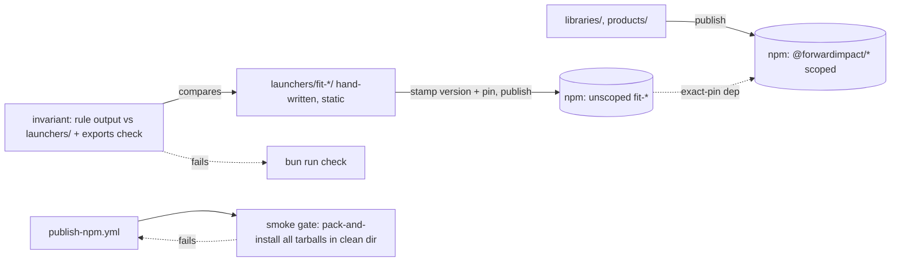

# Design 1670 — Public CLI Launcher Packages

## Summary

For each of the 22 public CLIs enumerated in
[spec § Public-CLI set](spec.md#public-cli-set-the-unit-of-work), publish a
thin **launcher package** whose npm name equals the invoked name (`fit-eval`,
`fit-wiki`, …) and whose only purpose is to re-exec the bin in the scoped
source package at an exact-pinned version. Launcher dirs are **hand-written
and static** — two short files each; the only dynamic content (version and
exact pin) is stamped at publish time from the source's `package.json` at
the tagged commit, so no checked-in file changes per release. Launchers
publish in the same workflow run as their source — both source and
launcher tarballs pass a pre-publish smoke gate
against locally packed tarballs, so neither registry version exists without
the other being already smoke-clean. A single build-time invariant computes
the rule's output and fails CI when the launcher set drifts from it or a
source package omits the bin subpath its launcher imports.

## Components



| Component | Where | What it owns |
|---|---|---|
| **Launcher package** | `launchers/fit-<name>/` (one per public CLI) | A `package.json` named `fit-<name>` plus a single `bin/fit-<name>.js` that dynamically imports the scoped bin — shape under [§ Launcher shape](#launcher-shape). Hand-written once, then static: `version` and the `@forwardimpact/<src-pkg>` dependency hold a `0.0.0` placeholder that publish stamps (see [Decision 4](#key-decisions)). No tests, no code beyond the launcher. Creating one is copying a sibling dir and editing two strings — the invariant's failure message names what is missing. |
| **Public-set invariant** | `scripts/check-public-cli-set.mjs` | The single alignment check. Computes the rule inline — non-private workspace bins ∩ invoked names grepped from `websites/fit/docs/**` and **published skill packs** (all markdown under `.claude/skills/{fit,kata}-*/`, `references/` included), plus a declared list of CLIs the sibling composite actions invoke (their sources live outside this checkout; the list sits beside the rule with a pointer to `.github/CLAUDE.md`'s sibling table, and is subsumed by docs/skills today) — then fails CI on: (a) `launchers/` set ≠ rule output (either direction); (b) a launcher's `bin` key ≠ its invoked name, its import path ≠ the rule's source-pkg/bin mapping, or the source's `exports` lacks that subpath (see [Decision 5](#key-decisions)); (c) a launcher's `version`/pin is not the `0.0.0` placeholder (keeps the stamp step the only version writer); (d) a launcher's `package.json` strays from the **allowed-keys schema** — `dependencies` is exactly one entry equal to the rule's mapped source, no `scripts` key, `files` is exactly `["bin/"]`, a single `bin` key, and no keys beyond the canonical metadata set. Launchers publish verbatim from the working tree, so (d) pins the full published surface: without it nothing forbids a smuggled extra dependency, a `postinstall` hook, or extra `files` entries riding into every `npx fit-*` install. |
| **Publish coupling** | `.github/workflows/publish-npm.yml` | Single per-tag job: run the public-set invariant, stamp matching launchers with the source's `package.json` version, pack source + launchers, install all tarballs into a clean dir, smoke each launcher, then publish source, then each launcher. See [§ Publish flow](#publish-flow). Matching launchers are found by reading `launchers/*/package.json` dependency names — the in-job invariant run guarantees that equals the rule's output even for a tag cut from a commit that skipped CI. Tags whose package has no launchers keep today's smoke path unchanged — the launcher steps are additive. |

## Launcher shape

```js
#!/usr/bin/env node
import "@forwardimpact/libeval/bin/fit-eval.js";
```

```jsonc
{
  "name": "fit-eval",
  "version": "0.0.0",                       // placeholder — publish stamps the source's version
  "type": "module",
  "bin": { "fit-eval": "./bin/fit-eval.js" },
  "files": ["bin/"],
  "dependencies": {
    "@forwardimpact/libeval": "0.0.0"       // placeholder — stamped to the same exact version
  }
  // common metadata (homepage/repository/license/author/engines/publishConfig)
  // hand-written once to the repo's canonical shape; invariant condition (c)
  // guards the placeholders, condition (d) pins the full key surface
}
```

The in-process `import` preserves `process.argv`, signals, and exit code —
the launcher is invisible to the running CLI. For multi-bin sources, each
launcher imports its specific bin path, so the running CLI's `--help`
banner identifies the correct bin.

## Publish flow

```mermaid
sequenceDiagram
  participant Tag as git tag libeval@v0.1.58
  participant Job as publish-npm.yml
  participant Reg as npm registry
  Tag->>Job: trigger
  Job->>Job: run check-public-cli-set.mjs
  Job->>Job: stamp launcher version + exact pin = source package.json version (npm pkg set)
  Job->>Job: pack source.tgz; pack matching launchers
  Job->>Job: clean tmp dir; npm install <source.tgz> <launcher.tgz>...
  loop each launcher
    Job->>Job: node_modules/.bin/fit-<name> --help; assert exit 0 + per-bin banner
    Job->>Job: assert @forwardimpact/<src> resolved from the launcher's context == source version, zero nesting
  end
  alt smoke fails on any launcher
    Job->>Job: exit non-zero (registry untouched)
  else all pass
    Job->>Reg: publish source (Decision 6a skip if version already on registry)
    loop each launcher
      Job->>Reg: publish launcher (Decision 6a skip if version already on registry)
    end
  end
```

The stamp step (`npm pkg set version=… dependencies.@forwardimpact/<src>=…`
in each matching launcher dir) is a CI-working-tree edit like the existing
LICENSE copy — nothing is committed back. The stamped value is the source's
`package.json` version — the value `npm publish` actually ships — never the
tag string, so a mis-tag cannot skew launcher from source. A stamping bug
that pins an *unpublished* version fails the clean-dir install below; one
that pins an already-published version would resolve from the registry and
pass the banner check, which is why the smoke additionally asserts the
`@forwardimpact/<src>` version **resolved from the launcher's own context**
equals the source version (Decision 6b) — npm hoists the tarball version
top-level and nests the wrong registry copy under the launcher, so a
top-level read would pass while the launcher runs the wrong code.
`npm install <source.tgz> <launcher.tgz>...` resolves each launcher's
exact-pinned `@forwardimpact/<src>` dep against the *sibling tarball* in
the same command (this is the load-bearing reason tarball-install is
registry-equivalent for the launcher contract). The source tarball's own
scoped runtime deps (`libcli`, `libconfig`, `libpreflight`, etc.) come
from the registry; their versions must already be published — the same
precondition the existing publish workflow already relies on. Per-batch
release ordering (foundational scoped packages before their consumers) is
unchanged; see `kata-release-cut` § Edge Cases "Dependency chain".

Source and launcher publishes both run `npm publish --provenance` — the
workflow already grants `id-token: write`, currently unused. For unscoped
launchers whose published bytes never exist verbatim in the repo (the stamp
mutates pre-pack, like the existing LICENSE copy), provenance is the
consumer-verifiable link back to this workflow and commit.

**Rollout**: cut the first coordinated release promptly after
implementation — the 22 unclaimed unscoped names are a standing typosquat
exposure that predates this design and is the spec's reason to exist.
Before that release, confirm `NPM_TOKEN` can create new unscoped packages;
once the names exist, prefer a granular token scoped to the 22 names plus
`@forwardimpact`.

## Key decisions

| # | Decision | Rejected alternative | Why |
|---|---|---|---|
| 1 | **One thin launcher per public CLI** (22 packages) | Rename each scoped package to its bin name | Multi-bin sources (`libeval` carries 3 in-scope bins) cannot be renamed to satisfy more than one invoked name. Structural. |
| 2 | Launcher **`import`s the scoped bin in-process** (top-level `import` declaration) | `child_process.spawn` the source bin | Spawn forks a new Node process — doubles startup, requires explicit signal/exit forwarding, complicates banner identity. Same-process import inherits `process.argv` and exits naturally. |
| 3 | Launcher dep on source is **exact-pinned** (`"0.1.58"`, no range) | Caret `^0.1.58` | Caret allows the registry to serve a launcher that pulls a newer source than the launcher was smoke-tested against. The spec's "same version as the scoped source package it is published alongside" demands exact. |
| 4a | Launchers are **hand-written and static** — no generator | `scripts/generate-launchers.mjs` materialising dirs from the rule, `--check`/rewrite modes | With versions stamped at publish (4b), a launcher is two short files that change only when the public set changes — rare. A generator is a second writer of repo state automating that rare case; the invariant alone keeps manual dirs honest, and its failure message names exactly which dir to add or delete. A launcher-shape defect is a normal hand edit across small identical files, republished with each source's next release. |
| 4b | Launcher `version` and exact pin are **stamped at publish time** from the source's `package.json`; checked-in files hold a `0.0.0` placeholder | Checked-in real versions bumped per release (by hand or generator) | Version is the only per-release content in a launcher. Checking it in turns every source release into a multi-file edit with a red-invariant window between source bump and launcher bump; stamping makes launcher-version = source-version true by construction (the atomic-release rule the spec demands) and leaves the dirs fully static. Reported version stays the scoped source's authoritative version (spec § Success Criteria row 4) either way. |
| 5 | **Source packages export `./bin/<file>.js`** via `exports`; the public-set invariant blocks regressions | Launcher does `require.resolve('@forwardimpact/<src>/package.json')` and joins `bin[name]` manually | Subpath import is one line, ESM-native, and breaks loudly with `ERR_PACKAGE_PATH_NOT_EXPORTED`. Manual resolution is fragile across npm/bun and silently picks the wrong file when `bin` rearranges. 7 of 22 in-scope bin subpaths are already exported (`libeval` exports 3, `libwiki`/`libxmr`/`libcodegen`/`librc` 1 each); the remaining 15 — across 12 source packages — gain the entry under this design. |
| 6a | Publish step is **idempotent with an ownership check**: per package, `npm view <pkg>@<ver> version` first; skip only when the version is present **and** the package is ours (`npm owner ls` contains our publisher — sole criterion) | Presence-only skip; tolerate `npm publish`'s `409 Conflict` by ignoring exit code; or accept the registry `repository` field as an alternate ownership signal | A pre-check is explicit and fails loudly on other errors; 409-swallowing hides distinct errors that share an exit code. `E404` means "absent, proceed" (every launcher's first release). A presence-only skip has a silent wrong-artifact path on first publish: all 22 unscoped names are currently unclaimed, and a squatter who pre-claims one at a version matching our source would turn the skip into a green workflow that leaves `npx fit-<name>` serving attacker code. "Name exists but we never published it" fails loud. Ownership reads only the registry's maintainers ACL: the `repository` field is publisher-controlled metadata, so accepting it as an OR-branch lets the same squatter satisfy the check with one line in their `package.json`, silently re-opening the path this guard exists to close. |
| 6b | Smoke gate asserts **per-bin banner identity and resolved source version, from the launcher's resolution context**: `--help` output contains the invoked CLI's bare bin name as a substring (e.g. `fit-trace`, not just `fit-eval`'s suite banner), and the `@forwardimpact/<src>` version is read by resolving **from the launcher's own context** — `createRequire` anchored at the launcher's installed bin path, plus `npm ls @forwardimpact/<src>` asserting a single deduped copy (zero copies nested under any launcher) | Read the top-level `node_modules/@forwardimpact/<src>/package.json` in the clean dir | The banner check catches an `import` that silently routes to a sibling bin — the spec's "banner names the specific bin, not a sibling" criterion. The version check catches the one stamp failure the install cannot: a wrong pin that matches an already-published version. The rejected top-level read is **vacuous for exactly that case**: npm hoists the correct tarball version to the clean dir's top level and silently nests the wrong registry copy under the launcher (`node_modules/fit-<name>/node_modules/@forwardimpact/<src>`), so the top-level read passes while the launcher executes the nested wrong version. Resolution locality is what makes spec § Success Criteria row 6 hold. |
| 7a | **Launcher tags never exist** — the tag resolver scans `workspaces`, which launchers are not in (7b), and unscoped names fail its `endsWith('/'+tag)` suffix test anyway; no resolver change is needed | Add a directory-allowlist exclusion for `launchers/` | A redundant guard increases surface area; the exclusion is doubly structural. |
| 7b | `launchers/` is **not registered in root `workspaces`** | Add `"launchers/*"` to `workspaces` | Nothing needs workspace resolution — publish packs and publishes by directory path, and launchers carry no tests or build. Membership would link 22 duplicate bin names into `node_modules/.bin/` (colliding with the source bins) and add 22 placeholder-versioned packages to the install graph for no behavioural benefit. |
| 8 | **Pre-publish smoke** packs source + matching launchers and installs all tarballs into a clean dir; runs `node_modules/.bin/fit-<name> --help` per launcher (direct bin path — cannot fall back to the registry the way `npx` can when bin-linking fails) | Pre-publish smoke against the registry (publish source first, then `npm install fit-<name>`) | Registry-based smoke admits a propagation race between publish and resolve; a failure after source-publish leaves the registry in a half-released state. Tarball install in a clean dir is registry-equivalent for resolution semantics and atomic at the artifact boundary — if smoke fails, nothing has been published. |
| 9 | `launchers/` is a **top-level dir** | Sub-folder inside each source package | Source packages stay single-responsibility. Launchers' lifecycle (static, publish-stamped, smoke-tested) is distinct enough to warrant its own tree. |

## Boundaries with adjacent systems

| Adjacent system | Boundary |
|---|---|
| `scripts/check-metadata.mjs` | Launcher `package.json` files are hand-written to canonical key order + provenance fields once. The script already walks every `package.json` from the repo root (not workspace-scoped), so `launchers/` is covered by construction — no change needed. |
| `scripts/check-workspace-imports.mjs` | Scopes `products/`, `libraries/`, `services/` today; `launchers/` is intentionally outside that scope — each launcher's single import is checked against the rule's mapping by the public-set invariant. |
| `bunx coaligned jtbd` | No interaction. `libcoaligned`'s catalog scans `products/`, `services/`, and `libraries/lib*` only — `launchers/` is structurally outside its scope, so no exemption is needed. |
| `CLAUDE.md` / getting-started guides | Spec § In scope row 3: documented `npx fit-*` instructions become correct by construction on first coordinated release — no instruction text changes. Traceability (spec § Success Criteria row 8) is carried by a `launchers/README.md` stating the contract and citing spec 1670, plus a one-line pointer from the `CLAUDE.md` distribution statement. |
| Sibling actions `fit-eval@v1`, `fit-wiki@v1` | The `--package=` workaround stays as defense-in-depth (spec § Out of scope); it becomes redundant but not load-bearing once launchers ship. |
| `kata-release-cut` | Release procedure unchanged at the human level: one tag per source package. The publish workflow does the fan-out. |
| `publish-native.yml` | Unaffected — native binaries are a separate channel (GitHub Releases assets) and not in the public-CLI set. |

## Failure modes addressed

| Scenario | What protects |
|---|---|
| A new CLI added without a launcher, a stale launcher left behind, or a source that lost its bin subpath in `exports` | `check-public-cli-set.mjs` fails `bun run invariants` on the introducing PR |
| Hand-edit wires a launcher to the wrong source or sibling bin | Invariant condition (b) compares each launcher's import path to the rule's mapping on every PR; Decision 6b banner assertion backstops at publish |
| A real version gets checked in, reviving per-release manual bumps | Invariant condition (c) fails CI unless `version`/pin are the `0.0.0` placeholder — the stamp step stays the only version writer |
| Stamp step bug (wrong or missing version) | A pin to an unpublished version fails the clean-dir install; a pin to an already-published version resolves from the registry (nested under the launcher, correct tarball hoisted top-level) but fails Decision 6b's launcher-context resolved-version / zero-nesting assertion — either way the smoke gate blocks publish |
| Squatter pre-claims an unscoped launcher name at a version matching our source | Decision 6a ownership check: presence without ownership fails loud instead of skipping; rollout note shrinks the unclaimed-names window |
| Extra dependency, `scripts.postinstall`, or extra `files` entry slips into a launcher `package.json` | Invariant condition (d) allowed-keys schema fails `bun run invariants` on the introducing PR |
| Smoke fails on any launcher | Workflow exits non-zero before any publish; registry untouched |
| Source publish succeeds, a later launcher publish fails (transient) | Re-run the same tag; `npm view` skip-check (Decision 6a) passes through already-published artifacts and completes the rest |
| Multi-bin source: launcher silently runs sibling bin | Decision 6b per-bin banner-identity assertion in smoke |
| Launcher resolves but runs the wrong source version | Exact pin + Decision 6b resolved-version assertion in the tarball-install smoke → no registry version-skew window |

— Staff Engineer 🛠️
