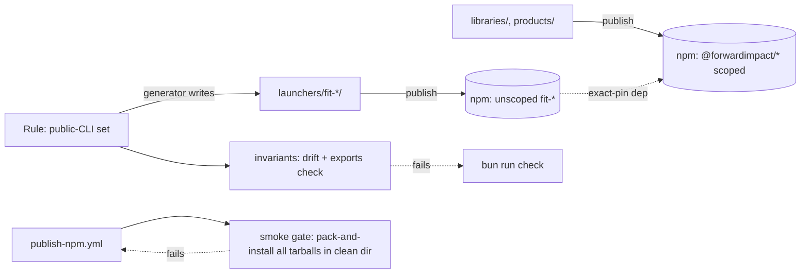

# Design 1670 — Public CLI Launcher Packages

## Summary

For each of the 22 public CLIs enumerated in
[spec § Public-CLI set](spec.md#public-cli-set-the-unit-of-work), publish a
thin **launcher package** whose npm name equals the invoked name (`fit-eval`,
`fit-wiki`, …) and whose only purpose is to re-exec the bin in the scoped
source package at an exact-pinned version. Launchers are generated from the
rule, exact-pinned per release, and published in the same workflow run as
their source — both source and launcher tarballs pass a pre-publish smoke
gate against locally packed tarballs, so neither registry version exists
without the other being already smoke-clean. A build-time invariant fails
any release where the launcher set drifts from the rule's output or where a
source package omits the bin subpath the launcher needs.

## Components



| Component | Where | What it owns |
|---|---|---|
| **Launcher package** | `launchers/fit-<name>/` (one per public CLI) | A `package.json` named `fit-<name>` plus a single `bin/fit-<name>.js` that dynamically imports the scoped bin — shape under [§ Launcher shape](#launcher-shape). Declares `@forwardimpact/<src-pkg>` as an exact-version dependency. No tests, no code beyond the launcher. |
| **Launcher generator** | `scripts/generate-launchers.mjs` | Materialises one launcher dir per rule entry, stamping the standard provenance metadata (`homepage`, `repository`, `license`, `author`, `engines`) plus a generated description. `--check` reports drift; default rewrites. |
| **Rule evaluator** | `scripts/lib/public-cli-set.mjs` | Pure function. Inputs: non-private workspace bins, grep over `websites/fit/docs/**`, **published skills** (`SKILL.md` files matching `.claude/skills/{fit,kata}-*/SKILL.md`), and published composite-action references. Output: invoked-name → source-pkg map. Shared by generator and invariant. |
| **Public-set invariant** | `scripts/check-public-cli-set.mjs` | Fails CI on three conditions: (a) `launchers/` diverges from rule output (set or dep-version); (b) a source package's `exports` lacks the bin subpath its launcher imports (see [Decision 5](#key-decisions)); (c) a launcher exists for a bin the source no longer ships. |
| **Publish coupling** | `.github/workflows/publish-npm.yml` | Single per-tag job: pack source, pack matching launchers, install all tarballs into a clean dir, smoke each launcher, then publish source, then publish each launcher. See [§ Publish flow](#publish-flow). Matching launchers are the rule evaluator's output filtered to entries whose source equals this tag's source — single source of truth shared with the generator and invariant. |
| **Workspace registration** | root `package.json` `workspaces` | Adds `"launchers/*"` so the generator and packer have a single resolution path. Bin symlink collision under `node_modules/.bin/` is benign — see [Decision 7b](#key-decisions). |

## Launcher shape

```js
#!/usr/bin/env node
// generated by scripts/generate-launchers.mjs — do not edit
import "@forwardimpact/libeval/bin/fit-eval.js";
```

```jsonc
{
  "name": "fit-eval",
  "version": "0.1.58",                      // = source version
  "type": "module",
  "bin": { "fit-eval": "./bin/fit-eval.js" },
  "files": ["bin/"],
  "dependencies": {
    "@forwardimpact/libeval": "0.1.58"      // exact pin, no range
  }
  // common metadata (homepage/repository/license/author/engines/publishConfig)
  // stamped by the generator, omitted here for brevity
}
```

Dynamic `import` preserves `process.argv`, signals, and exit code — the
launcher is invisible to the running CLI. For multi-bin sources, each
launcher imports its specific bin path, so the running CLI's `--help`
banner identifies the correct bin.

## Publish flow

```mermaid
sequenceDiagram
  participant Tag as git tag libeval@v0.1.58
  participant Job as publish-npm.yml
  participant Reg as npm registry
  Tag->>Job: trigger
  Job->>Job: pack source.tgz; pack matching launchers
  Job->>Job: clean tmp dir; npm install <source.tgz> <launcher.tgz>...
  loop each launcher
    Job->>Job: npx --no-install fit-<name> --help; assert exit 0 + per-bin banner
  end
  alt smoke fails on any launcher
    Job->>Job: exit non-zero (registry untouched)
  else all pass
    Job->>Reg: publish source (Decision 6a skip if version already on registry)
    loop each launcher
      Job->>Reg: publish launcher (Decision 6a skip if version already on registry)
    end
  end
```

`npm install <source.tgz> <launcher.tgz>...` resolves each launcher's
exact-pinned `@forwardimpact/<src>` dep against the *sibling tarball* in
the same command (this is the load-bearing reason tarball-install is
registry-equivalent for the launcher contract). The source tarball's own
scoped runtime deps (`libcli`, `libconfig`, `libpreflight`, etc.) come
from the registry; their versions must already be published — the same
precondition the existing publish workflow already relies on. Per-batch
release ordering (foundational scoped packages before their consumers) is
unchanged; see `kata-release-cut` § Edge Cases "Dependency chain".

## Key decisions

| # | Decision | Rejected alternative | Why |
|---|---|---|---|
| 1 | **One thin launcher per public CLI** (22 packages) | Rename each scoped package to its bin name | Multi-bin sources (`libeval` carries 3 in-scope bins) cannot be renamed to satisfy more than one invoked name. Structural. |
| 2 | Launcher **dynamically `import`s** the scoped bin | `child_process.spawn` the source bin | Spawn forks a new Node process — doubles startup, requires explicit signal/exit forwarding, complicates banner identity. Same-process import inherits `process.argv` and exits naturally. |
| 3 | Launcher dep on source is **exact-pinned** (`"0.1.58"`, no range) | Caret `^0.1.58` | Caret allows the registry to serve a launcher that pulls a newer source than the launcher was smoke-tested against. The spec's "same version as the scoped source package it is published alongside" demands exact. |
| 4 | Launcher version **equals source version** | Independent semver per launcher | Atomic-release rule means every source bump triggers a launcher bump; an independent axis is dead weight. Reported version stays the scoped source's authoritative version (spec § Success Criteria row 4) either way. A launcher-only defect (generator-shape bug) regenerates all 22 launcher dirs but only republishes those whose source carries an unreleased commit in the next release window — an operational pattern the release procedure already handles. |
| 5 | **Source packages export `./bin/<file>.js`** via `exports`; the public-set invariant blocks regressions | Launcher does `require.resolve('@forwardimpact/<src>/package.json')` and joins `bin[name]` manually | Subpath import is one line, ESM-native, and breaks loudly with `ERR_PACKAGE_PATH_NOT_EXPORTED`. Manual resolution is fragile across npm/bun and silently picks the wrong file when `bin` rearranges. 7 of 22 in-scope bin subpaths are already exported (`libeval` exports 3, `libwiki`/`libxmr`/`libcodegen`/`librc` 1 each); the remaining 15 — across 12 source packages — gain the entry under this design. |
| 6a | Publish step is **idempotent**: per package, `npm view <pkg>@<ver> version` first, skip if present | Tolerate `npm publish`'s `409 Conflict` by ignoring exit code | A pre-check is explicit and fails loudly on other errors; 409-swallowing hides distinct errors that share an exit code. |
| 6b | Smoke gate **asserts `--help` output contains the invoked CLI's bare bin name as a substring** (e.g. `fit-trace` smoke checks the output mentions `fit-trace`, not just `fit-eval`'s suite banner) | Trust exit code alone, or trust any non-empty stdout | Catches an `import` that silently routes to a sibling bin under a multi-bin source — the exact failure mode the spec's "banner names the specific bin, not a sibling" criterion guards. |
| 7a | **Launcher tags never exist** — the existing tag-prefix matcher (`pkg.name.endsWith('/'+tag)`) structurally rejects unscoped launcher names, so no resolver change is needed | Add a directory-allowlist exclusion for `launchers/` | A redundant guard increases surface area; the natural exclusion is sufficient. |
| 7b | **Bin symlink collision is benign** — workspace-only concern: inside the monorepo's `bun install`, both the source and launcher bins target `node_modules/.bin/fit-<name>`; whichever wins terminates at the same scoped-bin implementation (direct on win-source, one extra `import` frame on win-launcher). External consumers install only the launcher, so the collision does not arise. | Suppress one bin via workspace config | The collision is harmless and self-documenting; suppression adds machinery for no behavioural change. |
| 8 | **Pre-publish smoke** packs source + matching launchers and installs all tarballs into a clean dir; runs `npx --no-install fit-<name> --help` per launcher | Pre-publish smoke against the registry (publish source first, then `npm install fit-<name>`) | Registry-based smoke admits a propagation race between publish and resolve; a failure after source-publish leaves the registry in a half-released state. Tarball install in a clean dir is registry-equivalent for resolution semantics and atomic at the artifact boundary — if smoke fails, nothing has been published. |
| 9 | `launchers/` is a **top-level workspace dir** | Sub-folder inside each source package | Source packages stay single-responsibility. Launchers' lifecycle (generated, exact-pinned, smoke-tested) is distinct enough to warrant its own tree. |

## Boundaries with adjacent systems

| Adjacent system | Boundary |
|---|---|
| `scripts/check-metadata.mjs` | Launcher `package.json` satisfies canonical key order + provenance fields on regeneration; the generator stamps each from monorepo constants. |
| `scripts/check-workspace-imports.mjs` | Scopes `products/`, `libraries/`, `services/` today; `launchers/` is intentionally outside that scope — imports are pinned-by-construction by the generator + public-set invariant. |
| `bunx coaligned jtbd` | No interaction. `libcoaligned`'s catalog scans `products/`, `services/`, and `libraries/lib*` only — `launchers/` is structurally outside its scope, so no exemption is needed. |
| `CLAUDE.md` / getting-started guides | Spec § In scope row 3: documented `npx fit-*` instructions become correct by construction on first coordinated release — this design edits no doc text. |
| Sibling actions `fit-eval@v1`, `fit-wiki@v1` | The `--package=` workaround stays as defense-in-depth (spec § Out of scope); it becomes redundant but not load-bearing once launchers ship. |
| `kata-release-cut` | Release procedure unchanged at the human level: one tag per source package. The publish workflow does the fan-out. |
| `publish-native.yml` | Unaffected — native binaries are a separate channel (GitHub Releases assets) and not in the public-CLI set. |

## Failure modes addressed

| Scenario | What protects |
|---|---|
| A new CLI added without a launcher, or a launcher whose source lost its bin subpath in `exports` | `check-public-cli-set.mjs` fails `bun run invariants` on the introducing PR |
| Launcher dep pin drifts from source `version` | Generator rewrites on `bun run context:fix`; `--check` mode fails CI otherwise |
| Smoke fails on any launcher | Workflow exits non-zero before any publish; registry untouched |
| Source publish succeeds, a later launcher publish fails (transient) | Re-run the same tag; `npm view` skip-check (Decision 6a) passes through already-published artifacts and completes the rest |
| Multi-bin source: launcher silently runs sibling bin | Decision 6b per-bin banner-identity assertion in smoke |
| Launcher resolves but runs the wrong source version | Exact pin + tarball-install smoke at matching version → no registry version-skew window |

— Staff Engineer 🛠️
