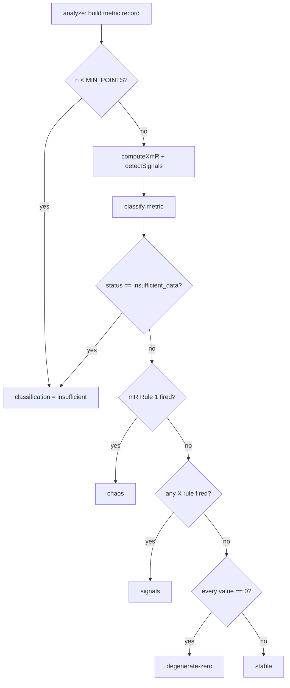

# Design 1680 — libxmr classification taxonomy admits degenerate-zero

Adds a fifth `classification` value, `degenerate-zero`, to the libxmr taxonomy
for the no-variation-around-zero process-behavior shape. The discrimination
lives in the classifier so every downstream reader receives one verdict.

## Components

| Component | Role | Change |
| --- | --- | --- |
| `libxmr/src/classify.js` | Single source of the process-behavior verdict | New branch returns `degenerate-zero` for an all-zero series at or above `MIN_POINTS`; the four existing values are otherwise unchanged |
| `libxmr/src/analyze.js` | Orchestrator; stamps `classification` on each metric record | No logic change; the doc comment enumerating the four values gains the fifth |
| `libxmr/src/commands/{analyze,summarize}.js` | Render the verdict to JSON/text | No change — they pass `classification` through verbatim |
| `libxmr/README.md` | Library reference | Gains a new § Classifications table (none today) |
| `websites/.../xmr-analysis/index.md` | User-facing guide | Two enumeration sites + adjacent guidance prose updated for five values |
| `.claude/skills/fit-xmr/SKILL.md` | Published report-shape roll-up | § Report Shape gains the fifth value |

## Where the discrimination lives

The new test (`G`) sits **after** the no-signal determination and **before**
`stable`. A degenerate-zero series fires no rule, so it reaches `G` exactly as a
stable series does today; only the all-zero series diverts to the new value.
`status` is untouched — both shapes report `predictable`.

## Key Decisions

| Decision | Choice | Rejected alternative |
| --- | --- | --- |
| Detection predicate | Test the series directly: every observation equals zero | Deriving it from `stats` (mean and σ̂ both zero) — arithmetically equivalent but reads as two derived facts the reader must combine; the spec defines the shape as "every observation equals zero," so testing the series is self-documenting and immune to float rounding in derived stats |
| Detection site | `classify.js`, after signals, before `stable` | Storyboard renderer / a parallel `mode` field / a new signal rule — each is rejected in the spec's § Alternatives considered; placing it in the classifier keeps the classification axis the single process-behavior verdict every consumer reads |
| `status` field | Unchanged: degenerate-zero ⇒ `predictable` | Routing it to a new status — would cascade into `signals_present` semantics and false alerts; spec § Scope fixes `status` as out of scope |
| Inputs to `classify` | Read `metric.values` already on the record | Threading a new computed flag from `analyze` — adds an `analyze`/`classify` coupling for a fact already present on the metric |
| README classification doc | Add a new § Classifications table | Extending an existing table — there is none in the README today |

## Data flow and contract

`classify(metric)` already receives the full metric record, which carries
`values` (the ordered series) on both the insufficient and the computed path.
The new branch reads `metric.values`; no new parameter, no `analyze` change. The
guard is only reachable on the `n >= MIN_POINTS`, no-signal path, so a sub-window
all-zero series still classifies `insufficient` (boundary unchanged,
success criterion 3).

Downstream consumers switch on the `classification` string; adding an enum value
is additive. The published JSON shape gains one possible value; no field is
renamed or removed. This is a clean break in the sense of [§ Clean
breaks](../../CONTRIBUTING.md#read-do): no shim, no fallback — the classifier
emits the correct verdict directly and every reader sees it.

## Doc enumeration sites (success criterion 4)

| Surface | Sites to update |
| --- | --- |
| `libraries/libxmr/README.md` | New § Classifications table (5 rows) |
| `websites/.../xmr-analysis/index.md` | (a) `classification` JSON-field bullet; (b) § Classifications table; (c) "Read `classification` first…" and "Do not react…" guidance prose must stay accurate — `degenerate-zero` is a quiet verdict like `stable` but signifies *no process signal at all*, not control |
| `.claude/skills/fit-xmr/SKILL.md` | § Report Shape roll-up sentence |

The guidance prose change is the substantive doc work: today both passages treat
`stable` as the sole quiet verdict. With five values, the reader must learn that
`degenerate-zero` is also quiet but means the series carries no information — a
trivially predictable flat-zero process — so a predictability *target* is not
substantively met by it.

## Out of scope (per spec)

Stuck-at-K classification, storyboard cell auto-rendering, historical
re-classification, Wheeler/Vacanti constants, and `status`/signal logic are all
untouched. The follow-on TW storyboard wording is Issue #1656, shipped
separately.

## Risks

| Risk | Mitigation |
| --- | --- |
| A golden snapshot (`chart`, `summarize`, `analyze`) shifts | Golden fixtures use a non-zero stable series, so the new branch is unreachable for them; success criterion 5 re-runs the libxmr and libwiki suites to confirm |
| `classify` reads `metric.values` but the insufficient path also carries `values` | The new branch is guarded behind the no-signal path, only reachable for `n >= MIN_POINTS`; the insufficient path returns earlier on `status` |

— Staff Engineer 🛠️
