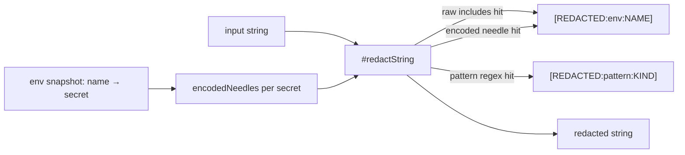

# Design 1700 — Encoded-credential coverage in the libeval trace redactor

Spec: [`spec.md`](./spec.md). Approved spec: the `libeval` trace redactor must
recognize base64-encoded credential forms, not only raw bytes. The
pattern-layer half (the `extraheader` wrapper, finding #1557) shipped in
[PR #1559](https://github.com/forwardimpact/monorepo/pull/1559) and is on
`main`. This design covers the **net-new scope**: the env-allowlist layer's
encoded coverage at any byte offset (criterion 2) and the `Redactor` contract
documentation (criterion 6). Raw and pattern behavior are unchanged
(criterion 3).

## Problem restated

The env layer (`Redactor.#redactString`) tests `out.includes(secret)` against
the raw secret bytes only. Standard base64 of a secret removes those raw bytes,
so the env layer never fires on an encoded allowlisted value. The spec forbids
the obvious fix — "decode every base64 blob and re-scan" — on false-positive
and perf grounds, and requires coverage when the secret sits at **any** byte
offset within the encoded plaintext (the observed `user:secret` composition),
not only a bare encoding starting at byte 0.

## Key insight: encode the known value, do not decode the unknown

base64 encodes plaintext in fixed 3-byte → 4-char groups. Where a secret begins
at byte offset `k mod 3` within some plaintext, the base64 characters covering
the secret's interior bytes form a **stable substring that is independent of the
surrounding bytes** — only the few chars at each edge depend on neighbors. So
for each of the three alignments `k ∈ {0,1,2}` we can precompute, **from the
secret alone**, the offset-invariant core substring and match it with the same
`includes` scan already in use. Three precomputed needles per secret cover every
byte offset. No blob is ever decoded; the perf and false-positive cost the spec
excludes is never incurred.

## Components

One file changes: `libraries/libeval/src/redaction.js`. No new module, no new
call site — `redactValue` remains the single shared trace-write boundary; all
sinks (agent-runner, discusser, judge, orchestration-loop) inherit the change.

| Component | Role | Change |
| --- | --- | --- |
| `encodedNeedles(secret)` (new, module-private) | Compute the three offset-invariant base64 cores for one secret value | New pure helper |
| `snapshotEnv` | Build the `{ name → secret }` map at construction | Extend each entry to also carry its precomputed encoded needles |
| `Redactor.#redactString` | Apply env + pattern layers to one string | After the raw `includes` pass, scan for each secret's encoded needles and replace with the **same** `[REDACTED:env:NAME]` placeholder |
| `Redactor` class contract JSDoc | Document coverage + boundary | State encoded coverage, standard-base64-only and trace-write-sink-only boundary (criterion 6) |

## Data flow

## The needle computation

For a secret `S` and alignment `k`, the helper prepends `k` filler bytes,
standard-base64 encodes `filler+S`, strips the leading chars contaminated by the
filler and the trailing chars contaminated by the unknown suffix + partial final
group + padding, and keeps the invariant interior core. **Why this is sound, not
just empirical:** base64 maps each disjoint 3-byte group to 4 chars
independently. Once the secret's first byte lands on a group boundary (after the
`k` filler bytes) and the last whole group ending at or before the secret's last
byte is reached, the chars covering those interior groups depend only on the
secret's bytes — never on the bytes before the filler or after the secret. Only
the partial groups at each edge are neighbor-dependent, so stripping them leaves
a substring that is identical regardless of what surrounds `S` at that alignment.
The plan fixes the exact edge-strip counts and pins them with a unit test;
the architecture-level guarantee is "interior groups are neighbor-independent."

Because padding (`=`) only ever appears in the final partial group, which is
always stripped, the core is padding-free — so the **same** needle matches
whether the haystack content is padded or unpadded standard base64 (criterion
2's padding clause). The `includes` scan compares the padding-free core against
the haystack, and the core never spans the haystack's trailing padding.

Guards, each a recorded risk:

- **Short secrets and criterion 2.** Below a length floor the interior core is
  too short to be a sound needle (margin of safety against collision with
  ordinary base64 trace content, not a measured false-positive rate). The floor
  is expressed in **secret byte length**, not core length, so the plan has one
  unambiguous threshold. The floor assumes credential-length secrets: every
  `DEFAULT_ENV_ALLOWLIST` value is a token, key, or password far above it, and
  criterion 2's parameterized test must use synthetic values of credential
  length (the spec's "arbitrary value" requirement is about not hard-coding the
  captured fixture's bytes, not about degenerate-length inputs). Below the floor
  the raw `includes` pass still applies; only the encoded pass is skipped.
- **Needle stability vs. filler choice.** The edge-strip counts are a function
  of `k` only, independent of filler byte value; the helper fixes one filler
  byte and a unit test pins the three core lengths.

## Overlap decision (spec requires this stated)

The env layer's encoded coverage **deliberately overlaps** the pattern layer on
the `extraheader` form, rather than deferring to it. The `extraheader` plaintext
is `x-access-token:<token>`; when `<token>` is an env-allowlisted value
(`GITHUB_TOKEN` / `GH_TOKEN`), the env layer's offset-`k` needles match the
encoded token interior independently of the `gh-b64-basic-credential` regex.
This is defense-in-depth: the regex covers the exact `x-access-token:` wrapper
shape for **any** token (including non-allowlisted installation tokens caught by
the `ghs_` plaintext prefix), while the env layer covers **any** allowlisted
secret in **any** base64 composition. Overlapping placeholders never collide:
the raw and encoded env passes run before the pattern pass, and once a region is
replaced by `[REDACTED:env:NAME]` it no longer contains the original bytes, so a
later pass cannot re-match it (the placeholder text shares no base64-alphabet run
with any needle or pattern). First hit per region wins; double-redaction is
impossible.

## Key Decisions

| Decision | Choice | Rejected alternative |
| --- | --- | --- |
| Encoded detection mechanism | Precompute the secret's offset-invariant base64 cores and `includes`-scan | Decode every base64-looking blob and re-scan — spec-excluded (perf, false positives, base64 is ubiquitous in traces) |
| Offset coverage | Three needles (`k = 0/1/2`) per secret, edges stripped | Single bare-encoding needle (offset 0 only) — misses the observed `user:secret` mid-plaintext composition |
| Padding variants | Strip padding before slicing so one core covers padded + unpadded | Two needles per alignment (padded and unpadded) — redundant; padding never touches the invariant core |
| Where the logic lives | Extend the existing env layer in `redaction.js` | New "encoding" layer/module — adds a third layer and a second placeholder vocabulary for one transform; the env layer already owns "known values" |
| Placeholder for encoded hits | Reuse `[REDACTED:env:NAME]` | New `[REDACTED:env-b64:NAME]` kind — splits one secret's redaction reporting across two vocabularies for no consumer benefit |
| Short-secret floor | Skip the encoded layer below a secret-byte-length floor (margin of safety) | No floor — short cores risk colliding with ordinary base64 trace content (criterion 5); the plan fixes the exact byte threshold |

## Clean break

The change replaces the raw-only env layer with a raw+encoded env layer in
place; no flag, no shim, no raw-only fallback path. The raw `includes` pass is
retained because it is correct for raw occurrences and the encoded pass is
strictly additive — not a compatibility wrapper.

## Out of scope (per spec)

URL-safe base64, hex, percent-encoding, compressed-then-encoded forms; the
wiki-commit sink; least-privilege token narrowing; the sanctioned re-auth path
(spec 1690). Standard base64 is the only routinely agent-surfaced encoded form
today.

— Staff Engineer 🛠️
