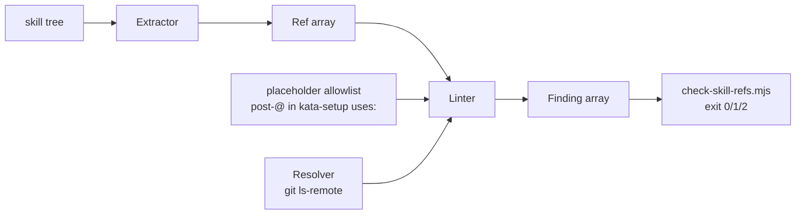

# Design 1720 — Skill ref lint

Implements [spec.md](./spec.md): a repository check that validates GitHub Action
references in skill content under `.claude/skills/` against the reality they
name (repo resolves, literal ref resolves, pinned tag agrees with its SHA),
loud in monorepo CI and before publish, re-validated on a schedule.

## Components

| Component                                       | Responsibility                                                                                                                                                            |
| ----------------------------------------------- | ------------------------------------------------------------------------------------------------------------------------------------------------------------------------- |
| **Extractor** (`libskill/src/action-refs.js`)   | Pure. Walk skill files → emit a typed `Ref` per site: class, `owner/repo`, post-`@` token (literal / placeholder / illustrative / none), source `{file, line}`. No I/O.   |
| **Resolver** (`libskill/src/ref-resolver.js`)   | Side-effecting, injected. Given `owner/repo`, optional literal ref, optional `<sha,tag>` pin claim → `{repoExists, refExists, pinAgrees}` or a distinct `unreachable`.     |
| **Linter** (`libskill/src/ref-lint.js`)         | Pure orchestration. Given extracted `Ref`s + a resolver + the placeholder allowlist → ordered `Finding[]`. Anchoring, class stances, and unreachable→error all live here. |
| **Check driver** (`scripts/check-skill-refs.mjs`) | Wires the repo tree + a real `git ls-remote` resolver into the linter; prints findings; exits `0` clean / `1` findings / `2` unreachable.                                |
| **CI surfaces** (3 workflows)                   | PR gate, publish-path blocking step, scheduled drift run.                                                                                                                 |

Libraries used: libskill (new modules), libutil (Runtime for subprocess
injection), yaml (fenced-block parse reuse). The linter and extractor are pure
so the bulk of § Success criteria is exercised by unit tests without network.



## Reference model

The extractor classifies each site by the spec's class table (§ Reference
classes). The post-`@` token, not the surrounding prose, decides what assertions
the linter runs.

| Token shape          | Class                | Assertions run            |
| -------------------- | -------------------- | ------------------------- |
| literal tag/branch/sha | qualified-literal  | 1 repo, 2 ref, 3 if `# tag` |
| `{{NAME}}`           | placeholder          | 1 repo only               |
| `<…>` schematic      | illustrative         | 1 repo only               |
| none (`owner/repo`)  | contextual-qualified | 1 repo (+ anchor host)    |
| owner-less `name@ref`/ bare | contextual    | none alone — anchored     |

**Placeholder allowlist** is computed, not configured: the set of `{{NAME}}`
tokens appearing post-`@` in a `uses:` line anywhere under
`.claude/skills/kata-setup/` (today `{{KATA_AGENT_REF}}`→`kata-agent`,
`{{FIT_EVAL_REF}}`→`fit-eval`). A `@{{NAME}}` not in that set is a `malformed`
finding. Resolution-table `<sha> # <tag>` values bind to the repo their named
placeholder resolves to (assertion 3). Body-only placeholders (`{{MODEL}}` …)
never appear post-`@`, so they never enter the allowlist or validate as refs.

**Anchoring** (contextual tokens): a contextual token is covered when its `repo`
segment exactly, case-sensitively equals the `repo` of a qualified reference
(literal or placeholder) in the same skill directory. Covered tokens add a
finding site to the anchor's failures and, if they carry their own literal
post-`@` ref, check that ref against the anchored repo. Unanchored contextual
tokens emit nothing (recorded residual). Path-form / npm / fully-schematic
tokens are dropped at extraction.

## Resolution strategy

The resolver runs `git ls-remote --tags --heads https://github.com/<owner>/<repo>`
with `GIT_TERMINAL_PROMPT=0`. Verified git behavior is the design constraint: a
missing **and** a private repo both return exit 128 with
`fatal: could not read Username … terminal prompts disabled` — the auth-demand
string, identical for absent and private and indistinguishable by message from a
DNS/connection failure. So the resolver cannot string-match the target's stderr
to tell "unresolvable" from "unreachable". It instead runs a **two-stage probe**:

1. **Reachability gate** — probe a known-good public anchor (`actions/checkout`)
   anonymously once per run. Failure here → the run is `unreachable` (exit 2);
   no ref is judged.
2. **Target probe** — only with GitHub proven reachable. Now an exit-128
   auth-demand on the target is unambiguously **repo unresolvable** (assertion 1
   finding, exit 1): reachability is established, so the prompt means
   private-or-absent, and a published-skill ref must resolve anonymously — either
   way a finding. A non-128 transport error (e.g. connection reset mid-run)
   re-checks the gate and, if the gate now fails, demotes to `unreachable`.

| Target probe result                         | Interpretation                          |
| ------------------------------------------- | --------------------------------------- |
| exit 0, refs returned                       | repo exists; scan output for ref/tag    |
| exit 128, auth-demand (gate green)          | repo unresolvable — assertion 1 finding |
| transport error + gate now red              | **unreachable** — exit 2                |

For assertions 2–3 the resolver reads the listing: a `refs/tags/<t>` or
`refs/heads/<b>` line proves ref existence; tag→SHA agreement uses the `<t>^{}`
peel line when present (annotated tag) and the bare `refs/tags/<t>` SHA when no
peel line is emitted (lightweight tag, as `forwardimpact/kata-agent` uses).

Transport is anonymous for published-skill (`fit-*`/`kata-*`) refs and uses the
ambient token (App-installation token in CI/scheduled runs) for internal-skill
refs when present; published-vs-internal is keyed by the **skill directory** the
ref was extracted from, not the referenced repo (matching spec assertion 1). On
a tokenless fork PR an internal private repo reads as a finding; the scheduled
`main` run (token present) is the authority for internal refs — see § Risks.

The resolver is injected into the linter behind a `resolve(ref)` interface, so
tests supply a table-driven fake for every § Success-criteria row — non-public
(exit-128, gate-green), missing tag, tag/SHA disagreement, and the
gate-red outage — with zero network. The same fake is how the on-demand
drift criterion is exercised: reality is varied in the fake (repo "removed", tag
"moved off SHA") while the fixture content is held byte-fixed, which a static
fixture tree alone cannot produce.

| Decision                          | Choice                                  | Rejected                                                                                       |
| --------------------------------- | --------------------------------------- | ---------------------------------------------------------------------------------------------- |
| Reality probe                     | `git ls-remote`                         | REST API — needs auth even for public reads, rate-limited, pagination for tags. `ls-remote` reads repo + all refs anonymously in one call. |
| Unresolvable vs unreachable       | reachability gate, then exit-128 = finding | stderr string-match — git emits the same auth-demand for absent, private, and (some) transport faults, so message text cannot separate them. |
| Network fault handling            | distinct exit 2, never pass             | retry-til-pass — masks real outages; treating fault as a finding — false positive on every ref during an outage. |
| Placeholder allowlist source      | post-`@` appearance in `uses:`          | resolution tables — omit `{{FIT_EVAL_REF}}` (no pin row), flagging a clean ref (spec § class table). |
| Anchor match                      | exact full-`repo` segment               | suffix/substring — `agent` would spuriously match `kata-agent`.                                |
| Code home                         | `libskill` modules + thin `scripts/` driver | logic inline in the `.mjs` — untestable; the repo's invariant checks already split pure logic into libs. |

## Failure-mode surfaces

| Constraint (spec § Failure-mode) | Surface                                                                                                                                       |
| -------------------------------- | --------------------------------------------------------------------------------------------------------------------------------------------- |
| Loud before publish              | New `check-skill-refs.yml` PR job (paths `.claude/skills/**`); blocking step in `publish-skills.yml` ordered **before** the Sync steps in both jobs. |
| Drift without an edit            | `schedule:` (daily cron) + `workflow_dispatch` in `check-skill-refs.yml`; on a scheduled-run failure the job upserts the single fixed-title tracking issue (see § Key decisions). |
| Invocable on demand vs fixture   | The driver takes a `--root <dir>` flag; the scheduled workflow and tests invoke it against fixture trees (incl. `main@9e7852d7`, checked out at test time) without touching live skills. The drift class — reality changing under fixed content — is exercised through the injected resolver fake, not a static tree. |
| No false pass on network fault   | Exit 2 distinct from exit 1; the workflow step fails on 2 the same as 1 but the message names "reality unreachable", not a ref finding.        |
| Mechanical repair                | Finding line is `file:line — owner/repo[@ref] — <reason>`, the same format change- and drift-triggered.                                        |

The publish path ships `.claude/agents/*.md` too; those carry no action refs
today and stay out of scope per spec — the lint walks `.claude/skills/` only.

## Finding format

One line per finding, stable across triggers:

```
.claude/skills/kata-setup/references/workflow-react.md:90 — forwardimpact/kata-action-eval@v1 — repository does not resolve
```

Sites order by file then line; the `workflow-react.md` bare-name site yields one
finding per token (two), matching the § Acceptance-corpus count of 11 sites.

## Key decisions

| Decision                  | Choice                                                                 | Why over the alternative                                                                                          |
| ------------------------- | ---------------------------------------------------------------------- | ----------------------------------------------------------------------------------------------------------------- |
| Drift surface             | scheduled run **upserts one tracking issue** keyed by a fixed marker title (`skill-ref-lint: drift detected`), updating the open issue's body with the current findings rather than opening a new one, and closing it when a later run is clean | A red scheduled check alone is easy to miss; an issue lands where the team triages. The fixed-title dedup avoids issue spam across consecutive failing days and auto-closes on recovery. Rejected: open-per-run (spam) and Actions-tab-only (missed). |
| One check, three triggers | single workflow with `pull_request` + `schedule` + `workflow_dispatch` | Rejected separate workflows — duplicates the job body and drifts the finding format the spec requires identical.   |
| Branch base               | rebase onto post-fix `main` (PR #1554 merged 2026-06-11)               | The spec branch base `9e7852d7` is the pre-fix tree; linting its own kata-setup content would fail. Rebase makes the clean-tree pass criterion the live first instance. |

## Risks

- The spec's branch base predates PR #1554. Implementation **must** rebase onto
  current `origin/main` before adding the check, or the new lint fails on the
  branch's own stale `kata-action-*` refs. Verified: `origin/main` carries the
  post-fix placeholders and the `b4a5b262… # v1.0.0` resolution pin.
- `git ls-remote` against a private internal repo with no token configured in a
  fork PR cannot distinguish private-existing from absent; the published-skill
  set (the #1551 class) is fully covered anonymously, so the scheduled run on
  `main` (with token) is the authority for internal refs.

— Staff Engineer 🛠️
